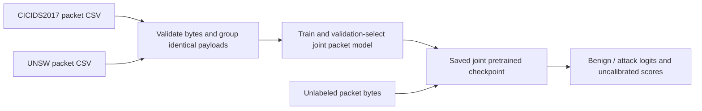

# NetMamba+ — two-CSV packet classifier

**One supported workflow:** prepare the supplied CICIDS2017 and UNSW packet CSVs, train the native NetMamba+ packet adaptation, and use the selected **joint pretrained** checkpoint to predict benign/attack from packet bytes.

**Explaining this to a client? Start with [Understand and explain the client project](docs/customer/client-project-guide.md).** It explains the paper, both CSVs, every part of the delivered system, training/inference, actual tests, setup, results, the demo and remaining work. The [every-file walkthrough](docs/repository-walkthrough.md) covers individual files and downloads.

The concise executable delivery is [netmambaplus-client](https://github.com/buffbeefalo/netmambaplus-client). This reproduction repository is its development and learning source. Verified exports keep shared code and packet evidence updated; see [maintenance and delivery](docs/research/client-edition.md).

**[Watch the current CSV-workflow video](https://buffbeefalo.github.io/netmambaplus-reproduction/video/)** — one continuous 60-minute lesson covering both CSVs, the paper, both repositories, training, inference, actual results, setup and remaining work. [PDF handbook](docs/customer/demo/video/v5/NetMambaPlus-course-handbook.pdf) · [PowerPoint](docs/customer/demo/video/v5/NetMambaPlus-course-slides.pptx) · [Transcript](docs/customer/demo/video/v5/transcript.md).

## What was built and measured

Both CSVs supply real byte inputs and supervised targets to the original NetMamba+ encoder. All **1,490,136 rows** and **2,235,204,000 payload-byte cells** were validated. Identical payloads stay in one global training/validation/test partition, including duplicates shared between sources.

The joint pretrained model reached **97.56% on CIC and 94.29% on UNSW** in group-weighted balanced accuracy. The recorded study trained six native comparison models for 1,000 updates each and fitted nine controls. Those comparisons support one packet application workflow; the client prediction uses the joint pretrained model. The UNSW-only metadata control scored **99.34%**, above the neural models there. [Complete results and limits](docs/customer/packet-model-study.md).

This is an explicit **packet adaptation** of NetMamba+. The paper's original flow inputs require connection identity and ordering absent from the CSVs. Its 97.50% flow accuracy is a different task/metric and was not reproduced here. The project is a measured research implementation, with no live capture, blocking or validated NPU/SmartNIC backend.



The model consumes 1,500 payload bytes per example: 375 byte vectors plus three learned positions form 378 tokens through four Mamba blocks and a two-class head. Metadata and labels do not enter its forward pass. [Input contract and architecture](docs/customer/packet-model-study.md#from-one-row-to-one-prediction).

## Start, demonstrate and check

| Need | Open |
|---|---|
| Explain the complete client delivery | [Client project guide](docs/customer/client-project-guide.md) |
| Install, prepare, train and predict | [Single packet setup](docs/customer/packet-study-setup.md) · [Client setup](https://github.com/buffbeefalo/netmambaplus-client/blob/main/SETUP.md) |
| See measured packet predictions | [Packet demo](https://buffbeefalo.github.io/netmambaplus-reproduction/) |
| Understand the inputs and paper | [Paper and both CSVs](docs/customer/paper-and-data-explained.md) · [Changes from upstream](docs/customer/upstream-comparison.md) |
| Present the packet study | [Customer index](docs/customer/README.md) · [Packet PDF](docs/customer/packet-addendum/NetMambaPlus-packet-addendum.pdf) · [PowerPoint](docs/customer/packet-addendum/NetMambaPlus-packet-addendum.pptx) · [Script](docs/customer/packet-addendum/packet-addendum-script.md) |
| Inspect results and actual tests | [Packet report](docs/customer/packet-model-study.md) · [Acceptance map](docs/customer/acceptance.md) · [Current delivery audit](docs/research/packet-only-handoff.md) |
| Find a particular file | [Complete repository walkthrough](docs/repository-walkthrough.md) |
| Understand future hardware work | [IDS / NPU / SmartNIC roadmap](docs/customer/hardware-roadmap.md) |

With Python 3.10 or 3.12, run from this repository's root:

```text
python -m unittest discover -s tests -v
python tools/review_packet_study.py
python tools/verify_packet_briefing.py
python tools/verify_repository_guide.py
python tools/render_packet_demo.py --output runs/packet-demo-new
```

Open `runs/packet-demo-new/index.html`. It shows the joint model's complete 20,000 CIC and 5,930 UNSW test groups, with filters for class, label disagreements and contradictory labels. It is recorded evidence, not fresh inference or a live IDS. These portable checks need no GPU or private CSVs; optional native checks report skips. Use a full source clone for the full suite's historical media checks. The concise client also supports offline checks from a source ZIP.

Fresh native execution requires the [checked CUDA environment](docs/customer/packet-study-setup.md), local CSVs and separately acquired/trained weights. The packet-specific runtime gate uses prepared bytes from both sources and refuses to treat skipped native tests as success. Actual neural execution is measured on Linux ARM64 / GB10; portable CI runs separately on Linux, Windows and macOS.

## Keep these limits with the result

All 25,930 classes agreed in the original saved-model packet comparison, while two strict logit comparisons failed. A later client-checkout check validated 20,000 CIC rows and predicted 128: classes all agreed, but 76 strict logit comparisons failed. The [receipts](docs/research/client-edition-validation.json) preserve these separate scopes. Successful evidence verification confirms the record, including its failures.

The study has one model seed, capped group subsets, replacement sampling, unknown prior pretrained exposure and weak cross-source transfer. Selected CIC test support includes no PortScan and only four DDoS rows. It does not establish customer-network accuracy, independent captures, calibrated packet confidence or operational alert thresholds.

The authors' source, raw CSVs and weights remain external assets. Hashes establish identities; inherited redistribution/commercial terms remain unresolved. The original encoder implementation and frozen packet evidence are preserved.

## Historical research and teaching

Earlier work used a separate CICIoT2022 flow dataset and investigated confidence calibration. Its commands, results and media remain historical research in this full source repository, not a second supported client workflow. The preserved v4 video predates the packet study and does not teach this current CSV setup. Use the current packet guide and presentation for the handoff; [historical material is labeled in the customer index](docs/customer/README.md#historical-material). The retired `/course/` site remains excluded from deployment.
