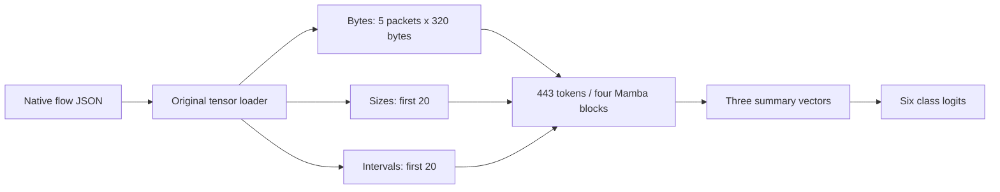

# NetMamba+ — measured reproduction attempt

This repository runs the authors’ original multimodal NetMamba+ model on compatible CICIoT2022 flows. The customer package records actual GPU masked-pretraining execution, three full 120-epoch fine-tuning runs, strict saved-classifier inference, independently checked metrics and an offline demonstration.

The later [packet study](docs/customer/packet-model-study.md) incorporates **both uploaded CSVs into the native NetMamba+ encoder**. It adds CIC-only, UNSW-only and joint benign/attack training, matched scratch controls, and strict unlabeled packet inference. Its data, classes and measured outcomes are separate from the six-class flow experiment below. Start with the [packet setup guide](docs/customer/packet-study-setup.md).

The measured environment is an **NVIDIA GB10 compatibility port**. The source-based batch/rate settings differ from the paper, and the released checkpoint’s complete pretraining history remains unknown. **Do not describe these results as an exact reproduction of every paper result or as a production IDS.**

Test accuracy was **91.26%, 84.05% and 84.63%** across the three declared seeds: **86.65% mean**, with a 4.00 percentage-point sample standard deviation. The paper reports 97.50% under different conditions. The [results](docs/customer/results.md) preserve every seed, metric definition, error and limitation.

The flow route also supports optional **confidence calibration** for each frozen classifier, followed by an optional accept/defer decision. On the same already-published test flows, mean negative log-likelihood improved from **0.4416 to 0.4172**, Brier score from **0.2035 to 0.2012**, and 15-bin calibration error from **7.03% to 3.82%**. Every predicted category stayed unchanged. These are retrospective confidence measurements, not an accuracy gain or independent customer-network validation.

The fixed **0.90** acceptance threshold also exposes a tradeoff: seed 0 accepted **620 of 1,041** flows with **9 errors** before scaling, and **893 of 1,041** with **37 errors** afterward. Error among accepted predictions rose from **1.45% to 4.14%**. The [calibration explanation and all-seed results](docs/customer/confidence-calibration.md) show the method, commands, denominators and limits. The threshold is an illustrative review policy, not a safety guarantee.

## Open the customer package

| Deliverable | Link |
|---|---|
| Both CSVs connected to NetMamba+ | [Packet study and actual results](docs/customer/packet-model-study.md) · [Setup and unlabeled use](docs/customer/packet-study-setup.md) |
| Packet presentation addendum | [PDF](docs/customer/packet-addendum/NetMambaPlus-packet-addendum.pdf) · [PowerPoint](docs/customer/packet-addendum/NetMambaPlus-packet-addendum.pptx) · [Matching script](docs/customer/packet-addendum/packet-addendum-script.md) |
| Preserved v4 one-hour course: flows and calibration | [Watch v4](https://buffbeefalo.github.io/netmambaplus-reproduction/video/) · [Download MP4](https://github.com/buffbeefalo/netmambaplus-reproduction/releases/download/course-video-v4/NetMambaPlus-one-hour-course.mp4) · [Exact checks and review limits](docs/customer/video-verification-v4.md) |
| Matching historical v4 course documents | [PDF handbook and every-file appendix](docs/customer/demo/video/v4/NetMambaPlus-course-handbook.pdf) · [PowerPoint with speaker notes](docs/customer/demo/video/v4/NetMambaPlus-course-slides.pptx) · [PDF slides](docs/customer/demo/video/v4/NetMambaPlus-course-slides.pdf) · [Full transcript](docs/customer/demo/video/v4/transcript.md) |
| Use the new confidence feature | [Calibration method, measured results and commands](docs/customer/confidence-calibration.md) · [Recomputable evidence](docs/customer/evidence/calibration/results.json) |
| Original customer package and checklist | [Frozen customer index](docs/customer/README.md) |
| Read the original 16-slide presentation simply | [Historical slide-by-slide field guide](https://buffbeefalo.github.io/netmambaplus-reproduction/guide.html) |
| Current setup, usage and test results on other systems | [Setup and support matrix](docs/support-matrix.md) · [Original experiment quickstart](docs/customer/quickstart.md) |
| Understand the paper, both CSVs and our changes | [Complete paper/data explanation](docs/customer/paper-and-data-explained.md) · [Authors’ repository comparison](docs/customer/upstream-comparison.md) |
| Understand every file and how the code fits together | [Complete repository walkthrough](docs/repository-walkthrough.md) |
| Find each of your seven answers | [Current v4 question map](docs/customer/video-verification-v4.md#seven-questions) · [Historical 16-slide map](docs/customer/answers.md) |
| Download the original offline customer bundle | [Frozen release ZIP](https://github.com/buffbeefalo/netmambaplus-reproduction/releases/download/customer-2026-09-15-audited/netmambaplus-customer-package.zip) |
| Original short technical briefing | [PDF](docs/customer/NetMambaPlus-customer-briefing.pdf) · [Markdown](docs/customer/briefing.md) |
| Original editable 16-slide presentation | [PowerPoint](docs/customer/NetMambaPlus-customer-slides.pptx) · [Slide PDF](docs/customer/NetMambaPlus-customer-slides.pdf) |
| Working recorded-inference demo | [Open in browser](https://buffbeefalo.github.io/netmambaplus-reproduction/) · [Download HTML](https://raw.githubusercontent.com/buffbeefalo/netmambaplus-reproduction/main/docs/customer/demo/index.html) |
| Measured results, errors and learning curves | [Results](docs/customer/results.md) · [Machine-readable evidence](docs/customer/evidence/results.json) |
| Research and AI-assisted findings | [Reviewed research record](docs/research/research-record.md) |
| Repeat the experiment | [Tested runbook](docs/customer/runbook.md) |
| Explain it yourself | [Teaching lesson](docs/lesson.md) · [Presenter talk track](docs/customer/talk-track.md) |
| Future IDS / NPU / SmartNIC integration | [Hardware roadmap](docs/customer/hardware-roadmap.md) |

The demo shows recorded predictions from the original GPU inference run. It does not apply the new calibration feature, capture or block packets. Display pace is unrelated to model latency. Its known errors remain visible. The current v4 course and documents explain both this replay and the actual calibrated command-line outputs. The original customer index, ZIP, 16-slide deck and briefing retain their historical bytes and do not include the later calibration addition.

## How the CSVs connect, and why they are separate from the original flows

The starting files were [paper v1](https://arxiv.org/abs/2601.21792v1), `Payload_data_CICIDS2017.csv` and `Payload_data_UNSW.csv`. Full metadata scans found **1,410,255** and **79,881** packet rows respectively. Both CSVs have 1,500 payload-byte columns plus TTL, length, protocol, time delta and label. They lack the connection identity and established ordering needed to reconstruct this model’s flows. Five adjacent rows cannot be assumed to belong to one connection.

The new packet classifier uses both exports as an explicit adaptation. The original flow experiment uses the authors’ processed **CICIoT2022** flow release: 8,323 training, 1,040 validation and 1,041 test flows across six classes. CICIoT2022 and CICIDS2017 are different datasets. The original CSV profiling record remains unchanged. The new packet study validates every payload cell and trains directly on packet bytes; it never invents flow inputs.

## What goes through the model



The loader owns padding, truncation and normalization. The model’s six classes are Flood, RTSP Brute Force and four IoT power/device categories. Raw softmax scores remain available; optional temperature scaling adds calibrated scores without changing the winning category. Neither score supplies universal attack coverage. See the [lesson](docs/lesson.md) for the transformations, the [harness reference](docs/harness-reference.md) for native inputs, and the [calibration guide](docs/customer/confidence-calibration.md) for the new output fields.

## Start with the offline checks

Python 3.10 or newer is sufficient for the standard-library tests:

```bash
python3 -m unittest discover -s tests -v
python3 tools/verify_package.py
python3 tools/review_calibration.py --check
python3 tools/review_packet_study.py
python3 tools/verify_repository_guide.py
python3 tools/build_course.py --check
python3 tools/verify_course.py
python3 tools/verify_course_video.py
python3 tools/verify_video_course_v3.py
python3 tools/verify_video_course_v4.py
python3 tools/build_video_page.py --check
```

CPU CI runs on Linux x86-64, Windows x86-64 and macOS ARM64 with Python 3.10 and 3.12. It checks the harness and published evidence; it does not retrain the GPU model. The [support matrix](docs/support-matrix.md) links actual workflow results and separate GPU execution evidence. The original customer PDF, PPT, quickstart and ZIP preserve their audited snapshot; their older test counts and platform statements are superseded by this current setup guide.

The earlier interactive HTML course was retired at the user’s request. Its archived source and tests remain as evidence bindings used by the video; the public `/course/` page is excluded from deployment.

The **v4 lesson plan is 60:00**, with 12 chapters and 96 teaching scenes, including 3:20 of announced practice. Codex wrote and directed the lesson; Microsoft Andrew synthetic speech renders that text. Moving packet/token diagrams, code emphasis, measured-result reveals and an actual recording of replay controls support the explanation. The matching handbook and [file guide](docs/repository-walkthrough.md) provide the individual-file detail. Captions, chapter controls and a reflowing transcript accompany one MP4 lesson and its equivalent browser encoding. The [v4 receipt](docs/customer/video-verification-v4.md) records actual media checks and distinguishes them from pending human full-watch/all-caption acceptance. The [v4 coverage record](docs/customer/video-course-v4-coverage.json) maps every nonignored file in its frozen 494-file edition, paper section, CSV and required scientific quantity to its explanation. Historical v3 and v4 verification read immutable release snapshots; the separate repository-guide check covers current additions. The v4 video does not cover this later packet study. Send the packet PDF/PPT addendum with it; [v3 downloads and receipts](docs/repository-walkthrough.md#v3-course) retain their original contents.

Acquire the pinned original source and assets:

```bash
python3 repro.py fetch
python3 tools/fetch_assets.py --output assets
python3 repro.py validate --data assets/data/ciciot2022 --report runs/validation-new.json
```

`fetch` verifies every tracked file against commit `eec9483e2f0fb84ca22982b9de8149bc3a8b1ad2` and seven additional core SHA-256 pins. Modified or extra importable source files cause rejection. Asset acquisition checks expected sizes and hashes before publishing each local file and refuses mismatched existing files.

## Train, evaluate and predict

First follow the [current CUDA setup and support matrix](docs/support-matrix.md), or the preserved [original GB10 recipe](docs/customer/runbook.md). The generalized builder selects a compiler-supported NVIDIA GPU architecture and builds the pinned extensions in disposable copies. Run both numerical and complete-model checks before training. Fresh GB10 execution is measured; additional physical GPUs and CPU-only model execution remain unverified. The original model/loader checkout, dependency warnings and experiment records are preserved.

After activating that environment and its documented variables:

```bash
python repro.py finetune --data assets/data/ciciot2022 --checkpoint assets/checkpoints/fuse3_mamba.pth --output runs/ciciot-ft-seed0 --seed 0 --num-workers 2
python evaluate.py --data assets/data/ciciot2022 --checkpoint runs/ciciot-ft-seed0/checkpoint-best.pth --output runs/ciciot-eval-seed0 --num-workers 2
python replay.py --data assets/data/ciciot2022 --checkpoint runs/ciciot-ft-seed0/checkpoint-best.pth --output runs/ciciot-replay-seed0 --num-workers 2
```

The native fine-tuner selects the best **validation** accuracy, then performs its final test pass. Separate evaluation strictly reloads that same classifier. Repeat with seeds 1 and 2 for the published three-seed protocol; all seed results are retained. Every invocation requires a fresh output directory and records configuration, source/data/checkpoint hashes, class mapping and status.

For already assembled native flows with no ground-truth labels:

```bash
python predict.py --flows path/to/unlabeled-flows.json --checkpoint runs/ciciot-ft-seed0/checkpoint-best.pth --output runs/predictions-new
```

This command returns logits, scores and class names without inventing an accuracy metric. It requires checkpoint-bound class meanings and uses the same native feature transformations. The [runbook](docs/customer/runbook.md) also covers masked pretraining, all-seed verification, model-only exports, timing, the export probe and rebuilding the presentation.

To add confidence scaling, fit on the validation split and then use that checkpoint's matching artifact:

```bash
python tools/calibrate.py --data assets/data/ciciot2022 --checkpoint runs/ciciot-ft-seed0/checkpoint-best.pth --output runs/calibration-seed0
python predict.py --flows path/to/unlabeled-flows.json --checkpoint runs/ciciot-ft-seed0/checkpoint-best.pth --calibration runs/calibration-seed0/calibration.json --abstain-threshold 0.90 --output runs/calibrated-predictions-new
```

The fitter uses the 1,040 validation flows, never test labels. The validation split was already used for checkpoint selection and contains five exact training overlaps, so it is not an independent calibration holdout. The predictor retains raw outputs and adds `calibrated_scores` plus `decision`; it rejects incompatible artifacts. New inference still needs the checked CUDA environment. Recomputing the saved study with `tools/review_calibration.py --check` needs only ordinary Python.

## Code and evidence map

| Path | Responsibility |
|---|---|
| [repro.py](repro.py) | Source/data validation, native parser settings, training subprocesses and manifests |
| [evaluate.py](evaluate.py) | Strict test-only native classifier evaluation |
| [predict.py](predict.py) | Native-flow prediction with original outputs and optional calibrated scores/accept-or-defer policy |
| [calibration.py](calibration.py) | Standard-library temperature fitting, score/metric arithmetic and artifact compatibility checks |
| [replay.py](replay.py) | Recorded native inference, independent metrics and self-contained browser page |
| [configs](configs) | Source pin, settings/provenance, asset hashes and functional-pretraining budget |
| [tools](tools) | Tested runtime build, numerical checks, experiment review, timing, export probe and publication tools |
| [tests](tests) | Synthetic CPU checks of important acceptance and failure behavior |
| [docs/customer/evidence](docs/customer/evidence) | Reviewed manifests, logs, predictions, runtime records and hashes |

## Boundaries to keep with the result

The official files contain five exact stored inputs shared across train/validation and six across train/test. Recorded identifiers and raw-input fingerprints do not establish physical capture independence. The released pretraining checkpoint’s earlier exposure remains unknown. Repeated evaluation of one fixed test set is not an independent holdout or validation on customer traffic.

The short pretraining run validates reconstruction learning on downstream training data; it does not recreate the paper’s full Browser/Kitsune pretraining. The paper/source batch and learning-rate differences remain explicit. Confidence calibration is measured on the existing benchmark, with the threshold tradeoff disclosed above. Independent calibration data, optional LDA/class-balancing paths, live capture/extraction, unknown-attack detection and NPU/SmartNIC deployment remain unestablished.

Raw data, upstream source and original weights are acquired from their authors rather than mirrored in this repository. Locally produced classifier exports and their hashes are recorded; inherited asset redistribution/commercial terms remain unresolved, so the customer package shares prediction evidence and a repeatable training route rather than asserting new rights over those assets. The authors’ inspected repository root has no license file.

The [7 September audit](docs/audit.md) is historical. The later [focused council decision](docs/research/research-record.md#council-decision-and-its-limits) reviewed the staged experiment plan; it did not independently certify later numerical results or replace the earlier unratified audit. The current package’s [verification record](docs/customer/verification.md) states the checks actually performed.

The [final council review](docs/research/final-council-review.md) records the exact ratified handoff criteria, retained evidence limits and applied corrections. Its initial escalated review is preserved separately. The final release receipt binds publication checks to the downloaded revision.
