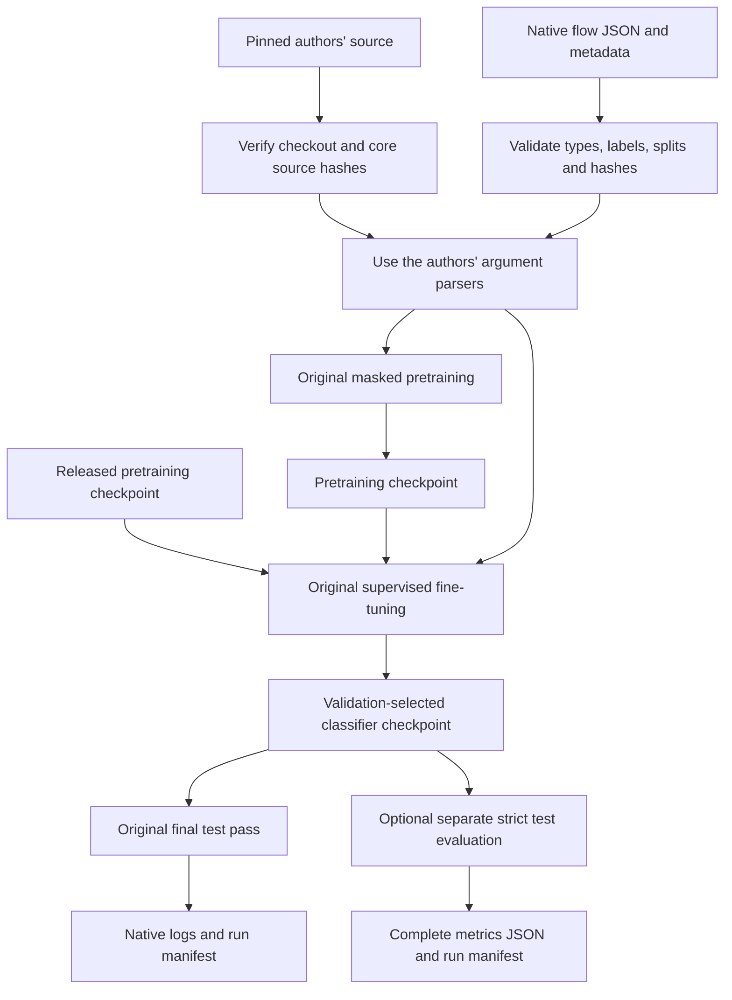

# NetMamba+ reproduction attempt

A small experiment harness for the authors' original NetMamba+ implementation. It validates native flow data, checks an exact source revision, runs the original training programs, and records experiment inputs and outcomes. The initial target is the authors' six-class **CICIoT2022** release.

**Current evidence:** the offline harness tests pass; a fresh upstream checkout and all 10,404 released CICIoT2022 flows passed validation; pretraining, fine-tuning and test-only evaluation passed argument-building dry runs with the actual upstream parsers. **No GPU training or inference experiment has been completed. No paper accuracy, speed result or full pretraining history has been reproduced.**

Read [the teaching lesson](docs/lesson.md) for a walkthrough, model concepts, worked examples and exercises.

## Why this repository uses flows

The starting materials were the [NetMamba+ paper](https://arxiv.org/abs/2601.21792v1) and two Payload-Byte CSV exports named `Payload_data_CICIDS2017.csv` and `Payload_data_UNSW.csv`. The CSVs contain individual packet payload vectors and a few metadata fields. They omit the flow identifiers and ordering context needed to establish the packet sequences consumed by NetMamba+. Adjacent CSV rows cannot be assumed to belong to one connection.

A classifier trained directly on those packet exports would be an adaptation. Reproducing NetMamba+ requires compatible flow inputs, the original transformations and a defensible experimental protocol. This repository starts with the authors' processed CICIoT2022 flows. **CICIoT2022 and CICIDS2017 are different datasets.** The CSVs are not converted, bundled or used as reproduction inputs.

## What the code does



| File | Responsibility |
|---|---|
| [repro.py](repro.py) | CLI, flow validation, source checks, native arguments, training subprocesses and manifests |
| [evaluate.py](evaluate.py) | Strict classifier loading and test-only invocation of the original evaluator |
| [configs/ciciot2022.json](configs/ciciot2022.json) | Exact source pin, seven core hashes, settings and field-level provenance |
| [tests/test_repro.py](tests/test_repro.py) | Offline synthetic tests of the harness and its failure behavior |
| [.github/workflows/ci.yml](.github/workflows/ci.yml) | Python 3.10 and 3.12 CPU acceptance checks |

The authors' loader owns padding, truncation, normalization and tensor construction. Their model and training code own optimization, validation-based checkpoint selection and the final test pass. The harness does not rewrite those algorithms. It uses the complete namespace returned by the native argument parser, including defaults that are absent from our JSON preset.

## Start with the offline checks

From this repository's root, with Python 3.10 or newer:

```bash
python3 -m unittest discover -s tests -v
python3 repro.py --help
```

These commands need only the Python standard library. They work without Git, upstream source, NumPy, Torch, datasets, checkpoints or network access. Tests use small synthetic flows and dependency stubs; their passing scores are not model performance measurements.

## Obtain the original source and research assets

Git and network access are needed for source acquisition:

```bash
python3 repro.py fetch
```

This fetches [the authors' source at `eec9483e2f0fb84ca22982b9de8149bc3a8b1ad2`](https://github.com/wangtz19/NetMambaPlus/tree/eec9483e2f0fb84ca22982b9de8149bc3a8b1ad2) into `upstream/NetMambaPlus`. An existing checkout is checked without resetting it. Every tracked file must match its Git object; seven core files also have explicit SHA-256 checks. Modified tracked files and extra importable files, including ignored ones, cause rejection before any upstream parser or model code executes. Bytecode writing is disabled to keep legitimate runs from adding source-cache files.

Only `fetch` acquires source. Dataset/checkpoint acquisition and research-environment installation are separate from offline acceptance. Use the authors' [Drive release root](https://drive.google.com/drive/folders/1_IMfmpB34SM7nUSzzivd_7wAOnt2zwzE), [fine-tuning datasets](https://drive.google.com/drive/folders/12dXxKYNwJsMZnNHpX6rzUZr6KslZFsS6) and [checkpoints](https://drive.google.com/drive/folders/1-LEQQB_bn3jB90rLAP5rbppy6k0iN0Pb). Download the processed CICIoT2022 files and the pretraining checkpoint into this layout:

```text
data/ciciot2022/
  metadata.json
  data-train.json
  data-valid.json
  data-test.json
checkpoints/
  fuse3_mamba.pth
```

Data, checkpoints, upstream source, local evidence and run outputs are ignored by Git. Upstream is fetched separately and is not vendored; this repository does not confer redistribution rights for the authors' code or datasets. The inspected upstream root contains no license file.

## Native data contract

Each split is a nonempty JSON array of flows. This abbreviated, synthetic record illustrates the types; it is not a captured packet:

```json
{
  "data": ["69 0 0 64", "69 0 0 52"],
  "sizes": "64 52",
  "intervals": "0 0.001",
  "num_packet": 2,
  "label": 0,
  "name": "6-Attacks-1-Flood",
  "pcap_file": "example-flow-001.pcap"
}
```

`data` contains integer bytes from 0 through 255. `sizes` and `intervals` are literal-space-separated numeric strings of equal length. Sizes must be finite; intervals must be finite and nonnegative. Short flows and sequences longer than twenty are valid. The original loader determines which values are retained or padded. Optional `num_packet` is checked for a nonnegative integer but is not substituted for the actual arrays; the native loader does not use it to reconstruct missing packets.

`metadata.json` contains `name_to_idx`, an object mapping each class name to one unique integer starting at zero, without gaps. Every record's `name` and `label` must agree with it. The default preset requires six classes and derives the classifier's output count from this mapping:

| Index | Released class name |
|---|---|
| 0 | `6-Attacks-1-Flood` |
| 1 | `6-Attacks-2-RTSP Brute Force` |
| 2 | `1-Power-Audio` |
| 3 | `1-Power-Other` |
| 4 | `1-Power-Cameras` |
| 5 | `1-Power-Home Automation` |

Validate and save the report before training:

```bash
python3 repro.py validate --data data/ciciot2022 --report runs/validation.json
```

Full-split validation reads all three splits, checks labels, reports class counts and identifier coverage, and rejects shared recorded `pcap_file` identifiers across splits. Missing identifiers are reported as missing evidence; they do not establish independence.

Raw-input fingerprints are SHA-256 of UTF-8 `json.dumps([data, sizes, intervals], ensure_ascii=False, separators=(",", ":"))`. For a custom `size_key`, that field replaces `sizes`. Labels and provenance identifiers are excluded. String formatting is retained: this measures exact stored-input equality, not equality after normalization or padding. `shared_raw_inputs` counts distinct fingerprints in both splits; `left_rows` and `right_rows` count all rows carrying those fingerprints. `duplicate_excess` is rows minus distinct fingerprints within a split. Reports never alter or deduplicate the data.

## Research environment

The pinned [upstream README](https://github.com/wangtz19/NetMambaPlus/blob/eec9483e2f0fb84ca22982b9de8149bc3a8b1ad2/README.md) specifies Python 3.10.13, Torch 2.2.0, torchvision 0.17.0 and cu121, its bundled Mamba 1.1.1 package with causal-conv1d 1.1.2.post1, and flash-attn 2.7.4.post1. The [requirements file](https://github.com/wangtz19/NetMambaPlus/blob/eec9483e2f0fb84ca22982b9de8149bc3a8b1ad2/requirements.txt) supplies the remaining versions, including NumPy 1.26.2 and timm 0.4.12.

On a machine compatible with that research stack, the setup sequence is:

```bash
conda create -n netmambaplus python=3.10.13
conda activate netmambaplus
python -m pip install torch==2.2.0 torchvision==0.17.0 --index-url https://download.pytorch.org/whl/cu121
python -m pip install -r upstream/NetMambaPlus/requirements.txt
```

Build the bundled Mamba package in a disposable copy, so generated importable build files do not contaminate the verified checkout:

```bash
netmamba_build_dir=$(mktemp -d)
cp -a upstream/NetMambaPlus/mamba-1p1p1 "$netmamba_build_dir/mamba-1p1p1"
python -m pip install --no-build-isolation "$netmamba_build_dir/mamba-1p1p1"
python -m pip install flash-attn==2.7.4.post1 --no-build-isolation
python repro.py fetch
```

These are setup instructions derived from upstream, not a validated environment lockfile. Native extensions require an appropriate compiler/CUDA toolchain. The development host has aarch64 Python 3.12.3 and an NVIDIA GB10; installation and GPU compatibility of this older stack on that host remain unverified. CPU harness checks do not establish CPU equivalence for the CUDA evaluator. Keep package/build details and GPU/driver information with every eventual experiment; the manifest's package-version list is useful but not a complete environment lock.

## Run the released-checkpoint route

First build the actual native arguments without importing the training stack or launching a training process:

```bash
python3 repro.py finetune --data data/ciciot2022 --checkpoint checkpoints/fuse3_mamba.pth --output runs/ciciot-ft-dry --dry-run
```

Inspect `runs/ciciot-ft-dry/manifest.json`, especially `native_args`, `configuration_provenance` and `validation`. A dry run performs Git/source checks, JSON validation and checkpoint hashing. It does not deserialize the checkpoint, test model compatibility or prove a GPU operation will work.

After environment setup, fine-tune with a fresh output directory:

```bash
python3 repro.py finetune --data data/ciciot2022 --checkpoint checkpoints/fuse3_mamba.pth --output runs/ciciot-ft-seed0 --seed 0
```

The input checkpoint goes through the original `--finetune` transfer-learning path. The native program trains on `data-train.json`, selects `checkpoint-best.pth` using validation accuracy, and already performs its final test pass on `data-test.json`. It writes its own reports plus `native.log`; the harness adds `manifest.json`. No additional test pass is inserted into training.

The released `fuse3_mamba.pth` was inspected during project intake as a ZIP/pickle archive without loading it into Torch. Its archive root was `checkpoint-step100000`; decoder keys were present and `head.weight`/`head.bias` were absent. Those observations support treating it as a **pretraining input**, not a ready six-class classifier. The archive name does not prove its total training history, exact corpus or compatibility with a completed GPU run. Actual input files are hashed into each run manifest.

## Optional pretraining route

The paper reports Browser and Kitsune pretraining data. Establish that corpus, preprocessing, membership and provenance separately before claiming full reproduction. The released CICIoT2022 fine-tuning set is not evidence of that pretraining corpus.

Native pretraining discovers `data-train.json` when it exists, otherwise `data.json`. The harness also requires `metadata.json` and valid label/name fields because the native dataset loader expects those fields, even though the reconstruction objective does not use class targets. For a pretraining corpus with a different class inventory, copy the preset and update `dataset.name`, `dataset.expected_classes` and the corresponding provenance to match its actual metadata. Preserve the source pin and model settings unless you are explicitly defining a separate experiment.

With that reviewed configuration and data available:

```bash
python3 repro.py validate --config configs/pretraining.json --stage pretrain --data data/pretraining --report runs/pretraining-validation.json
python3 repro.py pretrain --config configs/pretraining.json --data data/pretraining --output runs/pretrain-dry --dry-run
python3 repro.py pretrain --config configs/pretraining.json --data data/pretraining --output runs/pretrain-seed0 --seed 0
```

`configs/pretraining.json` and `data/pretraining` above are user-supplied inputs, not bundled assets. A checkpoint produced by this route can replace `checkpoints/fuse3_mamba.pth` in the fine-tuning command. Record the actual checkpoint path/hash and the upstream log; a successful process exit alone does not certify paper-equivalent pretraining.

## Separate strict test evaluation

This route measures an already fine-tuned classifier. It can run with only metadata and test data present:

```bash
mkdir -p data/ciciot2022-test-only
cp data/ciciot2022/metadata.json data/ciciot2022-test-only/
cp data/ciciot2022/data-test.json data/ciciot2022-test-only/
python3 repro.py evaluate --data data/ciciot2022-test-only --checkpoint runs/ciciot-ft-seed0/checkpoint-best.pth --output runs/ciciot-eval-dry --dry-run
python3 repro.py evaluate --data data/ciciot2022-test-only --checkpoint runs/ciciot-ft-seed0/checkpoint-best.pth --output runs/ciciot-eval
```

`evaluate.py` loads checkpoint storage on CPU, requires `checkpoint["model"]`, constructs the original classifier and calls `load_state_dict(..., strict=True)`. It moves the model to the requested device, builds exactly one test loader, verifies the loader's class mapping and calls the original `engine_mm.evaluate`. It never enters the native fine-tuning `main` or reads/hashes training and validation datasets. The separate entry point also avoids the pinned fine-tuner's `--eval` branch, which references its test loader before construction.

Incompatible keys or tensor shapes cause failure; there is no head replacement or non-strict evaluation fallback. The evaluator uses the original internal CUDA autocast, even though the source preset passes `--no_amp`. That flag does not switch this evaluator to full precision.

A successful fine-tuning manifest binds `checkpoint-best.pth` to its SHA-256 and class mapping. Evaluation discovers this sibling `manifest.json` automatically. If a classifier is moved elsewhere, pass `--provenance /path/to/its/manifest.json`; an explicit mapping document may also contain `checkpoint_sha256` and `class_mapping`. Explicit hash mismatches and established class-order conflicts fail. Without a matching binding, outputs retain `class_order: "unknown"` and `training_history: "unknown"`. Hash binding records a claim about one exact file; it does not independently authenticate that claim or recover unknown pretraining history. Only load checkpoints from a trusted source: the native format uses Python pickle deserialization.

`metrics.json` preserves every key from the native test-state dictionary, including weighted metrics, per-class arrays, support and confusion matrix. NumPy-like scalars/arrays become ordinary JSON; nonfinite values become `null`, with their JSON-pointer paths recorded separately. No metric is silently discarded or replaced by a claimed result. For custom test subsets lacking classes, the unchanged native metric arrays may omit absent classes; do not blindly assign every array position to all six metadata classes.

## What each manifest establishes

Execution stages create `manifest.json` atomically before substantive preflight when the output is writable. They distinguish `preflight_failed`, `dry_run`, `running`, `succeeded` and `failed`. Each completed record includes the stage, timestamps, configuration/provenance, hashes of both harness scripts, upstream source pin and core hashes, stage-specific input hashes, class mapping, applicable checkpoint hashes, full parsed native arguments, command, working directory, selected runtime versions and exit/error details. Only an allowlist of relevant environment values is recorded.

Pretraining hashes its selected training file and metadata; fine-tuning hashes all three splits and metadata; separate evaluation hashes only test data and metadata, plus its checkpoint and available provenance information. Inputs and the checkpoint are checked again after execution. A fresh output directory is required when a manifest already exists, so reruns cannot overwrite a prior run record. A hard kill or power loss can leave a `running` record; that is not success. Source checks establish the inspected checkout, not a security sandbox or proof that installed dependencies are identical.

## Source settings, paper settings and observations

The JSON preset distinguishes source-launcher evidence, native parser defaults and explicit harness choices. In the authors' pretraining launcher, the Mamba call is an explicit supported call commented out in `main`; the harness selects it deliberately. It does not execute the launcher's different default model selection.

| Setting | Supplied source-based preset | Paper v1, page 9 |
|---|---|---|
| Pretraining steps | 100,000 | 150,000 |
| Pretraining batch size | 128 | 128 |
| Fine-tuning epochs | 120 | 120 |
| Fine-tuning batch size | 128 | 64 |
| Pretraining learning-rate setting | `blr=0.001`; `lr` unset | Initial learning rate 0.001; scaling reference not specified there |
| Fine-tuning learning-rate setting | `blr=0.002`; `lr` unset | Learning rate 0.002 |

The native formula is `lr = blr * (batch_size * accum_iter * world_size) / 256`. With accumulation 1 and one process, the conditional initial rates are **0.0005 for pretraining** and **0.001 for fine-tuning**. These are derivations, not observed training results. The harness leaves `lr` unset and lets upstream compute it. A fixed seed does not promise bitwise determinism: native pretraining enables cuDNN benchmarking, while fine-tuning disables it and enables cuDNN's deterministic setting without enabling all deterministic algorithms.

Local intake observations were rechecked using this harness on 7 September 2026:

| Split | Rows | Distinct raw inputs | Duplicate excess |
|---|---:|---:|---:|
| Train | 8,323 | 8,289 | 34 |
| Validation | 1,040 | 1,040 | 0 |
| Test | 1,041 | 1,041 | 0 |

Five distinct raw inputs occur in both train and validation (7 train rows, 5 validation rows); six occur in both train and test (8 train rows, 6 test rows). None occur across validation and test. There were no conflicting labels among these groups and no recorded `pcap_file` overlap across splits. These are measurements of the inspected release files, not proof of physical capture independence. The official records remain unchanged; any deduplicated or capture-grouped experiment should be reported separately with its own split definition.

The files for those measurements have these SHA-256 values, so later release changes can be detected:

```text
metadata.json    1e5914d8cb3443a9c491ad127acf82203646b77ed4139f98cbc332ff080b8135
data-train.json  ba54a0ec94f21386b58f2df01270144f69ad53421cbd6301ec445cd5d902b107
data-valid.json  c614f00e5b9b1d0059916eb90bd3296cbb8d4868154223e9717c3acb50184723
data-test.json   8c1dfc79b6d7c5c4c9b589353ba2b1ab7bfc505d4b133135b604c2f835836b99
```

## Make the eventual result defensible

1. Declare whether the experiment reproduces the released source recipe or tests a paper-derived configuration. Record every difference, the dataset release hashes and checkpoint provenance before training.
2. Verify the research environment on a compatible GPU. Preserve the environment export, GPU/driver details, source pin and complete run directories. CPU CI and parser dry runs establish narrower claims.
3. Freeze hyperparameters, seed list, metrics and acceptable comparison tolerance before using test results. Use validation for model selection. Repeat the planned seeds and report all runs and variability; do not choose the best seed by test accuracy.
4. Run the native fine-tuning workflow. For independent evaluation, use the same validation-selected classifier and the strict test-only command. Keep accuracy, weighted F1, per-class support and the confusion matrix together; a six-class task can conceal poor minority-class behavior in its average.
5. Report the input overlaps and unresolved capture/pretraining provenance. Preserve the official-split result as the primary reproduction attempt. Label robustness checks, altered splits, changed environments and CSV experiments as additional experiments.

A defensible current description is: **“A tested harness around pinned NetMamba+ source, with validated native CICIoT2022 inputs and documented experimental discrepancies; GPU reproduction remains to be established.”**
