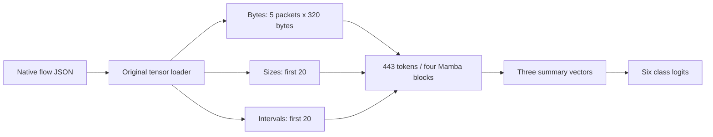

# NetMamba+ — measured reproduction attempt

This repository runs the authors’ original multimodal NetMamba+ model on compatible CICIoT2022 flows. The customer package records actual GPU masked-pretraining execution, three full 120-epoch fine-tuning runs, strict saved-classifier inference, independently checked metrics and an offline demonstration.

The measured environment is an **NVIDIA GB10 compatibility port**. The source-based batch/rate settings differ from the paper, and the released checkpoint’s complete pretraining history remains unknown. **Do not describe these results as an exact reproduction of every paper result or as a production IDS.**

Test accuracy was **91.26%, 84.05% and 84.63%** across the three declared seeds: **86.65% mean**, with a 4.00 percentage-point sample standard deviation. The paper reports 97.50% under different conditions. The [results](docs/customer/results.md) preserve every seed, metric definition, error and limitation.

## Open the customer package

| Deliverable | Link |
|---|---|
| Start here: results, downloads and completion checklist | [Customer index](docs/customer/README.md) |
| Understand it without a technical background | [Slide-by-slide field guide](https://buffbeefalo.github.io/netmambaplus-reproduction/guide.html) |
| Simple setup, usage and test results | [Quickstart](docs/customer/quickstart.md) |
| What the paper/data mean and what we changed | [Authors’ repository comparison](docs/customer/upstream-comparison.md) |
| Find each of your seven answers | [Question-to-slide/script/PDF map](docs/customer/answers.md) |
| Download the complete offline customer bundle | [Release ZIP](https://github.com/buffbeefalo/netmambaplus-reproduction/releases/latest/download/netmambaplus-customer-package.zip) |
| Short technical briefing | [PDF](docs/customer/NetMambaPlus-customer-briefing.pdf) · [Markdown](docs/customer/briefing.md) |
| Editable presentation with speaker notes | [PowerPoint](docs/customer/NetMambaPlus-customer-slides.pptx) · [Slide PDF](docs/customer/NetMambaPlus-customer-slides.pdf) |
| Working recorded-inference demo | [Open in browser](https://buffbeefalo.github.io/netmambaplus-reproduction/) · [Download HTML](https://raw.githubusercontent.com/buffbeefalo/netmambaplus-reproduction/main/docs/customer/demo/index.html) |
| Measured results, errors and learning curves | [Results](docs/customer/results.md) · [Machine-readable evidence](docs/customer/evidence/results.json) |
| Research and AI-assisted findings | [Reviewed research record](docs/research/research-record.md) |
| Repeat the experiment | [Tested runbook](docs/customer/runbook.md) |
| Explain it yourself | [Teaching lesson](docs/lesson.md) · [Presenter talk track](docs/customer/talk-track.md) |
| Future IDS / NPU / SmartNIC integration | [Hardware roadmap](docs/customer/hardware-roadmap.md) |

The demo shows recorded predictions from a real GPU inference run. It does not capture or block packets. Display pace is unrelated to model latency. The package includes a recording as a meeting backup and preserves actual prediction errors.

## Why the uploaded CSVs are not the model’s training inputs

The starting files were [paper v1](https://arxiv.org/abs/2601.21792v1), `Payload_data_CICIDS2017.csv` and `Payload_data_UNSW.csv`. Full metadata scans found **1,410,255** and **79,881** packet rows respectively. Both CSVs have 1,500 payload-byte columns plus TTL, length, protocol, time delta and label. They lack the connection identity and established ordering needed to reconstruct this model’s flows. Five adjacent rows cannot be assumed to belong to one connection.

A packet classifier built directly from those exports would be an adaptation. This experiment instead uses the authors’ processed **CICIoT2022** flow release: 8,323 training, 1,040 validation and 1,041 test flows across six classes. CICIoT2022 and CICIDS2017 are different datasets. The original CSVs are profiled, not converted into fictitious flow inputs.

## What goes through the model



The loader owns padding, truncation and normalization. The model’s six classes are Flood, RTSP Brute Force and four IoT power/device categories. Softmax scores are uncalibrated; this is not universal attack coverage. See the [lesson](docs/lesson.md) for the transformations and the [harness reference](docs/harness-reference.md) for exact validation and manifest behavior.

## Start with the offline checks

Python 3.10 or newer is sufficient for the standard-library tests:

```bash
python3 -m unittest discover -s tests -v
python3 tools/verify_package.py
```

CPU CI checks the harness and published evidence. It does not retrain the GPU model. The separately saved GPU records establish the actual experiments described in the customer package.

Acquire the pinned original source and assets:

```bash
python3 repro.py fetch
python3 tools/fetch_assets.py --output assets
python3 repro.py validate --data assets/data/ciciot2022 --report runs/validation-new.json
```

`fetch` verifies every tracked file against commit `eec9483e2f0fb84ca22982b9de8149bc3a8b1ad2` and seven additional core SHA-256 pins. Modified or extra importable source files cause rejection. Asset acquisition checks expected sizes and hashes before publishing each local file and refuses mismatched existing files.

## Train, evaluate and predict

First follow the [tested GB10 environment setup](docs/customer/runbook.md). It builds the authors’ Mamba fork with recorded CUDA 13 compatibility edits in disposable copies and runs GPU numerical checks. The original model/loader checkout remains unchanged. The package preserves the old dependency warnings and the limits of this runtime profile.

After activating that environment and its documented variables:

```bash
python repro.py finetune --data assets/data/ciciot2022 --checkpoint assets/checkpoints/fuse3_mamba.pth --output runs/ciciot-ft-seed0 --seed 0 --num-workers 2
python evaluate.py --data assets/data/ciciot2022 --checkpoint runs/ciciot-ft-seed0/checkpoint-best.pth --output runs/ciciot-eval-seed0 --num-workers 2
python replay.py --data assets/data/ciciot2022 --checkpoint runs/ciciot-ft-seed0/checkpoint-best.pth --output runs/ciciot-replay-seed0 --num-workers 2
```

The native fine-tuner selects the best **validation** accuracy, then performs its final test pass. Separate evaluation strictly reloads that same classifier. Repeat with seeds 1 and 2 for the published three-seed protocol; all seed results are retained. Every invocation requires a fresh output directory and records configuration, source/data/checkpoint hashes, class mapping and status.

For already assembled native flows with no ground-truth labels:

```bash
python predict.py --flows path/to/unlabeled-flows.json --checkpoint runs/ciciot-ft-seed0/checkpoint-best.pth --output runs/predictions-new
```

This command returns logits, scores and class names without inventing an accuracy metric. It requires checkpoint-bound class meanings and uses the same native feature transformations. The [runbook](docs/customer/runbook.md) also covers masked pretraining, all-seed verification, model-only exports, timing, the export probe and rebuilding the presentation.

## Code and evidence map

| Path | Responsibility |
|---|---|
| [repro.py](repro.py) | Source/data validation, native parser settings, training subprocesses and manifests |
| [evaluate.py](evaluate.py) | Strict test-only native classifier evaluation |
| [predict.py](predict.py) | Prediction on native flow records without known labels |
| [replay.py](replay.py) | Recorded native inference, independent metrics and self-contained browser page |
| [configs](configs) | Source pin, settings/provenance, asset hashes and functional-pretraining budget |
| [tools](tools) | Tested runtime build, numerical checks, experiment review, timing, export probe and publication tools |
| [tests](tests) | Synthetic CPU checks of important acceptance and failure behavior |
| [docs/customer/evidence](docs/customer/evidence) | Reviewed manifests, logs, predictions, runtime records and hashes |

## Boundaries to keep with the result

The official files contain five exact stored inputs shared across train/validation and six across train/test. Recorded identifiers and raw-input fingerprints do not establish physical capture independence. The released pretraining checkpoint’s earlier exposure remains unknown. Repeated evaluation of one fixed test set is not an independent holdout or validation on customer traffic.

The short pretraining run validates reconstruction learning on downstream training data; it does not recreate the paper’s full Browser/Kitsune pretraining. The paper/source batch and learning-rate differences remain explicit. Optional LDA/class-balancing paths, live capture/extraction, confidence calibration, unknown-attack detection and NPU/SmartNIC deployment are not established by these measurements.

Raw data, upstream source and original weights are acquired from their authors rather than mirrored in this repository. Locally produced classifier exports and their hashes are recorded; inherited asset redistribution/commercial terms remain unresolved, so the customer package shares prediction evidence and a repeatable training route rather than asserting new rights over those assets. The authors’ inspected repository root has no license file.

The [7 September audit](docs/audit.md) is historical. The later [focused council decision](docs/research/research-record.md#council-decision-and-its-limits) reviewed the staged experiment plan; it did not independently certify later numerical results or replace the earlier unratified audit. The current package’s [verification record](docs/customer/verification.md) states the checks actually performed.

The [final council review](docs/research/final-council-review.md) records the exact ratified handoff criteria, retained evidence limits and applied corrections. Its initial escalated review is preserved separately. The final release receipt binds publication checks to the downloaded revision.
