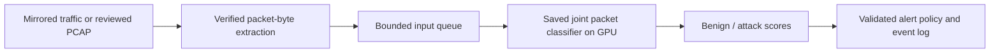

# From a flow classifier to an IDS and accelerator deployment

The original experiment uses an **NVIDIA GB10 GPU** to classify processed CICIoT2022 flows. The later [packet adaptation](packet-model-study.md) also runs the native encoder on both supplied CSVs. A SmartNIC and an AI NPU are prospective deployment components. This repository makes no measured claim that either model runs on them.

## A simple packet IDS architecture

The current supported model workflow consumes formatted packet CSVs. The native joint classifier has run on GB10; the public demo displays its recorded test predictions. Capture, verified extraction/padding semantics, continuous queues and an operational alert service in this diagram are **future work**. Packet confidence is uncalibrated. Use [packet setup](packet-study-setup.md) for the implemented commands.

The earlier flow/calibration work below supplies historical research context and an export-probe result. It is not a second supported client workflow. No SmartNIC or NPU execution is claimed for either historical measurements or the current packet adaptation.

## Make capture semantics explicit before writing a live adapter

The extractor must establish the same flow grouping, direction convention, packet ordering, header normalization, byte selection, timestamp units, truncation and padding as training. A five-tuple alone does not specify flow timeouts or bidirectional canonicalization. The harness validates stored fields; it cannot certify their packet-capture provenance.

Start with a small reviewed PCAP and expected feature records produced by the original extraction process. Compare the adapter's byte, size and interval tensors with those reference tensors, including short flows, retransmissions, fragmented packets and timeouts. The upstream helpers require path changes and reference a missing `dataset_debias_common` module; a reliable extraction path is not established here.

Use mirrored traffic and alert-only operation for an initial deployment experiment. Measure packet drops, queue occupancy, active-flow memory, flow completion delays, end-to-end latency and false alerts per hour. The current recorded classifier latency excludes these costs. Independent customer captures and incident labels are required before operational performance can be assessed.

## Where a SmartNIC could help

| Component | Candidate location | Work to establish |
|---|---|---|
| Packet classification, filtering, steering, counters | NIC hardware / DOCA Flow | Match/action rules, supported headers, offload coverage, drop accounting |
| Connection state, timeouts and extraction | Host CPU or DPU Arm cores | Bounded memory, packet order, exact training-compatible features, backpressure |
| Multimodal classifier | GPU initially | Batched inference, queue deadlines, input ownership, measured accuracy and latency |
| Calibrated alert policy and audit events | Host / DPU software | Threshold validation, unknown traffic handling, logging and operational response |

[NVIDIA DOCA Flow](https://docs.nvidia.com/doca/sdk/doca-flow/) provides packet steering and match/action capabilities. This does not imply that the Mamba recurrence runs on the NIC's packet-processing pipeline. [DOCA GPUNetIO documentation](https://docs.nvidia.com/doca/sdk/doca-gpunetio/), rechecked on 14 September 2026, identifies **DGX Spark as lacking GPUDirect RDMA** and describes CPU/GPU shared-memory allocation with CPU proxy transmission for such systems. No GPUNetIO pipeline was executed here. The GB10 host therefore cannot be assumed to have the paper's or another server's direct NIC-to-GPU path. Check the exact host, NIC, firmware, interconnect and SDK version before proposing one.

## What an AI NPU port would require

“AI NPU” is a device category, not a compiler target. As one concrete future investigation, an Intel Core Ultra NPU through [OpenVINO](https://docs.openvino.ai/2026/openvino-workflow/running-inference/inference-devices-and-modes/npu-device.html) would require a supported exported graph, static shapes, supported precision and an on-device accuracy/latency check. That target has not been tested or selected for the customer.

The table below describes the original flow configuration. The packet adaptation retains the native scan/convolution kernels but uses 378 positions and 1,852,416 parameters, with no observed size/IAT sequence. Its smaller input does not establish export support or accelerator compatibility.

| Model operation or resource | Original flow implementation | Porting question |
|---|---|---|
| Byte-stride projection, size embedding, interval projection, head | Torch tensor operations | Can the target compile lookup, projection and reshape operations? |
| Causal convolution, width 4 | Custom CUDA extension | Is a semantically equivalent causal convolution supported? |
| Selective state-space scan | Custom CUDA extension with input-dependent state updates | Can the recurrence be represented and compiled efficiently, or is a custom kernel required? |
| RMS normalization and fused residual path | Triton kernels | Can it be decomposed without unacceptable numerical or latency changes? |
| 443 tokens × 256 embedding dimensions | Fixed classifier sequence | What are peak activation and scan-state memory, compiler limits and transfer costs? |
| 1,870,080 trainable classifier parameters | FP32 weights; evaluation autocast | Does FP16 or INT8 preserve held-out per-class behavior after calibration? |

For scale, the parameter count alone represents **7,480,320 bytes in FP32** or **3,740,160 bytes in FP16**. This is arithmetic, not total device memory: buffers, activation tensors, state, workspaces, compiler layouts and transfer queues add storage. A nominal TOPS figure cannot determine latency for this mixture of projections and sequential operations.

The repository ran a fixed-shape `torch.export.export(strict=True)` probe against the saved classifier after successful eager GPU inference. It failed with `Unsupported` because graph capture cannot trace the custom `causal_conv1d_cuda.causal_conv1d_fwd` call. The [exact probe result](evidence/export-probe/metrics.json) records that blocker. This is evidence about one Torch graph-capture path; no ONNX exporter, NPU compiler or NPU hardware was tested. Resolving this first blocker would still leave the selective scan and other operations to assess. The failure does not prove that the architecture can never run on an NPU.

## A defensible sequence of next milestones

1. Establish a PCAP-to-tensor reference and implement a byte-identical online adapter.
2. Run a bounded, alert-only GPU IDS on independent traffic; measure false alerts, misses, capture loss and end-to-end delays.
3. Choose the exact deployment device and power/memory/latency requirements.
4. Port unsupported operators, then compare logits and per-class metrics with the frozen GPU classifier using declared tolerances.
5. Measure the complete deployed system on that hardware, including preprocessing, transfers and flow observation time.

Changing precision or retraining a smaller model is a new experiment. Keep the current measured checkpoint and results as the comparison reference. Do not present a diagram, an export file, a packet-steering demo or a GPU model-only timing as completion of these milestones.
