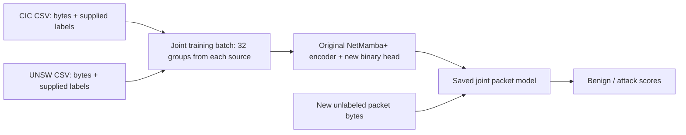

# How both uploaded CSVs enter NetMamba+

**Current delivery:** This is the sole supported [client workflow](client-project-guide.md). Use the validation-selected joint pretrained model for prediction; the six native arms and nine controls are comparison evidence within this packet study. The current [recorded demo](https://buffbeefalo.github.io/netmambaplus-reproduction/) shows its joint-model packet groups.

Rows from both uploads now supply real inputs and supervised training targets to the original NetMamba+ encoder. **All six models completed 1,000 updates.** The joint pretrained model reached 97.56% group-balanced accuracy on CIC and 94.29% on UNSW. A separate UNSW metadata control reached 99.34%, so the native model is not uniformly best. [Recorded native results](evidence/packet-study/results.json), [control results](evidence/packet-study/controls/evaluation/results.json).

Previously these CSVs were profiled while a separate classifier learned six CICIoT2022 flow classes. This addition uses the unchanged native encoder code with packet inputs and a binary head. The original flow results retain their meaning.

Only selected training groups enter the training batch. Separate validation groups choose the checkpoint; untouched test groups measure it afterward.

## From one row to one prediction

[Preparation](../../packet_data.py) validates all 1,500 slots as integers from 0 through 255 before byte conversion. Stored zeros remain; the metadata cannot establish padding.

The [adapter](../../packet_model.py) normalizes bytes using `float32(payload)/127.5 - 1`. Four bytes produce one learned vector: 375 byte vectors plus a byte summary and two learned prefixes make **378 tokens**, each 256 numbers wide. All pass through the original four Mamba blocks. Native fusion adds the three resulting summary vectors; a new head produces two logits: scores for benign and attack.

The size and inter-arrival-time streams contain **zero observations**. Their prefixes start identically for every packet and remain trainable. Later byte positions can use them; in native causal order, those prefix outputs cannot summarize the later bytes. TTL, recorded length, protocol, undocumented time delta, dataset identity and labels never enter model forward. The paper/PDF architecture drawing shows byte, size and timing representations; it does not establish that the uploaded CSVs supplied usable flow sequences.

Transferred initialization copies 50 compatible trunk state tensors from the registered checkpoint and excludes 31 reconstruction-related tensors. The head starts fresh. Positions remain learned and trainable: `[20,41] + range(42,417) + [442]` selects 378 entries from the original 443-position table. Scratch models use the same coordinates from fresh native initialization. Transferred positional values are part of the pretraining treatment. Paired comparisons use identical fresh heads and sampled groups.

## What the data supports

| Source | Rows scanned | Unique payload groups | Selected train / validation / test groups | Selected test rows |
|---|---:|---:|---:|---:|
| CICIDS2017 | 1,410,255 | 438,886 | 100,000 / 20,000 / 20,000 | 47,048 |
| UNSW | 79,881 | 39,168 | 27,380 / 5,858 / 5,930 | 12,112 |

Together, **1,490,136 rows form 478,044 globally distinct payload groups**. Ten payloads occur in both sources; nine have contradictory binary labels. The manifest retains every original label count and identifies the large duplicate groups.

`BENIGN` in CIC and `normal` in UNSW map to class 0. The other enumerated source labels map to class 1; unknown labels fail. These annotations have not been independently adjudicated for operational maliciousness.

A seeded payload hash assigns global groups to training, validation or test, targeting 70/15/15 proportions. Identical payloads cannot cross partitions, even across sources. Fixed hash order applies source-specific caps without consulting labels. Flow, capture and near-duplicate independence remain unknown.

Preparation accounts for every row; caps and sampling mean some never contribute to an update. Selected CIC test support includes **zero PortScan rows and four DDoS rows**. PortScan performance is unavailable; four rows cannot support a broad DDoS claim.

## What the completed experiment measured

Six models combined CIC, UNSW or joint training with transferred or scratch initialization. Each achieved 1,000 updates of 64 groups: **64,000 presentations per model**, sampled with replacement. Joint batches contained 32 groups per source, totaling 32,000 presentations each. They covered 27,460 distinct CIC groups and 18,809 UNSW groups; source-only runs covered 47,320 and 24,695 respectively. Repeated presentations are not full-file epochs.

Groups retain their label proportions: nine benign labels and one attack label produce a 90%/10% target. Each sampled group has equal total weight in the loss. Contradictory labels remain represented.

Validation ran every 100 updates. Group-weighted macro-F1 selected the earliest best checkpoint; joint selection averaged source scores. All six choices froze before final tests. Every selected model was strictly reloaded and tested on both sources, measuring familiar-source behavior and transfer without supervised fitting on the other source.

Row-weighted metrics give each original row one vote. Group-weighted metrics give each distinct payload one vote, divided across conflicting labels. Balanced accuracy averages benign and attack recall. AUROC measures score ranking across thresholds; attack average precision (AP) summarizes precision versus recall and depends on the proportion of attacks. The evidence includes both weightings, confusion matrices, F1, false-positive rate, attack recall and label slices.

## Results and limits

Both result columns below are **group-weighted balanced accuracy**, as percentages. Each model predicts the same 20,000 CIC and 5,930 UNSW test groups.

| Training source | Initialization | Selected update | CIC test | UNSW test |
|---|---|---:|---:|---:|
| CIC | Pretrained | 1,000 | 98.67% | 53.73% |
| CIC | Scratch | 100 | 50.00% | 50.00% |
| UNSW | Pretrained | 1,000 | 71.52% | 93.22% |
| UNSW | Scratch | 100 | 50.00% | 50.00% |
| Joint | Pretrained | 1,000 | 97.56% | 94.29% |
| Joint | Scratch | 1,000 | 55.57% | 50.00% |

The single-source scratch checkpoints were selected at update 100 because that was their earliest best validation result. Training still continued through update 1,000, as the optimizer counters and receipts record. Their 50% balanced accuracy reflects constant-class decisions, not successful discrimination.

Transfer was weak, especially CIC to UNSW. Compared with the corresponding pretrained source-only models, joint training gained **1.07 percentage points on UNSW and lost 1.11 on CIC**. This single-seed observation is neither a significance result nor an improvement on the original flow benchmark.

The joint model also illustrates why weighting matters:

| Test source | Group balanced accuracy | Row balanced accuracy | Group AUROC | Group attack AP |
|---|---:|---:|---:|---:|
| CIC | 97.56% | 96.31% | 99.34% | 98.46% |
| UNSW | 94.29% | 89.24% | 98.60% | 99.63% |

Nine CPU controls used only training groups for fitting and scaling; all six logistic-regression fits converged. Metadata controls use group means and protocol fractions, separately from the neural model’s payload-only inputs. All control outcomes, including poor transfer, appear below using the same group-balanced accuracy measure.

| Control training source | Control | CIC test | UNSW test |
|---|---|---:|---:|
| CIC | Majority | 50.00% | 50.00% |
| CIC | Byte histogram | 95.64% | 58.40% |
| CIC | Metadata | 93.91% | 28.47% |
| UNSW | Majority | 50.00% | 50.00% |
| UNSW | Byte histogram | 57.12% | 88.72% |
| UNSW | Metadata | 51.67% | **99.34%** |
| Joint | Majority | 50.00% | 50.00% |
| Joint | Byte histogram | 90.50% | 79.58% |
| Joint | Metadata | 85.06% | 83.58% |

The UNSW-only metadata result exceeds every native model on UNSW. It uses different inputs and shows strong source-specific label separability; it prevents a blanket claim of neural superiority. Full metrics and label slices remain in the [native](evidence/packet-study/results.json) and [control](evidence/packet-study/controls/evaluation/results.json) records.

The native run took **950.036 seconds**, including its held-out test inference; CPU-control work is excluded. Separate actual unlabeled-CSV inference reproduced **all 25,930 predicted classes**. Raw logits are not bit-exact across CUDA executions: with matched FP32 settings and source batches, the maximum difference was **0.000004411**, and two CIC rows failed the recorded strict comparison (`rtol=1e-4`, `atol=1e-6`). Default inference also preserved every class, but its maximum score difference was 0.001894 and 39 rows failed that stricter numerical check. The [inference records](evidence/packet-study/unlabeled/agreement.json) retain these limits; neither model weights nor primary test results were changed to erase them.

The released weights’ earlier exposure remains unknown. This single-seed study establishes neither flow-benchmark improvement nor production readiness; scores remain uncalibrated.

After the experiment, cross-platform CI exposed file-handling differences on Windows and macOS. The predictor now compares open-file metadata consistently; the video-page builder resolves path aliases, and history test fixtures preserve exact bytes. The original six implementation hashes remain available at [experiment commit 7eeb498](https://github.com/buffbeefalo/netmambaplus-reproduction/tree/7eeb4980eea9fd5ad17bfacd29ed88687cb3e1e5); neither its protocol nor its predictions were rewritten. The evidence checker binds original inference to that frozen protocol. A separate [GB10 check of the revised predictor](evidence/packet-study/post-study-io-check.json) validated the full 25,930-row unlabeled CSV and predicted its first 128 rows, with all 128 classes agreeing. That capped regression check does not replace the full experiment or erase its two numerical-comparison failures.

The [model council](../research/packet-model-council.json), run `b542fcac-8fbb-4190-8110-0e6f1566a44a`, and the earlier [connection council](../research/packet-connection-council.json) ended **ESCALATED / UNRATIFIED**. The model review lacked primary positional evidence. Subsequent direct review and mechanical checks establish learned positions and the mapping. These authorized audits leave the council outcomes unchanged; no consensus is claimed.

The new packet presentation comprises an [eight-slide PDF](packet-addendum/NetMambaPlus-packet-addendum.pdf), [editable PowerPoint](packet-addendum/NetMambaPlus-packet-addendum.pptx) and [speaker script](packet-addendum/packet-addendum-script.md). Send it with this report and the [setup guide](packet-study-setup.md). The [current video](https://buffbeefalo.github.io/netmambaplus-reproduction/video/) and its [v5 handbook](demo/video/v5/NetMambaPlus-course-handbook.pdf), [PowerPoint](demo/video/v5/NetMambaPlus-course-slides.pptx) and [transcript](demo/video/v5/transcript.md) explain both CSVs, the paper, this model, both repositories and their update process. The preserved v4 video and original PDF/PowerPoint are earlier flow/calibration history.
