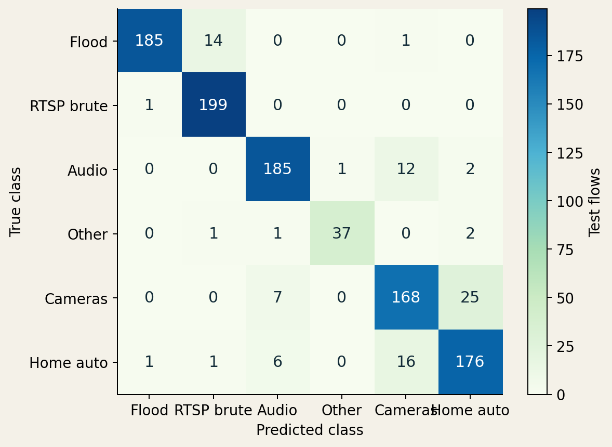
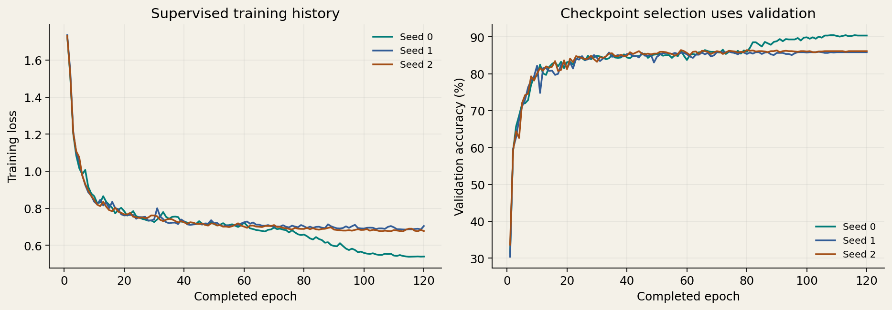

# Measured results

| Seed | Accuracy | Weighted F1 | Macro F1 |
|---|---|---|---|
| 0 | 91.26% | 91.26% | 91.58% |
| 1 | 84.05% | 84.08% | 84.86% |
| 2 | 84.63% | 84.67% | 85.38% |
| Mean | 86.65% | 86.67% | 87.27% |

All three runs completed 120 epochs and 7,920 updates each. Checkpoints were selected by validation accuracy. Seed 0 was fixed for the demo before test scores.

Paper Table IV reports NetMamba+ CICIoT2022 accuracy/F1 of **97.50%**. The source-based batch/rate settings, GB10 runtime and unresolved pretraining history differ; this is not a controlled equivalence comparison.

## Variability across seeds

| Metric | Mean | Sample SD (percentage points) |
|---|---:|---:|
| accuracy | 86.65% | 4.004 |
| weighted_f1 | 86.67% | 3.985 |
| macro_f1 | 87.27% | 3.737 |

Three seeds on one split do not establish uncertainty across other networks. All values are independently recomputed from saved predictions; weighted averages use true-class support and macro averages give six classes equal weight.

## Per-class seed-0 results

| Class | Support | Precision | Recall | F1 |
|---|---:|---:|---:|---:|
| Flood | 200 | 98.93% | 92.50% | 95.61% |
| RTSP Brute Force | 200 | 92.56% | 99.50% | 95.90% |
| Power–Audio | 200 | 92.96% | 92.50% | 92.73% |
| Power–Other | 41 | 97.37% | 90.24% | 93.67% |
| Power–Cameras | 200 | 85.28% | 84.00% | 84.63% |
| Power–Home Automation | 200 | 85.85% | 88.00% | 86.91% |

Rows are true classes; columns are predictions. Counts sum to 1,041. Prediction errors are retained in the replay.

## Training evidence

| Seed | Selected epoch (zero-based) | Best validation accuracy | First → last train loss | Elapsed (shared GPU) |
|---|---:|---:|---:|---:|
| 0 | 107 | 90.48% | 1.7274 → 0.5395 | 73.43 min |
| 1 | 73 | 86.06% | 1.7343 → 0.7044 | 79.46 min |
| 2 | 57 | 86.44% | 1.7299 → 0.6769 | 78.91 min |

The full native epoch logs are retained. Elapsed training times include resource sharing and are not isolated GPU performance measurements. The collector checks the actual selected-checkpoint optimizer counters and changed, finite model parameters.

## Strict inference and checkpoint identity

Native final evaluation, separate strict evaluation and independently reconstructed confusion matrices agree for every seed. These re-executions use the same fixed test set and do not constitute new independent holdouts.

| Seed | Selected classifier SHA-256 |
|---|---|
| 0 | `b7f90a3a01d2d14ec0f81b4c5166fba835b48c1c4050c52d10e600496dbed94c` |
| 1 | `80aa8647061228248fc4cc2746aa42eb4bceed6b583b3d5533eae8c4d3ec24eb` |
| 2 | `f36386bb9dd34f9d3954b1c38bf27ac9986ed7bf433b60af491f3d547513494b` |

The model-only exports are tensor-identical and have separate hashes/provenance. Original checkpoints and raw research assets are not silently substituted by the replay.

## Model-only latency

| Batch | Median latency | 95th percentile | Flows/s from mean |
|---|---|---|---|
| 1 | 0.88 ms | 0.93 ms | 1,120.0 |
| 16 | 4.32 ms | 4.64 ms | 3,679.1 |
| 128 | 36.55 ms | 37.38 ms | 3,502.3 |

GB10, float16 autocast, batches 1/16/128, 20 warmups and 100 synchronized measurements per batch. Capture, flow waiting, preprocessing, data loading, transfers and alert handling are excluded. The measurement JSON contains every latency sample and a process snapshot.

Single-flow versus batched prediction agreement on the first 128 test flows: **100.00%**. Maximum absolute logit difference: `0.001953125`.

## Limits that accompany the numbers

The official split contains five exact stored inputs shared between train/validation and six between train/test. Recorded identifiers and raw fingerprints do not prove capture independence; additional collisions after normalization are possible. Earlier exposure of the released pretraining checkpoint is unknown. These results do not establish unknown-attack performance, calibrated confidence, an operational false-alert rate or NPU/SmartNIC deployment.

Primary machine-readable evidence: [results.json](evidence/results.json), [benchmark](evidence/benchmark/metrics.json), [evidence index](evidence/artifact-index.json).
