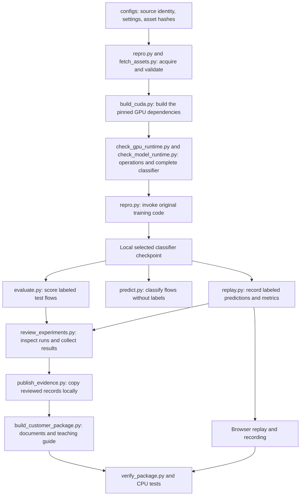

# Every file in the NetMamba+ repository

This companion explains the repository’s files, their inputs and outputs, and how they support the experiment and its presentation. Existing files and [expected v3 outputs](#v3-outputs) have individual entries below. During assembly, output links are reserved paths until their files are generated. The coverage and verification records establish the actual inventory and completion status; this guide does not infer success from a listed filename. Before publication, the coverage record must reconcile the Git inventory, including nonignored additions.

The 173-file audited experiment at commit `17b4aaebcf9327ae9967ca45ddfaf16325766993` is a frozen historical package. Later additions provide this walkthrough, teaching material, versioned narrated video, portability tools and their audit records. The original experiment evidence, customer PDFs and PowerPoint remain unchanged. The [current support matrix](support-matrix.md) supersedes the historical quickstart’s 54-test count and then-untested Windows/macOS status for portable evidence checks; additional physical GPUs still require validation.

“Tracked” means included in Git and visible in the GitHub repository. Nonignored new files also need review before the final inventory is frozen. The downloaded authors’ code, raw data, locally trained weights, temporary files and Git’s internal history are outside that inventory; their roles are explained near the end. The existing audited release remains a fixed package of its recorded commit. The earlier interactive HTML course is archived for evidence continuity, and its public `/course/` page is excluded from deployment. There is one active video watch route. The expanded v3 course has a separate media directory and is staged before that route changes; v2 media and its receipts remain historical evidence. None of these additions changes the seven historical release attachments.

You can read this one file from top to bottom, use the links below, or search it for a filename. To keep a local copy, use GitHub’s **Raw / Download raw file** action. A Markdown reader displays its formatting; an ordinary text editor can read the same file. Follow source links only when you want the underlying code or evidence.

**Jump to:** [How it fits together](#first-understand-what-the-repository-is) · [Vocabulary](#vocabulary-for-reading-the-files) · [Main code](#1-files-at-the-repository-root) · [GitHub automation](#2-githubworkflows-automated-github-jobs) · [Settings](#3-configs-recipes-and-input-identities) · [Dependencies](#4-requirements-packages-for-different-activities) · [Tools](#5-tools-programs-supporting-the-experiment) · [Tests](#6-tests-cpu-regression-tests) · [Foundational docs](#7-docs-foundational-explanations) · [Customer documents](#8-docscustomer-presentation-and-customer-instructions) · [Demo](#9-docscustomerdemo-files-used-for-the-browser-demonstration) · [Figures](#10-docscustomerfigures-reusable-charts) · [Original evidence](#11-docscustomerevidence-original-aggregate-and-input-records) · [Later audit](#12-docscustomeraudit-evidence-later-rechecks) · [Council/research](#13-docsresearch-reasoning-plans-and-council-records) · [V2 history](#v2-video) · [V3 production](#v3-course) · [V3 chapter and frame map](#v3-scenes) · [Local files](#files-you-may-see-locally-that-are-not-tracked-in-this-repo) · [Every release download](#release-attachments-are-separate-from-tracked-files).

## First understand what the repository is

Think of it as a small research laboratory with four parts:

1. **Execution code** gets the correct inputs into the authors’ model and runs training or prediction.
2. **Checks** test the execution code, compare GPU calculations and verify the recorded evidence.
3. **Lab records** preserve what actually ran: settings, logs, model identities, predictions and failures.
4. **Teaching materials** turn those records into the slides, briefing, guide and browser demo.

The neural model is **NetMamba+**, a classifier of network flows. A flow is a group of related packets. It reads byte content, packet sizes and time gaps, then assigns one of six dataset categories. Two categories are attacks; four describe IoT device/power activity. It is not a chatbot and does not call an AI chat service to make traffic predictions.

The uploaded CICIDS2017 and UNSW CSVs contain individual packet records. They lack established flow identity and ordering, so the experiment uses the authors’ separate CICIoT2022 flow release. The original model and tensor loader are fetched at a pinned commit rather than copied into this repository. Our scripts organize and verify their execution.

In the tested preset, one flow contributes the first five packets with up to 320 stored bytes each, plus the first 20 packet sizes and 20 time gaps. The original loader pads/truncates and normalizes these values. The model turns them into 443 input units called tokens, processes them through four Mamba blocks and combines three summaries into six outputs. A Mamba block scans a sequence while updating an internal numerical state; that state is not an implemented live network-connection cache. The six categories are Flood, RTSP Brute Force, Audio, Other, Cameras and Home Automation under the release's recorded class names.

## Follow one experiment through the files

The short pretraining check is a separate branch of this experiment. The three full fine-tuning runs started from the authors’ released pretrained checkpoint, **not from the checkpoint produced by our short check**. That distinction matters when explaining what was reproduced.

Opening the finished demo only reads recorded predictions. It does not run these training steps again. Running the CPU tests also does not train a model. New GPU experiments use the [support matrix](support-matrix.md) for the current environment and the original source/assets and execution sequence described in the runbook. `build_gb10.py` retains the historical GB10 build route; `build_cuda.py` checks a selected compiler-supported NVIDIA target while keeping the pinned model unchanged.

## Vocabulary for reading the files

| Term | Meaning in this project |
|---|---|
| Python / `.py` | Executable program text. Run it with Python; inspect it to understand the implementation. |
| Markdown / `.md` | Readable document text with headings, links and tables. GitHub displays it as a formatted page. |
| JSON / `.json` | Structured data made of named fields, lists and values. It can describe settings, results or predictions; the extension alone does not tell you which. |
| YAML / `.yml` | Structured settings used here to tell GitHub which automated jobs to run. |
| Manifest | A run’s lab notebook: what was requested, which files and model were used, what environment ran it, and whether it completed. |
| Checkpoint | A saved state of a trained neural network. Native training checkpoints may also contain optimizer state and settings. |
| Model-only export | A local checkpoint containing the selected model tensors without the training optimizer and executable settings object. It is still a PyTorch model file. |
| Graph export | A different operation: capture the model’s computations into a form another execution system might consume. The tested graph-export path failed. Successful model-only export does not establish graph-export support. |
| Provenance | The recorded origin and identity of a file or model, including which class index means which category. |
| Hash / SHA-256 | A content fingerprint. Matching hashes establish matching file bytes; they do not prove scientific correctness or data rights. |
| Seed | A chosen starting value for random operations. Seeds 0, 1 and 2 produced three training runs on the same data split. They are not three separate datasets. |
| Epoch / update | An epoch is a pass through the training loader. An optimizer update changes model parameters after a batch. The main runs each completed 120 epochs and 7,920 updates. |
| Logits / scores | Logits are six raw model outputs. Softmax converts them to six normalized display scores. Those scores are not calibrated probabilities of a real attack. |
| Accuracy / F1 | Accuracy is the fraction of correct predictions. F1 combines precision and recall. Weighted F1 accounts for each class’s number of true examples; macro F1 gives each class equal weight. |
| Confusion matrix | A table of true versus predicted categories. Here rows are true classes and columns are predicted classes. It shows which mistakes produced an aggregate score. |
| Fixture / regression test | A controlled example used to test code behavior, such as rejecting a mismatched model. These CPU examples do not establish neural-model accuracy. |
| Runtime / environment | The actual Python, packages, compiler, driver and hardware used to execute the model. |
| CPU / GPU / GB10 | The CPU runs general-purpose programs. A GPU performs many numerical operations in parallel. NVIDIA GB10 is the hardware profile used for the measured model execution here. The basic package tests need only a CPU. |
| Torch / CUDA / Triton | PyTorch (imported as `torch`) supplies neural-network operations and training machinery. CUDA is NVIDIA's GPU computing platform. Triton compiles some specialized GPU calculations used by this software stack. |
| NIC / SmartNIC / DPU | A NIC connects a computer to a network. SmartNICs and data processing units can take on additional packet handling or computation. This project's proposed division of work is described in the hardware roadmap; it has not been deployed there. |
| NPU / IDS | An NPU is a neural processing unit designed to accelerate supported neural computations. An IDS is an intrusion detection system that observes traffic and raises security alerts. A traffic classifier is one component of a possible IDS, not the whole capture-to-alert system. |

## 1. Files at the repository root

Course links: [main execution path](#v3-chapter-code), especially [the coordinator](#v3-scene-code-02), and [root/settings/dependencies](#v3-scene-repository-02).

These are the main entry points and Git settings. Links in every inventory table lead to the actual file. A table’s heading gives the folder; file names within that table are relative to it.

| File | What it does and when you would open it |
|---|---|
| [.gitattributes](../.gitattributes) | Tells Git to preserve exact bytes for captured records and documents, and to treat PDFs, PowerPoints, images and video as binary files. This protects hash comparisons against automatic text conversions. |
| [.gitignore](../.gitignore) | Lists local outputs that Git should normally exclude: downloaded source, datasets, checkpoints, run directories, virtual environments and secret-setting files. It reduces accidental publication; it is not a permission system. |
| [README.md](../README.md) | The project’s front door. Explains the measured result, links the customer material, gives basic commands and states the scientific and deployment limits. Read this before running the code. |
| [repro.py](../repro.py) | The main experiment coordinator. Its `fetch`, `validate`, `pretrain`, `finetune` and `evaluate` commands verify source/data, resolve native settings, create run manifests and launch the authors’ code. It also supplies shared validation, hashing, output protection and provenance helpers to the other scripts. |
| [evaluate.py](../evaluate.py) | Reloads a saved classifier strictly and scores labeled test flows using the authors’ loader and evaluation engine. It checks category meanings and writes the returned metrics. It does not train the classifier or select it using test accuracy. |
| [predict.py](../predict.py) | Classifies already assembled native flows when their correct labels are unknown. It makes temporary label/name placeholders only for the original loader, removes targets before prediction, and returns class names, logits and scores. It computes no accuracy without ground truth. |
| [replay.py](../replay.py) | Runs labeled test inference, records each prediction and independently recomputes the metrics. It also contains the browser replay’s HTML, CSS and JavaScript template. The generated page displays those saved results without executing the neural model in the browser. |

The main pattern is **shared preparation, specialized execution**. `repro.py` checks identity and settings once; evaluation, prediction and replay reuse that preparation. The authors’ loader remains responsible for tensor transformations, avoiding a second interpretation of packet bytes, padding and normalization.

## 2. `.github/workflows/`: automated GitHub jobs

Course links: [six portable CI combinations](#v3-scene-setup-03) and [tests, workflows and evidence](#v3-scene-repository-05).

| File | What it does and when you would open it |
|---|---|
| [ci.yml](../.github/workflows/ci.yml) | Defines six hosted jobs: Ubuntu 24.04, Windows 2022 and macOS 14, each with Python 3.10 and 3.12. On pushes, pull requests or manual dispatch, runs CPU tests, command help, package/video verification, v3 coverage/readiness verification and page freshness checks. Its inputs are the checked-out commit and saved artifacts; a green job does not repeat GPU training or prove a CPU model backend. |
| [pages.yml](../.github/workflows/pages.yml) | On a push to `main` or manual dispatch, runs tests and package verification, then publishes `docs/customer/demo` to GitHub Pages. The workflow stages that folder and excludes the retired `course/` directory before publishing the replay, video, learning guide and meeting backups. It does not deploy a live IDS. |

## 3. `configs/`: recipes and input identities

Course links: [the executable configuration](#v3-scene-code-06) and [native input transformations](#v3-chapter-features).

| File | What it does and when you would open it |
|---|---|
| [assets.json](../configs/assets.json) | The acquisition inventory: expected download locations, byte sizes and hashes for three native flow splits and the released pretrained checkpoint, plus the exact class metadata to generate. It also records the unresolved inherited-asset rights. It contains instructions for acquisition, not the raw flows or weights. |
| [ciciot2022.json](../configs/ciciot2022.json) | The main source-based recipe. Pins the authors’ commit and core source hashes, six classes, byte/size/interval input settings, batch size 128, 120-epoch fine-tuning and learning-rate settings. Its provenance fields explain where settings came from and how they differ from the paper. Its longer pretraining preset is a recipe, not evidence that we executed it. |
| [ciciot2022-pretrain-smoke.json](../configs/ciciot2022-pretrain-smoke.json) | The short functional-pretraining recipe. Requests 100 steps on CICIoT2022 training data and frequent checkpoint saves. The original loop rounds to complete epochs, so the actual check completed two epochs and 132 updates. “Smoke” means a limited test that the training machinery works. |

Changing a configuration changes an experiment. A configuration by itself does not prove that the requested run completed; find the corresponding manifest and logs.

## 4. `requirements/`: packages for different activities

Course links: [dependency groups](#v3-scene-repository-02) and [native model prerequisites](#v3-scene-setup-04).

| File | What it does and when you would open it |
|---|---|
| [gb10.txt](../requirements/gb10.txt) | Pinned Python packages for the tested GB10 profile. The runbook installs the selected Torch/CUDA stack first and builds the custom extensions separately. This file alone is not a complete machine setup or universal environment lock. |
| [browser.txt](../requirements/browser.txt) | Pins Playwright, the browser-automation library used to test and record the demo and guide. Chromium is installed separately. None of this is needed merely to open the finished HTML in a normal browser. |
| [presentation.txt](../requirements/presentation.txt) | Pins document/chart libraries such as python-pptx, ReportLab and Matplotlib. These build the editable deck, briefing and figures. External rendering tools, including LibreOffice and `pdfinfo`, are separate runbook requirements. |

## 5. `tools/`: programs supporting the experiment

Course links: [acquire/build/measure tools](#v3-scene-repository-03), [document and video tools](#v3-scene-repository-04) and [GPU execution checks](#v3-scene-setup-05).

Some tools need a GPU, some need a real browser, and some run with ordinary Python. Start with the current support matrix, then use the runbook for the relevant experiment commands; reading the report does not require every dependency.

| File | What it does and when you would open it |
|---|---|
| [benchmark.py](../tools/benchmark.py) | Measures saved-classifier GPU execution for batches of 1, 16 and 128 flows, with 20 warmups and 100 synchronized timing samples each. Records mean, median, p95 and throughput, plus single-versus-batch prediction agreement. Capture, preparation and transfers are excluded. |
| [build_customer_package.py](../tools/build_customer_package.py) | Reads reviewed measurements and document sources, fills result placeholders, builds charts, writes the briefing/results/script, creates the PowerPoint, renders PDFs and builds the guide/answer map. It checks actual PDF page counts. Rebuilding can change output hashes even when wording stays the same. |
| [build_gb10.py](../tools/build_gb10.py) | Builds the pinned Mamba fork and causal-convolution dependency for the tested GB10/CUDA profile. Applies recorded architecture and compiler-compatibility changes in separate build copies, then checks installed Mamba Python files against upstream. Build success is followed by numerical checks. |
| [build_course.py](../tools/build_course.py) | Renders the archived 30-minute interactive HTML course from its JSON source and saved evidence, including the real prediction, answer keys, styles and quiz controls. Uses only Python’s standard library. Its `--check` mode compares exact expected HTML without writing files. |
| [build_learning_guide.py](../tools/build_learning_guide.py) | Generates the slide-by-slide HTML learning guide and Markdown question map from the same presentation source. It supplies the plain-language explanations, glossary and exact scripts so those outputs stay aligned with the deck. Uses the Python standard library. |
| [capture_runtime.py](../tools/capture_runtime.py) | Records package versions, GPU, driver, compiler, source comparisons and compiled-extension hashes. It preserves dependency-check warnings and uses a bounded inventory rather than dumping the whole shell environment. Open its outputs to identify the machine/software conditions behind a run. |
| [check_gpu_runtime.py](../tools/check_gpu_runtime.py) | Compares optimized GPU operations with reference calculations, including forward outputs and backward gradients. Its seven checks cover causal convolution, selective scan, normalization and full Mamba blocks. Passing shows numerical agreement within the recorded tolerances for those cases. |
| [check_learning_guide.py](../tools/check_learning_guide.py) | Opens the guide in Chromium and checks all 16 titles/scripts, disclosures, internal anchors, keyboard skip navigation, errors and four viewport widths. Saves screenshots and a dated receipt. Its hosted mode also compares the live HTML bytes with the local reviewed guide. |
| [fetch_assets.py](../tools/fetch_assets.py) | Downloads the research assets described in `configs/assets.json`, or generates the small metadata file, and verifies size/hash before making each target available. It preserves mismatched existing files and rejects bad downloads. It does not fetch the authors’ Git checkout; `repro.py fetch` does that. |
| [learning-guide.css](../tools/learning-guide.css) | Controls the learning guide’s typography, colors, spacing, navigation, responsive layout and print styling. The generator embeds this stylesheet into the finished HTML, allowing the page to work offline. |
| [probe_export.py](../tools/probe_export.py) | First runs ordinary GPU inference, then tries one strict Torch graph-capture path with a single flow. Records either an exported graph or the actual exception. Our recorded attempt was unsupported at a custom causal-convolution operator; it did not test an NPU compiler. |
| [profile_csvs.py](../tools/profile_csvs.py) | Uses Python and the DuckDB command-line tool to scan the uploaded packet CSVs, count rows/classes, summarize metadata and hash the files. It records missing flow context. It neither trains a packet classifier nor exhaustively validates every payload byte numerically. |
| [publish_evidence.py](../tools/publish_evidence.py) | Copies a defined set of reviewed local run records and demo files into a new publication directory, preserving their bytes and writing an evidence index. Despite its name, it does not push to GitHub. It deliberately excludes raw data and model weights. |
| [record_demo.py](../tools/record_demo.py) | Uses Chromium/Playwright to exercise the replay controls and filters, check desktop/mobile layout, and create screenshots plus a WebM video backup. It records actual browser behavior while displaying saved predictions. |
| [render_replay.py](../tools/render_replay.py) | Rebuilds the replay display from an existing prediction JSON without running the GPU model. Recomputes the confusion matrix, preserves the prediction file byte for byte and records the new HTML’s identity. Useful when changing presentation layout. |
| [review_experiments.py](../tools/review_experiments.py) | Inspects all three completed training runs: epoch histories, validation-selected checkpoints, optimizer counters, finite/changed weights and matching test results. Exercises a training batch on disposable model copies and makes tensor-identical model-only exports. Produces the combined results record; requires the runtime and local assets. |
| [summarize_audit.py](../tools/summarize_audit.py) | Runs package verification and the actual CPU tests, then extracts compact facts from primary records for a reviewer or council. Its output is a dated evidence summary, not a new GPU experiment or automatic publication certificate. |
| [verify_course.py](../tools/verify_course.py) | Checks the 1,800-second plan, reading load, activity time, topic coverage, evidence bindings, prediction, links, HTML and review statuses. Preserves every prior audited artifact hash. Optional Playwright mode tests browser behavior and saves a receipt under local `runs/`; normal verification needs no browser. A pending human rehearsal cannot become a full-verification claim. |
| [verify_package.py](../tools/verify_package.py) | Checks the delivered evidence and documents using ordinary Python: recomputes metrics from predictions, checks hashes and identities, compares fresh evaluations, checks guide/notes/question alignment and local links. Its checksum-refresh option is for reviewed intentional changes; refreshing hashes does not validate new claims. |

An important distinction: a probe manifest can say `succeeded` because the probe completed and recorded its answer, while its metric file says `unsupported_in_tested_path`. Always read the specific result, not just the outer process status.

## 6. `tests/`: CPU regression tests

Course links: [what portable CI establishes](#v3-scene-setup-03) and [matching each check to its claim](#v3-scene-setup-07).

These use temporary examples and controlled substitutes for expensive components. Their purpose is to catch software mistakes and verify rejection behavior. The original audited suite contains 54 tests; 17 additional course tests brought the HTML-course snapshot to 71; seven video checks brought the first video snapshot to 78. Later portability, complete-model boundary and caption-anchor regressions are included in the current workflow. Use its commit-specific count; real GPU experiments have separate evidence.

| File | What it does and when you would open it |
|---|---|
| [test_assets.py](../tests/test_assets.py) | Tests asset acquisition: bad hashes never become published local targets, mismatched existing assets are preserved, and valid existing assets are reused without downloading again. |
| [test_course.py](../tests/test_course.py) | Seventeen regression tests reject altered results/predictions, timing or reading overload, absent activity time/topics, broken links, invalid keys, stale HTML and unsupported completion claims. Temporary fixtures protect the actual evidence. These checks validate the course, not a learner’s understanding. |
| [test_predict.py](../tests/test_predict.py) | Tests the unlabeled-flow adapter: valid class-zero mapping is required, original features remain unchanged, and malformed/empty collections are rejected. These tests exercise adaptation, not GPU inference accuracy. |
| [test_replay.py](../tests/test_replay.py) | Tests independent metrics, class support, weighted versus macro F1, malformed prediction inventories, stable softmax and HTML escaping. It helps prevent a misleading chart or executable text from entering the replay. |
| [test_repro.py](../tests/test_repro.py) | The largest test collection. Exercises native-flow validation, source drift, report/output protection, concurrent run ownership, native parser settings, failure manifests, checkpoint provenance, strict loading and test-only evaluation access. Its mocked model interfaces are explicitly separate from numerical GPU tests. |

## 7. `docs/`: foundational explanations

Course links: [the file guide](#v3-scene-repository-01), [paper reading](#v3-chapter-paper) and [the native data contract](#v3-chapter-features).

| File | What it does and when you would open it |
|---|---|
| [audit.md](audit.md) | Historical sharing audit from 7 September, when the project had not completed GPU training. Preserves earlier defects, fixes, tests and an unratified council outcome. Read it as project history; the customer verification record gives the later results. |
| [harness-reference.md](harness-reference.md) | The precise reference for accepted native-flow fields, stage-specific data access, duplicate counting, strict evaluation and manifest meaning. Use this when implementing or troubleshooting an input file. |
| [lesson.md](lesson.md) | A teaching chapter explaining packets versus flows, tensor transformations, training stages, class provenance, experiment records and metric definitions. Includes four runnable CPU exercises. |
| [repository-walkthrough.md](repository-walkthrough.md) | This individual-file explanation and v3 scene cross-reference. The handbook generator includes its reviewed text as an appendix. Its entries describe existing files and expected generated outputs; the coverage snapshot establishes which files actually exist and passed their required checks. |

## 8. `docs/customer/`: presentation and customer instructions

Course links: [choosing downloads](#v3-scene-repository-06), [measured results](#v3-chapter-results) and [hardware limits](#v3-chapter-hardware).

| File | What it does and when you would open it |
|---|---|
| [README.md](customer/README.md) | The customer package’s index, download links and completion checklist. Use it as the meeting material’s entry point. |
| [NetMambaPlus-customer-briefing.pdf](customer/NetMambaPlus-customer-briefing.pdf) | The eight-page readable/printable briefing. Explains the work, inputs/outputs, training, actual results, demo, setup, original-repository differences and hardware roadmap. |
| [NetMambaPlus-customer-slides.pdf](customer/NetMambaPlus-customer-slides.pdf) | The 16-slide deck rendered into a fixed-layout PDF. Useful for presenting or sharing when PowerPoint rendering varies between computers. |
| [NetMambaPlus-customer-slides.pptx](customer/NetMambaPlus-customer-slides.pptx) | The editable 16-slide PowerPoint, including speaker notes. Use it for your presentation and read its notes to understand the intended explanation. The checked-in file is generated from the presentation source. |
| [SHA256SUMS](customer/SHA256SUMS) | A fingerprint list covering the customer and reviewed-research files, excluding the checksum file itself. The verifier uses it to detect changed or missing artifacts. It does not cover every source file in the repository. |
| [acceptance.md](customer/acceptance.md) | Maps all 16 requested deliverables and the code/tool areas to checks, evidence and limits. Use it to answer “Which requested work was completed, and what remains open?” |
| [answers.md](customer/answers.md) | Maps the seven requested customer questions to slide/script/guide numbers and briefing pages, then gives concise answers. Generated from the shared presentation source. |
| [briefing-source.md](customer/briefing-source.md) | The editable briefing template. Contains prose, deliberate page breaks and measurement placeholders that the package builder fills. Edit this when changing the briefing’s source explanation. |
| [briefing.md](customer/briefing.md) | The generated briefing text after measured values are inserted. Read it on GitHub or compare it with the PDF. Direct edits can be overwritten by the builder. |
| [course-source.json](customer/course-source.json) | Editable source for nine lessons, eight questions, answer explanations, the final teach-back rubric and exact teaching/practice times. Contains measured-value bindings, a real prediction row and original artifact fingerprints. It is teaching data, not model-training data. |
| [course-verification.md](customer/course-verification.md) | Explains how to open, download, rebuild and test the course. Records content review, timing assumptions, browser checks, publication receipts and the exact council decision. Keeps the human-paced full-route rehearsal visibly pending; automated checks do not establish mastery. |
| [document-check.json](customer/document-check.json) | Records actual rendered page counts and hashes of the two PDFs and PowerPoint. Establishes document identity/inventory; it does not by itself establish that every explanation is correct. |
| [hardware-roadmap.md](customer/hardware-roadmap.md) | Explains a possible capture-to-alert IDS and the roles of a NIC, DPU, GPU and NPU. Identifies extraction, compiler, precision and validation work still needed. It is a roadmap, not proof of deployment. |
| [presentation-source.json](customer/presentation-source.json) | Shared editable source for all 16 slides, their scripts, the seven questions, guide explanations and expected briefing page count. The generator substitutes measured values into this source to keep outputs consistent. |
| [publication-checks.json](customer/publication-checks.json) | The historical public-download, hosted-browser and CI receipt for the earlier artifact commit. Inspect its commit and timestamps. The audited release has a separate release-attached verification receipt. |
| [questions.md](customer/questions.md) | Customer discussion questions with defensible answers. Useful for likely follow-up questions about credibility, limits and practical use; distinct from the numbered seven-question presentation map. |
| [quickstart.md](customer/quickstart.md) | Historical setup/use/test route shipped with the audited customer package. Explains browser viewing, the then-current CPU package checks and original GB10 execution. Its old test count and platform statements belong to that snapshot. Start new installations with [support-matrix.md](support-matrix.md), then use the runbook for experiment commands. |
| [results.md](customer/results.md) | Generated readable tables of all three seed results, selected epochs, per-class errors, learning curves and model timings. Explains metric definitions and limits beside the numbers. |
| [runbook.md](customer/runbook.md) | The detailed procedure to acquire source/assets, build the tested environment, run short pretraining and full fine-tuning, evaluate/predict, review exports and rebuild the presentation. Includes a meeting rehearsal sequence. |
| [talk-track.md](customer/talk-track.md) | The complete presenter script in slide order, plus question locations. Generated from the same script text placed in PowerPoint notes and the guide. Use it to rehearse what you will say. |
| [upstream-comparison.md](customer/upstream-comparison.md) | Explains the paper’s problem, the uploaded packet tables, the separate native flow dataset and exactly what this project adds around the authors’ code. Start here if the source/data distinction is unclear. |
| [verification.md](customer/verification.md) | The detailed record of actual checks: source/data identity, runtime builds, numerical tests, training, inference, browser/document review and publication. Distinguishes original evidence, later rechecks and unresolved limitations. |

## 9. `docs/customer/demo/`: files used for the browser demonstration

Course links: [the recorded replay](#v3-scene-demo-01), [one actual error](#v3-scene-demo-04) and [new inference](#v3-scene-demo-05).

| File | What it does and when you would open it |
|---|---|
| [index.html](customer/demo/index.html) | The self-contained replay application. Displays seed-0 predictions, correct/incorrect results and attack-category filters. Open it offline or on Pages; playback speed controls display pace, not model execution speed. |
| [guide.html](customer/demo/guide.html) | The standalone learning page following the 16 slides and exact speaker scripts. Includes setup routes, plain-language explanations and a glossary. Works offline; links to external resources still need internet access. |
| [course/index.html](customer/demo/course/index.html) | Archived interactive course, excluded from public deployment: nine lessons, eight scored questions, explanatory keys, the saved prediction error and a separate customer teach-back checklist. Works offline with no runtime AI service; answers also work without JavaScript. This later teaching artifact is outside the historical audited ZIP. |
| [predictions.json](customer/demo/predictions.json) | The browser demo’s copy of the 1,041 seed-0 test predictions, with true labels, predicted classes, six logits/scores, metrics and source/model hashes. The HTML embeds its record, so no running prediction server is required. |
| [browser-check.json](customer/demo/browser-check.json) | Receipt for the recorded browser rehearsal. Binds the page, predictions, model and video by hashes and records tested controls/layout. It is browser evidence, not an additional accuracy experiment. |
| [recorded-demo.webm](customer/demo/recorded-demo.webm) | A video of the working replay for meeting backup. It shows recorded classifier outputs and browser controls; it is not a live traffic capture. |
| [replay-screenshot.png](customer/demo/replay-screenshot.png) | Desktop screenshot from the browser rehearsal. Useful for previewing the demo and checking its reviewed layout. |
| [replay-mobile.png](customer/demo/replay-mobile.png) | Mobile-width screenshot from the rehearsal. Shows how the same demo fits a narrow screen. |

## 10. `docs/customer/figures/`: reusable charts

Course links: [three measured results](#v3-scene-results-01) and [the confusion matrix](#v3-scene-results-04).

Each chart is exported in three formats. PNG is a pixel image suitable for slides; SVG is scalable vector artwork suitable for the web/editing; PDF preserves a print-friendly vector figure. These are format variants of two charts, not six experiments.

| File | What it does and when you would open it |
|---|---|
| [learning-curves.png](customer/figures/learning-curves.png) | Image version of the three runs’ training/validation history. Embedded in the readable results and presentation materials. |
| [learning-curves.svg](customer/figures/learning-curves.svg) | Scalable vector version of the learning-curves chart. Use when resizing or inspecting/editing vector artwork. |
| [learning-curves.pdf](customer/figures/learning-curves.pdf) | Standalone PDF version of the learning-curves chart for print or reuse in a document. |
| [seed0-confusion.png](customer/figures/seed0-confusion.png) | Image of the seed-0 confusion matrix. The six-by-six counts show which true categories were predicted as other categories. |
| [seed0-confusion.svg](customer/figures/seed0-confusion.svg) | Scalable vector version of that same seed-0 confusion matrix. Useful for high-quality resizing. |
| [seed0-confusion.pdf](customer/figures/seed0-confusion.pdf) | Standalone PDF of that same matrix. It summarizes the demo model’s 1,041 labeled test predictions. |

## How to read the experiment-record folders

The original `evidence/` folder preserves the main experiment and first checks. The later `audit-evidence/` folder preserves rechecks without overwriting those records. A later recheck on the same test flows strengthens execution repeatability; it does not create independent customer-traffic evidence.

Common names have consistent roles:

- **`manifest.json`** explains the run’s identity, inputs, arguments, runtime and process status. Historical absolute machine paths identify what was used then; they are not paths you must reproduce exactly.
- **`native.log`** is verbose program output, including warnings. **`log.txt`** is usually one structured JSON record per epoch, despite its `.txt` extension.
- **`train_stats.json`** summarizes the training run. **`test_stats.json`** is the native trainer’s final test result for the selected model.
- **`metrics.json`** contains the activity’s result. For evaluation it has accuracy/F1; for timing it has latencies; for an export probe it has support/failure; for unlabeled prediction it contains outputs without accuracy.
- **`predictions.json`** retains row-level results so aggregate metrics can be independently recomputed.
- **`model-export-provenance.json`** binds a local model-only export to the original selected checkpoint and class meanings. The JSON is not the model weights.

## 11. `docs/customer/evidence/`: original aggregate and input records

Course links: [CSV profiles](#v3-chapter-cic-csv), [training stages](#v3-chapter-learning) and [results and errors](#v3-chapter-results).

| File | What it does and when you would open it |
|---|---|
| [artifact-index.json](customer/evidence/artifact-index.json) | Inventory of 57 copied original evidence files, with byte sizes, hashes and original names. The index itself makes this folder contain 58 tracked files. Use it to verify that records were copied unchanged. |
| [results.json](customer/evidence/results.json) | The main combined three-seed results record produced by experiment review. Contains each run’s budget, selected epoch, metrics, checkpoint/export hashes, training curves, parameter checks and cross-seed aggregate statistics. This is the source for the presentation’s measured numbers. |
| [checkpoint-transfer.json](customer/evidence/checkpoint-transfer.json) | Compares the released pretrained model with the six-class classifier: parameter counts, missing classifier-head weights, extra reconstruction-decoder weights and shape mismatches. Explains why the pretrained encoder needs downstream fine-tuning before classification. |
| [native-data-validation.json](customer/evidence/native-data-validation.json) | Original validation of all 10,404 native flows: input hashes, split counts, six-category mapping and raw-input overlap. It discloses five train/validation and six train/test shared stored inputs. |
| [uploaded-csv-profile.json](customer/evidence/uploaded-csv-profile.json) | Original complete-file metadata profiles of the two uploaded packet CSVs: sizes/hashes, column/row counts, label aggregates and missing flow context. No raw packet table is embedded. |
| [unlabeled-inference-agreement.json](customer/evidence/unlabeled-inference-agreement.json) | Compares the original 128-flow unlabeled prediction check against the corresponding labeled replay outputs. All predicted classes agree; the recorded maximum logit difference is 0.001953125. This is execution agreement, not a new accuracy estimate. |
| [browser-check.json](customer/evidence/browser-check.json) | Preserved evidence copy of the successful replay browser rehearsal. The corresponding file also appears beside the demo so its identity record travels with the display. |
| [replay-render-manifest.json](customer/evidence/replay-render-manifest.json) | Records the corrected replay HTML’s generation from unchanged saved predictions. Binds renderer, HTML and prediction hashes, making a display-only correction distinguishable from rerunning the classifier. |

### `evidence/benchmark/`

| File | What it does and when you would open it |
|---|---|
| [manifest.json](customer/evidence/benchmark/manifest.json) | Identifies the original seed-0 model-timing invocation: settings, selected checkpoint, test inputs, runtime and completion. Read it to establish what was timed. |
| [metrics.json](customer/evidence/benchmark/metrics.json) | Contains every original latency sample for batches 1/16/128, summary statistics, mean-based throughput and batch/single prediction comparison. Its scope explicitly excludes packet capture and preparation. |

### `evidence/export-probe/`

| File | What it does and when you would open it |
|---|---|
| [manifest.json](customer/evidence/export-probe/manifest.json) | Identifies the original graph-export experiment and model. A completed probe is not itself a successful export. |
| [metrics.json](customer/evidence/export-probe/metrics.json) | Records successful eager inference followed by the actual strict Torch graph-capture failure at `causal_conv1d_cuda.causal_conv1d_fwd`. This is the evidence for the limited portability blocker. |

### `evidence/pretrain-functional/`

These four files describe the original short reconstruction-training check. They do not describe the paper’s full Browser/Kitsune pretraining or the initialization history of the released checkpoint.

| File | What it does and when you would open it |
|---|---|
| [manifest.json](customer/evidence/pretrain-functional/manifest.json) | Records the short pretraining configuration, training-only input identity, original source, runtime, invocation and completed status. |
| [native.log](customer/evidence/pretrain-functional/native.log) | Full console output from that short pretraining run, including progress, saves and warnings. Use it for the detailed execution trace. |
| [log.txt](customer/evidence/pretrain-functional/log.txt) | Two structured epoch records with overall reconstruction loss and separate byte, size and interval losses. Shows loss changing during the functional check. |
| [train_stats.json](customer/evidence/pretrain-functional/train_stats.json) | Compact run summary: batch size 128, two completed epochs and about 21.07 seconds elapsed. Update counts require the loop/log context, not just this summary. |

### `evidence/runtime/`

“Rehearsal” means a second isolated software installation on the same GB10 workstation. It is not a different hardware platform.

| File | What it does and when you would open it |
|---|---|
| [build-report.json](customer/evidence/runtime/build-report.json) | Successful native-extension build record. Lists upstream/causal-convolution pins, exact compatibility patches and matching installed Mamba Python sources. Establishes the built software’s identity. |
| [numerical-check.json](customer/evidence/runtime/numerical-check.json) | Seven numerical GPU checks in the main environment, with tolerances and observed output/gradient differences. These synthetic checks support runtime correctness for the tested operations. |
| [training-environment.json](customer/evidence/runtime/training-environment.json) | Inventory of the main training environment: packages, GPU/driver/compiler, source identities, compiled-extension hashes and dependency warnings. Use when reconstructing the tested setup. |
| [rehearsal-environment.json](customer/evidence/runtime/rehearsal-environment.json) | Equivalent inventory for the second installation. Helps distinguish a repeated build from simply reusing the original environment. |
| [rehearsal-numerical-check.json](customer/evidence/runtime/rehearsal-numerical-check.json) | Seven numerical checks repeated in that second environment. Preserves observed errors rather than relying only on matching version strings. |
| [rehearsal-classifier-evaluation/manifest.json](customer/evidence/runtime/rehearsal-classifier-evaluation/manifest.json) | Identifies seed-0 strict evaluation in the rebuilt environment, including the checkpoint and reacquired data hashes. |
| [rehearsal-classifier-evaluation/metrics.json](customer/evidence/runtime/rehearsal-classifier-evaluation/metrics.json) | The second-environment classifier’s measured test result. Its confusion matrix and aggregate metrics agree with the original seed-0 evaluation. |

### `evidence/seed0/`: the run used for the demo

Seed 0 completed 120 epochs and achieved **91.26%** test accuracy. Its chosen checkpoint was selected by validation performance; “seed 0” was the predeclared demo choice.

| File | What it does and when you would open it |
|---|---|
| [training/manifest.json](customer/evidence/seed0/training/manifest.json) | Seed-0 training’s configuration, source/data/checkpoint identities, runtime, command and resulting selected classifier. This is the run’s main provenance record. |
| [training/native.log](customer/evidence/seed0/training/native.log) | Seed-0 trainer’s complete console output: progress, validation messages, checkpoint saves, final testing and warnings. Per-epoch “test samples” wording in upstream actually refers to its supplied validation loader. |
| [training/log.txt](customer/evidence/seed0/training/log.txt) | Seed-0 history with 120 JSON epoch records, including training loss/rate and validation metrics. Use it to trace learning and verify selection against the full history. |
| [training/train_stats.json](customer/evidence/seed0/training/train_stats.json) | Seed-0 training summary: completed epochs, batch size, elapsed time, best validation accuracy and chosen epoch. Chosen epochs are zero-based. |
| [training/test_stats.json](customer/evidence/seed0/training/test_stats.json) | Native fine-tuner’s final test metrics for its selected seed-0 classifier, including accuracy, weighted metrics and confusion matrix. This is separate from per-epoch validation. |
| [eval/manifest.json](customer/evidence/seed0/eval/manifest.json) | Records a fresh strict-load evaluation of that saved seed-0 classifier. Binds the same checkpoint and labeled test data to a separate invocation. |
| [eval/metrics.json](customer/evidence/seed0/eval/metrics.json) | Seed-0 strict evaluator’s returned metrics and class mapping. Compared against the trainer’s final test result to check saved-model reproducibility. |
| [replay/manifest.json](customer/evidence/seed0/replay/manifest.json) | Identifies the seed-0 inference pass that collected row-level outputs and generated the replay. Includes input/model identity and output references. |
| [replay/metrics.json](customer/evidence/seed0/replay/metrics.json) | Both native and independently computed seed-0 metrics, plus hashes of the prediction record and generated display. Establishes agreement between two metric calculations. |
| [replay/predictions.json](customer/evidence/seed0/replay/predictions.json) | All 1,041 labeled seed-0 predictions, logits and scores. You can reconstruct the 950 correct predictions and 91 mistakes from these rows. This is the original record copied into the demo. |
| [model-export-provenance.json](customer/evidence/seed0/model-export-provenance.json) | Binds the local model-only seed-0 export to its selected training checkpoint, pretrained input, class order, source commit and selected epoch. Publishes identities without including the weights. |

### `evidence/seed1/`: the second declared training run

Seed 1 completed the same 120-epoch budget on the same split and achieved **84.05%** test accuracy. Its files preserve the less favorable result rather than hiding it behind the demo run.

| File | What it does and when you would open it |
|---|---|
| [training/manifest.json](customer/evidence/seed1/training/manifest.json) | Seed-1 training recipe, inputs, runtime, command, completion and selected-classifier identity. Use it to establish which run these results belong to. |
| [training/native.log](customer/evidence/seed1/training/native.log) | Full native console trace for seed 1, including progress, validation, saves, final test evaluation and warnings. |
| [training/log.txt](customer/evidence/seed1/training/log.txt) | The 120 per-epoch seed-1 training/validation records. Provides the learning curve and evidence for its validation-selected epoch. |
| [training/train_stats.json](customer/evidence/seed1/training/train_stats.json) | Seed-1 budget, elapsed time and best validation result/epoch in a compact summary. It is not the final test score. |
| [training/test_stats.json](customer/evidence/seed1/training/test_stats.json) | Native final labeled-test metrics for seed 1’s chosen classifier. Contains the actual seed-1 test accuracy and class-confusion counts. |
| [eval/manifest.json](customer/evidence/seed1/eval/manifest.json) | Identity and completion record for the separate strict evaluation of the saved seed-1 checkpoint. |
| [eval/metrics.json](customer/evidence/seed1/eval/metrics.json) | Seed-1 metrics after strict checkpoint reload, with checkpoint/class provenance. Used to compare saved-model behavior with the trainer’s final evaluation. |
| [replay/manifest.json](customer/evidence/seed1/replay/manifest.json) | Invocation and file/model identities for the seed-1 pass collecting full prediction records. |
| [replay/metrics.json](customer/evidence/seed1/replay/metrics.json) | Seed-1 native metrics alongside the independent reconstruction from row-level predictions, plus output hashes. |
| [replay/predictions.json](customer/evidence/seed1/replay/predictions.json) | All 1,041 labeled seed-1 predictions and six-output vectors. Supplies the primary rows for recomputing this run’s metrics. |
| [model-export-provenance.json](customer/evidence/seed1/model-export-provenance.json) | Identity and class-order record for the locally exported seed-1 model tensors, linked back to the native selected checkpoint. |

### `evidence/seed2/`: the third declared training run

Seed 2 completed the same budget and achieved **84.63%** test accuracy. Together the three runs yield **86.65% mean accuracy** and **4.00 percentage points sample standard deviation**. That standard deviation is not a confidence interval or a measure of performance on unseen customer networks.

| File | What it does and when you would open it |
|---|---|
| [training/manifest.json](customer/evidence/seed2/training/manifest.json) | Seed-2 training request, identities, runtime, completion and selected-classifier record. |
| [training/native.log](customer/evidence/seed2/training/native.log) | Complete seed-2 native console output, including progress, validation, checkpoint selection, testing and warnings. |
| [training/log.txt](customer/evidence/seed2/training/log.txt) | The 120 seed-2 epoch records. Shows training and validation behavior across the full run. |
| [training/train_stats.json](customer/evidence/seed2/training/train_stats.json) | Seed-2 training budget/time and validation-selected epoch/accuracy. Read alongside its epoch history. |
| [training/test_stats.json](customer/evidence/seed2/training/test_stats.json) | Native final test metrics for the selected seed-2 classifier, including its confusion matrix. |
| [eval/manifest.json](customer/evidence/seed2/eval/manifest.json) | Separate strict evaluation’s request, checkpoint/data identity and completion for seed 2. |
| [eval/metrics.json](customer/evidence/seed2/eval/metrics.json) | Seed-2 test metrics returned after reloading the saved classifier; compared with the original final test pass. |
| [replay/manifest.json](customer/evidence/seed2/replay/manifest.json) | Identifies the seed-2 full prediction-recording invocation and its model/data sources. |
| [replay/metrics.json](customer/evidence/seed2/replay/metrics.json) | Seed-2 native and independently reconstructed metric dictionaries, with hashes binding the row records and display. |
| [replay/predictions.json](customer/evidence/seed2/replay/predictions.json) | All 1,041 labeled seed-2 predictions and logits/scores. Enables independent recalculation of accuracy, F1 and confusion counts. |
| [model-export-provenance.json](customer/evidence/seed2/model-export-provenance.json) | Records the local model-only seed-2 export’s hash, original selected checkpoint, class meanings and upstream/pretraining identities. |

### `evidence/unlabeled-prediction/`

| File | What it does and when you would open it |
|---|---|
| [manifest.json](customer/evidence/unlabeled-prediction/manifest.json) | Records the original unlabeled seed-0 prediction invocation, source-input hash, checkpoint mapping and temporary native-loader adapter. No raw flow inputs are published here. |
| [metrics.json](customer/evidence/unlabeled-prediction/metrics.json) | Despite its generic name, this contains the first 128 flows’ predicted classes, logits and scores without true-label accuracy. Compare it using the separate agreement record. |

## 12. `docs/customer/audit-evidence/`: later rechecks

Course links: [rechecking versus retraining](#v3-scene-results-05) and [what the accuracy gap does not explain](#v3-scene-results-06).

These 33 records plus their index are separate from the original 57 records. They include fresh execution and explicit failure probes; they do not represent three additional full 120-epoch training runs.

| File | What it does and when you would open it |
|---|---|
| [index.json](customer/audit-evidence/index.json) | Inventory of the 33 later audit records and screenshots, with sizes, hashes and origins. Use it to distinguish fresh checks from unchanged original experiment evidence. |
| [source-integrity.txt](customer/audit-evidence/source-integrity.txt) | Output of the later original-source verification. Confirms the pinned tracked checkout and explicit core hashes still match. |
| [data-validation.json](customer/audit-evidence/data-validation.json) | Fresh validation of all 10,404 released native flows. Preserves split counts, mapping, hashes and overlap observations for comparison with the original validation. |
| [csv-profile.json](customer/audit-evidence/csv-profile.json) | Fresh full metadata scans of both uploaded CSVs. The resulting profiles match the original counts and aggregates; this remains profiling, not classifier training. |
| [cpu-tests.txt](customer/audit-evidence/cpu-tests.txt) | Captured output listing the 54 passing CPU tests during the audit. It is a dated test record; current CI indicates whether a later commit also passes. |
| [dependency-install.json](customer/audit-evidence/dependency-install.json) | Result of a third fresh Python-dependency installation rehearsal, including package/GPU observations. Native extensions were not rebuilt a third time in this check. |
| [runtime-main.json](customer/audit-evidence/runtime-main.json) | The seven numerical GPU checks repeated in the main environment during the later audit, with their tolerances and observed errors. |
| [runtime-rehearsal.json](customer/audit-evidence/runtime-rehearsal.json) | The same seven checks repeated again in the second built environment. It preserves a distinct runtime recheck record. |
| [public-browser.json](customer/audit-evidence/public-browser.json) | Later browser check of the public replay, including controls/filters, 1,041 rows, 91 errors and viewport widths 320/390/768/1440. The 402 attack-category predictions are model outputs, not confirmed real-world incidents. |
| [unlabeled-agreement.json](customer/audit-evidence/unlabeled-agreement.json) | Compares all 1,041 later unlabeled seed-0 outputs with the original labeled prediction record. Classes and logits match exactly in this execution; binds the native/export checkpoint identities. |
| [verifier-rejection-checks.json](customer/audit-evidence/verifier-rejection-checks.json) | Records disposable-package checks showing stale guide text and altered speaker script are rejected, even when checksum refresh is requested. These are supplementary failure probes, not extra tests added to the count of 54. |
| [prediction-rejection-checks.json](customer/audit-evidence/prediction-rejection-checks.json) | Records rejection of shortened score vectors, wrong class names, reordered rows and unequal prediction collection lengths. Modified hashes were refreshed in disposable copies so this exercised semantic checks rather than only hash mismatches. |
| [page-count-rejection.json](customer/audit-evidence/page-count-rejection.json) | Records a deliberate wrong expected PDF page count being rejected. Demonstrates that the briefing-page map cannot silently drift just because files were regenerated. |
| [benchmark-arithmetic.json](customer/audit-evidence/benchmark-arithmetic.json) | Independent arithmetic check of the original and repeated benchmark samples: means, medians, p95 and mean-based flows/second. It validates calculations, not network line-rate performance. |
| [primary-summary.json](customer/audit-evidence/primary-summary.json) | Compact dated extraction of tests, numerical results, seed metrics, document identities and limits. Prepared before final publication and some later supplementary checks; its pending-publication wording is historical. |

### `audit-evidence/benchmark/`

| File | What it does and when you would open it |
|---|---|
| [manifest.json](customer/audit-evidence/benchmark/manifest.json) | Identity and completion of the later model-timing repetition. Separates this timing run from the original headline measurements. |
| [metrics.json](customer/audit-evidence/benchmark/metrics.json) | All later latency samples and summaries. Median batch 1/16/128 times were about 0.9043/4.3290/36.7392 milliseconds, still excluding capture, preparation and transfers. |

### `audit-evidence/export-probe/`

| File | What it does and when you would open it |
|---|---|
| [manifest.json](customer/audit-evidence/export-probe/manifest.json) | Records the later strict graph-export probe’s inputs, model identity and completed invocation. |
| [metrics.json](customer/audit-evidence/export-probe/metrics.json) | Records eager inference succeeding again and strict Torch export failing again at the tested custom operation. This does not establish that every possible export route would fail. |

### `audit-evidence/export-seed0/`, `export-seed1/`, `export-seed2/`

These folders evaluate the local **model-only checkpoint exports**. They are unrelated to the failed graph-capture export above.

| File | What it does and when you would open it |
|---|---|
| [export-seed0/manifest.json](customer/audit-evidence/export-seed0/manifest.json) | Fresh strict-evaluation provenance for the seed-0 model-only export, including the export hash and class mapping. |
| [export-seed0/metrics.json](customer/audit-evidence/export-seed0/metrics.json) | Actual seed-0 export evaluation: its confusion matrix and metrics match the original selected classifier’s result. |
| [export-seed1/manifest.json](customer/audit-evidence/export-seed1/manifest.json) | Fresh strict-evaluation provenance for the seed-1 model-only export. Establishes which exported weights were checked. |
| [export-seed1/metrics.json](customer/audit-evidence/export-seed1/metrics.json) | Actual seed-1 export evaluation, agreeing with that run’s original metrics and confusion matrix. |
| [export-seed2/manifest.json](customer/audit-evidence/export-seed2/manifest.json) | Fresh strict-evaluation provenance for the seed-2 model-only export, with checkpoint/class identities. |
| [export-seed2/metrics.json](customer/audit-evidence/export-seed2/metrics.json) | Actual seed-2 export evaluation, agreeing with the original seed-2 saved-classifier result. |

### `audit-evidence/guide/`

| File | What it does and when you would open it |
|---|---|
| [browser-check.json](customer/audit-evidence/guide/browser-check.json) | Receipt for the final local learning-guide rehearsal: 16 sections/scripts, seven questions, disclosure/anchor/keyboard checks and four widths. Its HTML hash binds it to the reviewed page. |
| [guide-1440.png](customer/audit-evidence/guide/guide-1440.png) | Desktop-width screenshot from that guide rehearsal. Shows the reviewed page’s visual presentation at 1,440 pixels. |
| [guide-390.png](customer/audit-evidence/guide/guide-390.png) | Narrow-screen screenshot of the guide at 390 pixels. Complements the automatic overflow checks with visible layout evidence. |

### `audit-evidence/pretrain/`

| File | What it does and when you would open it |
|---|---|
| [manifest.json](customer/audit-evidence/pretrain/manifest.json) | Identity, training-only inputs and completed status for the later short masked-pretraining repetition. It remains separate from the main three fine-tuning runs. |
| [native.log](customer/audit-evidence/pretrain/native.log) | Full console output from that repeated two-epoch functional check, including progress, saving and warnings. |
| [log.txt](customer/audit-evidence/pretrain/log.txt) | Two structured epoch records from the repeated reconstruction-training check. Retains total and modality-specific losses. |
| [train_stats.json](customer/audit-evidence/pretrain/train_stats.json) | Compact summary of the repeated check: batch size 128, two epochs and approximately 17.91 seconds elapsed. This is a short functionality check, not full pretraining reproduction. |

### `audit-evidence/unlabeled-export/`

| File | What it does and when you would open it |
|---|---|
| [manifest.json](customer/audit-evidence/unlabeled-export/manifest.json) | Provenance for predicting all 1,041 native flows without labels using the seed-0 model-only export. Records the source-input hash and temporary adapter behavior. |
| [metrics.json](customer/audit-evidence/unlabeled-export/metrics.json) | All 1,041 unlabeled predictions, with row indices, class names, six logits and six display scores. Supplies the actual outputs behind the full agreement check; it contains no ground-truth accuracy calculation. |

## 13. `docs/research/`: reasoning, plans and council records

Course links: [evidence-backed claims](#v3-scene-orientation-06) and [tests, documents and research records](#v3-scene-repository-05).

These are research and review records. Model-assisted review can identify issues and define acceptance criteria; it is not a substitute for actually running an experiment. Historical outcomes remain historical even after later work succeeds.

| File | What it does and when you would open it |
|---|---|
| [research-record.md](research/research-record.md) | Curated account of the research: why the task moved from packet classification to flow reproduction, paper/source differences, checkpoint interpretation, installation failures/fixes, experiments and remaining gaps. This is the shared AI-assisted research narrative, not a private raw chat transcript. |
| [execution-plan.md](research/execution-plan.md) | Plan and commitments made for the experiments and customer package, including scope and acceptance work. A plan describes intended work; use manifests and verification for completed-work evidence. |
| [council-decision.json](research/council-decision.json) | Immutable canonical council decision for the original experiment/customer-package plan. The package verifier checks its exact hash. Its scope predates the later numerical results. |
| [council-receipt.json](research/council-receipt.json) | Records the original plan council’s ratification identity/order, pinned seats and scope. Establishes how that decision was accepted, not that training was already complete. |
| [audit-council-initial-result.json](research/audit-council-initial-result.json) | Full preserved result of the first later handoff review: **ESCALATED / UNRATIFIED**. Contains positions, reviews and evidence-pack gaps. It was not rewritten as a success after the narrower follow-up. |
| [audit-primary-pack.json](research/audit-primary-pack.json) | Compact primary facts supplied to the focused follow-up council, including a hash of the underlying summary. A frozen intake snapshot, so its publication-pending statements reflect that time. |
| [final-council-decision.json](research/final-council-decision.json) | Exact canonical **CONSENSUS / RATIFIED** decision for the bounded research-demo handoff criteria. Lists findings and required checks, while retaining limits on what the council itself saw and established. |
| [final-council-receipt.json](research/final-council-receipt.json) | Records both pinned seats’ exact-hash acceptance of the final decision, with model/effort identity and scope. It is a ratification receipt, not a GitHub publication or GPU certification receipt. |
| [final-council-review.md](research/final-council-review.md) | Readable explanation of that final council decision, its exact hash, the earlier escalation and the local corrections/checks that followed. Links to the separate final public release verification. |

## 14. Video foundation and preserved v2 files

Course links: [versioned teaching tools](#v3-scene-repository-04) and [current versus historical downloads](#v3-scene-repository-06).

The 30-minute lesson is preserved in the [historical course-video-v2 release](https://github.com/buffbeefalo/netmambaplus-reproduction/releases/tag/course-video-v2) and the files listed here. Its source, media, captions, transcript, manifest and receipts describe that version. The [one active watch route](https://buffbeefalo.github.io/netmambaplus-reproduction/video/) is a current navigation surface and can switch to the separately checked v3 media; its HTML is not a frozen v2 receipt. The original v2 HTML remains available in Git history. These video releases do not replace the seven original audited customer attachments.

| File | What it does and when you would open it |
|---|---|
| [docs/customer/video-course-source.json](customer/video-course-source.json) | Preserved v2 narration and visible teaching for 60 scenes. Contains evidence-bound numbers, the nine original chapter budgets, practice durations and two audio-bound caption corrections. New v3 authoring uses a different source file. |
| [docs/customer/video-verification.md](customer/video-verification.md) | Preserved v2 receipt and rebuild explanation: original downloads, scene times, council outcome and actual media/publication checks. Its pending human-listening status and recorded hashes remain about v2 after the active page changes. |
| [docs/customer/demo/video/NetMambaPlus-30-minute-course.mp4](customer/demo/video/NetMambaPlus-30-minute-course.mp4) | The actual narrated 30:00, 1080p H.264/AAC course. Download it for offline presentation; visible captions and countdowns are included in the picture. |
| [docs/customer/demo/video/NetMambaPlus-30-minute-course.webm](customer/demo/video/NetMambaPlus-30-minute-course.webm) | Preserved browser encoding of the same v2 lesson for players without H.264/AAC support. It has its own exact file hash and the same lesson content as the v2 MP4. |
| [docs/customer/demo/video/index.html](customer/demo/video/index.html) | The one active public watch page. Generated from the selected version’s media manifest, with playback, chapter seeking, downloads and a reflowing transcript. V3 links use the `v3/` subdirectory. Page activation follows checks of the new media; this HTML does not run inference or serve as a historical media receipt. |
| [docs/customer/demo/video/poster.png](customer/demo/video/poster.png) | Opening teaching image shown before playback. It is a course illustration, not a live network screenshot. |
| [docs/customer/demo/video/captions.vtt](customer/demo/video/captions.vtt) | Timed WebVTT captions loaded by the browser’s optional English text track; also a separate download. The encoded video already includes visible captions. |
| [docs/customer/demo/video/captions.srt](customer/demo/video/captions.srt) | The same timed caption text in SubRip format for desktop players and editing tools. |
| [docs/customer/demo/video/transcript.md](customer/demo/video/transcript.md) | Complete timestamped narration, visible teaching points, announced practices and evidence links. Read or download it without playing audio. |
| [docs/customer/demo/video/chapters.json](customer/demo/video/chapters.json) | Nine chapter titles and exact start/end seconds, from 00:00 through 30:00. |
| [docs/customer/demo/video/media-manifest.json](customer/demo/video/media-manifest.json) | Binds the video source, local voice/model identities, 60 scenes, caption cues, cited files and downloadable media hashes. This build manifest is distinct from the verification receipt. |
| [docs/research/video-council-decision.json](research/video-council-decision.json) | Immutable exact-hash two-seat video review. Defines treatment and acceptance criteria; does not certify unseen final media or turn a pending human review into a pass. |
| [docs/research/video-quality-review.json](research/video-quality-review.json) | Exact final quality-review result: ESCALATED / UNRATIFIED, with no ratified decision hash. Preserves both seats’ positions and the outstanding human playback/caption gates; later deterministic fixes are recorded separately in video-verification.md. |

### Shared video generators and technical checks

| File | What it does and when you would open it |
|---|---|
| [requirements/video.txt](../requirements/video.txt) | Pins the local Kokoro, ONNX, audio-array, WAV and Pillow packages used for the original rendering route. FFmpeg, fonts and matching local Kokoro model/voice files are separate prerequisites. V3’s service client has its own dependency file; viewers install none of these packages. |
| [tests/test_course_video.py](../tests/test_course_video.py) | CPU regressions for source-driven schedules, variable frame rates, image/reference containment, table shape, staged page paths, historical-reference hashes and current media/page agreement. Rejects truncated media, missing audio, unexplained silence, changed bytes, caption errors and stale audio anchors. The stored-media case requires actual current artifacts; fixture metadata does not prove encoded playback. |
| [tools/narrate_course_video.py](../tools/narrate_course_video.py) | Supplies shared source loading, fact-token substitution and hashing, and retains the local Kokoro sentence renderer. Its CLI defaults `--source` to the preserved v2 source and requires matching model and voice files. It reuses a matching scene fingerprint and WAV hash; otherwise it synthesizes that scene again. It rejects the wrong engine/model and source changes during a run. Local synthesis produces WAVs, timing records and `narration.json`; it does not author the lesson. |
| [tools/build_course_video.py](../tools/build_course_video.py) | Takes a selected source and its measured narration cache, allocates exact scene frames, checks evidence/image identities, renders layouts, maps captions through tempo changes and encodes MP4. Source metadata supplies duration, chapters, frame rate, practice budget, filenames and production credit. It uses `video_motion.py` for diagrams/emphasis and writes separate media, narration and motion manifests. `--output` stages a version; `--webm-only` derives a browser fallback from the checked MP4. |
| [tools/build_video_page.py](../tools/build_video_page.py) | Reads the v3 media manifest and generates the single root watch page with `v3/` media, poster, caption and transcript links. `--media-dir` and `--output` support an isolated staged site; `--check` only compares expected HTML. Legacy generation needs `--legacy` plus a separate output and cannot overwrite the active page. |
| [tools/verify_course_video.py](../tools/verify_course_video.py) | Checks the selected source path/hash, exact reference mapping, artifacts, scene/chapter schedule and captions. Optional FFmpeg mode fully decodes MP4 and measures its audio; optional Playwright mode tests the selected media through the root or staged watch page. `--legacy --reference-revision 4bf8947` checks actual preserved v2 downloads against reference-file blobs at the pinned historical commit. A `passed` file check describes that check’s scope, not a complete teaching or publication review. |

## 15. Current portability and full-video audit additions

Course links: [setup](#v3-chapter-setup), [two GPU gates](#v3-scene-setup-05) and [platform limits](#v3-scene-setup-06).

The [support matrix](support-matrix.md) is the current setup route. The original presentation and quickstart describe the earlier audited experiment snapshot. Their older test counts and platform limits remain historically accurate for that revision, but do not describe the newer portability checks.

| File | What it does and when you would open it |
|---|---|
| [tools/build_cuda.py](../tools/build_cuda.py) | Builds the two pinned CUDA extensions for a selected compiler-supported NVIDIA GPU on Linux x86-64 or ARM64. Refuses unsupported environments before installation, preserves source pins, records actual compiler flags and installed hashes, and retains failure reports. Additional GPU hardware is not automatically certified by this route. |
| [tools/check_model_runtime.py](../tools/check_model_runtime.py) | Runs the complete original classifier on six explicitly synthetic native-flow fixtures: forward pass, loss, gradients, one optimizer update, checkpoint save/strict reload and inference. Can bind installed extension hashes to a completed build report. Produces functionality evidence without claiming dataset accuracy. |
| [tests/test_build_cuda.py](../tests/test_build_cuda.py) | Tests CUDA preflight, source/architecture patch guards, actual compiler-flag extraction, output protection and build failure handling. These controlled CPU tests are separate from real GPU compilation. |
| [tests/test_model_runtime.py](../tests/test_model_runtime.py) | Tests malformed/incomplete build evidence, extension-hash mismatch, missing inputs, reused outputs and failure manifests for the complete-model checker. Actual GPU acceptance has a separate record. |
| [tests/test_portability.py](../tests/test_portability.py) | Reproduces Windows-style encoding/newline failures with controlled fixtures and checks generated text/hash portability. The hosted workflow then runs the full suite on six actual OS/Python combinations. |
| [docs/support-matrix.md](support-matrix.md) | Current beginner-facing setup: view documents, check saved evidence or run new GPU experiments. Gives installation and test commands, measured platforms, unverified hardware and the reason a CPU model backend is still missing. |
| [docs/portability-evidence.json](portability-evidence.json) | Public execution receipt for the generalized CUDA build, seven numerical cases, complete classifier update/reload/inference and all 1,041 real seed-0 predictions in the fresh environment. Keeps failed-first-build history and source/runtime identities. |
| [docs/research/portability-council-review.json](research/portability-council-review.json) | Exact ESCALATED / UNRATIFIED council result, with the unresolved complete CPU integration issue. Directly authorized CUDA changes and subsequent tests do not turn this historical result into consensus. |
| [docs/research/video-audit-v2.json](research/video-audit-v2.json) | Historical v2 audit receipt: source coverage, measured corrections, complete audiovisual decode, all-scene frame samples, independent speech-recognition/caption review, browser checks and downloaded-release hashes. Its statuses bind v2 bytes; they do not certify v3. Human listening and uncertain speech-recognition anchors remain distinct from automated checks. |

## 16. The expanded v3 course: source, production and review

The current source describes 12 chapters and 96 scenes, with a target of about one hour. Those are authoring inputs, not an encoded-runtime measurement. Chapter budgets follow the measured speech allocation; the encoded duration still requires a media check. The [scene map](#v3-scenes) includes stable IDs and the narration-backed schedule. The generated `chapters.json`, transcript and verification receipt bind those locations to the encoded media.

**Codex authors and directs the lesson.** The selected Microsoft `en-US-AndrewMultilingualNeural` voice renders that text through `edge-tts` 7.2.7. This is a network speech service, not local Kokoro synthesis, a Codex voice, or a local language model writing narration. The service does not expose an immutable model revision. Retained audio, word events, client/settings records and file hashes establish which rendering was used; they cannot promise that a later request returns identical sound.

The production chain has distinct inputs and outputs:

1. The versioned source supplies narration, visible examples, evidence references, practice instructions and production settings. The paper/data companion supplies deeper explanations; this walkthrough supplies individual-file detail.
2. The neural narrator sends the reviewed text for speech rendering, validates returned word boundaries against the original text, and writes reusable audio/timing caches. It neither researches nor rewrites the script.
3. The video builder combines those measured caches with teaching frames, diagrams, captions and a bounded recorded-replay excerpt. It writes the encoded lesson and separate build manifests. Animated packets and highlights explain a concept; they are not live model outputs.
4. The document builder uses the same scene frames and narration for slide images, editable speaker notes and a searchable handbook. Its `--work-dir` must point to the frame directory from the matching video build.
5. Technical checks, content/visual reviews and publication observations produce separate records. Coverage links those records to the exact source, companion and media. Only the checked current version is activated at the one watch route.

### Source, supporting explanations and production code

| File | Purpose, inputs, outputs and relationship |
|---|---|
| [docs/customer/video-course-v3-source.json](customer/video-course-v3-source.json) | Codex-authored lesson source, separate from the preserved v2 JSON. Defines the 96 scene IDs, narration, examples, citations, practice, visual instructions, target schedule, voice and animation settings. Narration and media identities follow these bytes; changing the source requires the corresponding review and build checks again. |
| [docs/customer/paper-and-data-explained.md](customer/paper-and-data-explained.md) | Deeper companion for the attached paper and both packet CSVs. Explains all major paper sections, each CSV field and label distribution, missing flow context, native data, loader transformations, training, results and source/paper discrepancies. It links the paper, pinned upstream code and recorded evidence. Read it alongside the paper/CSV/features chapters rather than expecting filenames alone to teach those topics. |
| [docs/customer/video-figures/recorded-replay-controls.png](customer/video-figures/recorded-replay-controls.png) | Captured view of the saved-prediction replay controls, used by scene `demo-01`. Its source field carries a SHA-256 so the image cannot silently change during rendering. It illustrates a recorded browser interface; it is not packet capture or new inference. |
| [requirements/video-neural.txt](../requirements/video-neural.txt) | Pins the `edge-tts` client used for v3 speech requests. Inputs are the reviewed text and voice settings; the service and FFmpeg conversion are separate requirements. Installing this file does not obtain or pin the provider’s model weights. |
| [requirements/video-documents.txt](../requirements/video-documents.txt) | Pins python-pptx, ReportLab and Pillow for the v3 slide deck, PDFs and rendered imagery. These packages consume the lesson’s existing text/frames; they do not train the classifier or synthesize speech. Fonts and FFmpeg are separate local prerequisites. |
| [tools/narrate_video_neural.py](../tools/narrate_video_neural.py) | Reads v3 narration and voice settings, makes a bounded speech-service request per scene, converts MP3 to 24 kHz mono PCM WAV, and validates caption-sized groups against returned word boundaries. Writes MP3/WAV/word-event files, per-scene hashes and a complete `narration.json`; `--only-scene` writes a separately labeled partial manifest. Matching caches are reused, changed same-identity cache bytes are rejected, and failures remain in `failures.jsonl` without an automatic request retry. |
| [tools/video_motion.py](../tools/video_motion.py) | Draws packet/flow, byte-layout, token-assembly and training-loop diagrams. Given timed scenes and narration cues, emits bounded ASS drawing events for moving packets/tokens, progress, progressive outlines and measured-result bar reveals. Optional focus phrases locate a measured narration passage. The video builder combines this illustrative motion with captions; the module performs no network classification. |
| [tools/build_video_documents.py](../tools/build_video_documents.py) | Requires the current media manifest and its matching rendered frames. Produces a PowerPoint with one frame image per slide and editable narration notes, a fixed-layout slide PDF, and a searchable handbook containing narration, code/tables, references and this walkthrough. The slide artwork is an image, not a set of editable PowerPoint diagram shapes. `companion-manifest.json` records source/walkthrough/frame and output identities; generation is followed by separate document checks. |
| [tools/verify_video_course_v3.py](../tools/verify_video_course_v3.py) | Reads the v3 source, coverage map, media manifest, authoritative measurements and required review receipts. Reconciles every nonignored project file with its companion link, checks paper/CSV coverage and claim units/rounding, and binds scene timing, audio/captions and reviewed visuals. `--content` is a limited content check; full readiness requires final media and the five completed check records. It validates recorded evidence and review scope rather than certifying teaching quality from counts. |
| [tests/test_video_neural.py](../tests/test_video_neural.py) | Offline fixtures test original-text preservation, acronym splitting/merging, caption-size limits, incomplete or overlapping word events, cache identities, corrupt audio and service-failure behavior. Small fixture audio and mocked service events test rejection paths; they do not establish that the production voice sounds correct. |
| [tests/test_video_motion.py](../tests/test_video_motion.py) | Checks narration-anchored emphasis after tempo conversion, event bounds, disabled legacy motion, recorded-clip hashes/geometry/duration and handbook link/anchor handling. Its identity-only clip fixture is explicitly not playable-media evidence. |
| [tests/test_course_video_v3.py](../tests/test_course_video_v3.py) | Acceptance fixtures reject incomplete inventory, missing paper/CSV explanations, stale review/audio/media identities, wrong scientific units or attribution, caption defects and absent required checks. Positive fixtures cover declared practice and equivalent quantity formatting. These tests keep content-only checks distinct from publication readiness; real decode and browser checks have separate receipts. |
| [docs/research/video-v3-council-decision.json](research/video-v3-council-decision.json) | Exact consensus decision defining the expanded course, evidence protection, coverage and acceptance contract. It requires a separate v3 source/media/receipt and preserves the older escalated video review. A ratified plan is not evidence that the final video, documents or release have passed their checks. |

### Where the paper and CSV detail lives

The paper chapter introduces the problem, representations, model and experimental boundaries. For individual sections, follow the [paper reading map](customer/paper-and-data-explained.md#4-a-route-through-all-major-parts-of-the-pdf), which includes ablations, few-shot/OOD experiments and the authors’ online prototype. These were not all reproduced here. The [optional technical notes](customer/paper-and-data-explained.md#10-optional-technical-notes-for-reading-paper-and-source-together) explain details such as the paper’s 401-token table versus this classifier’s 443 tokens and the interval-formula notation discrepancy.

For the CSV chapters, read the [complete field explanation and label counts](customer/paper-and-data-explained.md#2-read-a-csv-row-without-confusing-its-fields) with the hashed metadata profile. One packet row has byte slots and metadata; it does not establish a flow’s membership or order. The [native-flow and model walkthrough](customer/paper-and-data-explained.md#5-the-native-dataset-actually-used) then explains the separately acquired data that actually entered the experiment. This companion treatment is deeper than a brief on-screen table or a link in the video.

### Public coverage and review records

These files form the final evidence chain. A pending record is allowed while generation or review continues, and its presence is not a passing result. Read each record’s method, status, scope and reviewed hashes. Completed checks must be backed by actual observations; unresolved work remains visible.

| File | What the completed record must establish |
|---|---|
| [docs/customer/video-course-v3-coverage.json](customer/video-course-v3-coverage.json) | The actual inventory snapshot and every file’s companion anchor/teaching scene; substantive paper/CSV coverage; reviewed teaching-cluster minima; and source-bound script, worked-answer and visual reviews. Scene IDs are stable; final chapter locations must come from measured media. |
| [docs/customer/video-verification-v3.md](customer/video-verification-v3.md) | The separate human-readable v3 receipt: actual build/check commands, media and document identities, completed reviews, unresolved defects and publication observations. It must retain pending human full-watch/all-caption acceptance rather than borrow v2 status. |
| [docs/research/video-audit-v3.json](research/video-audit-v3.json) | The public v3 audit bundle linking the standalone checks and content/visual review records. It binds those observations to the final versions and preserves the older v2 escalation as history. |
| [docs/research/video-v3/decode.json](research/video-v3/decode.json) | Actual complete audiovisual decode, stream/runtime and encoded-audio measurements. Scheduled seconds and a successful encoder exit alone do not establish this check. |
| [docs/research/video-v3/browser.json](research/video-v3/browser.json) | Browser playback, chapter seeking, captions, responsive layout and download checks against exact page/media bytes. Must state whether the tested URL was staged or publicly deployed. |
| [docs/research/video-v3/captions.json](research/video-v3/captions.json) | Canonical text coverage, timing/provenance, ordering/bounds and readable rendered-caption review against the final audio. Structural checks and sampled inspection must not be described as human acceptance of every word. |
| [docs/research/video-v3/claims.json](research/video-v3/claims.json) | Scientific quantities and explanations compared with the authoritative paper, profiles and experiment records, using explicit units and rounding. Correct digits without correct attribution or meaning are insufficient. |
| [docs/research/video-v3/rendered_samples.json](research/video-v3/rendered_samples.json) | Which rendered technical terms, identifiers, numbers and chapter transitions were inspected, the method used, the exact artifacts and any defects. Sampling has a narrower scope than a complete human watch-through. |
| [docs/customer/demo/video/v3/manifest.json](customer/demo/video/v3/manifest.json) | Final validation summary linking the measured build, companion, coverage and public audit records. It is separate from `media-manifest.json`, which describes production outputs. Neither summary may manufacture completed checks from a pending placeholder. |

### Expected v3 outputs and their relationships

The following are expected output identities. During assembly, a link whose file has not yet been generated is a reserved path; listing it does not claim successful generation or review. The coverage record checks every actual path, including additions or renamed files. All these outputs belong to the same lesson; format alternatives and the short source capture do not create another promoted course.

| Repository path | Output and relationship |
|---|---|
| [docs/customer/demo/video/v3/NetMambaPlus-one-hour-course.mp4](customer/demo/video/v3/NetMambaPlus-one-hour-course.mp4) | The complete H.264/AAC narrated lesson with captions and instructional motion. Actual duration, decode, audio and content checks are required before activation. |
| [docs/customer/demo/video/v3/NetMambaPlus-one-hour-course.webm](customer/demo/video/v3/NetMambaPlus-one-hour-course.webm) | VP9/Opus browser encoding derived from that checked MP4 when a fallback is needed. It represents the same lesson and has its own byte identity. |
| [docs/customer/demo/video/v3/poster.png](customer/demo/video/v3/poster.png) | The opening scene image used while the active player is loading or paused before playback. |
| [docs/customer/demo/video/v3/captions.vtt](customer/demo/video/v3/captions.vtt) | Final WebVTT captions referenced through the active page’s same-origin `v3/` path. |
| [docs/customer/demo/video/v3/captions.srt](customer/demo/video/v3/captions.srt) | Equivalent final caption text/timing for desktop subtitle players and editing software. |
| [docs/customer/demo/video/v3/transcript.md](customer/demo/video/v3/transcript.md) | Complete timed narration, practice instructions and worked answers, visible teaching points, source links and production attribution. |
| [docs/customer/demo/video/v3/chapters.json](customer/demo/video/v3/chapters.json) | Chapter IDs/titles and measured start/end locations for navigation, checked against the source and media. |
| [docs/customer/demo/video/v3/media-manifest.json](customer/demo/video/v3/media-manifest.json) | Build inventory of source/version/voice settings, timing, scenes, captions, evidence references and artifact sizes/hashes. Feeds page generation and technical checks; it is not the final validation receipt. |
| [docs/customer/demo/video/v3/narration-manifest.json](customer/demo/video/v3/narration-manifest.json) | Published narration identity and timing records copied from the successful rendering cache. Identifies the synthetic voice/client and unavailable provider-model revision without redistributing the provider’s model. |
| [docs/customer/demo/video/v3/motion-manifest.json](customer/demo/video/v3/motion-manifest.json) | Bounded scene-level drawing/clip events and their instructional meanings, so animation can be reviewed separately from the scientific predictions. |
| [docs/customer/demo/video/v3/NetMambaPlus-course-slides.pptx](customer/demo/video/v3/NetMambaPlus-course-slides.pptx) | One slide image per scene with editable narration/evidence notes. This is the expanded course’s deck, separate from the original 16-slide customer presentation. |
| [docs/customer/demo/video/v3/NetMambaPlus-course-slides.pdf](customer/demo/video/v3/NetMambaPlus-course-slides.pdf) | Fixed-layout PDF of those same scene images, with scene bookmarks for presenting or printing. |
| [docs/customer/demo/video/v3/NetMambaPlus-course-handbook.pdf](customer/demo/video/v3/NetMambaPlus-course-handbook.pdf) | Searchable narration, examples and references plus this reviewed individual-file appendix. The handbook supplies detail that cannot all be spoken in an hour. |
| [docs/customer/demo/video/v3/companion-manifest.json](customer/demo/video/v3/companion-manifest.json) | Source/walkthrough/frame identities, slide count and hashes of the three newly generated companion documents. Actual page/render checks remain separate. |
| [docs/customer/video-figures/recorded-controls.webm](customer/video-figures/recorded-controls.webm) | The short, approximately 8.6-second recorded-replay controls capture used inside one v3 scene. The source clip’s hash and placement are checked; it is supporting footage of saved predictions, not an additional standalone lesson or live IDS demonstration. |

### Chapter, scene and individual frame map

Each PNG under `docs/customer/demo/video/v3/frames/` is named after its stable scene ID. It is the rendered base teaching image consumed by the video and matching companion slide. Timed motion, recorded footage, captions and countdowns can be added during encoding, so one PNG does not represent every later video frame. The rows below explain each base visual and the part of the lesson it belongs to. The 96 public PNGs must match the final rendered frames, individual hashes and visual review. During assembly, their links are reserved until the files are copied. The locations below come from the final measured-narration schedule; scene times are rounded to the nearest millisecond. The media checks verify the encoded lesson against that schedule. The final chapter intentionally places its concise answer after the teach-back and 90-second practice, while retaining scene ID `hardware-06`.

#### Chapter 1: Start here: what you built · 00:00–04:43

File and explanation links: [project structure](#first-understand-what-the-repository-is) and [vocabulary](#vocabulary-for-reading-the-files).

| Scene and base frame | What this individual visual teaches |
|---|---|
| [orientation-01.png](customer/demo/video/v3/frames/orientation-01.png) · 00:00.000–00:36.800 | **A research lab you can explain.** Paper → research proposal. |
| [orientation-02.png](customer/demo/video/v3/frames/orientation-02.png) · 00:36.800–01:17.767 | **The result to remember.** Three full fine-tuning runs on compatible flows. |
| [orientation-03.png](customer/demo/video/v3/frames/orientation-03.png) · 01:17.767–01:56.200 | **Packet, header and payload.** Packet: a small unit sent across a network. |
| [orientation-04.png](customer/demo/video/v3/frames/orientation-04.png) · 01:56.200–02:35.233 | **A flow needs a grouping rule.** Related packets must be grouped. |
| [orientation-05.png](customer/demo/video/v3/frames/orientation-05.png) · 02:35.233–03:15.933 | **Classifier, detector and response.** Classifier: select a category. |
| [orientation-06.png](customer/demo/video/v3/frames/orientation-06.png) · 03:15.933–03:56.633 | **How to read an evidence claim.** Implemented: code exists. |
| [orientation-07.png](customer/demo/video/v3/frames/orientation-07.png) · 03:56.633–04:33.000 | **Your presentation has an evidence trail.** Watch this course to learn the story. |
| [orientation-08.png](customer/demo/video/v3/frames/orientation-08.png) · 04:33.000–04:43.000 | **Your turn · 10 seconds.** Does a working classifier prove a complete live IDS? A declared practice interval; it does not add a new model result. |

#### Chapter 2: The PDF: ideas, experiments and boundaries · 04:43–09:59

File and explanation links: [the paper reading map](customer/paper-and-data-explained.md#4-a-route-through-all-major-parts-of-the-pdf).

| Scene and base frame | What this individual visual teaches |
|---|---|
| [paper-01.png](customer/demo/video/v3/frames/paper-01.png) · 04:43.000–05:25.967 | **What the attached PDF is.** arXiv 2601.21792v1 · January 2026. |
| [paper-02.png](customer/demo/video/v3/frames/paper-02.png) · 05:25.967–06:12.667 | **Three problems motivate the paper.** Computation cost of long sequences. |
| [paper-03.png](customer/demo/video/v3/frames/paper-03.png) · 06:12.667–06:52.467 | **What multimodal means here.** Bytes: content patterns. |
| [paper-04.png](customer/demo/video/v3/frames/paper-04.png) · 06:52.467–07:33.600 | **Mamba and the alternative backbone.** Mamba: input-dependent state updates. |
| [paper-05.png](customer/demo/video/v3/frames/paper-05.png) · 07:33.600–08:15.667 | **Read the paper in this order.** Framework and representation: sections IV–V. |
| [paper-06.png](customer/demo/video/v3/frames/paper-06.png) · 08:15.667–08:58.600 | **A table is not our result.** Paper Table IV: 97.50% for CICIoT2022. |
| [paper-07.png](customer/demo/video/v3/frames/paper-07.png) · 08:58.600–09:49.000 | **Two details that prevent overclaiming.** Paper byte sequence: 401 tokens. |
| [paper-08.png](customer/demo/video/v3/frames/paper-08.png) · 09:49.000–09:59.000 | **Your turn · 10 seconds.** Name one paper claim that has not been reproduced here. A declared practice interval; it does not add a new model result. |

#### Chapter 3: The first CSV: CICIDS2017 packet records · 09:59–15:00

File and explanation links: [CSV fields and distributions](customer/paper-and-data-explained.md#2-read-a-csv-row-without-confusing-its-fields).

| Scene and base frame | What this individual visual teaches |
|---|---|
| [cic-csv-01.png](customer/demo/video/v3/frames/cic-csv-01.png) · 09:59.000–10:40.033 | **A CSV is a table, not a running database.** Rows: individual records. |
| [cic-csv-02.png](customer/demo/video/v3/frames/cic-csv-02.png) · 10:40.033–11:21.700 | **One row contains five kinds of metadata.** payload_byte_1 … payload_byte_1500. |
| [cic-csv-03.png](customer/demo/video/v3/frames/cic-csv-03.png) · 11:21.700–12:06.233 | **Benign and attack labels are imbalanced.** BENIGN: 362,108 rows. |
| [cic-csv-04.png](customer/demo/video/v3/frames/cic-csv-04.png) · 12:06.233–12:46.367 | **Why the small classes matter.** PortScan: 830 rows. |
| [cic-csv-05.png](customer/demo/video/v3/frames/cic-csv-05.png) · 12:46.367–13:29.333 | **Odd values are questions to investigate.** Some t_delta values are negative. |
| [cic-csv-06.png](customer/demo/video/v3/frames/cic-csv-06.png) · 13:29.333–14:09.933 | **What the profiling actually checked.** Full-file row counts and metadata aggregates. |
| [cic-csv-07.png](customer/demo/video/v3/frames/cic-csv-07.png) · 14:09.933–14:50.000 | **The missing information changes the task.** No established addresses, ports or flow ID. |
| [cic-csv-08.png](customer/demo/video/v3/frames/cic-csv-08.png) · 14:50.000–15:00.000 | **Your turn · 10 seconds.** Why is matching a tensor shape insufficient to establish compatible flow data? A declared practice interval; it does not add a new model result. |

#### Chapter 4: The second CSV and the choice of flow data · 15:00–20:06

File and explanation links: [CSV fields and distributions](customer/paper-and-data-explained.md#2-read-a-csv-row-without-confusing-its-fields) and [input records](#11-docscustomerevidence-original-aggregate-and-input-records).

| Scene and base frame | What this individual visual teaches |
|---|---|
| [unsw-csv-01.png](customer/demo/video/v3/frames/unsw-csv-01.png) · 15:00.000–15:39.733 | **The UNSW extract has the same broad schema.** 79,881 rows. |
| [unsw-csv-02.png](customer/demo/video/v3/frames/unsw-csv-02.png) · 15:39.733–16:21.167 | **Read the UNSW label distribution.** normal: 21,000. |
| [unsw-csv-03.png](customer/demo/video/v3/frames/unsw-csv-03.png) · 16:21.167–17:02.533 | **Rare labels and protocol variety.** dos: 3,397 · backdoor: 1,239. |
| [unsw-csv-04.png](customer/demo/video/v3/frames/unsw-csv-04.png) · 17:02.533–17:46.767 | **Related subject, different learning problems.** CICIDS2017 CSV: 15 packet labels. |
| [unsw-csv-05.png](customer/demo/video/v3/frames/unsw-csv-05.png) · 17:46.767–18:29.367 | **Why the actual experiment used other data.** Train: 8,323 flows · Validation: 1,040 flows. |
| [unsw-csv-06.png](customer/demo/video/v3/frames/unsw-csv-06.png) · 18:29.367–19:14.600 | **Compatible data still has limitations.** 5 identical stored inputs across train / validation. |
| [unsw-csv-07.png](customer/demo/video/v3/frames/unsw-csv-07.png) · 19:14.600–19:56.000 | **The defensible connection between the files.** The paper defines a flow representation. |
| [unsw-csv-08.png](customer/demo/video/v3/frames/unsw-csv-08.png) · 19:56.000–20:06.000 | **Your turn · 10 seconds.** Which data was actually used for training, and why were the uploaded CSVs not used? A declared practice interval; it does not add a new model result. |

#### Chapter 5: Follow one native flow into the model · 20:06–25:00

File and explanation links: [the native dataset](customer/paper-and-data-explained.md#5-the-native-dataset-actually-used) and [configuration files](#3-configs-recipes-and-input-identities).

| Scene and base frame | What this individual visual teaches |
|---|---|
| [features-01.png](customer/demo/video/v3/frames/features-01.png) · 20:06.000–20:43.767 | **The actual input is a list of flow objects.** data: packet byte strings. |
| [features-02.png](customer/demo/video/v3/frames/features-02.png) · 20:43.767–21:24.867 | **Bytes: five packets, 320 stored bytes each.** 5 × 320 = 1,600 stored byte positions. |
| [features-03.png](customer/demo/video/v3/frames/features-03.png) · 21:24.867–22:02.867 | **Normalization changes the numerical scale.** byte / 255 → range 0 to 1. |
| [features-04.png](customer/demo/video/v3/frames/features-04.png) · 22:02.867–22:42.767 | **Sizes and intervals use their own rules.** First 20 sizes: clipped to 0 … 1,500. |
| [features-05.png](customer/demo/video/v3/frames/features-05.png) · 22:42.767–23:19.033 | **The 443-token calculation.** 400 byte tokens. |
| [features-06.png](customer/demo/video/v3/frames/features-06.png) · 23:19.033–24:10.967 | **Four blocks produce six raw outputs.** 4 blocks · width 256 · 1,870,080 parameters. |
| [features-07.png](customer/demo/video/v3/frames/features-07.png) · 24:10.967–24:50.000 | **Explain the input contract back.** Meaning and origin must match. |
| [features-08.png](customer/demo/video/v3/frames/features-08.png) · 24:50.000–25:00.000 | **Your turn · 10 seconds.** Describe the three feature views and the six-number output. A declared practice interval; it does not add a new model result. |

#### Chapter 6: How pretraining, training and inference work · 25:00–30:00

File and explanation links: [training evidence](#11-docscustomerevidence-original-aggregate-and-input-records) and [main code](#1-files-at-the-repository-root).

| Scene and base frame | What this individual visual teaches |
|---|---|
| [learning-01.png](customer/demo/video/v3/frames/learning-01.png) · 25:00.000–25:40.000 | **Three activities, three different outputs.** Pretraining → general representation weights. |
| [learning-02.png](customer/demo/video/v3/frames/learning-02.png) · 25:40.000–26:20.600 | **Pretraining hides part of the input.** Mask byte content and selected feature values. |
| [learning-03.png](customer/demo/video/v3/frames/learning-03.png) · 26:20.600–26:59.267 | **What our pretraining check actually did.** 2 completed epochs · 132 updates. |
| [learning-04.png](customer/demo/video/v3/frames/learning-04.png) · 26:59.267–27:41.333 | **A labeled batch changes the classifier.** Forward pass → predictions. |
| [learning-05.png](customer/demo/video/v3/frames/learning-05.png) · 27:41.333–28:24.467 | **Three splits prevent one obvious shortcut.** Training split: update parameters. |
| [learning-06.png](customer/demo/video/v3/frames/learning-06.png) · 28:24.467–29:08.100 | **The completed training protocol.** Seeds 0, 1 and 2. |
| [learning-07.png](customer/demo/video/v3/frames/learning-07.png) · 29:08.100–29:50.000 | **A successful reload has a narrow meaning.** Strict loading checks all expected tensors. |
| [learning-08.png](customer/demo/video/v3/frames/learning-08.png) · 29:50.000–30:00.000 | **Your turn · 10 seconds.** What does each of pretraining, fine-tuning and inference produce? A declared practice interval; it does not add a new model result. |

#### Chapter 7: The main code: follow a real execution path · 30:00–34:46

File and explanation links: [the individual entry points](#1-files-at-the-repository-root) and [supporting tools](#5-tools-programs-supporting-the-experiment).

| Scene and base frame | What this individual visual teaches |
|---|---|
| [code-01.png](customer/demo/video/v3/frames/code-01.png) · 30:00.000–30:43.000 | **Our code surrounds the authors’ code.** Acquire and verify the original source. |
| [code-02.png](customer/demo/video/v3/frames/code-02.png) · 30:43.000–31:22.667 | **repro.py is the experiment coordinator.** fetch and validate. |
| [code-03.png](customer/demo/video/v3/frames/code-03.png) · 31:22.667–31:59.000 | **evaluate.py answers: how accurate is this model?** Labeled native test flows. |
| [code-04.png](customer/demo/video/v3/frames/code-04.png) · 31:59.000–32:39.133 | **predict.py answers: which category fits this flow?** Unlabeled native flow input. |
| [code-05.png](customer/demo/video/v3/frames/code-05.png) · 32:39.133–33:17.933 | **replay.py connects execution to explanation.** Run labeled inference. |
| [code-06.png](customer/demo/video/v3/frames/code-06.png) · 33:17.933–34:02.167 | **Configurations and assets define the recipe.** configs: settings, hashes and class mapping. |
| [code-07.png](customer/demo/video/v3/frames/code-07.png) · 34:02.167–34:36.000 | **Read a run in this order.** Manifest: what was requested and what completed. |
| [code-08.png](customer/demo/video/v3/frames/code-08.png) · 34:36.000–34:46.000 | **Your turn · 10 seconds.** Which scripts handle unlabeled prediction and labeled evaluation? Where is run provenance recorded? A declared practice interval; it does not add a new model result. |

#### Chapter 8: Read the actual results, including the mistakes · 34:46–39:33

File and explanation links: [published results](customer/results.md), [figures](#10-docscustomerfigures-reusable-charts) and [later rechecks](#12-docscustomeraudit-evidence-later-rechecks).

| Scene and base frame | What this individual visual teaches |
|---|---|
| [results-01.png](customer/demo/video/v3/frames/results-01.png) · 34:46.000–35:26.067 | **Three runs, one fixed test set.** Seed 0: 91.26% · 950 / 1,041 correct. |
| [results-02.png](customer/demo/video/v3/frames/results-02.png) · 35:26.067–36:04.367 | **Mean and spread answer different questions.** Mean: 86.65%. |
| [results-03.png](customer/demo/video/v3/frames/results-03.png) · 36:04.367–36:44.067 | **Accuracy, precision, recall and F1.** Accuracy: correct predictions / all predictions. |
| [results-04.png](customer/demo/video/v3/frames/results-04.png) · 36:44.067–37:23.633 | **Read a confusion matrix.** Rows: known category. |
| [results-05.png](customer/demo/video/v3/frames/results-05.png) · 37:23.633–38:04.267 | **Rechecking a result is different from retraining.** Native evaluation, strict reload and replay agree. |
| [results-06.png](customer/demo/video/v3/frames/results-06.png) · 38:04.267–38:45.333 | **The paper gap is still an open question.** Paper: different runtime and training conditions. |
| [results-07.png](customer/demo/video/v3/frames/results-07.png) · 38:45.333–39:23.000 | **Choose wording the evidence can support.** “Three measured training runs completed.”. |
| [results-08.png](customer/demo/video/v3/frames/results-08.png) · 39:23.000–39:33.000 | **Your turn · 10 seconds.** Explain the mean and spread without claiming customer-network validation. A declared practice interval; it does not add a new model result. |

#### Chapter 9: Demonstrate one prediction, then reveal an error · 39:33–44:01

File and explanation links: [browser demonstration files](#9-docscustomerdemo-files-used-for-the-browser-demonstration).

| Scene and base frame | What this individual visual teaches |
|---|---|
| [demo-01.png](customer/demo/video/v3/frames/demo-01.png) · 39:33.000–40:08.867 | **Open the recorded replay.** Runs without a GPU or Python. |
| [demo-02.png](customer/demo/video/v3/frames/demo-02.png) · 40:08.867–40:48.933 | **Choose the demo model before inspecting outcomes.** Seed 0 is the declared demonstration model. |
| [demo-03.png](customer/demo/video/v3/frames/demo-03.png) · 40:48.933–41:23.600 | **Inspect JSON row 635.** Browser display row: 0636. |
| [demo-04.png](customer/demo/video/v3/frames/demo-04.png) · 41:23.600–41:59.200 | **Reveal the known label.** True category: Other. |
| [demo-05.png](customer/demo/video/v3/frames/demo-05.png) · 41:59.200–42:34.533 | **New inference starts outside the browser.** Supply already assembled native flows. |
| [demo-06.png](customer/demo/video/v3/frames/demo-06.png) · 42:34.533–43:14.867 | **A simple next IDS prototype.** Capture and group traffic. |
| [demo-07.png](customer/demo/video/v3/frames/demo-07.png) · 43:14.867–43:51.000 | **Practice the demonstration handoff.** Show the replay and one actual error. |
| [demo-08.png](customer/demo/video/v3/frames/demo-08.png) · 43:51.000–44:01.000 | **Your turn · 10 seconds.** Why was the 84.43% display score insufficient to trust this prediction? A declared practice interval; it does not add a new model result. |

#### Chapter 10: Set it up, use it and test the right layer · 44:01–48:49

File and explanation links: [current platform/setup instructions](support-matrix.md), [dependencies](#4-requirements-packages-for-different-activities) and [CI](#2-githubworkflows-automated-github-jobs).

| Scene and base frame | What this individual visual teaches |
|---|---|
| [setup-01.png](customer/demo/video/v3/frames/setup-01.png) · 44:01.000–44:39.500 | **Choose one of three setup routes.** Present: browser or document viewer. |
| [setup-02.png](customer/demo/video/v3/frames/setup-02.png) · 44:39.500–45:17.567 | **Clone and run the portable checks.** Clone the current repository. |
| [setup-03.png](customer/demo/video/v3/frames/setup-03.png) · 45:17.567–45:57.300 | **What cross-platform CI establishes.** Linux x86-64, Windows x86-64, macOS ARM64. |
| [setup-04.png](customer/demo/video/v3/frames/setup-04.png) · 45:57.300–46:40.067 | **The model environment has native dependencies.** Python 3.12 · Torch 2.9.1 + CUDA 13.0. |
| [setup-05.png](customer/demo/video/v3/frames/setup-05.png) · 46:40.067–47:21.933 | **Pass two gates before a new experiment.** Numerical check: forward and backward comparisons. |
| [setup-06.png](customer/demo/video/v3/frames/setup-06.png) · 47:21.933–48:03.733 | **Know what is still platform-specific.** GB10: measured training and inference. |
| [setup-07.png](customer/demo/video/v3/frames/setup-07.png) · 48:03.733–48:39.000 | **Match the test to the claim.** Document checks → package integrity. |
| [setup-08.png](customer/demo/video/v3/frames/setup-08.png) · 48:39.000–48:49.000 | **Your turn · 10 seconds.** Which setup is enough to present, and which setup is needed for new model predictions? A declared practice interval; it does not add a new model result. |

#### Chapter 11: Every repository area and every download · 48:49–53:53

File and explanation links: [all file entries](#files), [expected v3 downloads](#v3-outputs) and [historical release attachments](#release-attachments-are-separate-from-tracked-files).

| Scene and base frame | What this individual visual teaches |
|---|---|
| [repository-01.png](customer/demo/video/v3/frames/repository-01.png) · 48:49.000–49:30.167 | **Use the file guide as the complete index.** One entry for every tracked file. |
| [repository-02.png](customer/demo/video/v3/frames/repository-02.png) · 49:30.167–50:11.900 | **Root files, configuration and dependencies.** README and four entry points: start and execute. |
| [repository-03.png](customer/demo/video/v3/frames/repository-03.png) · 50:11.900–50:55.500 | **Tools: acquire, build, measure and explain.** fetch_assets / profile_csvs / capture_runtime. |
| [repository-04.png](customer/demo/video/v3/frames/repository-04.png) · 50:55.500–51:37.233 | **Tools: documents, replay and this video.** Package and guide builders produce teaching artifacts. |
| [repository-05.png](customer/demo/video/v3/frames/repository-05.png) · 51:37.233–52:24.633 | **Tests, workflows, documents and evidence.** tests: controlled regression cases. |
| [repository-06.png](customer/demo/video/v3/frames/repository-06.png) · 52:24.633–53:08.967 | **Choose the right download.** Current course: one MP4, transcript, captions and companion slides. |
| [repository-07.png](customer/demo/video/v3/frames/repository-07.png) · 53:08.967–53:43.000 | **A practical reading order.** README → course → file guide. |
| [repository-08.png](customer/demo/video/v3/frames/repository-08.png) · 53:43.000–53:53.000 | **Your turn · 10 seconds.** Where would you verify a platform claim and an actual training result? A declared practice interval; it does not add a new model result. |

#### Chapter 12: Hardware roadmap, missing work and your handoff · 53:53–60:00

File and explanation links: [the hardware roadmap](customer/hardware-roadmap.md) and [current platform evidence](support-matrix.md).

| Scene and base frame | What this individual visual teaches |
|---|---|
| [hardware-01.png](customer/demo/video/v3/frames/hardware-01.png) · 53:53.000–54:31.800 | **Keep the measured timing boundary visible.** Batch 1 median: 0.881265 ms. |
| [hardware-02.png](customer/demo/video/v3/frames/hardware-02.png) · 54:31.800–55:08.667 | **A possible SmartNIC and NPU division.** NIC / SmartNIC: packet handling and flow assembly. |
| [hardware-03.png](customer/demo/video/v3/frames/hardware-03.png) · 55:08.667–55:52.567 | **Weights are not a portable computation graph.** Model-only export: saved parameter tensors. |
| [hardware-04.png](customer/demo/video/v3/frames/hardware-04.png) · 55:52.567–56:33.200 | **A defensible hardware validation process.** Check full-model output and gradient parity where relevant. |
| [hardware-05.png](customer/demo/video/v3/frames/hardware-05.png) · 56:33.200–57:11.933 | **What remains missing.** Matching paper accuracy and full pretraining. |
| [hardware-07.png](customer/demo/video/v3/frames/hardware-07.png) · 57:11.933–57:51.033 | **Teach the project to someone else.** What data went in, and why? |
| [hardware-08.png](customer/demo/video/v3/frames/hardware-08.png) · 57:51.033–59:21.033 | **Your turn · 90 seconds.** Explain the data choice, tested result, repository and remaining deployment work. A declared practice interval; it does not add a new model result. |
| [hardware-06.png](customer/demo/video/v3/frames/hardware-06.png) · 59:21.033–60:00.000 | **Your concise explanation.** We built a checked execution and evidence layer. |

## Files you may see locally that are not tracked in this repo

The inventory above covers reviewed repository files and separately identifies planned additions. Setup and execution also create local files that do not belong in the published inventory:

- **`upstream/NetMambaPlus/`**: the separately fetched authors’ Git checkout. The original model, training engine, argument parsers and tensor loader live there. The repository verifies 103 tracked upstream files; it does not mirror them. See the pinned source links in the comparison and lesson for those internals.
- **`assets/data/ciciot2022/`**: `data-train.json`, `data-valid.json`, `data-test.json` and `metadata.json`. These are the actual native flows and class mapping obtained through asset acquisition. Their counts are 8,323 / 1,040 / 1,041 flows.
- **`assets/checkpoints/fuse3_mamba.pth`**: the authors’ pretrained reconstruction model used as the starting point for downstream fine-tuning. It is not already the trained six-class IDS classifier.
- **`assets/acquisition.json`**: locally generated receipt recording acquisition statuses, expected hashes and inventory identity.
- **`runs/<new-name>/`**: a new experiment’s local manifest, logs, metrics and possibly checkpoints/predictions/HTML. A training directory can contain `checkpoint-best.pth`; the runbook requires fresh output directories to avoid mixing runs.
- **Local model exports**: `seed0-classifier.pth`, `seed1-classifier.pth`, `seed2-classifier.pth` and their provenance JSON. These are generated by experiment review. Only their provenance and derived prediction evidence are published in the Git tree.
- **`runs/video-course/`**: local speech caches, source snapshots, rendered frames, codec logs, transcription diagnostics and disposable failure-test media. V2 Kokoro caches and v3 neural-service caches are separate. The latter retain service MP3s, converted WAVs, word-event JSON and per-scene identities; cache files are not model training inputs. Reviewed public v3 assets belong under `docs/customer/demo/video/v3/`, while the active watch page stays one directory above.
- **Virtual environments and build directories**: installed Python packages, compiler outputs and disposable copies of native dependency source. They are environment-specific and excluded from Git.
- **`.git/` and `__pycache__/`**: Git’s internal history/index and Python’s generated bytecode caches. Neither is application source you need to edit.
- **Original uploaded PDF/CSVs**: inputs supplied outside the Git tree. The shared package includes research explanations and CSV profiles, not copies of those original large uploads.

The runbook can use a different asset/cache directory if passed explicitly. Historical paths inside manifests describe the original execution machine; use your own valid paths when repeating the commands.

## Release attachments are separate from tracked files

The [audited GitHub release](https://github.com/buffbeefalo/netmambaplus-reproduction/releases/tag/customer-2026-09-15-audited) has downloadable artifacts outside the Git tree:

| Download | What it contains; how to use it |
|---|---|
| [netmambaplus-customer-package.zip](https://github.com/buffbeefalo/netmambaplus-reproduction/releases/download/customer-2026-09-15-audited/netmambaplus-customer-package.zip) | The complete audited customer package and source snapshot at its recorded commit. Unzip it, then open the guide/replay or follow the quickstart. It includes the documents, recorded replay backup, code and evidence, with an added `SOURCE-COMMIT.txt` identifying the snapshot. Raw research assets and trained weights are separate. The later 30-minute course video, portability updates and this walkthrough belong to current GitHub source and their separate video release, not this older frozen ZIP. |
| [NetMambaPlus-customer-briefing.pdf](https://github.com/buffbeefalo/netmambaplus-reproduction/releases/download/customer-2026-09-15-audited/NetMambaPlus-customer-briefing.pdf) | Eight-page explanatory briefing. Open it in a PDF reader to read or print the customer story without downloading the entire repository. Same reviewed PDF as the tracked customer document. |
| [NetMambaPlus-customer-slides.pdf](https://github.com/buffbeefalo/netmambaplus-reproduction/releases/download/customer-2026-09-15-audited/NetMambaPlus-customer-slides.pdf) | Fixed-layout PDF of all 16 slides. Present from this when you want the reviewed layout without depending on a PowerPoint installation. |
| [NetMambaPlus-customer-slides.pptx](https://github.com/buffbeefalo/netmambaplus-reproduction/releases/download/customer-2026-09-15-audited/NetMambaPlus-customer-slides.pptx) | Editable 16-slide PowerPoint with the presenter script in its notes. Open with compatible presentation software; the slide PDF is the checked fixed-layout alternative. |
| [SHA256SUMS-release.txt](https://github.com/buffbeefalo/netmambaplus-reproduction/releases/download/customer-2026-09-15-audited/SHA256SUMS-release.txt) | Plain text containing hashes of the ZIP and three document downloads. Compare against your downloaded bytes to detect incomplete or changed files. Different from the broader `docs/customer/SHA256SUMS` inside the package. |
| [release-inventory.json](https://github.com/buffbeefalo/netmambaplus-reproduction/releases/download/customer-2026-09-15-audited/release-inventory.json) | Machine-readable package commit and the four principal downloads’ names, byte sizes and hashes. Useful when matching a file to an exact release. It does not inventory every repository file. |
| [release-verification.json](https://github.com/buffbeefalo/netmambaplus-reproduction/releases/download/customer-2026-09-15-audited/release-verification.json) | Final commit-specific CI/Pages, anonymous-download, extracted-ZIP test and hosted-guide checks. It records what was checked after publication. Its scope is public delivery, not independent GPU certification. |

GitHub also automatically offers **Source code (zip)** and **Source code (tar.gz)** on a release. These are two archive formats for the same tagged Git source tree. ZIP is widely convenient on desktop computers; `.tar.gz` is common on Linux. They include the tracked documents/evidence at that tag, but do not contain separately attached release receipts or the customer ZIP’s added `SOURCE-COMMIT.txt`. They do not acquire the external training assets. The **Code → Download ZIP** action on the repository’s `main` page instead downloads the current branch, including this newer walkthrough.

The [older `customer-2026-09-15` release](https://github.com/buffbeefalo/netmambaplus-reproduction/releases/tag/customer-2026-09-15) remains available as history. It has six named attachments: the customer ZIP, briefing PDF, slide PDF, PowerPoint, release checksums and release-verification JSON. Those names have the same roles explained above, but contain the earlier six-page/13-slide package and its own receipt. That release has no separate `release-inventory.json`. Use the audited release for the expanded eight-page/16-slide customer package.

The web guide, replay, recording, images and individual source/evidence files can also be opened or downloaded directly from GitHub. Their purposes are all covered in their individual inventory entries above. The hosted guide and replay are ordinary browser pages; they do not require installing the GPU dependencies.

During setup, there are three further groups of downloads. `repro.py fetch` gets the pinned authors’ Git source; `fetch_assets.py` obtains the three native data splits and pretrained checkpoint while generating the exact small metadata file; the runbook’s package-install and build commands acquire Python libraries, browser/runtime tools and the pinned causal-convolution source. The `configs/`, `requirements/`, `tools/` and local-files sections explain each group and the checks applied. None of these is silently bundled into the customer ZIP.

Keeping a release attached to its recorded commit lets you distinguish “the package that was checked” from later documentation additions. Always match a receipt to the release/commit it names.

## Which file should you open for a particular question?

| Your next question | Start here |
|---|---|
| “What should I say to the customer?” | `docs/customer/talk-track.md`, then the slide-aligned `demo/guide.html`. |
| “How do I get it running?” | `docs/support-matrix.md` for current setup and measured platform limits, then `docs/customer/runbook.md` for experiment commands. The old quickstart travels with the historical package. |
| “What was actually measured?” | `docs/customer/results.md`, then `evidence/results.json` and the relevant seed predictions. |
| “How do I know the model was really trained?” | A seed’s training manifest, 120-row epoch log, selected-checkpoint identity, review results and separate evaluation record. The weights themselves remain local. |
| “What does the model read?” | `docs/harness-reference.md`, `configs/ciciot2022.json` and the original loader linked by `docs/lesson.md`. |
| “Where are the model weights and neural layers?” | The separately acquired local checkpoints and pinned upstream checkout, not the presentation or prediction JSON. |
| “Why isn’t this the paper’s exact score?” | `docs/customer/upstream-comparison.md` and `docs/research/research-record.md`. The cause of the gap has not been isolated. |
| “Can I put it on a SmartNIC now?” | `docs/customer/hardware-roadmap.md` and the export-probe result. The deployment is still future work. |
| “Was every requested item addressed?” | `docs/customer/acceptance.md` and `answers.md`; completed work and unresolved work are explicit. |

## A short self-check

Before presenting, try explaining these three distinctions aloud:

1. **Settings versus evidence:** the config requests a training run; the manifest, epoch logs, checkpoint and evaluations show what actually happened.
2. **Prediction versus replay:** `predict.py` executes a saved GPU classifier on compatible flows; the HTML demo displays outputs already measured.
3. **A successful check versus a stronger claim:** passing CPU tests verifies selected software behavior; it does not establish the paper’s 97.50%, independent customer-traffic performance, live intrusion prevention or NPU/SmartNIC deployment.

The measured result remains three completed source-based fine-tuning runs with **86.65% mean test accuracy**. This file map explains where that claim comes from and where its limits are recorded.
