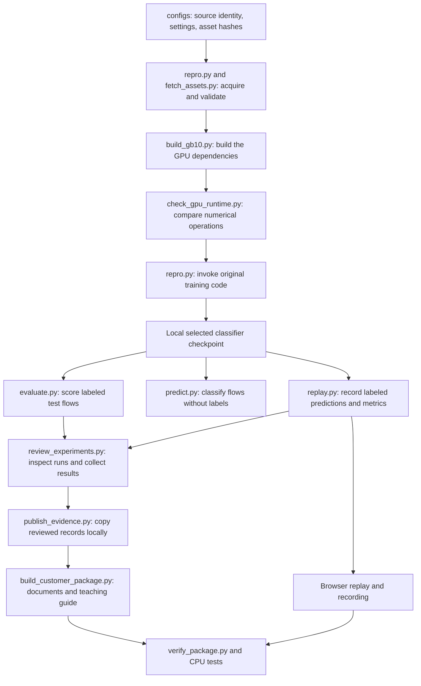

# Every file in the NetMamba+ repository

This is a plain-language map of **all 208 tracked files**, including this walkthrough. Each file has its own entry below. The 173-file audited experiment at commit `17b4aaebcf9327ae9967ca45ddfaf16325766993` is a frozen historical package. Later additions provide this inventory, teaching material, one narrated video, portability tools and their audit records. The original model, experiment evidence, PDF and PowerPoint remain unchanged. The current support matrix supersedes the historical quickstart’s 54-test count and then-untested Windows/macOS status for the portable evidence checks; additional physical GPUs still require validation.

“Tracked” means included in Git and visible in the GitHub repository. The downloaded authors’ code, raw data, locally trained weights, temporary files and Git’s internal history are outside that inventory. Their roles are explained near the end. The existing audited release remains a fixed package of its recorded commit; this later walkthrough is available from the current repository. The earlier interactive HTML course is archived for evidence continuity; its public `/course/` page is excluded from deployment at the user’s request. The single narrated video is the active teaching resource. It does not change the seven historical release attachments.

You can read this one file from top to bottom, use the links below, or search it for a filename. To keep a local copy, use GitHub’s **Raw / Download raw file** action. A Markdown reader displays its formatting; an ordinary text editor can read the same file. Follow source links only when you want the underlying code or evidence.

**Jump to:** [How it fits together](#first-understand-what-the-repository-is) · [Vocabulary](#vocabulary-for-reading-the-files) · [Main code](#1-files-at-the-repository-root) · [GitHub automation](#2-githubworkflows-automated-github-jobs) · [Settings](#3-configs-recipes-and-input-identities) · [Dependencies](#4-requirements-packages-for-different-activities) · [Tools](#5-tools-programs-supporting-the-experiment) · [Tests](#6-tests-cpu-regression-tests) · [Foundational docs](#7-docs-foundational-explanations) · [Customer documents](#8-docscustomer-presentation-and-customer-instructions) · [Demo](#9-docscustomerdemo-files-used-for-the-browser-demonstration) · [Figures](#10-docscustomerfigures-reusable-charts) · [Original evidence](#11-docscustomerevidence-original-aggregate-and-input-records) · [Later audit](#12-docscustomeraudit-evidence-later-rechecks) · [Council/research](#13-docsresearch-reasoning-plans-and-council-records) · [Local files](#files-you-may-see-locally-that-are-not-tracked-in-this-repo) · [Every release download](#release-attachments-are-separate-from-tracked-files).

## First understand what the repository is

Think of it as a small research laboratory with four parts:

1. **Execution code** gets the correct inputs into the authors’ model and runs training or prediction.
2. **Checks** test the execution code, compare GPU calculations and verify the recorded evidence.
3. **Lab records** preserve what actually ran: settings, logs, model identities, predictions and failures.
4. **Teaching materials** turn those records into the slides, briefing, guide and browser demo.

The neural model is **NetMamba+**, a classifier of network flows. A flow is a group of related packets. It reads byte content, packet sizes and time gaps, then assigns one of six dataset categories. Two categories are attacks; four describe IoT device/power activity. It is not a chatbot and does not call an AI chat service to make traffic predictions.

The uploaded CICIDS2017 and UNSW CSVs contain individual packet records. They lack established flow identity and ordering, so the experiment uses the authors’ separate CICIoT2022 flow release. The original model and tensor loader are fetched at a pinned commit rather than copied into this repository. Our scripts organize and verify their execution.

In the tested preset, one flow contributes the first five packets with up to 320 stored bytes each, plus the first 20 packet sizes and 20 time gaps. The original loader pads/truncates and normalizes these values. The model turns them into 443 input units called tokens, processes them through four Mamba blocks and combines three summaries into six outputs. A Mamba block scans a sequence while updating an internal numerical state; that state is not an implemented live network-connection cache. The six categories are Flood, RTSP Brute Force, Audio, Other, Cameras and Home Automation under the release's recorded class names.

## Follow one experiment through the files

The short pretraining check is a separate branch of this experiment. The three full fine-tuning runs started from the authors’ released pretrained checkpoint, **not from the checkpoint produced by our short check**. That distinction matters when explaining what was reproduced.

Opening the finished demo only reads recorded predictions. It does not run these training steps again. Running the CPU tests also does not train a model. New GPU experiments require the environment, original source and separately acquired assets described in the runbook.

## Vocabulary for reading the files

| Term | Meaning in this project |
|---|---|
| Python / `.py` | Executable program text. Run it with Python; inspect it to understand the implementation. |
| Markdown / `.md` | Readable document text with headings, links and tables. GitHub displays it as a formatted page. |
| JSON / `.json` | Structured data made of named fields, lists and values. It can describe settings, results or predictions; the extension alone does not tell you which. |
| YAML / `.yml` | Structured settings used here to tell GitHub which automated jobs to run. |
| Manifest | A run’s lab notebook: what was requested, which files and model were used, what environment ran it, and whether it completed. |
| Checkpoint | A saved state of a trained neural network. Native training checkpoints may also contain optimizer state and settings. |
| Model-only export | A local checkpoint containing the selected model tensors without the training optimizer and executable settings object. It is still a PyTorch model file. |
| Graph export | A different operation: capture the model’s computations into a form another execution system might consume. The tested graph-export path failed. Successful model-only export does not establish graph-export support. |
| Provenance | The recorded origin and identity of a file or model, including which class index means which category. |
| Hash / SHA-256 | A content fingerprint. Matching hashes establish matching file bytes; they do not prove scientific correctness or data rights. |
| Seed | A chosen starting value for random operations. Seeds 0, 1 and 2 produced three training runs on the same data split. They are not three separate datasets. |
| Epoch / update | An epoch is a pass through the training loader. An optimizer update changes model parameters after a batch. The main runs each completed 120 epochs and 7,920 updates. |
| Logits / scores | Logits are six raw model outputs. Softmax converts them to six normalized display scores. Those scores are not calibrated probabilities of a real attack. |
| Accuracy / F1 | Accuracy is the fraction of correct predictions. F1 combines precision and recall. Weighted F1 accounts for each class’s number of true examples; macro F1 gives each class equal weight. |
| Confusion matrix | A table of true versus predicted categories. Here rows are true classes and columns are predicted classes. It shows which mistakes produced an aggregate score. |
| Fixture / regression test | A controlled example used to test code behavior, such as rejecting a mismatched model. These CPU examples do not establish neural-model accuracy. |
| Runtime / environment | The actual Python, packages, compiler, driver and hardware used to execute the model. |
| CPU / GPU / GB10 | The CPU runs general-purpose programs. A GPU performs many numerical operations in parallel. NVIDIA GB10 is the hardware profile used for the measured model execution here. The basic package tests need only a CPU. |
| Torch / CUDA / Triton | PyTorch (imported as `torch`) supplies neural-network operations and training machinery. CUDA is NVIDIA's GPU computing platform. Triton compiles some specialized GPU calculations used by this software stack. |
| NIC / SmartNIC / DPU | A NIC connects a computer to a network. SmartNICs and data processing units can take on additional packet handling or computation. This project's proposed division of work is described in the hardware roadmap; it has not been deployed there. |
| NPU / IDS | An NPU is a neural processing unit designed to accelerate supported neural computations. An IDS is an intrusion detection system that observes traffic and raises security alerts. A traffic classifier is one component of a possible IDS, not the whole capture-to-alert system. |

## 1. Files at the repository root

These are the main entry points and Git settings. Links in every inventory table lead to the actual file. A table’s heading gives the folder; file names within that table are relative to it.

| File | What it does and when you would open it |
|---|---|
| [.gitattributes](../.gitattributes) | Tells Git to preserve exact bytes for captured records and documents, and to treat PDFs, PowerPoints, images and video as binary files. This protects hash comparisons against automatic text conversions. |
| [.gitignore](../.gitignore) | Lists local outputs that Git should normally exclude: downloaded source, datasets, checkpoints, run directories, virtual environments and secret-setting files. It reduces accidental publication; it is not a permission system. |
| [README.md](../README.md) | The project’s front door. Explains the measured result, links the customer material, gives basic commands and states the scientific and deployment limits. Read this before running the code. |
| [repro.py](../repro.py) | The main experiment coordinator. Its `fetch`, `validate`, `pretrain`, `finetune` and `evaluate` commands verify source/data, resolve native settings, create run manifests and launch the authors’ code. It also supplies shared validation, hashing, output protection and provenance helpers to the other scripts. |
| [evaluate.py](../evaluate.py) | Reloads a saved classifier strictly and scores labeled test flows using the authors’ loader and evaluation engine. It checks category meanings and writes the returned metrics. It does not train the classifier or select it using test accuracy. |
| [predict.py](../predict.py) | Classifies already assembled native flows when their correct labels are unknown. It makes temporary label/name placeholders only for the original loader, removes targets before prediction, and returns class names, logits and scores. It computes no accuracy without ground truth. |
| [replay.py](../replay.py) | Runs labeled test inference, records each prediction and independently recomputes the metrics. It also contains the browser replay’s HTML, CSS and JavaScript template. The generated page displays those saved results without executing the neural model in the browser. |

The main pattern is **shared preparation, specialized execution**. `repro.py` checks identity and settings once; evaluation, prediction and replay reuse that preparation. The authors’ loader remains responsible for tensor transformations, avoiding a second interpretation of packet bytes, padding and normalization.

## 2. `.github/workflows/`: automated GitHub jobs

| File | What it does and when you would open it |
|---|---|
| [ci.yml](../.github/workflows/ci.yml) | Runs the CPU test suite, command help and package verifier on Linux with Python 3.10 and 3.12 for pushes and pull requests. A green result means these checks passed for that commit; it does not repeat GPU training. |
| [pages.yml](../.github/workflows/pages.yml) | On a push to `main` or manual dispatch, runs tests and package verification, then publishes `docs/customer/demo` to GitHub Pages. The workflow stages that folder and excludes the retired `course/` directory before publishing the replay, video, learning guide and meeting backups. It does not deploy a live IDS. |

## 3. `configs/`: recipes and input identities

| File | What it does and when you would open it |
|---|---|
| [assets.json](../configs/assets.json) | The acquisition inventory: expected download locations, byte sizes and hashes for three native flow splits and the released pretrained checkpoint, plus the exact class metadata to generate. It also records the unresolved inherited-asset rights. It contains instructions for acquisition, not the raw flows or weights. |
| [ciciot2022.json](../configs/ciciot2022.json) | The main source-based recipe. Pins the authors’ commit and core source hashes, six classes, byte/size/interval input settings, batch size 128, 120-epoch fine-tuning and learning-rate settings. Its provenance fields explain where settings came from and how they differ from the paper. Its longer pretraining preset is a recipe, not evidence that we executed it. |
| [ciciot2022-pretrain-smoke.json](../configs/ciciot2022-pretrain-smoke.json) | The short functional-pretraining recipe. Requests 100 steps on CICIoT2022 training data and frequent checkpoint saves. The original loop rounds to complete epochs, so the actual check completed two epochs and 132 updates. “Smoke” means a limited test that the training machinery works. |

Changing a configuration changes an experiment. A configuration by itself does not prove that the requested run completed; find the corresponding manifest and logs.

## 4. `requirements/`: packages for different activities

| File | What it does and when you would open it |
|---|---|
| [gb10.txt](../requirements/gb10.txt) | Pinned Python packages for the tested GB10 profile. The runbook installs the selected Torch/CUDA stack first and builds the custom extensions separately. This file alone is not a complete machine setup or universal environment lock. |
| [browser.txt](../requirements/browser.txt) | Pins Playwright, the browser-automation library used to test and record the demo and guide. Chromium is installed separately. None of this is needed merely to open the finished HTML in a normal browser. |
| [presentation.txt](../requirements/presentation.txt) | Pins document/chart libraries such as python-pptx, ReportLab and Matplotlib. These build the editable deck, briefing and figures. External rendering tools, including LibreOffice and `pdfinfo`, are separate runbook requirements. |

## 5. `tools/`: programs supporting the experiment

Some tools need a GPU, some need a real browser, and some run with ordinary Python. Use the quickstart/runbook for the relevant environment rather than installing every dependency to read the report.

| File | What it does and when you would open it |
|---|---|
| [benchmark.py](../tools/benchmark.py) | Measures saved-classifier GPU execution for batches of 1, 16 and 128 flows, with 20 warmups and 100 synchronized timing samples each. Records mean, median, p95 and throughput, plus single-versus-batch prediction agreement. Capture, preparation and transfers are excluded. |
| [build_customer_package.py](../tools/build_customer_package.py) | Reads reviewed measurements and document sources, fills result placeholders, builds charts, writes the briefing/results/script, creates the PowerPoint, renders PDFs and builds the guide/answer map. It checks actual PDF page counts. Rebuilding can change output hashes even when wording stays the same. |
| [build_gb10.py](../tools/build_gb10.py) | Builds the pinned Mamba fork and causal-convolution dependency for the tested GB10/CUDA profile. Applies recorded architecture and compiler-compatibility changes in separate build copies, then checks installed Mamba Python files against upstream. Build success is followed by numerical checks. |
| [build_course.py](../tools/build_course.py) | Renders the separate 30-minute course from its JSON source and saved evidence, including the real prediction, answer keys, styles and quiz controls. Uses only Python’s standard library. Its `--check` mode compares exact expected HTML without writing files. |
| [build_learning_guide.py](../tools/build_learning_guide.py) | Generates the slide-by-slide HTML learning guide and Markdown question map from the same presentation source. It supplies the plain-language explanations, glossary and exact scripts so those outputs stay aligned with the deck. Uses the Python standard library. |
| [capture_runtime.py](../tools/capture_runtime.py) | Records package versions, GPU, driver, compiler, source comparisons and compiled-extension hashes. It preserves dependency-check warnings and uses a bounded inventory rather than dumping the whole shell environment. Open its outputs to identify the machine/software conditions behind a run. |
| [check_gpu_runtime.py](../tools/check_gpu_runtime.py) | Compares optimized GPU operations with reference calculations, including forward outputs and backward gradients. Its seven checks cover causal convolution, selective scan, normalization and full Mamba blocks. Passing shows numerical agreement within the recorded tolerances for those cases. |
| [check_learning_guide.py](../tools/check_learning_guide.py) | Opens the guide in Chromium and checks all 16 titles/scripts, disclosures, internal anchors, keyboard skip navigation, errors and four viewport widths. Saves screenshots and a dated receipt. Its hosted mode also compares the live HTML bytes with the local reviewed guide. |
| [fetch_assets.py](../tools/fetch_assets.py) | Downloads the research assets described in `configs/assets.json`, or generates the small metadata file, and verifies size/hash before making each target available. It preserves mismatched existing files and rejects bad downloads. It does not fetch the authors’ Git checkout; `repro.py fetch` does that. |
| [learning-guide.css](../tools/learning-guide.css) | Controls the learning guide’s typography, colors, spacing, navigation, responsive layout and print styling. The generator embeds this stylesheet into the finished HTML, allowing the page to work offline. |
| [probe_export.py](../tools/probe_export.py) | First runs ordinary GPU inference, then tries one strict Torch graph-capture path with a single flow. Records either an exported graph or the actual exception. Our recorded attempt was unsupported at a custom causal-convolution operator; it did not test an NPU compiler. |
| [profile_csvs.py](../tools/profile_csvs.py) | Uses Python and the DuckDB command-line tool to scan the uploaded packet CSVs, count rows/classes, summarize metadata and hash the files. It records missing flow context. It neither trains a packet classifier nor exhaustively validates every payload byte numerically. |
| [publish_evidence.py](../tools/publish_evidence.py) | Copies a defined set of reviewed local run records and demo files into a new publication directory, preserving their bytes and writing an evidence index. Despite its name, it does not push to GitHub. It deliberately excludes raw data and model weights. |
| [record_demo.py](../tools/record_demo.py) | Uses Chromium/Playwright to exercise the replay controls and filters, check desktop/mobile layout, and create screenshots plus a WebM video backup. It records actual browser behavior while displaying saved predictions. |
| [render_replay.py](../tools/render_replay.py) | Rebuilds the replay display from an existing prediction JSON without running the GPU model. Recomputes the confusion matrix, preserves the prediction file byte for byte and records the new HTML’s identity. Useful when changing presentation layout. |
| [review_experiments.py](../tools/review_experiments.py) | Inspects all three completed training runs: epoch histories, validation-selected checkpoints, optimizer counters, finite/changed weights and matching test results. Exercises a training batch on disposable model copies and makes tensor-identical model-only exports. Produces the combined results record; requires the runtime and local assets. |
| [summarize_audit.py](../tools/summarize_audit.py) | Runs package verification and the actual CPU tests, then extracts compact facts from primary records for a reviewer or council. Its output is a dated evidence summary, not a new GPU experiment or automatic publication certificate. |
| [verify_course.py](../tools/verify_course.py) | Checks the 1,800-second plan, reading load, activity time, topic coverage, evidence bindings, prediction, links, HTML and review statuses. Preserves every prior audited artifact hash. Optional Playwright mode tests browser behavior and saves a receipt under local `runs/`; normal verification needs no browser. A pending human rehearsal cannot become a full-verification claim. |
| [verify_package.py](../tools/verify_package.py) | Checks the delivered evidence and documents using ordinary Python: recomputes metrics from predictions, checks hashes and identities, compares fresh evaluations, checks guide/notes/question alignment and local links. Its checksum-refresh option is for reviewed intentional changes; refreshing hashes does not validate new claims. |

An important distinction: a probe manifest can say `succeeded` because the probe completed and recorded its answer, while its metric file says `unsupported_in_tested_path`. Always read the specific result, not just the outer process status.

## 6. `tests/`: CPU regression tests

These use temporary examples and controlled substitutes for expensive components. Their purpose is to catch software mistakes and verify rejection behavior. The original audited suite contains 54 tests; 17 additional course tests brought the HTML-course snapshot to 71; seven video checks brought the first video snapshot to 78. Later portability, complete-model boundary and caption-anchor regressions are included in the current workflow. Use its commit-specific count; real GPU experiments have separate evidence.

| File | What it does and when you would open it |
|---|---|
| [test_assets.py](../tests/test_assets.py) | Tests asset acquisition: bad hashes never become published local targets, mismatched existing assets are preserved, and valid existing assets are reused without downloading again. |
| [test_course.py](../tests/test_course.py) | Seventeen regression tests reject altered results/predictions, timing or reading overload, absent activity time/topics, broken links, invalid keys, stale HTML and unsupported completion claims. Temporary fixtures protect the actual evidence. These checks validate the course, not a learner’s understanding. |
| [test_predict.py](../tests/test_predict.py) | Tests the unlabeled-flow adapter: valid class-zero mapping is required, original features remain unchanged, and malformed/empty collections are rejected. These tests exercise adaptation, not GPU inference accuracy. |
| [test_replay.py](../tests/test_replay.py) | Tests independent metrics, class support, weighted versus macro F1, malformed prediction inventories, stable softmax and HTML escaping. It helps prevent a misleading chart or executable text from entering the replay. |
| [test_repro.py](../tests/test_repro.py) | The largest test collection. Exercises native-flow validation, source drift, report/output protection, concurrent run ownership, native parser settings, failure manifests, checkpoint provenance, strict loading and test-only evaluation access. Its mocked model interfaces are explicitly separate from numerical GPU tests. |

## 7. `docs/`: foundational explanations

| File | What it does and when you would open it |
|---|---|
| [audit.md](audit.md) | Historical sharing audit from 7 September, when the project had not completed GPU training. Preserves earlier defects, fixes, tests and an unratified council outcome. Read it as project history; the customer verification record gives the later results. |
| [harness-reference.md](harness-reference.md) | The precise reference for accepted native-flow fields, stage-specific data access, duplicate counting, strict evaluation and manifest meaning. Use this when implementing or troubleshooting an input file. |
| [lesson.md](lesson.md) | A teaching chapter explaining packets versus flows, tensor transformations, training stages, class provenance, experiment records and metric definitions. Includes four runnable CPU exercises. |
| [repository-walkthrough.md](repository-walkthrough.md) | This complete file inventory and explanation. Use it to locate a program, understand an evidence record or decide which document answers your next question. It adds no model functionality. |

## 8. `docs/customer/`: presentation and customer instructions

| File | What it does and when you would open it |
|---|---|
| [README.md](customer/README.md) | The customer package’s index, download links and completion checklist. Use it as the meeting material’s entry point. |
| [NetMambaPlus-customer-briefing.pdf](customer/NetMambaPlus-customer-briefing.pdf) | The eight-page readable/printable briefing. Explains the work, inputs/outputs, training, actual results, demo, setup, original-repository differences and hardware roadmap. |
| [NetMambaPlus-customer-slides.pdf](customer/NetMambaPlus-customer-slides.pdf) | The 16-slide deck rendered into a fixed-layout PDF. Useful for presenting or sharing when PowerPoint rendering varies between computers. |
| [NetMambaPlus-customer-slides.pptx](customer/NetMambaPlus-customer-slides.pptx) | The editable 16-slide PowerPoint, including speaker notes. Use it for your presentation and read its notes to understand the intended explanation. The checked-in file is generated from the presentation source. |
| [SHA256SUMS](customer/SHA256SUMS) | A fingerprint list covering the customer and reviewed-research files, excluding the checksum file itself. The verifier uses it to detect changed or missing artifacts. It does not cover every source file in the repository. |
| [acceptance.md](customer/acceptance.md) | Maps all 16 requested deliverables and the code/tool areas to checks, evidence and limits. Use it to answer “Which requested work was completed, and what remains open?” |
| [answers.md](customer/answers.md) | Maps the seven requested customer questions to slide/script/guide numbers and briefing pages, then gives concise answers. Generated from the shared presentation source. |
| [briefing-source.md](customer/briefing-source.md) | The editable briefing template. Contains prose, deliberate page breaks and measurement placeholders that the package builder fills. Edit this when changing the briefing’s source explanation. |
| [briefing.md](customer/briefing.md) | The generated briefing text after measured values are inserted. Read it on GitHub or compare it with the PDF. Direct edits can be overwritten by the builder. |
| [course-source.json](customer/course-source.json) | Editable source for nine lessons, eight questions, answer explanations, the final teach-back rubric and exact teaching/practice times. Contains measured-value bindings, a real prediction row and original artifact fingerprints. It is teaching data, not model-training data. |
| [course-verification.md](customer/course-verification.md) | Explains how to open, download, rebuild and test the course. Records content review, timing assumptions, browser checks, publication receipts and the exact council decision. Keeps the human-paced full-route rehearsal visibly pending; automated checks do not establish mastery. |
| [document-check.json](customer/document-check.json) | Records actual rendered page counts and hashes of the two PDFs and PowerPoint. Establishes document identity/inventory; it does not by itself establish that every explanation is correct. |
| [hardware-roadmap.md](customer/hardware-roadmap.md) | Explains a possible capture-to-alert IDS and the roles of a NIC, DPU, GPU and NPU. Identifies extraction, compiler, precision and validation work still needed. It is a roadmap, not proof of deployment. |
| [presentation-source.json](customer/presentation-source.json) | Shared editable source for all 16 slides, their scripts, the seven questions, guide explanations and expected briefing page count. The generator substitutes measured values into this source to keep outputs consistent. |
| [publication-checks.json](customer/publication-checks.json) | The historical public-download, hosted-browser and CI receipt for the earlier artifact commit. Inspect its commit and timestamps. The audited release has a separate release-attached verification receipt. |
| [questions.md](customer/questions.md) | Customer discussion questions with defensible answers. Useful for likely follow-up questions about credibility, limits and practical use; distinct from the numbered seven-question presentation map. |
| [quickstart.md](customer/quickstart.md) | The shortest setup/use/test path. Separates browser viewing, CPU package verification and actual GB10 execution, with expected outcomes and common problems. Start here to use the project. |
| [results.md](customer/results.md) | Generated readable tables of all three seed results, selected epochs, per-class errors, learning curves and model timings. Explains metric definitions and limits beside the numbers. |
| [runbook.md](customer/runbook.md) | The detailed procedure to acquire source/assets, build the tested environment, run short pretraining and full fine-tuning, evaluate/predict, review exports and rebuild the presentation. Includes a meeting rehearsal sequence. |
| [talk-track.md](customer/talk-track.md) | The complete presenter script in slide order, plus question locations. Generated from the same script text placed in PowerPoint notes and the guide. Use it to rehearse what you will say. |
| [upstream-comparison.md](customer/upstream-comparison.md) | Explains the paper’s problem, the uploaded packet tables, the separate native flow dataset and exactly what this project adds around the authors’ code. Start here if the source/data distinction is unclear. |
| [verification.md](customer/verification.md) | The detailed record of actual checks: source/data identity, runtime builds, numerical tests, training, inference, browser/document review and publication. Distinguishes original evidence, later rechecks and unresolved limitations. |

## 9. `docs/customer/demo/`: files used for the browser demonstration

| File | What it does and when you would open it |
|---|---|
| [index.html](customer/demo/index.html) | The self-contained replay application. Displays seed-0 predictions, correct/incorrect results and attack-category filters. Open it offline or on Pages; playback speed controls display pace, not model execution speed. |
| [guide.html](customer/demo/guide.html) | The standalone learning page following the 16 slides and exact speaker scripts. Includes setup routes, plain-language explanations and a glossary. Works offline; links to external resources still need internet access. |
| [course/index.html](customer/demo/course/index.html) | Archived interactive course, excluded from public deployment: nine lessons, eight scored questions, explanatory keys, the saved prediction error and a separate customer teach-back checklist. Works offline with no runtime AI service; answers also work without JavaScript. This new download is outside the historical audited ZIP. |
| [predictions.json](customer/demo/predictions.json) | The browser demo’s copy of the 1,041 seed-0 test predictions, with true labels, predicted classes, six logits/scores, metrics and source/model hashes. The HTML embeds its record, so no running prediction server is required. |
| [browser-check.json](customer/demo/browser-check.json) | Receipt for the recorded browser rehearsal. Binds the page, predictions, model and video by hashes and records tested controls/layout. It is browser evidence, not an additional accuracy experiment. |
| [recorded-demo.webm](customer/demo/recorded-demo.webm) | A video of the working replay for meeting backup. It shows recorded classifier outputs and browser controls; it is not a live traffic capture. |
| [replay-screenshot.png](customer/demo/replay-screenshot.png) | Desktop screenshot from the browser rehearsal. Useful for previewing the demo and checking its reviewed layout. |
| [replay-mobile.png](customer/demo/replay-mobile.png) | Mobile-width screenshot from the rehearsal. Shows how the same demo fits a narrow screen. |

## 10. `docs/customer/figures/`: reusable charts

Each chart is exported in three formats. PNG is a pixel image suitable for slides; SVG is scalable vector artwork suitable for the web/editing; PDF preserves a print-friendly vector figure. These are format variants of two charts, not six experiments.

| File | What it does and when you would open it |
|---|---|
| [learning-curves.png](customer/figures/learning-curves.png) | Image version of the three runs’ training/validation history. Embedded in the readable results and presentation materials. |
| [learning-curves.svg](customer/figures/learning-curves.svg) | Scalable vector version of the learning-curves chart. Use when resizing or inspecting/editing vector artwork. |
| [learning-curves.pdf](customer/figures/learning-curves.pdf) | Standalone PDF version of the learning-curves chart for print or reuse in a document. |
| [seed0-confusion.png](customer/figures/seed0-confusion.png) | Image of the seed-0 confusion matrix. The six-by-six counts show which true categories were predicted as other categories. |
| [seed0-confusion.svg](customer/figures/seed0-confusion.svg) | Scalable vector version of that same seed-0 confusion matrix. Useful for high-quality resizing. |
| [seed0-confusion.pdf](customer/figures/seed0-confusion.pdf) | Standalone PDF of that same matrix. It summarizes the demo model’s 1,041 labeled test predictions. |

## How to read the experiment-record folders

The original `evidence/` folder preserves the main experiment and first checks. The later `audit-evidence/` folder preserves rechecks without overwriting those records. A later recheck on the same test flows strengthens execution repeatability; it does not create independent customer-traffic evidence.

Common names have consistent roles:

- **`manifest.json`** explains the run’s identity, inputs, arguments, runtime and process status. Historical absolute machine paths identify what was used then; they are not paths you must reproduce exactly.
- **`native.log`** is verbose program output, including warnings. **`log.txt`** is usually one structured JSON record per epoch, despite its `.txt` extension.
- **`train_stats.json`** summarizes the training run. **`test_stats.json`** is the native trainer’s final test result for the selected model.
- **`metrics.json`** contains the activity’s result. For evaluation it has accuracy/F1; for timing it has latencies; for an export probe it has support/failure; for unlabeled prediction it contains outputs without accuracy.
- **`predictions.json`** retains row-level results so aggregate metrics can be independently recomputed.
- **`model-export-provenance.json`** binds a local model-only export to the original selected checkpoint and class meanings. The JSON is not the model weights.

## 11. `docs/customer/evidence/`: original aggregate and input records

| File | What it does and when you would open it |
|---|---|
| [artifact-index.json](customer/evidence/artifact-index.json) | Inventory of 57 copied original evidence files, with byte sizes, hashes and original names. The index itself makes this folder contain 58 tracked files. Use it to verify that records were copied unchanged. |
| [results.json](customer/evidence/results.json) | The main combined three-seed results record produced by experiment review. Contains each run’s budget, selected epoch, metrics, checkpoint/export hashes, training curves, parameter checks and cross-seed aggregate statistics. This is the source for the presentation’s measured numbers. |
| [checkpoint-transfer.json](customer/evidence/checkpoint-transfer.json) | Compares the released pretrained model with the six-class classifier: parameter counts, missing classifier-head weights, extra reconstruction-decoder weights and shape mismatches. Explains why the pretrained encoder needs downstream fine-tuning before classification. |
| [native-data-validation.json](customer/evidence/native-data-validation.json) | Original validation of all 10,404 native flows: input hashes, split counts, six-category mapping and raw-input overlap. It discloses five train/validation and six train/test shared stored inputs. |
| [uploaded-csv-profile.json](customer/evidence/uploaded-csv-profile.json) | Original complete-file metadata profiles of the two uploaded packet CSVs: sizes/hashes, column/row counts, label aggregates and missing flow context. No raw packet table is embedded. |
| [unlabeled-inference-agreement.json](customer/evidence/unlabeled-inference-agreement.json) | Compares the original 128-flow unlabeled prediction check against the corresponding labeled replay outputs. All predicted classes agree; the recorded maximum logit difference is 0.001953125. This is execution agreement, not a new accuracy estimate. |
| [browser-check.json](customer/evidence/browser-check.json) | Preserved evidence copy of the successful replay browser rehearsal. The corresponding file also appears beside the demo so its identity record travels with the display. |
| [replay-render-manifest.json](customer/evidence/replay-render-manifest.json) | Records the corrected replay HTML’s generation from unchanged saved predictions. Binds renderer, HTML and prediction hashes, making a display-only correction distinguishable from rerunning the classifier. |

### `evidence/benchmark/`

| File | What it does and when you would open it |
|---|---|
| [manifest.json](customer/evidence/benchmark/manifest.json) | Identifies the original seed-0 model-timing invocation: settings, selected checkpoint, test inputs, runtime and completion. Read it to establish what was timed. |
| [metrics.json](customer/evidence/benchmark/metrics.json) | Contains every original latency sample for batches 1/16/128, summary statistics, mean-based throughput and batch/single prediction comparison. Its scope explicitly excludes packet capture and preparation. |

### `evidence/export-probe/`

| File | What it does and when you would open it |
|---|---|
| [manifest.json](customer/evidence/export-probe/manifest.json) | Identifies the original graph-export experiment and model. A completed probe is not itself a successful export. |
| [metrics.json](customer/evidence/export-probe/metrics.json) | Records successful eager inference followed by the actual strict Torch graph-capture failure at `causal_conv1d_cuda.causal_conv1d_fwd`. This is the evidence for the limited portability blocker. |

### `evidence/pretrain-functional/`

These four files describe the original short reconstruction-training check. They do not describe the paper’s full Browser/Kitsune pretraining or the initialization history of the released checkpoint.

| File | What it does and when you would open it |
|---|---|
| [manifest.json](customer/evidence/pretrain-functional/manifest.json) | Records the short pretraining configuration, training-only input identity, original source, runtime, invocation and completed status. |
| [native.log](customer/evidence/pretrain-functional/native.log) | Full console output from that short pretraining run, including progress, saves and warnings. Use it for the detailed execution trace. |
| [log.txt](customer/evidence/pretrain-functional/log.txt) | Two structured epoch records with overall reconstruction loss and separate byte, size and interval losses. Shows loss changing during the functional check. |
| [train_stats.json](customer/evidence/pretrain-functional/train_stats.json) | Compact run summary: batch size 128, two completed epochs and about 21.07 seconds elapsed. Update counts require the loop/log context, not just this summary. |

### `evidence/runtime/`

“Rehearsal” means a second isolated software installation on the same GB10 workstation. It is not a different hardware platform.

| File | What it does and when you would open it |
|---|---|
| [build-report.json](customer/evidence/runtime/build-report.json) | Successful native-extension build record. Lists upstream/causal-convolution pins, exact compatibility patches and matching installed Mamba Python sources. Establishes the built software’s identity. |
| [numerical-check.json](customer/evidence/runtime/numerical-check.json) | Seven numerical GPU checks in the main environment, with tolerances and observed output/gradient differences. These synthetic checks support runtime correctness for the tested operations. |
| [training-environment.json](customer/evidence/runtime/training-environment.json) | Inventory of the main training environment: packages, GPU/driver/compiler, source identities, compiled-extension hashes and dependency warnings. Use when reconstructing the tested setup. |
| [rehearsal-environment.json](customer/evidence/runtime/rehearsal-environment.json) | Equivalent inventory for the second installation. Helps distinguish a repeated build from simply reusing the original environment. |
| [rehearsal-numerical-check.json](customer/evidence/runtime/rehearsal-numerical-check.json) | Seven numerical checks repeated in that second environment. Preserves observed errors rather than relying only on matching version strings. |
| [rehearsal-classifier-evaluation/manifest.json](customer/evidence/runtime/rehearsal-classifier-evaluation/manifest.json) | Identifies seed-0 strict evaluation in the rebuilt environment, including the checkpoint and reacquired data hashes. |
| [rehearsal-classifier-evaluation/metrics.json](customer/evidence/runtime/rehearsal-classifier-evaluation/metrics.json) | The second-environment classifier’s measured test result. Its confusion matrix and aggregate metrics agree with the original seed-0 evaluation. |

### `evidence/seed0/`: the run used for the demo

Seed 0 completed 120 epochs and achieved **91.26%** test accuracy. Its chosen checkpoint was selected by validation performance; “seed 0” was the predeclared demo choice.

| File | What it does and when you would open it |
|---|---|
| [training/manifest.json](customer/evidence/seed0/training/manifest.json) | Seed-0 training’s configuration, source/data/checkpoint identities, runtime, command and resulting selected classifier. This is the run’s main provenance record. |
| [training/native.log](customer/evidence/seed0/training/native.log) | Seed-0 trainer’s complete console output: progress, validation messages, checkpoint saves, final testing and warnings. Per-epoch “test samples” wording in upstream actually refers to its supplied validation loader. |
| [training/log.txt](customer/evidence/seed0/training/log.txt) | Seed-0 history with 120 JSON epoch records, including training loss/rate and validation metrics. Use it to trace learning and verify selection against the full history. |
| [training/train_stats.json](customer/evidence/seed0/training/train_stats.json) | Seed-0 training summary: completed epochs, batch size, elapsed time, best validation accuracy and chosen epoch. Chosen epochs are zero-based. |
| [training/test_stats.json](customer/evidence/seed0/training/test_stats.json) | Native fine-tuner’s final test metrics for its selected seed-0 classifier, including accuracy, weighted metrics and confusion matrix. This is separate from per-epoch validation. |
| [eval/manifest.json](customer/evidence/seed0/eval/manifest.json) | Records a fresh strict-load evaluation of that saved seed-0 classifier. Binds the same checkpoint and labeled test data to a separate invocation. |
| [eval/metrics.json](customer/evidence/seed0/eval/metrics.json) | Seed-0 strict evaluator’s returned metrics and class mapping. Compared against the trainer’s final test result to check saved-model reproducibility. |
| [replay/manifest.json](customer/evidence/seed0/replay/manifest.json) | Identifies the seed-0 inference pass that collected row-level outputs and generated the replay. Includes input/model identity and output references. |
| [replay/metrics.json](customer/evidence/seed0/replay/metrics.json) | Both native and independently computed seed-0 metrics, plus hashes of the prediction record and generated display. Establishes agreement between two metric calculations. |
| [replay/predictions.json](customer/evidence/seed0/replay/predictions.json) | All 1,041 labeled seed-0 predictions, logits and scores. You can reconstruct the 950 correct predictions and 91 mistakes from these rows. This is the original record copied into the demo. |
| [model-export-provenance.json](customer/evidence/seed0/model-export-provenance.json) | Binds the local model-only seed-0 export to its selected training checkpoint, pretrained input, class order, source commit and selected epoch. Publishes identities without including the weights. |

### `evidence/seed1/`: the second declared training run

Seed 1 completed the same 120-epoch budget on the same split and achieved **84.05%** test accuracy. Its files preserve the less favorable result rather than hiding it behind the demo run.

| File | What it does and when you would open it |
|---|---|
| [training/manifest.json](customer/evidence/seed1/training/manifest.json) | Seed-1 training recipe, inputs, runtime, command, completion and selected-classifier identity. Use it to establish which run these results belong to. |
| [training/native.log](customer/evidence/seed1/training/native.log) | Full native console trace for seed 1, including progress, validation, saves, final test evaluation and warnings. |
| [training/log.txt](customer/evidence/seed1/training/log.txt) | The 120 per-epoch seed-1 training/validation records. Provides the learning curve and evidence for its validation-selected epoch. |
| [training/train_stats.json](customer/evidence/seed1/training/train_stats.json) | Seed-1 budget, elapsed time and best validation result/epoch in a compact summary. It is not the final test score. |
| [training/test_stats.json](customer/evidence/seed1/training/test_stats.json) | Native final labeled-test metrics for seed 1’s chosen classifier. Contains the actual seed-1 test accuracy and class-confusion counts. |
| [eval/manifest.json](customer/evidence/seed1/eval/manifest.json) | Identity and completion record for the separate strict evaluation of the saved seed-1 checkpoint. |
| [eval/metrics.json](customer/evidence/seed1/eval/metrics.json) | Seed-1 metrics after strict checkpoint reload, with checkpoint/class provenance. Used to compare saved-model behavior with the trainer’s final evaluation. |
| [replay/manifest.json](customer/evidence/seed1/replay/manifest.json) | Invocation and file/model identities for the seed-1 pass collecting full prediction records. |
| [replay/metrics.json](customer/evidence/seed1/replay/metrics.json) | Seed-1 native metrics alongside the independent reconstruction from row-level predictions, plus output hashes. |
| [replay/predictions.json](customer/evidence/seed1/replay/predictions.json) | All 1,041 labeled seed-1 predictions and six-output vectors. Supplies the primary rows for recomputing this run’s metrics. |
| [model-export-provenance.json](customer/evidence/seed1/model-export-provenance.json) | Identity and class-order record for the locally exported seed-1 model tensors, linked back to the native selected checkpoint. |

### `evidence/seed2/`: the third declared training run

Seed 2 completed the same budget and achieved **84.63%** test accuracy. Together the three runs yield **86.65% mean accuracy** and **4.00 percentage points sample standard deviation**. That standard deviation is not a confidence interval or a measure of performance on unseen customer networks.

| File | What it does and when you would open it |
|---|---|
| [training/manifest.json](customer/evidence/seed2/training/manifest.json) | Seed-2 training request, identities, runtime, completion and selected-classifier record. |
| [training/native.log](customer/evidence/seed2/training/native.log) | Complete seed-2 native console output, including progress, validation, checkpoint selection, testing and warnings. |
| [training/log.txt](customer/evidence/seed2/training/log.txt) | The 120 seed-2 epoch records. Shows training and validation behavior across the full run. |
| [training/train_stats.json](customer/evidence/seed2/training/train_stats.json) | Seed-2 training budget/time and validation-selected epoch/accuracy. Read alongside its epoch history. |
| [training/test_stats.json](customer/evidence/seed2/training/test_stats.json) | Native final test metrics for the selected seed-2 classifier, including its confusion matrix. |
| [eval/manifest.json](customer/evidence/seed2/eval/manifest.json) | Separate strict evaluation’s request, checkpoint/data identity and completion for seed 2. |
| [eval/metrics.json](customer/evidence/seed2/eval/metrics.json) | Seed-2 test metrics returned after reloading the saved classifier; compared with the original final test pass. |
| [replay/manifest.json](customer/evidence/seed2/replay/manifest.json) | Identifies the seed-2 full prediction-recording invocation and its model/data sources. |
| [replay/metrics.json](customer/evidence/seed2/replay/metrics.json) | Seed-2 native and independently reconstructed metric dictionaries, with hashes binding the row records and display. |
| [replay/predictions.json](customer/evidence/seed2/replay/predictions.json) | All 1,041 labeled seed-2 predictions and logits/scores. Enables independent recalculation of accuracy, F1 and confusion counts. |
| [model-export-provenance.json](customer/evidence/seed2/model-export-provenance.json) | Records the local model-only seed-2 export’s hash, original selected checkpoint, class meanings and upstream/pretraining identities. |

### `evidence/unlabeled-prediction/`

| File | What it does and when you would open it |
|---|---|
| [manifest.json](customer/evidence/unlabeled-prediction/manifest.json) | Records the original unlabeled seed-0 prediction invocation, source-input hash, checkpoint mapping and temporary native-loader adapter. No raw flow inputs are published here. |
| [metrics.json](customer/evidence/unlabeled-prediction/metrics.json) | Despite its generic name, this contains the first 128 flows’ predicted classes, logits and scores without true-label accuracy. Compare it using the separate agreement record. |

## 12. `docs/customer/audit-evidence/`: later rechecks

These 33 records plus their index are separate from the original 57 records. They include fresh execution and explicit failure probes; they do not represent three additional full 120-epoch training runs.

| File | What it does and when you would open it |
|---|---|
| [index.json](customer/audit-evidence/index.json) | Inventory of the 33 later audit records and screenshots, with sizes, hashes and origins. Use it to distinguish fresh checks from unchanged original experiment evidence. |
| [source-integrity.txt](customer/audit-evidence/source-integrity.txt) | Output of the later original-source verification. Confirms the pinned tracked checkout and explicit core hashes still match. |
| [data-validation.json](customer/audit-evidence/data-validation.json) | Fresh validation of all 10,404 released native flows. Preserves split counts, mapping, hashes and overlap observations for comparison with the original validation. |
| [csv-profile.json](customer/audit-evidence/csv-profile.json) | Fresh full metadata scans of both uploaded CSVs. The resulting profiles match the original counts and aggregates; this remains profiling, not classifier training. |
| [cpu-tests.txt](customer/audit-evidence/cpu-tests.txt) | Captured output listing the 54 passing CPU tests during the audit. It is a dated test record; current CI indicates whether a later commit also passes. |
| [dependency-install.json](customer/audit-evidence/dependency-install.json) | Result of a third fresh Python-dependency installation rehearsal, including package/GPU observations. Native extensions were not rebuilt a third time in this check. |
| [runtime-main.json](customer/audit-evidence/runtime-main.json) | The seven numerical GPU checks repeated in the main environment during the later audit, with their tolerances and observed errors. |
| [runtime-rehearsal.json](customer/audit-evidence/runtime-rehearsal.json) | The same seven checks repeated again in the second built environment. It preserves a distinct runtime recheck record. |
| [public-browser.json](customer/audit-evidence/public-browser.json) | Later browser check of the public replay, including controls/filters, 1,041 rows, 91 errors and viewport widths 320/390/768/1440. The 402 attack-category predictions are model outputs, not confirmed real-world incidents. |
| [unlabeled-agreement.json](customer/audit-evidence/unlabeled-agreement.json) | Compares all 1,041 later unlabeled seed-0 outputs with the original labeled prediction record. Classes and logits match exactly in this execution; binds the native/export checkpoint identities. |
| [verifier-rejection-checks.json](customer/audit-evidence/verifier-rejection-checks.json) | Records disposable-package checks showing stale guide text and altered speaker script are rejected, even when checksum refresh is requested. These are supplementary failure probes, not extra tests added to the count of 54. |
| [prediction-rejection-checks.json](customer/audit-evidence/prediction-rejection-checks.json) | Records rejection of shortened score vectors, wrong class names, reordered rows and unequal prediction collection lengths. Modified hashes were refreshed in disposable copies so this exercised semantic checks rather than only hash mismatches. |
| [page-count-rejection.json](customer/audit-evidence/page-count-rejection.json) | Records a deliberate wrong expected PDF page count being rejected. Demonstrates that the briefing-page map cannot silently drift just because files were regenerated. |
| [benchmark-arithmetic.json](customer/audit-evidence/benchmark-arithmetic.json) | Independent arithmetic check of the original and repeated benchmark samples: means, medians, p95 and mean-based flows/second. It validates calculations, not network line-rate performance. |
| [primary-summary.json](customer/audit-evidence/primary-summary.json) | Compact dated extraction of tests, numerical results, seed metrics, document identities and limits. Prepared before final publication and some later supplementary checks; its pending-publication wording is historical. |

### `audit-evidence/benchmark/`

| File | What it does and when you would open it |
|---|---|
| [manifest.json](customer/audit-evidence/benchmark/manifest.json) | Identity and completion of the later model-timing repetition. Separates this timing run from the original headline measurements. |
| [metrics.json](customer/audit-evidence/benchmark/metrics.json) | All later latency samples and summaries. Median batch 1/16/128 times were about 0.9043/4.3290/36.7392 milliseconds, still excluding capture, preparation and transfers. |

### `audit-evidence/export-probe/`

| File | What it does and when you would open it |
|---|---|
| [manifest.json](customer/audit-evidence/export-probe/manifest.json) | Records the later strict graph-export probe’s inputs, model identity and completed invocation. |
| [metrics.json](customer/audit-evidence/export-probe/metrics.json) | Records eager inference succeeding again and strict Torch export failing again at the tested custom operation. This does not establish that every possible export route would fail. |

### `audit-evidence/export-seed0/`, `export-seed1/`, `export-seed2/`

These folders evaluate the local **model-only checkpoint exports**. They are unrelated to the failed graph-capture export above.

| File | What it does and when you would open it |
|---|---|
| [export-seed0/manifest.json](customer/audit-evidence/export-seed0/manifest.json) | Fresh strict-evaluation provenance for the seed-0 model-only export, including the export hash and class mapping. |
| [export-seed0/metrics.json](customer/audit-evidence/export-seed0/metrics.json) | Actual seed-0 export evaluation: its confusion matrix and metrics match the original selected classifier’s result. |
| [export-seed1/manifest.json](customer/audit-evidence/export-seed1/manifest.json) | Fresh strict-evaluation provenance for the seed-1 model-only export. Establishes which exported weights were checked. |
| [export-seed1/metrics.json](customer/audit-evidence/export-seed1/metrics.json) | Actual seed-1 export evaluation, agreeing with that run’s original metrics and confusion matrix. |
| [export-seed2/manifest.json](customer/audit-evidence/export-seed2/manifest.json) | Fresh strict-evaluation provenance for the seed-2 model-only export, with checkpoint/class identities. |
| [export-seed2/metrics.json](customer/audit-evidence/export-seed2/metrics.json) | Actual seed-2 export evaluation, agreeing with the original seed-2 saved-classifier result. |

### `audit-evidence/guide/`

| File | What it does and when you would open it |
|---|---|
| [browser-check.json](customer/audit-evidence/guide/browser-check.json) | Receipt for the final local learning-guide rehearsal: 16 sections/scripts, seven questions, disclosure/anchor/keyboard checks and four widths. Its HTML hash binds it to the reviewed page. |
| [guide-1440.png](customer/audit-evidence/guide/guide-1440.png) | Desktop-width screenshot from that guide rehearsal. Shows the reviewed page’s visual presentation at 1,440 pixels. |
| [guide-390.png](customer/audit-evidence/guide/guide-390.png) | Narrow-screen screenshot of the guide at 390 pixels. Complements the automatic overflow checks with visible layout evidence. |

### `audit-evidence/pretrain/`

| File | What it does and when you would open it |
|---|---|
| [manifest.json](customer/audit-evidence/pretrain/manifest.json) | Identity, training-only inputs and completed status for the later short masked-pretraining repetition. It remains separate from the main three fine-tuning runs. |
| [native.log](customer/audit-evidence/pretrain/native.log) | Full console output from that repeated two-epoch functional check, including progress, saving and warnings. |
| [log.txt](customer/audit-evidence/pretrain/log.txt) | Two structured epoch records from the repeated reconstruction-training check. Retains total and modality-specific losses. |
| [train_stats.json](customer/audit-evidence/pretrain/train_stats.json) | Compact summary of the repeated check: batch size 128, two epochs and approximately 17.91 seconds elapsed. This is a short functionality check, not full pretraining reproduction. |

### `audit-evidence/unlabeled-export/`

| File | What it does and when you would open it |
|---|---|
| [manifest.json](customer/audit-evidence/unlabeled-export/manifest.json) | Provenance for predicting all 1,041 native flows without labels using the seed-0 model-only export. Records the source-input hash and temporary adapter behavior. |
| [metrics.json](customer/audit-evidence/unlabeled-export/metrics.json) | All 1,041 unlabeled predictions, with row indices, class names, six logits and six display scores. Supplies the actual outputs behind the full agreement check; it contains no ground-truth accuracy calculation. |

## 13. `docs/research/`: reasoning, plans and council records

These are research and review records. Model-assisted review can identify issues and define acceptance criteria; it is not a substitute for actually running an experiment. Historical outcomes remain historical even after later work succeeds.

| File | What it does and when you would open it |
|---|---|
| [research-record.md](research/research-record.md) | Curated account of the research: why the task moved from packet classification to flow reproduction, paper/source differences, checkpoint interpretation, installation failures/fixes, experiments and remaining gaps. This is the shared AI-assisted research narrative, not a private raw chat transcript. |
| [execution-plan.md](research/execution-plan.md) | Plan and commitments made for the experiments and customer package, including scope and acceptance work. A plan describes intended work; use manifests and verification for completed-work evidence. |
| [council-decision.json](research/council-decision.json) | Immutable canonical council decision for the original experiment/customer-package plan. The package verifier checks its exact hash. Its scope predates the later numerical results. |
| [council-receipt.json](research/council-receipt.json) | Records the original plan council’s ratification identity/order, pinned seats and scope. Establishes how that decision was accepted, not that training was already complete. |
| [audit-council-initial-result.json](research/audit-council-initial-result.json) | Full preserved result of the first later handoff review: **ESCALATED / UNRATIFIED**. Contains positions, reviews and evidence-pack gaps. It was not rewritten as a success after the narrower follow-up. |
| [audit-primary-pack.json](research/audit-primary-pack.json) | Compact primary facts supplied to the focused follow-up council, including a hash of the underlying summary. A frozen intake snapshot, so its publication-pending statements reflect that time. |
| [final-council-decision.json](research/final-council-decision.json) | Exact canonical **CONSENSUS / RATIFIED** decision for the bounded research-demo handoff criteria. Lists findings and required checks, while retaining limits on what the council itself saw and established. |
| [final-council-receipt.json](research/final-council-receipt.json) | Records both pinned seats’ exact-hash acceptance of the final decision, with model/effort identity and scope. It is a ratification receipt, not a GitHub publication or GPU certification receipt. |
| [final-council-review.md](research/final-council-review.md) | Readable explanation of that final council decision, its exact hash, the earlier escalation and the local corrections/checks that followed. Links to the separate final public release verification. |

## 14. Narrated course video: every new file

The [watch page](https://buffbeefalo.github.io/netmambaplus-reproduction/video/) is the actual video. The main MP4, transcript, captions, chapters and media manifest are also separately downloadable from [course-video-v2](https://github.com/buffbeefalo/netmambaplus-reproduction/releases/tag/course-video-v2). MP4 is the ordinary offline presentation file; WebM is the same lesson’s internal browser encoding in the repository; VTT/SRT are subtitle formats; the transcript is readable text; chapter JSON provides navigation times; the manifest identifies exact bytes. Each download is explained individually below. This later release does not replace or modify the seven original audited attachments.

| File | What it does and when you would open it |
|---|---|
| [docs/customer/video-course-source.json](customer/video-course-source.json) | Editable narration and visible teaching for all 60 video scenes. Uses evidence-bound numbers, exact chapter budgets and explicit practice durations; the speech cache follows these identities. |
| [docs/customer/video-verification.md](customer/video-verification.md) | Video front door: watch/download links, setup and rebuild commands, all seven customer answers, every scene’s timecode, council decision and actual media/publication receipts. Human listening review stays visibly pending. |
| [docs/customer/demo/video/NetMambaPlus-30-minute-course.mp4](customer/demo/video/NetMambaPlus-30-minute-course.mp4) | The actual narrated 30:00, 1080p H.264/AAC course. Download it for offline presentation; visible captions and countdowns are included in the picture. |
| [docs/customer/demo/video/NetMambaPlus-30-minute-course.webm](customer/demo/video/NetMambaPlus-30-minute-course.webm) | Internal playback encoding of the same single course for browsers without MP4 codecs. The watch page selects it automatically; it is not another lesson. |
| [docs/customer/demo/video/index.html](customer/demo/video/index.html) | Public watch page with native playback controls, keyboard-accessible chapter seeking, downloads and the complete reflowing transcript. It does not run inference. |
| [docs/customer/demo/video/poster.png](customer/demo/video/poster.png) | Opening teaching image shown before playback. It is a course illustration, not a live network screenshot. |
| [docs/customer/demo/video/captions.vtt](customer/demo/video/captions.vtt) | Timed WebVTT captions loaded by the browser’s optional English text track; also a separate download. The encoded video already includes visible captions. |
| [docs/customer/demo/video/captions.srt](customer/demo/video/captions.srt) | The same timed caption text in SubRip format for desktop players and editing tools. |
| [docs/customer/demo/video/transcript.md](customer/demo/video/transcript.md) | Complete timestamped narration, visible teaching points, announced practices and evidence links. Read or download it without playing audio. |
| [docs/customer/demo/video/chapters.json](customer/demo/video/chapters.json) | Nine chapter titles and exact start/end seconds, from 00:00 through 30:00. |
| [docs/customer/demo/video/media-manifest.json](customer/demo/video/media-manifest.json) | Binds the video source, local voice/model identities, 60 scenes, caption cues, cited files and downloadable media hashes. This build manifest is distinct from the verification receipt. |
| [docs/research/video-council-decision.json](research/video-council-decision.json) | Immutable exact-hash two-seat video review. Defines treatment and acceptance criteria; does not certify unseen final media or turn a pending human review into a pass. |
| [docs/research/video-quality-review.json](research/video-quality-review.json) | Exact final quality-review result: ESCALATED / UNRATIFIED, with no ratified decision hash. Preserves both seats’ positions and the outstanding human playback/caption gates; later deterministic fixes are recorded separately in video-verification.md. |
| [requirements/video.txt](../requirements/video.txt) | Pinned packages for the Python 3.12 narration/rendering roles. FFmpeg, fonts and local Kokoro model files are separate rebuild prerequisites; viewers install nothing. |
| [tests/test_course_video.py](../tests/test_course_video.py) | CPU regression tests check current source/media/page agreement and reject truncated or missing-audio metadata, silent audio windows, invalid captions, changed bytes invalid frame budgets, and stale, ambiguous or out-of-range audio-bound caption corrections. |
| [tools/narrate_course_video.py](../tools/narrate_course_video.py) | Runs local Kokoro sentence synthesis and writes WAV/timing caches. Hashes the source, voice and audio; refuses stale or changed inputs. No online voice calls. |
| [tools/build_course_video.py](../tools/build_course_video.py) | Draws evidence-backed teaching layouts, fits measured speech without acceleration, writes captions and chapters, and encodes MP4. Its separate WebM mode creates the browser-compatible copy. |
| [tools/build_video_page.py](../tools/build_video_page.py) | Generates the watch page and reflowing transcript from the media manifest. The read-only --check option detects stale page bytes. |
| [tools/verify_course_video.py](../tools/verify_course_video.py) | Verifies source/caption/file agreement using standard Python. Optional FFmpeg mode completely decodes and measures MP4 audio; optional Playwright mode tests playback, seeking, captions and downloads. It records automated scope explicitly. |

## 15. Current portability and full-video audit additions

The [support matrix](support-matrix.md) is the current setup route. The original presentation and quickstart describe the earlier audited experiment snapshot. Their older test counts and platform limits remain historically accurate for that revision, but do not describe the newer portability checks.

| File | What it does and when you would open it |
|---|---|
| [tools/build_cuda.py](../tools/build_cuda.py) | Builds the two pinned CUDA extensions for a selected compiler-supported NVIDIA GPU on Linux x86-64 or ARM64. Refuses unsupported environments before installation, preserves source pins, records actual compiler flags and installed hashes, and retains failure reports. Additional GPU hardware is not automatically certified by this route. |
| [tools/check_model_runtime.py](../tools/check_model_runtime.py) | Runs the complete original classifier on six explicitly synthetic native-flow fixtures: forward pass, loss, gradients, one optimizer update, checkpoint save/strict reload and inference. Can bind installed extension hashes to a completed build report. Produces functionality evidence without claiming dataset accuracy. |
| [tests/test_build_cuda.py](../tests/test_build_cuda.py) | Tests CUDA preflight, source/architecture patch guards, actual compiler-flag extraction, output protection and build failure handling. These controlled CPU tests are separate from real GPU compilation. |
| [tests/test_model_runtime.py](../tests/test_model_runtime.py) | Tests malformed/incomplete build evidence, extension-hash mismatch, missing inputs, reused outputs and failure manifests for the complete-model checker. Actual GPU acceptance has a separate record. |
| [tests/test_portability.py](../tests/test_portability.py) | Reproduces Windows-style encoding/newline failures with controlled fixtures and checks generated text/hash portability. The hosted workflow then runs the full suite on six actual OS/Python combinations. |
| [docs/support-matrix.md](support-matrix.md) | Current beginner-facing setup: view documents, check saved evidence or run new GPU experiments. Gives installation and test commands, measured platforms, unverified hardware and the reason a CPU model backend is still missing. |
| [docs/portability-evidence.json](portability-evidence.json) | Public execution receipt for the generalized CUDA build, seven numerical cases, complete classifier update/reload/inference and all 1,041 real seed-0 predictions in the fresh environment. Keeps failed-first-build history and source/runtime identities. |
| [docs/research/portability-council-review.json](research/portability-council-review.json) | Exact ESCALATED / UNRATIFIED council result, with the unresolved complete CPU integration issue. Directly authorized CUDA changes and subsequent tests do not turn this historical result into consensus. |
| [docs/research/video-audit-v2.json](research/video-audit-v2.json) | Current video audit receipt: full source coverage, measured corrections, complete audiovisual decode, all-scene frame samples, independent speech-recognition/caption review, browser checks and downloaded-release hashes. Distinguishes verified automation from pending human listening and uncertain speech-recognition anchors. |

## Files you may see locally that are not tracked in this repo

The inventory above explains every repository file. Setup and execution create additional local files:

- **`upstream/NetMambaPlus/`**: the separately fetched authors’ Git checkout. The original model, training engine, argument parsers and tensor loader live there. The repository verifies 103 tracked upstream files; it does not mirror them. See the pinned source links in the comparison and lesson for those internals.
- **`assets/data/ciciot2022/`**: `data-train.json`, `data-valid.json`, `data-test.json` and `metadata.json`. These are the actual native flows and class mapping obtained through asset acquisition. Their counts are 8,323 / 1,040 / 1,041 flows.
- **`assets/checkpoints/fuse3_mamba.pth`**: the authors’ pretrained reconstruction model used as the starting point for downstream fine-tuning. It is not already the trained six-class IDS classifier.
- **`assets/acquisition.json`**: locally generated receipt recording acquisition statuses, expected hashes and inventory identity.
- **`runs/<new-name>/`**: a new experiment’s local manifest, logs, metrics and possibly checkpoints/predictions/HTML. A training directory can contain `checkpoint-best.pth`; the runbook requires fresh output directories to avoid mixing runs.
- **Local model exports**: `seed0-classifier.pth`, `seed1-classifier.pth`, `seed2-classifier.pth` and their provenance JSON. These are generated by experiment review. Only their provenance and derived prediction evidence are published in the Git tree.
- **`runs/video-course/`**: local speech WAVs, sentence timings, rendered frames, codec logs, speech-recognition checks and disposable negative-test videos. These are rebuild/verification intermediates; the published MP4 and its supporting files live under `docs/customer/demo/video/`.
- **Virtual environments and build directories**: installed Python packages, compiler outputs and disposable copies of native dependency source. They are environment-specific and excluded from Git.
- **`.git/` and `__pycache__/`**: Git’s internal history/index and Python’s generated bytecode caches. Neither is application source you need to edit.
- **Original uploaded PDF/CSVs**: inputs supplied outside the Git tree. The shared package includes research explanations and CSV profiles, not copies of those original large uploads.

The runbook can use a different asset/cache directory if passed explicitly. Historical paths inside manifests describe the original execution machine; use your own valid paths when repeating the commands.

## Release attachments are separate from tracked files

The [audited GitHub release](https://github.com/buffbeefalo/netmambaplus-reproduction/releases/tag/customer-2026-09-15-audited) has downloadable artifacts outside the Git tree:

| Download | What it contains; how to use it |
|---|---|
| [netmambaplus-customer-package.zip](https://github.com/buffbeefalo/netmambaplus-reproduction/releases/download/customer-2026-09-15-audited/netmambaplus-customer-package.zip) | The complete audited customer package and source snapshot at its recorded commit. Unzip it, then open the guide/replay or follow the quickstart. It includes the documents, recorded replay backup, code and evidence, with an added `SOURCE-COMMIT.txt` identifying the snapshot. Raw research assets and trained weights are separate. The later 30-minute course video, portability updates and this walkthrough belong to current GitHub source and their separate video release, not this older frozen ZIP. |
| [NetMambaPlus-customer-briefing.pdf](https://github.com/buffbeefalo/netmambaplus-reproduction/releases/download/customer-2026-09-15-audited/NetMambaPlus-customer-briefing.pdf) | Eight-page explanatory briefing. Open it in a PDF reader to read or print the customer story without downloading the entire repository. Same reviewed PDF as the tracked customer document. |
| [NetMambaPlus-customer-slides.pdf](https://github.com/buffbeefalo/netmambaplus-reproduction/releases/download/customer-2026-09-15-audited/NetMambaPlus-customer-slides.pdf) | Fixed-layout PDF of all 16 slides. Present from this when you want the reviewed layout without depending on a PowerPoint installation. |
| [NetMambaPlus-customer-slides.pptx](https://github.com/buffbeefalo/netmambaplus-reproduction/releases/download/customer-2026-09-15-audited/NetMambaPlus-customer-slides.pptx) | Editable 16-slide PowerPoint with the presenter script in its notes. Open with compatible presentation software; the slide PDF is the checked fixed-layout alternative. |
| [SHA256SUMS-release.txt](https://github.com/buffbeefalo/netmambaplus-reproduction/releases/download/customer-2026-09-15-audited/SHA256SUMS-release.txt) | Plain text containing hashes of the ZIP and three document downloads. Compare against your downloaded bytes to detect incomplete or changed files. Different from the broader `docs/customer/SHA256SUMS` inside the package. |
| [release-inventory.json](https://github.com/buffbeefalo/netmambaplus-reproduction/releases/download/customer-2026-09-15-audited/release-inventory.json) | Machine-readable package commit and the four principal downloads’ names, byte sizes and hashes. Useful when matching a file to an exact release. It does not inventory every repository file. |
| [release-verification.json](https://github.com/buffbeefalo/netmambaplus-reproduction/releases/download/customer-2026-09-15-audited/release-verification.json) | Final commit-specific CI/Pages, anonymous-download, extracted-ZIP test and hosted-guide checks. It records what was checked after publication. Its scope is public delivery, not independent GPU certification. |

GitHub also automatically offers **Source code (zip)** and **Source code (tar.gz)** on a release. These are two archive formats for the same tagged Git source tree. ZIP is widely convenient on desktop computers; `.tar.gz` is common on Linux. They include the tracked documents/evidence at that tag, but do not contain separately attached release receipts or the customer ZIP’s added `SOURCE-COMMIT.txt`. They do not acquire the external training assets. The **Code → Download ZIP** action on the repository’s `main` page instead downloads the current branch, including this newer walkthrough.

The [older `customer-2026-09-15` release](https://github.com/buffbeefalo/netmambaplus-reproduction/releases/tag/customer-2026-09-15) remains available as history. It has six named attachments: the customer ZIP, briefing PDF, slide PDF, PowerPoint, release checksums and release-verification JSON. Those names have the same roles explained above, but contain the earlier six-page/13-slide package and its own receipt. That release has no separate `release-inventory.json`. Use the audited release for the expanded eight-page/16-slide customer package.

The web guide, replay, recording, images and individual source/evidence files can also be opened or downloaded directly from GitHub. Their purposes are all covered in their individual inventory entries above. The hosted guide and replay are ordinary browser pages; they do not require installing the GPU dependencies.

During setup, there are three further groups of downloads. `repro.py fetch` gets the pinned authors’ Git source; `fetch_assets.py` obtains the three native data splits and pretrained checkpoint while generating the exact small metadata file; the runbook’s package-install and build commands acquire Python libraries, browser/runtime tools and the pinned causal-convolution source. The `configs/`, `requirements/`, `tools/` and local-files sections explain each group and the checks applied. None of these is silently bundled into the customer ZIP.

Keeping a release attached to its recorded commit lets you distinguish “the package that was checked” from later documentation additions. Always match a receipt to the release/commit it names.

## Which file should you open for a particular question?

| Your next question | Start here |
|---|---|
| “What should I say to the customer?” | `docs/customer/talk-track.md`, then the slide-aligned `demo/guide.html`. |
| “How do I get it running?” | `docs/customer/quickstart.md`, then `runbook.md` for GPU execution. |
| “What was actually measured?” | `docs/customer/results.md`, then `evidence/results.json` and the relevant seed predictions. |
| “How do I know the model was really trained?” | A seed’s training manifest, 120-row epoch log, selected-checkpoint identity, review results and separate evaluation record. The weights themselves remain local. |
| “What does the model read?” | `docs/harness-reference.md`, `configs/ciciot2022.json` and the original loader linked by `docs/lesson.md`. |
| “Where are the model weights and neural layers?” | The separately acquired local checkpoints and pinned upstream checkout, not the presentation or prediction JSON. |
| “Why isn’t this the paper’s exact score?” | `docs/customer/upstream-comparison.md` and `docs/research/research-record.md`. The cause of the gap has not been isolated. |
| “Can I put it on a SmartNIC now?” | `docs/customer/hardware-roadmap.md` and the export-probe result. The deployment is still future work. |
| “Was every requested item addressed?” | `docs/customer/acceptance.md` and `answers.md`; completed work and unresolved work are explicit. |

## A short self-check

Before presenting, try explaining these three distinctions aloud:

1. **Settings versus evidence:** the config requests a training run; the manifest, epoch logs, checkpoint and evaluations show what actually happened.
2. **Prediction versus replay:** `predict.py` executes a saved GPU classifier on compatible flows; the HTML demo displays outputs already measured.
3. **A successful check versus a stronger claim:** passing CPU tests verifies selected software behavior; it does not establish the paper’s 97.50%, independent customer-traffic performance, live intrusion prevention or NPU/SmartNIC deployment.

The measured result remains three completed source-based fine-tuning runs with **86.65% mean test accuracy**. This file map explains where that claim comes from and where its limits are recorded.
