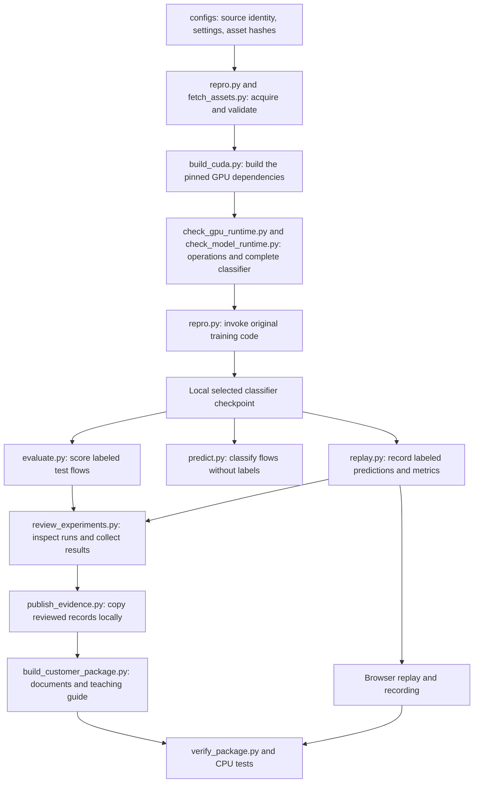
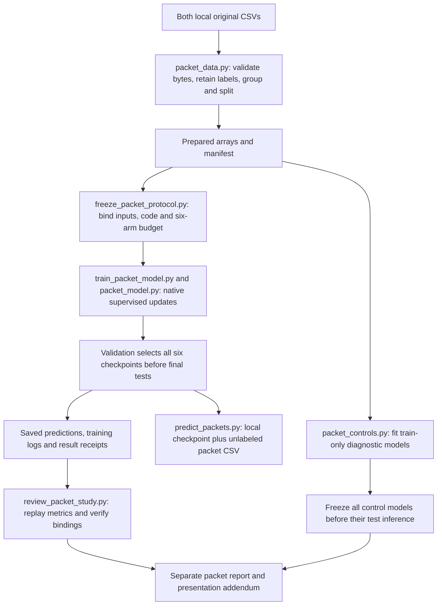

# Every file in the NetMamba+ repository

This companion explains every current repository file, its inputs and outputs, and when to use it. The [packet study](#packet-study) supplies the single supported native NetMamba+ training and prediction workflow for both uploaded CSVs. Its preparation, frozen protocol, six completed native comparisons and saved test predictions are available as separate evidence. The original six-class flow measurements keep their original meaning.

The **[current v5 video](https://buffbeefalo.github.io/netmambaplus-reproduction/video/)** explains both CSVs, the paper, the native packet adaptation, both repositories, actual tests, setup, predictions and remaining deployment work. Its [source, downloads and individual frame entries](#v5-course) follow one lesson. The slide images match the video and the handbook includes this guide as searchable text.

The supported client workflow now uses both CSVs and the selected joint pretrained packet model. Earlier flow/calibration code and media in this full inventory are historical research. For a first reading before a client handoff, use **[Understand and explain the client project](customer/client-project-guide.md)**. It explains both repository editions and the complete process, then shows how the client's manifest maps any delivered file back to the individual entries in this walkthrough.

The preserved historical **v4** course covers the original flow experiment and confidence calibration at immutable commit `4eba1da479238a10ff29097b2e0a27d98a79f063`, whose complete tree contains **494 files**. Its [source, checks and downloads](#v4-course) and [96-scene frame map](#v4-scenes) remain individually documented here. That video, PDF handbook and PowerPoint do not explain the later packet study. Historical verification checks the preserved edition; a separate current-guide check requires an individual entry for every tracked and nonignored file today. Neither check grants new video coverage or certifies every prose claim.

The original audited customer package at commit `17b4aaebcf9327ae9967ca45ddfaf16325766993` is historical. Its frozen ZIP, eight-page briefing, 16-slide deck and matching script retain their original contents and do not include later calibration or packet training. The current [customer index](customer/README.md), [quickstart](customer/quickstart.md) and [acceptance map](customer/acceptance.md) explain the supported packet delivery; historical entries retain their earlier scope. The 54-test count and then-untested Windows/macOS statements in the archived ZIP belong to that older snapshot; current platform evidence is in the [support matrix](support-matrix.md).

V3 also stays unchanged: its source, frames, video/documents and receipts are verified against immutable Git snapshot `71290440e917105ffa094402d94e24d7e29a3549`. The current verifier reads original Git blobs as data without executing old code; this shared guide can evolve. The [v3 section](#v3-course) retains its historical scene map. V2 remains separate history. There is one active video watch route, while the archived interactive `/course/` route stays excluded from deployment.

“Tracked” means included in Git. Nonignored additions also need explanation and review. Downloaded upstream code, raw data, local weights, speech/build caches and Git internals remain outside this inventory; their roles appear near the end.

You can read this one file from top to bottom, use the links below, or search it for a filename. To keep a local copy, use GitHub’s **Raw / Download raw file** action. A Markdown reader displays its formatting; an ordinary text editor can read the same file. Follow source links only when you want the underlying code or evidence.

**Jump to:** [How it fits together](#first-understand-what-the-repository-is) · [Vocabulary](#vocabulary-for-reading-the-files) · [Main code](#1-files-at-the-repository-root) · [GitHub automation](#2-githubworkflows-automated-github-jobs) · [Settings](#3-configs-recipes-and-input-identities) · [Dependencies](#4-requirements-packages-for-different-activities) · [Tools](#5-tools-programs-supporting-the-experiment) · [Tests](#6-tests-cpu-regression-tests) · [Foundational docs](#7-docs-foundational-explanations) · [Customer documents](#8-docscustomer-presentation-and-customer-instructions) · [Demo](#9-docscustomerdemo-files-used-for-the-browser-demonstration) · [Figures](#10-docscustomerfigures-reusable-charts) · [Original evidence](#11-docscustomerevidence-original-aggregate-and-input-records) · [Later audit](#12-docscustomeraudit-evidence-later-rechecks) · [Council/research](#13-docsresearch-reasoning-plans-and-council-records) · [V2 history](#v2-video) · [Current packet study](#packet-study) · [Historical v4 and calibration](#v4-course) · [V4 frame map](#v4-scenes) · [V3 history](#v3-course) · [Local files](#files-you-may-see-locally-that-are-not-tracked-in-this-repo) · [Every release download](#release-attachments-are-separate-from-tracked-files).

## First understand what the repository is

The current application receives one packet’s 1,500 stored payload bytes, processes 378 tokens through the original four-block encoder and predicts benign/attack. Both supplied CSVs contribute selected groups to its joint training. The client repo receives the executable packet package; the reproduction repo also preserves research history and teaching media. The flow description below explains those archived files, not a second client setup.

Think of it as a small research laboratory with four parts:

1. **Execution code** gets the correct inputs into the authors’ model and runs training or prediction.
2. **Checks** test the execution code, compare GPU calculations and verify the recorded evidence.
3. **Lab records** preserve what actually ran: settings, logs, model identities, predictions and failures.
4. **Teaching materials** turn those records into the slides, briefing, guide and browser demo.

The original neural model is **NetMamba+**, a classifier of network flows. A flow is a group of related packets. It reads byte content, packet sizes and time gaps, then assigns one of six dataset categories. Two categories are attacks; four describe IoT device/power activity. The current packet adaptation uses the same native encoder code with a two-class head and one packet's stored bytes. Neither route calls an AI chat service to make traffic predictions.

The uploaded CICIDS2017 and UNSW CSVs contain individual packet records. They lack established flow identity and ordering, so the original flow experiment uses the authors’ separate CICIoT2022 release. The later packet study explicitly accepts that limitation: it validates all 1,500 stored byte slots and learns supplied benign/attack labels without reconstructing flows. The original model and flow tensor loader are fetched at a pinned commit; our scripts organize their execution and define the separate packet input contract.

In the tested flow preset, one flow contributes the first five packets with up to 320 stored bytes each, plus the first 20 packet sizes and 20 time gaps. The original loader pads/truncates and normalizes these values. The model turns them into 443 input units called tokens, processes them through four Mamba blocks and combines three summaries into six outputs. A Mamba block scans a sequence while updating an internal numerical state; that state is not an implemented live network-connection cache. The six categories are Flood, RTSP Brute Force, Audio, Other, Cameras and Home Automation under the release's recorded class names. The [packet workflow](#packet-study) instead has 378 tokens and no observed size or timing sequence.

## Understand the preserved flow experiment

This diagram traces the original six-class flow experiment. Its files and recorded results remain separate from the packet workflow below.

The short pretraining check is a separate branch of this experiment. The three full fine-tuning runs started from the authors’ released pretrained checkpoint, **not from the checkpoint produced by our short check**. That distinction matters when explaining what was reproduced.

Opening the finished demo only reads recorded predictions. It does not run these training steps again. Running the CPU tests also does not train a model. New GPU experiments use the [support matrix](support-matrix.md) for the current environment and the original source/assets and execution sequence described in the runbook. `build_gb10.py` retains the historical GB10 build route; `build_cuda.py` checks a selected compiler-supported NVIDIA target while keeping the pinned model unchanged.

## Vocabulary for reading the files

| Term | Meaning in this project |
|---|---|
| Python / `.py` | Executable program text. Run it with Python; inspect it to understand the implementation. |
| Markdown / `.md` | Readable document text with headings, links and tables. GitHub displays it as a formatted page. |
| JSON / `.json` | Structured data made of named fields, lists and values. It can describe settings, results or predictions; the extension alone does not tell you which. |
| YAML / `.yml` | Structured settings used here to tell GitHub which automated jobs to run. |
| Manifest | A run’s lab notebook: what was requested, which files and model were used, what environment ran it, and whether it completed. |
| Checkpoint | A saved state of a trained neural network. Native training checkpoints may also contain optimizer state and settings. |
| Model-only export | A local checkpoint containing the selected model tensors without the training optimizer and executable settings object. It is still a PyTorch model file. |
| Graph export | A different operation: capture the model’s computations into a form another execution system might consume. The tested graph-export path failed. Successful model-only export does not establish graph-export support. |
| Provenance | The recorded origin and identity of a file or model, including which class index means which category. |
| Hash / SHA-256 | A content fingerprint. Matching hashes establish matching file bytes; they do not prove scientific correctness or data rights. |
| Seed | A chosen starting value for random operations. The original flow study used seeds 0, 1 and 2 on one split. The packet protocol fixes split seed 17 and model/sampling seed 0 for six comparison arms. These are not independent datasets or repeated packet-study seeds. |
| Epoch / update | An epoch is a pass through the training loader. An optimizer update changes model parameters after a batch. The original flow runs each completed 120 epochs and 7,920 updates. The packet protocol requests 1,000 updates per arm with replacement sampling; that budget is not a full-file epoch or proof of completion. |
| Logits / scores | Raw model outputs: six for the original flow classifier, two for the packet classifier. Softmax produces normalized scores. The separate flow calibration study adds optional temperature scaling without changing the winning class. Packet scores are uncalibrated; neither route establishes customer-network attack probability. |
| Accuracy / F1 | Accuracy is the fraction of correct predictions. F1 combines precision and recall. Weighted F1 accounts for each class’s number of true examples; macro F1 gives each class equal weight. |
| Confusion matrix | A table of true versus predicted categories. Here rows are true classes and columns are predicted classes. It shows which mistakes produced an aggregate score. |
| Fixture / regression test | A controlled example used to test code behavior, such as rejecting a mismatched model. These CPU examples do not establish neural-model accuracy. |
| Runtime / environment | The actual Python, packages, compiler, driver and hardware used to execute the model. |
| CPU / GPU / GB10 | The CPU runs general-purpose programs. A GPU performs many numerical operations in parallel. NVIDIA GB10 is the hardware profile used for the measured model execution here. The basic package tests need only a CPU. |
| Torch / CUDA / Triton | PyTorch (imported as `torch`) supplies neural-network operations and training machinery. CUDA is NVIDIA's GPU computing platform. Triton compiles some specialized GPU calculations used by this software stack. |
| NIC / SmartNIC / DPU | A NIC connects a computer to a network. SmartNICs and data processing units can take on additional packet handling or computation. This project's proposed division of work is described in the hardware roadmap; it has not been deployed there. |
| NPU / IDS | An NPU is a neural processing unit designed to accelerate supported neural computations. An IDS is an intrusion detection system that observes traffic and raises security alerts. A traffic classifier is one component of a possible IDS, not the whole capture-to-alert system. |

## 1. Files at the repository root

Course links: [main execution path](#v4-chapter-code), especially [the coordinator](#v4-scene-code-02), and [root/settings/dependencies](#v4-scene-repository-02).

These are the main entry points and Git settings. Links in every inventory table lead to the actual file. A table’s heading gives the folder; file names within that table are relative to it.

| File | What it does and when you would open it |
|---|---|
| [.gitattributes](../.gitattributes) | Tells Git to preserve exact bytes for captured records and documents, and to treat PDFs, PowerPoints, images and video as binary files. This protects hash comparisons against automatic text conversions. |
| [.gitignore](../.gitignore) | Lists local outputs that Git should normally exclude: downloaded source, datasets, checkpoints, run directories, virtual environments and secret-setting files. It reduces accidental publication; it is not a permission system. |
| [README.md](../README.md) | The project’s front door. Explains the measured result, links the customer material, gives basic commands and states the scientific and deployment limits. Read this before running the code. |
| [repro.py](../repro.py) | The main experiment coordinator. Its `fetch`, `validate`, `pretrain`, `finetune` and `evaluate` commands verify source/data, resolve native settings, create run manifests and launch the authors’ code. It also supplies shared validation, hashing, output protection and provenance helpers to the other scripts. |
| [evaluate.py](../evaluate.py) | Reloads a saved classifier strictly and scores labeled test flows using the authors’ loader and evaluation engine. It checks category meanings and writes the returned metrics. It does not train the classifier or select it using test accuracy. |
| [predict.py](../predict.py) | Reads native flows and a provenance-bound classifier, removes loader targets before forward, and returns original logits/scores/categories without unlabeled accuracy. Optional --calibration adds checked scaled scores; --abstain-threshold adds accept/defer for the unchanged category. Use the calibration guide for compatibility and policy limits. |
| [replay.py](../replay.py) | Runs labeled test inference, records each prediction and independently recomputes the metrics. It also contains the browser replay’s HTML, CSS and JavaScript template. The generated page displays those saved results without executing the neural model in the browser. |

The main pattern is **shared preparation, specialized execution**. `repro.py` checks identity and settings once; evaluation, prediction and replay reuse that preparation. The authors’ loader remains responsible for tensor transformations, avoiding a second interpretation of packet bytes, padding and normalization.

## 2. `.github/workflows/`: automated GitHub jobs

Course links: [six portable CI combinations](#v4-scene-setup-03) and [tests, workflows and evidence](#v4-scene-repository-05).

| File | What it does and when you would open it |
|---|---|
| [ci.yml](../.github/workflows/ci.yml) | Runs six CPU jobs: Ubuntu 24.04, Windows 2022 and macOS 14 with Python 3.10/3.12. Runs tests, recomputes saved flow calibration and packet-study evidence, checks every current guide entry, verifies the pinned historical v3/v4 editions and checks page freshness. Full history supplies both immutable course trees. A green job does not repeat GPU training or prove a CPU model backend. |
| [pages.yml](../.github/workflows/pages.yml) | On a push to `main` or manual dispatch, runs tests and package verification, then publishes `docs/customer/demo` to GitHub Pages. The workflow stages that folder and excludes the retired `course/` directory before publishing the replay, video, learning guide and meeting backups. It does not deploy a live IDS. |

## 3. `configs/`: recipes and input identities

Course links: [the executable configuration](#v4-scene-code-06) and [native input transformations](#v4-chapter-features).

| File | What it does and when you would open it |
|---|---|
| [assets.json](../configs/assets.json) | The acquisition inventory: expected download locations, byte sizes and hashes for three native flow splits and the released pretrained checkpoint, plus the exact class metadata to generate. It also records the unresolved inherited-asset rights. It contains instructions for acquisition, not the raw flows or weights. |
| [ciciot2022.json](../configs/ciciot2022.json) | The main source-based recipe. Pins the authors’ commit and core source hashes, six classes, byte/size/interval input settings, batch size 128, 120-epoch fine-tuning and learning-rate settings. Its provenance fields explain where settings came from and how they differ from the paper. Its longer pretraining preset is a recipe, not evidence that we executed it. |
| [ciciot2022-pretrain-smoke.json](../configs/ciciot2022-pretrain-smoke.json) | The short functional-pretraining recipe. Requests 100 steps on CICIoT2022 training data and frequent checkpoint saves. The original loop rounds to complete epochs, so the actual check completed two epochs and 132 updates. “Smoke” means a limited test that the training machinery works. |

Changing a configuration changes an experiment. A configuration by itself does not prove that the requested run completed; find the corresponding manifest and logs.

## 4. `requirements/`: packages for different activities

Course links: [dependency groups](#v4-scene-repository-02) and [native model prerequisites](#v4-scene-setup-04).

| File | What it does and when you would open it |
|---|---|
| [gb10.txt](../requirements/gb10.txt) | Pinned Python packages for the tested GB10 profile. The runbook installs the selected Torch/CUDA stack first and builds the custom extensions separately. This file alone is not a complete machine setup or universal environment lock. |
| [browser.txt](../requirements/browser.txt) | Pins Playwright, the browser-automation library used to test and record the demo and guide. Chromium is installed separately. None of this is needed merely to open the finished HTML in a normal browser. |
| [presentation.txt](../requirements/presentation.txt) | Pins document/chart libraries such as python-pptx, ReportLab and Matplotlib. These build the editable deck, briefing and figures. External rendering tools, including LibreOffice and `pdfinfo`, are separate runbook requirements. |

## 5. `tools/`: programs supporting the experiment

Course links: [acquire/build/measure tools](#v4-scene-repository-03), [document and video tools](#v4-scene-repository-04) and [GPU execution checks](#v4-scene-setup-05).

Some tools need a GPU, some need a real browser, and some run with ordinary Python. Start with the current support matrix, then use the runbook for the relevant experiment commands; reading the report does not require every dependency.

| File | What it does and when you would open it |
|---|---|
| [benchmark.py](../tools/benchmark.py) | Measures saved-classifier GPU execution for batches of 1, 16 and 128 flows, with 20 warmups and 100 synchronized timing samples each. Records mean, median, p95 and throughput, plus single-versus-batch prediction agreement. Capture, preparation and transfers are excluded. |
| [build_customer_package.py](../tools/build_customer_package.py) | Reads reviewed measurements and document sources, fills result placeholders, builds charts, writes the briefing/results/script, creates the PowerPoint, renders PDFs and builds the guide/answer map. It checks actual PDF page counts. Rebuilding can change output hashes even when wording stays the same. |
| [build_gb10.py](../tools/build_gb10.py) | Builds the pinned Mamba fork and causal-convolution dependency for the tested GB10/CUDA profile. Applies recorded architecture and compiler-compatibility changes in separate build copies, then checks installed Mamba Python files against upstream. Build success is followed by numerical checks. |
| [build_course.py](../tools/build_course.py) | Renders the archived 30-minute interactive HTML course from its JSON source and saved evidence, including the real prediction, answer keys, styles and quiz controls. Uses only Python’s standard library. Its `--check` mode verifies the immutable historical edition, including exact expected HTML and protected source/receipt bytes, without writing files or requiring current reference documents to stay frozen. |
| [build_learning_guide.py](../tools/build_learning_guide.py) | Generates the slide-by-slide HTML learning guide and Markdown question map from the same presentation source. It supplies the plain-language explanations, glossary and exact scripts so those outputs stay aligned with the deck. Uses the Python standard library. |
| [capture_runtime.py](../tools/capture_runtime.py) | Records package versions, GPU, driver, compiler, source comparisons and compiled-extension hashes. It preserves dependency-check warnings and uses a bounded inventory rather than dumping the whole shell environment. Open its outputs to identify the machine/software conditions behind a run. |
| [check_gpu_runtime.py](../tools/check_gpu_runtime.py) | Compares optimized GPU operations with reference calculations, including forward outputs and backward gradients. Its seven checks cover causal convolution, selective scan, normalization and full Mamba blocks. Passing shows numerical agreement within the recorded tolerances for those cases. |
| [check_learning_guide.py](../tools/check_learning_guide.py) | Opens the guide in Chromium and checks all 16 titles/scripts, disclosures, internal anchors, keyboard skip navigation, errors and four viewport widths. Saves screenshots and a dated receipt. Its hosted mode also compares the live HTML bytes with the local reviewed guide. |
| [fetch_assets.py](../tools/fetch_assets.py) | Downloads the research assets described in `configs/assets.json`, or generates the small metadata file, and verifies size/hash before making each target available. It preserves mismatched existing files and rejects bad downloads. It does not fetch the authors’ Git checkout; `repro.py fetch` does that. |
| [learning-guide.css](../tools/learning-guide.css) | Controls the learning guide’s typography, colors, spacing, navigation, responsive layout and print styling. The generator embeds this stylesheet into the finished HTML, allowing the page to work offline. |
| [probe_export.py](../tools/probe_export.py) | First runs ordinary GPU inference, then tries one strict Torch graph-capture path with a single flow. Records either an exported graph or the actual exception. Our recorded attempt was unsupported at a custom causal-convolution operator; it did not test an NPU compiler. |
| [profile_csvs.py](../tools/profile_csvs.py) | Uses Python and the DuckDB command-line tool to scan the uploaded packet CSVs, count rows/classes, summarize metadata and hash the files. It records missing flow context. It neither trains a packet classifier nor exhaustively validates every payload byte numerically. |
| [publish_evidence.py](../tools/publish_evidence.py) | Copies a defined set of reviewed local run records and demo files into a new publication directory, preserving their bytes and writing an evidence index. Despite its name, it does not push to GitHub. It deliberately excludes raw data and model weights. |
| [record_demo.py](../tools/record_demo.py) | Uses Chromium/Playwright to exercise the replay controls and filters, check desktop/mobile layout, and create screenshots plus a WebM video backup. It records actual browser behavior while displaying saved predictions. |
| [render_replay.py](../tools/render_replay.py) | Rebuilds the replay display from an existing prediction JSON without running the GPU model. Recomputes the confusion matrix, preserves the prediction file byte for byte and records the new HTML’s identity. Useful when changing presentation layout. |
| [review_experiments.py](../tools/review_experiments.py) | Inspects all three completed training runs: epoch histories, validation-selected checkpoints, optimizer counters, finite/changed weights and matching test results. Exercises a training batch on disposable model copies and makes tensor-identical model-only exports. Produces the combined results record; requires the runtime and local assets. |
| [summarize_audit.py](../tools/summarize_audit.py) | Runs package verification and the actual CPU tests, then extracts compact facts from primary records for a reviewer or council. Its output is a dated evidence summary, not a new GPU experiment or automatic publication certificate. |
| [verify_course.py](../tools/verify_course.py) | Defaults to the preserved 1,800-second interactive course at the immutable v4 snapshot, checking archived references, timing, questions, prediction, links and review status while rejecting current source/HTML/receipt drift. --current and explicit source/root calls retain strict supplied-data checks. Optional browser observations are separate; the retired route and pending human rehearsal stay explicit. |
| [verify_package.py](../tools/verify_package.py) | Checks the delivered evidence and documents using ordinary Python: recomputes metrics from predictions, checks hashes and identities, compares fresh evaluations, checks guide/notes/question alignment and local links. Its checksum-refresh option is for reviewed intentional changes; refreshing hashes does not validate new claims. |

An important distinction: a probe manifest can say `succeeded` because the probe completed and recorded its answer, while its metric file says `unsupported_in_tested_path`. Always read the specific result, not just the outer process status.

## 6. `tests/`: CPU regression tests

Course links: [what portable CI establishes](#v4-scene-setup-03) and [matching each check to its claim](#v4-scene-setup-07).

These use temporary examples and controlled substitutes for expensive components. Their purpose is to catch software mistakes and verify rejection behavior. The original audited suite contains 54 tests; 17 additional course tests brought the HTML-course snapshot to 71; seven video checks brought the first video snapshot to 78. Later portability, complete-model boundary and caption-anchor regressions are included in the current workflow. Use its commit-specific count; real GPU experiments have separate evidence.

| File | What it does and when you would open it |
|---|---|
| [test_assets.py](../tests/test_assets.py) | Tests asset acquisition: bad hashes never become published local targets, mismatched existing assets are preserved, and valid existing assets are reused without downloading again. |
| [test_course.py](../tests/test_course.py) | Preserves the original negative checks for altered results/predictions, budgets, topics, links, keys, stale HTML and false completion claims using archived-reference fixtures. Adds historical source/HTML/receipt drift, inventory, explicit-root source and during-check mutation tests; a real builder CLI regression verifies historical checking without rewriting the retired course. These checks validate software and preserved course evidence, not learning. |
| [test_predict.py](../tests/test_predict.py) | CPU fixtures check native-flow adaptation, absent-label handling and unchanged original outputs for the same logits. Also reject incompatible/changed calibration artifacts and thresholds without calibration, and confirm targets never reach forward. Actual GPU behavior has separate records. |
| [test_replay.py](../tests/test_replay.py) | Tests independent metrics, class support, weighted versus macro F1, malformed prediction inventories, stable softmax and HTML escaping. It helps prevent a misleading chart or executable text from entering the replay. |
| [test_repro.py](../tests/test_repro.py) | The largest test collection. Exercises native-flow validation, source drift, report/output protection, concurrent run ownership, native parser settings, failure manifests, checkpoint provenance, strict loading and test-only evaluation access. Its mocked model interfaces are explicitly separate from numerical GPU tests. |

## 7. `docs/`: foundational explanations

Course links: [the file guide](#v4-scene-repository-01), [paper reading](#v4-chapter-paper) and [the native data contract](#v4-chapter-features).

| File | What it does and when you would open it |
|---|---|
| [audit.md](audit.md) | Historical sharing audit from 7 September, when the project had not completed GPU training. Preserves earlier defects, fixes, tests and an unratified council outcome. Read it as project history; the customer verification record gives the later results. |
| [harness-reference.md](harness-reference.md) | The precise reference for accepted native-flow fields, stage-specific data access, duplicate counting, strict evaluation and manifest meaning. Use this when implementing or troubleshooting an input file. |
| [lesson.md](lesson.md) | A teaching chapter explaining packets versus flows, tensor transformations, training stages, class provenance, experiment records and metric definitions. Includes four runnable CPU exercises. |
| [repository-walkthrough.md](repository-walkthrough.md) | This current individual-file guide includes the packet study plus historical v4 and v3 scene maps. The preserved v4 handbook contains the guide revision from its 494-file edition. Every current file needs its own unique anchor and description; later guide text does not become part of old media. |

## 8. `docs/customer/`: presentation and customer instructions

Course links: [choosing downloads](#v4-scene-repository-06), [measured results](#v4-chapter-results) and [hardware limits](#v4-chapter-hardware).

| File | What it does and when you would open it |
|---|---|
| [README.md](customer/README.md) | Current customer handoff index. Separates packet, flow/calibration and original archived presentation editions; links setup, seven answers, evidence and actual audit limits. The historical ZIP retains its original index. |
| [NetMambaPlus-customer-briefing.pdf](customer/NetMambaPlus-customer-briefing.pdf) | The eight-page readable/printable briefing. Explains the work, inputs/outputs, training, actual results, demo, setup, original-repository differences and hardware roadmap. |
| [NetMambaPlus-customer-slides.pdf](customer/NetMambaPlus-customer-slides.pdf) | The 16-slide deck rendered into a fixed-layout PDF. Useful for presenting or sharing when PowerPoint rendering varies between computers. |
| [NetMambaPlus-customer-slides.pptx](customer/NetMambaPlus-customer-slides.pptx) | The editable 16-slide PowerPoint, including speaker notes. Use it for your presentation and read its notes to understand the intended explanation. The checked-in file is generated from the presentation source. |
| [SHA256SUMS](customer/SHA256SUMS) | A fingerprint list covering the customer and reviewed-research files, excluding the checksum file itself. The verifier uses it to detect changed or missing artifacts. It does not cover every source file in the repository. |
| [acceptance.md](customer/acceptance.md) | Current seven-question and requirements map for both model routes, calibration, tests, media and council outcomes. Distinguishes executed work from explained proposals and unimplemented deployment. |
| [answers.md](customer/answers.md) | Maps the seven requested customer questions to slide/script/guide numbers and briefing pages, then gives concise answers. Generated from the shared presentation source. |
| [briefing-source.md](customer/briefing-source.md) | The editable briefing template. Contains prose, deliberate page breaks and measurement placeholders that the package builder fills. Edit this when changing the briefing’s source explanation. |
| [briefing.md](customer/briefing.md) | The generated briefing text after measured values are inserted. Read it on GitHub or compare it with the PDF. Direct edits can be overwritten by the builder. |
| [course-source.json](customer/course-source.json) | Editable source for nine lessons, eight questions, answer explanations, the final teach-back rubric and exact teaching/practice times. Contains measured-value bindings, a real prediction row and original artifact fingerprints. It is teaching data, not model-training data. |
| [course-verification.md](customer/course-verification.md) | Explains how to open, download, rebuild and test the course. Records content review, timing assumptions, browser checks, publication receipts and the exact council decision. Keeps the human-paced full-route rehearsal visibly pending; automated checks do not establish mastery. |
| [document-check.json](customer/document-check.json) | Records actual rendered page counts and hashes of the two PDFs and PowerPoint. Establishes document identity/inventory; it does not by itself establish that every explanation is correct. |
| [hardware-roadmap.md](customer/hardware-roadmap.md) | Explains a possible capture-to-alert IDS and the roles of a NIC, DPU, GPU and NPU. Identifies extraction, compiler, precision and validation work still needed. It is a roadmap, not proof of deployment. |
| [presentation-source.json](customer/presentation-source.json) | Shared editable source for all 16 slides, their scripts, the seven questions, guide explanations and expected briefing page count. The generator substitutes measured values into this source to keep outputs consistent. |
| [publication-checks.json](customer/publication-checks.json) | The historical public-download, hosted-browser and CI receipt for the earlier artifact commit. Inspect its commit and timestamps. The audited release has a separate release-attached verification receipt. |
| [questions.md](customer/questions.md) | Customer discussion questions with defensible answers. Useful for likely follow-up questions about credibility, limits and practical use; distinct from the numbered seven-question presentation map. |
| [quickstart.md](customer/quickstart.md) | Current setup/use/test guide for the one supported CSV packet workflow. Separates saved viewing/checks from fresh native execution. Explains full Git-history requirements, platform-specific limits, optional test skips and retained numerical failures. |
| [client-project-guide.md](customer/client-project-guide.md) | Complete single-workflow client explanation: the paper and both CSVs, joint packet model, training/inference, measured results and test limits, setup/demo, component responsibilities, mapping client files to this guide, differences from upstream, automatic updates and future deployment work. Includes a concise introduction and handoff checklist. |
| [results.md](customer/results.md) | Generated readable tables of all three seed results, selected epochs, per-class errors, learning curves and model timings. Explains metric definitions and limits beside the numbers. |
| [runbook.md](customer/runbook.md) | The detailed procedure to acquire source/assets, build the tested environment, run short pretraining and full fine-tuning, evaluate/predict, review exports and rebuild the presentation. Includes a meeting rehearsal sequence. |
| [talk-track.md](customer/talk-track.md) | The complete presenter script in slide order, plus question locations. Generated from the same script text placed in PowerPoint notes and the guide. Use it to rehearse what you will say. |
| [upstream-comparison.md](customer/upstream-comparison.md) | Explains the paper’s problem, the uploaded packet tables, the separate native flow dataset and exactly what this project adds around the authors’ code. Start here if the source/data distinction is unclear. |
| [verification.md](customer/verification.md) | The detailed record of actual checks: source/data identity, runtime builds, numerical tests, training, inference, browser/document review and publication. Distinguishes original evidence, later rechecks and unresolved limitations. |

## 9. `docs/customer/demo/`: files used for the browser demonstration

Course links: [the recorded replay](#v4-scene-demo-01), [one actual error](#v4-scene-demo-04) and [new inference](#v4-scene-demo-05).

| File | What it does and when you would open it |
|---|---|
| [index.html](customer/demo/index.html) | The self-contained replay application. Displays seed-0 predictions, correct/incorrect results and attack-category filters. Open it offline or on Pages; playback speed controls display pace, not model execution speed. |
| [guide.html](customer/demo/guide.html) | The standalone learning page following the 16 slides and exact speaker scripts. Includes setup routes, plain-language explanations and a glossary. Works offline; links to external resources still need internet access. |
| [course/index.html](customer/demo/course/index.html) | Archived interactive course, excluded from public deployment: nine lessons, eight scored questions, explanatory keys, the saved prediction error and a separate customer teach-back checklist. Works offline with no runtime AI service; answers also work without JavaScript. This later teaching artifact is outside the historical audited ZIP. |
| [predictions.json](customer/demo/predictions.json) | The browser demo’s copy of the 1,041 seed-0 test predictions, with true labels, predicted classes, six logits/scores, metrics and source/model hashes. The HTML embeds its record, so no running prediction server is required. |
| [browser-check.json](customer/demo/browser-check.json) | Receipt for the recorded browser rehearsal. Binds the page, predictions, model and video by hashes and records tested controls/layout. It is browser evidence, not an additional accuracy experiment. |
| [recorded-demo.webm](customer/demo/recorded-demo.webm) | A video of the working replay for meeting backup. It shows recorded classifier outputs and browser controls; it is not a live traffic capture. |
| [replay-screenshot.png](customer/demo/replay-screenshot.png) | Desktop screenshot from the browser rehearsal. Useful for previewing the demo and checking its reviewed layout. |
| [replay-mobile.png](customer/demo/replay-mobile.png) | Mobile-width screenshot from the rehearsal. Shows how the same demo fits a narrow screen. |

## 10. `docs/customer/figures/`: reusable charts

Course links: [three measured results](#v4-scene-results-01) and [the confusion matrix](#v4-scene-results-04).

Each chart is exported in three formats. PNG is a pixel image suitable for slides; SVG is scalable vector artwork suitable for the web/editing; PDF preserves a print-friendly vector figure. These are format variants of two charts, not six experiments.

| File | What it does and when you would open it |
|---|---|
| [learning-curves.png](customer/figures/learning-curves.png) | Image version of the three runs’ training/validation history. Embedded in the readable results and presentation materials. |
| [learning-curves.svg](customer/figures/learning-curves.svg) | Scalable vector version of the learning-curves chart. Use when resizing or inspecting/editing vector artwork. |
| [learning-curves.pdf](customer/figures/learning-curves.pdf) | Standalone PDF version of the learning-curves chart for print or reuse in a document. |
| [seed0-confusion.png](customer/figures/seed0-confusion.png) | Image of the seed-0 confusion matrix. The six-by-six counts show which true categories were predicted as other categories. |
| [seed0-confusion.svg](customer/figures/seed0-confusion.svg) | Scalable vector version of that same seed-0 confusion matrix. Useful for high-quality resizing. |
| [seed0-confusion.pdf](customer/figures/seed0-confusion.pdf) | Standalone PDF of that same matrix. It summarizes the demo model’s 1,041 labeled test predictions. |

## How to read the experiment-record folders

The original `evidence/` folder preserves the main experiment and first checks. The later `audit-evidence/` folder preserves rechecks without overwriting those records. A later recheck on the same test flows strengthens execution repeatability; it does not create independent customer-traffic evidence.

Common names have consistent roles:

- **`manifest.json`** explains the run’s identity, inputs, arguments, runtime and process status. Historical absolute machine paths identify what was used then; they are not paths you must reproduce exactly.
- **`native.log`** is verbose program output, including warnings. **`log.txt`** is usually one structured JSON record per epoch, despite its `.txt` extension.
- **`train_stats.json`** summarizes the training run. **`test_stats.json`** is the native trainer’s final test result for the selected model.
- **`metrics.json`** contains the activity’s result. For evaluation it has accuracy/F1; for timing it has latencies; for an export probe it has support/failure; for unlabeled prediction it contains outputs without accuracy.
- **`predictions.json`** retains row-level results so aggregate metrics can be independently recomputed.
- **`model-export-provenance.json`** binds a local model-only export to the original selected checkpoint and class meanings. The JSON is not the model weights.

## 11. `docs/customer/evidence/`: original aggregate and input records

Course links: [CSV profiles](#v4-chapter-cic-csv), [training stages](#v4-chapter-learning) and [results and errors](#v4-chapter-results).

| File | What it does and when you would open it |
|---|---|
| [artifact-index.json](customer/evidence/artifact-index.json) | Inventory of 57 copied original evidence files, with byte sizes, hashes and original names. The index itself makes this folder contain 58 tracked files. Use it to verify that records were copied unchanged. |
| [results.json](customer/evidence/results.json) | The main combined three-seed results record produced by experiment review. Contains each run’s budget, selected epoch, metrics, checkpoint/export hashes, training curves, parameter checks and cross-seed aggregate statistics. This is the source for the presentation’s measured numbers. |
| [checkpoint-transfer.json](customer/evidence/checkpoint-transfer.json) | Compares the released pretrained model with the six-class classifier: parameter counts, missing classifier-head weights, extra reconstruction-decoder weights and shape mismatches. Explains why the pretrained encoder needs downstream fine-tuning before classification. |
| [native-data-validation.json](customer/evidence/native-data-validation.json) | Original validation of all 10,404 native flows: input hashes, split counts, six-category mapping and raw-input overlap. It discloses five train/validation and six train/test shared stored inputs. |
| [uploaded-csv-profile.json](customer/evidence/uploaded-csv-profile.json) | Historical complete-file metadata profiles of the two uploaded packet CSVs: sizes/hashes, row/column counts, label aggregates and missing flow context. These records predate the new payload validation and supervised packet fits; they are not evidence of those later runs. No raw packet table is embedded. |
| [unlabeled-inference-agreement.json](customer/evidence/unlabeled-inference-agreement.json) | Compares the original 128-flow unlabeled prediction check against the corresponding labeled replay outputs. All predicted classes agree; the recorded maximum logit difference is 0.001953125. This is execution agreement, not a new accuracy estimate. |
| [browser-check.json](customer/evidence/browser-check.json) | Preserved evidence copy of the successful replay browser rehearsal. The corresponding file also appears beside the demo so its identity record travels with the display. |
| [replay-render-manifest.json](customer/evidence/replay-render-manifest.json) | Records the corrected replay HTML’s generation from unchanged saved predictions. Binds renderer, HTML and prediction hashes, making a display-only correction distinguishable from rerunning the classifier. |

### `evidence/benchmark/`

| File | What it does and when you would open it |
|---|---|
| [manifest.json](customer/evidence/benchmark/manifest.json) | Identifies the original seed-0 model-timing invocation: settings, selected checkpoint, test inputs, runtime and completion. Read it to establish what was timed. |
| [metrics.json](customer/evidence/benchmark/metrics.json) | Contains every original latency sample for batches 1/16/128, summary statistics, mean-based throughput and batch/single prediction comparison. Its scope explicitly excludes packet capture and preparation. |

### `evidence/export-probe/`

| File | What it does and when you would open it |
|---|---|
| [manifest.json](customer/evidence/export-probe/manifest.json) | Identifies the original graph-export experiment and model. A completed probe is not itself a successful export. |
| [metrics.json](customer/evidence/export-probe/metrics.json) | Records successful eager inference followed by the actual strict Torch graph-capture failure at `causal_conv1d_cuda.causal_conv1d_fwd`. This is the evidence for the limited portability blocker. |

### `evidence/pretrain-functional/`

These four files describe the original short reconstruction-training check. They do not describe the paper’s full Browser/Kitsune pretraining or the initialization history of the released checkpoint.

| File | What it does and when you would open it |
|---|---|
| [manifest.json](customer/evidence/pretrain-functional/manifest.json) | Records the short pretraining configuration, training-only input identity, original source, runtime, invocation and completed status. |
| [native.log](customer/evidence/pretrain-functional/native.log) | Full console output from that short pretraining run, including progress, saves and warnings. Use it for the detailed execution trace. |
| [log.txt](customer/evidence/pretrain-functional/log.txt) | Two structured epoch records with overall reconstruction loss and separate byte, size and interval losses. Shows loss changing during the functional check. |
| [train_stats.json](customer/evidence/pretrain-functional/train_stats.json) | Compact run summary: batch size 128, two completed epochs and about 21.07 seconds elapsed. Update counts require the loop/log context, not just this summary. |

### `evidence/runtime/`

“Rehearsal” means a second isolated software installation on the same GB10 workstation. It is not a different hardware platform.

| File | What it does and when you would open it |
|---|---|
| [build-report.json](customer/evidence/runtime/build-report.json) | Successful native-extension build record. Lists upstream/causal-convolution pins, exact compatibility patches and matching installed Mamba Python sources. Establishes the built software’s identity. |
| [numerical-check.json](customer/evidence/runtime/numerical-check.json) | Seven numerical GPU checks in the main environment, with tolerances and observed output/gradient differences. These synthetic checks support runtime correctness for the tested operations. |
| [training-environment.json](customer/evidence/runtime/training-environment.json) | Inventory of the main training environment: packages, GPU/driver/compiler, source identities, compiled-extension hashes and dependency warnings. Use when reconstructing the tested setup. |
| [rehearsal-environment.json](customer/evidence/runtime/rehearsal-environment.json) | Equivalent inventory for the second installation. Helps distinguish a repeated build from simply reusing the original environment. |
| [rehearsal-numerical-check.json](customer/evidence/runtime/rehearsal-numerical-check.json) | Seven numerical checks repeated in that second environment. Preserves observed errors rather than relying only on matching version strings. |
| [rehearsal-classifier-evaluation/manifest.json](customer/evidence/runtime/rehearsal-classifier-evaluation/manifest.json) | Identifies seed-0 strict evaluation in the rebuilt environment, including the checkpoint and reacquired data hashes. |
| [rehearsal-classifier-evaluation/metrics.json](customer/evidence/runtime/rehearsal-classifier-evaluation/metrics.json) | The second-environment classifier’s measured test result. Its confusion matrix and aggregate metrics agree with the original seed-0 evaluation. |

### `evidence/seed0/`: the run used for the demo

Seed 0 completed 120 epochs and achieved **91.26%** test accuracy. Its chosen checkpoint was selected by validation performance; “seed 0” was the predeclared demo choice.

| File | What it does and when you would open it |
|---|---|
| [training/manifest.json](customer/evidence/seed0/training/manifest.json) | Seed-0 training’s configuration, source/data/checkpoint identities, runtime, command and resulting selected classifier. This is the run’s main provenance record. |
| [training/native.log](customer/evidence/seed0/training/native.log) | Seed-0 trainer’s complete console output: progress, validation messages, checkpoint saves, final testing and warnings. Per-epoch “test samples” wording in upstream actually refers to its supplied validation loader. |
| [training/log.txt](customer/evidence/seed0/training/log.txt) | Seed-0 history with 120 JSON epoch records, including training loss/rate and validation metrics. Use it to trace learning and verify selection against the full history. |
| [training/train_stats.json](customer/evidence/seed0/training/train_stats.json) | Seed-0 training summary: completed epochs, batch size, elapsed time, best validation accuracy and chosen epoch. Chosen epochs are zero-based. |
| [training/test_stats.json](customer/evidence/seed0/training/test_stats.json) | Native fine-tuner’s final test metrics for its selected seed-0 classifier, including accuracy, weighted metrics and confusion matrix. This is separate from per-epoch validation. |
| [eval/manifest.json](customer/evidence/seed0/eval/manifest.json) | Records a fresh strict-load evaluation of that saved seed-0 classifier. Binds the same checkpoint and labeled test data to a separate invocation. |
| [eval/metrics.json](customer/evidence/seed0/eval/metrics.json) | Seed-0 strict evaluator’s returned metrics and class mapping. Compared against the trainer’s final test result to check saved-model reproducibility. |
| [replay/manifest.json](customer/evidence/seed0/replay/manifest.json) | Identifies the seed-0 inference pass that collected row-level outputs and generated the replay. Includes input/model identity and output references. |
| [replay/metrics.json](customer/evidence/seed0/replay/metrics.json) | Both native and independently computed seed-0 metrics, plus hashes of the prediction record and generated display. Establishes agreement between two metric calculations. |
| [replay/predictions.json](customer/evidence/seed0/replay/predictions.json) | All 1,041 labeled seed-0 predictions, logits and scores. You can reconstruct the 950 correct predictions and 91 mistakes from these rows. This is the original record copied into the demo. |
| [model-export-provenance.json](customer/evidence/seed0/model-export-provenance.json) | Binds the local model-only seed-0 export to its selected training checkpoint, pretrained input, class order, source commit and selected epoch. Publishes identities without including the weights. |

### `evidence/seed1/`: the second declared training run

Seed 1 completed the same 120-epoch budget on the same split and achieved **84.05%** test accuracy. Its files preserve the less favorable result rather than hiding it behind the demo run.

| File | What it does and when you would open it |
|---|---|
| [training/manifest.json](customer/evidence/seed1/training/manifest.json) | Seed-1 training recipe, inputs, runtime, command, completion and selected-classifier identity. Use it to establish which run these results belong to. |
| [training/native.log](customer/evidence/seed1/training/native.log) | Full native console trace for seed 1, including progress, validation, saves, final test evaluation and warnings. |
| [training/log.txt](customer/evidence/seed1/training/log.txt) | The 120 per-epoch seed-1 training/validation records. Provides the learning curve and evidence for its validation-selected epoch. |
| [training/train_stats.json](customer/evidence/seed1/training/train_stats.json) | Seed-1 budget, elapsed time and best validation result/epoch in a compact summary. It is not the final test score. |
| [training/test_stats.json](customer/evidence/seed1/training/test_stats.json) | Native final labeled-test metrics for seed 1’s chosen classifier. Contains the actual seed-1 test accuracy and class-confusion counts. |
| [eval/manifest.json](customer/evidence/seed1/eval/manifest.json) | Identity and completion record for the separate strict evaluation of the saved seed-1 checkpoint. |
| [eval/metrics.json](customer/evidence/seed1/eval/metrics.json) | Seed-1 metrics after strict checkpoint reload, with checkpoint/class provenance. Used to compare saved-model behavior with the trainer’s final evaluation. |
| [replay/manifest.json](customer/evidence/seed1/replay/manifest.json) | Invocation and file/model identities for the seed-1 pass collecting full prediction records. |
| [replay/metrics.json](customer/evidence/seed1/replay/metrics.json) | Seed-1 native metrics alongside the independent reconstruction from row-level predictions, plus output hashes. |
| [replay/predictions.json](customer/evidence/seed1/replay/predictions.json) | All 1,041 labeled seed-1 predictions and six-output vectors. Supplies the primary rows for recomputing this run’s metrics. |
| [model-export-provenance.json](customer/evidence/seed1/model-export-provenance.json) | Identity and class-order record for the locally exported seed-1 model tensors, linked back to the native selected checkpoint. |

### `evidence/seed2/`: the third declared training run

Seed 2 completed the same budget and achieved **84.63%** test accuracy. Together the three runs yield **86.65% mean accuracy** and **4.00 percentage points sample standard deviation**. That standard deviation is not a confidence interval or a measure of performance on unseen customer networks.

| File | What it does and when you would open it |
|---|---|
| [training/manifest.json](customer/evidence/seed2/training/manifest.json) | Seed-2 training request, identities, runtime, completion and selected-classifier record. |
| [training/native.log](customer/evidence/seed2/training/native.log) | Complete seed-2 native console output, including progress, validation, checkpoint selection, testing and warnings. |
| [training/log.txt](customer/evidence/seed2/training/log.txt) | The 120 seed-2 epoch records. Shows training and validation behavior across the full run. |
| [training/train_stats.json](customer/evidence/seed2/training/train_stats.json) | Seed-2 training budget/time and validation-selected epoch/accuracy. Read alongside its epoch history. |
| [training/test_stats.json](customer/evidence/seed2/training/test_stats.json) | Native final test metrics for the selected seed-2 classifier, including its confusion matrix. |
| [eval/manifest.json](customer/evidence/seed2/eval/manifest.json) | Separate strict evaluation’s request, checkpoint/data identity and completion for seed 2. |
| [eval/metrics.json](customer/evidence/seed2/eval/metrics.json) | Seed-2 test metrics returned after reloading the saved classifier; compared with the original final test pass. |
| [replay/manifest.json](customer/evidence/seed2/replay/manifest.json) | Identifies the seed-2 full prediction-recording invocation and its model/data sources. |
| [replay/metrics.json](customer/evidence/seed2/replay/metrics.json) | Seed-2 native and independently reconstructed metric dictionaries, with hashes binding the row records and display. |
| [replay/predictions.json](customer/evidence/seed2/replay/predictions.json) | All 1,041 labeled seed-2 predictions and logits/scores. Enables independent recalculation of accuracy, F1 and confusion counts. |
| [model-export-provenance.json](customer/evidence/seed2/model-export-provenance.json) | Records the local model-only seed-2 export’s hash, original selected checkpoint, class meanings and upstream/pretraining identities. |

### `evidence/unlabeled-prediction/`

| File | What it does and when you would open it |
|---|---|
| [manifest.json](customer/evidence/unlabeled-prediction/manifest.json) | Records the original unlabeled seed-0 prediction invocation, source-input hash, checkpoint mapping and temporary native-loader adapter. No raw flow inputs are published here. |
| [metrics.json](customer/evidence/unlabeled-prediction/metrics.json) | Despite its generic name, this contains the first 128 flows’ predicted classes, logits and scores without true-label accuracy. Compare it using the separate agreement record. |

## 12. `docs/customer/audit-evidence/`: later rechecks

Course links: [rechecking versus retraining](#v4-scene-results-05) and [what the accuracy gap does not explain](#v4-scene-results-06).

These 33 records plus their index are separate from the original 57 records. They include fresh execution and explicit failure probes; they do not represent three additional full 120-epoch training runs.

| File | What it does and when you would open it |
|---|---|
| [index.json](customer/audit-evidence/index.json) | Inventory of the 33 later audit records and screenshots, with sizes, hashes and origins. Use it to distinguish fresh checks from unchanged original experiment evidence. |
| [source-integrity.txt](customer/audit-evidence/source-integrity.txt) | Output of the later original-source verification. Confirms the pinned tracked checkout and explicit core hashes still match. |
| [data-validation.json](customer/audit-evidence/data-validation.json) | Fresh validation of all 10,404 released native flows. Preserves split counts, mapping, hashes and overlap observations for comparison with the original validation. |
| [csv-profile.json](customer/audit-evidence/csv-profile.json) | Fresh full metadata scans of both uploaded CSVs. The resulting profiles match the original counts and aggregates; this remains profiling, not classifier training. |
| [cpu-tests.txt](customer/audit-evidence/cpu-tests.txt) | Captured output listing the 54 passing CPU tests during the audit. It is a dated test record; current CI indicates whether a later commit also passes. |
| [dependency-install.json](customer/audit-evidence/dependency-install.json) | Result of a third fresh Python-dependency installation rehearsal, including package/GPU observations. Native extensions were not rebuilt a third time in this check. |
| [runtime-main.json](customer/audit-evidence/runtime-main.json) | The seven numerical GPU checks repeated in the main environment during the later audit, with their tolerances and observed errors. |
| [runtime-rehearsal.json](customer/audit-evidence/runtime-rehearsal.json) | The same seven checks repeated again in the second built environment. It preserves a distinct runtime recheck record. |
| [public-browser.json](customer/audit-evidence/public-browser.json) | Later browser check of the public replay, including controls/filters, 1,041 rows, 91 errors and viewport widths 320/390/768/1440. The 402 attack-category predictions are model outputs, not confirmed real-world incidents. |
| [unlabeled-agreement.json](customer/audit-evidence/unlabeled-agreement.json) | Compares all 1,041 later unlabeled seed-0 outputs with the original labeled prediction record. Classes and logits match exactly in this execution; binds the native/export checkpoint identities. |
| [verifier-rejection-checks.json](customer/audit-evidence/verifier-rejection-checks.json) | Records disposable-package checks showing stale guide text and altered speaker script are rejected, even when checksum refresh is requested. These are supplementary failure probes, not extra tests added to the count of 54. |
| [prediction-rejection-checks.json](customer/audit-evidence/prediction-rejection-checks.json) | Records rejection of shortened score vectors, wrong class names, reordered rows and unequal prediction collection lengths. Modified hashes were refreshed in disposable copies so this exercised semantic checks rather than only hash mismatches. |
| [page-count-rejection.json](customer/audit-evidence/page-count-rejection.json) | Records a deliberate wrong expected PDF page count being rejected. Demonstrates that the briefing-page map cannot silently drift just because files were regenerated. |
| [benchmark-arithmetic.json](customer/audit-evidence/benchmark-arithmetic.json) | Independent arithmetic check of the original and repeated benchmark samples: means, medians, p95 and mean-based flows/second. It validates calculations, not network line-rate performance. |
| [primary-summary.json](customer/audit-evidence/primary-summary.json) | Compact dated extraction of tests, numerical results, seed metrics, document identities and limits. Prepared before final publication and some later supplementary checks; its pending-publication wording is historical. |

### `audit-evidence/benchmark/`

| File | What it does and when you would open it |
|---|---|
| [manifest.json](customer/audit-evidence/benchmark/manifest.json) | Identity and completion of the later model-timing repetition. Separates this timing run from the original headline measurements. |
| [metrics.json](customer/audit-evidence/benchmark/metrics.json) | All later latency samples and summaries. Median batch 1/16/128 times were about 0.9043/4.3290/36.7392 milliseconds, still excluding capture, preparation and transfers. |

### `audit-evidence/export-probe/`

| File | What it does and when you would open it |
|---|---|
| [manifest.json](customer/audit-evidence/export-probe/manifest.json) | Records the later strict graph-export probe’s inputs, model identity and completed invocation. |
| [metrics.json](customer/audit-evidence/export-probe/metrics.json) | Records eager inference succeeding again and strict Torch export failing again at the tested custom operation. This does not establish that every possible export route would fail. |

### `audit-evidence/export-seed0/`, `export-seed1/`, `export-seed2/`

These folders evaluate the local **model-only checkpoint exports**. They are unrelated to the failed graph-capture export above.

| File | What it does and when you would open it |
|---|---|
| [export-seed0/manifest.json](customer/audit-evidence/export-seed0/manifest.json) | Fresh strict-evaluation provenance for the seed-0 model-only export, including the export hash and class mapping. |
| [export-seed0/metrics.json](customer/audit-evidence/export-seed0/metrics.json) | Actual seed-0 export evaluation: its confusion matrix and metrics match the original selected classifier’s result. |
| [export-seed1/manifest.json](customer/audit-evidence/export-seed1/manifest.json) | Fresh strict-evaluation provenance for the seed-1 model-only export. Establishes which exported weights were checked. |
| [export-seed1/metrics.json](customer/audit-evidence/export-seed1/metrics.json) | Actual seed-1 export evaluation, agreeing with that run’s original metrics and confusion matrix. |
| [export-seed2/manifest.json](customer/audit-evidence/export-seed2/manifest.json) | Fresh strict-evaluation provenance for the seed-2 model-only export, with checkpoint/class identities. |
| [export-seed2/metrics.json](customer/audit-evidence/export-seed2/metrics.json) | Actual seed-2 export evaluation, agreeing with the original seed-2 saved-classifier result. |

### `audit-evidence/guide/`

| File | What it does and when you would open it |
|---|---|
| [browser-check.json](customer/audit-evidence/guide/browser-check.json) | Receipt for the final local learning-guide rehearsal: 16 sections/scripts, seven questions, disclosure/anchor/keyboard checks and four widths. Its HTML hash binds it to the reviewed page. |
| [guide-1440.png](customer/audit-evidence/guide/guide-1440.png) | Desktop-width screenshot from that guide rehearsal. Shows the reviewed page’s visual presentation at 1,440 pixels. |
| [guide-390.png](customer/audit-evidence/guide/guide-390.png) | Narrow-screen screenshot of the guide at 390 pixels. Complements the automatic overflow checks with visible layout evidence. |

### `audit-evidence/pretrain/`

| File | What it does and when you would open it |
|---|---|
| [manifest.json](customer/audit-evidence/pretrain/manifest.json) | Identity, training-only inputs and completed status for the later short masked-pretraining repetition. It remains separate from the main three fine-tuning runs. |
| [native.log](customer/audit-evidence/pretrain/native.log) | Full console output from that repeated two-epoch functional check, including progress, saving and warnings. |
| [log.txt](customer/audit-evidence/pretrain/log.txt) | Two structured epoch records from the repeated reconstruction-training check. Retains total and modality-specific losses. |
| [train_stats.json](customer/audit-evidence/pretrain/train_stats.json) | Compact summary of the repeated check: batch size 128, two epochs and approximately 17.91 seconds elapsed. This is a short functionality check, not full pretraining reproduction. |

### `audit-evidence/unlabeled-export/`

| File | What it does and when you would open it |
|---|---|
| [manifest.json](customer/audit-evidence/unlabeled-export/manifest.json) | Provenance for predicting all 1,041 native flows without labels using the seed-0 model-only export. Records the source-input hash and temporary adapter behavior. |
| [metrics.json](customer/audit-evidence/unlabeled-export/metrics.json) | All 1,041 unlabeled predictions, with row indices, class names, six logits and six display scores. Supplies the actual outputs behind the full agreement check; it contains no ground-truth accuracy calculation. |

## 13. `docs/research/`: reasoning, plans and council records

Course links: [evidence-backed claims](#v4-scene-orientation-06) and [tests, documents and research records](#v4-scene-repository-05).

These are research and review records. Model-assisted review can identify issues and define acceptance criteria; it is not a substitute for actually running an experiment. Historical outcomes remain historical even after later work succeeds.

| File | What it does and when you would open it |
|---|---|
| [research-record.md](research/research-record.md) | Curated account of the research: why the task moved from packet classification to flow reproduction, paper/source differences, checkpoint interpretation, installation failures/fixes, experiments and remaining gaps. This is the shared AI-assisted research narrative, not a private raw chat transcript. |
| [execution-plan.md](research/execution-plan.md) | Plan and commitments made for the experiments and customer package, including scope and acceptance work. A plan describes intended work; use manifests and verification for completed-work evidence. |
| [council-decision.json](research/council-decision.json) | Immutable canonical council decision for the original experiment/customer-package plan. The package verifier checks its exact hash. Its scope predates the later numerical results. |
| [council-receipt.json](research/council-receipt.json) | Records the original plan council’s ratification identity/order, pinned seats and scope. Establishes how that decision was accepted, not that training was already complete. |
| [audit-council-initial-result.json](research/audit-council-initial-result.json) | Full preserved result of the first later handoff review: **ESCALATED / UNRATIFIED**. Contains positions, reviews and evidence-pack gaps. It was not rewritten as a success after the narrower follow-up. |
| [audit-primary-pack.json](research/audit-primary-pack.json) | Compact primary facts supplied to the focused follow-up council, including a hash of the underlying summary. A frozen intake snapshot, so its publication-pending statements reflect that time. |
| [final-council-decision.json](research/final-council-decision.json) | Exact canonical **CONSENSUS / RATIFIED** decision for the bounded research-demo handoff criteria. Lists findings and required checks, while retaining limits on what the council itself saw and established. |
| [final-council-receipt.json](research/final-council-receipt.json) | Records both pinned seats’ exact-hash acceptance of the final decision, with model/effort identity and scope. It is a ratification receipt, not a GitHub publication or GPU certification receipt. |
| [final-council-review.md](research/final-council-review.md) | Readable explanation of that final council decision, its exact hash, the earlier escalation and the local corrections/checks that followed. Links to the separate final public release verification. |

## 14. Video foundation and preserved v2 files

Course links: [versioned teaching tools](#v4-scene-repository-04) and [current versus historical downloads](#v4-scene-repository-06).

The 30-minute lesson is preserved in the [historical course-video-v2 release](https://github.com/buffbeefalo/netmambaplus-reproduction/releases/tag/course-video-v2) and the files listed here. Its source, media, captions, transcript, manifest and receipts describe that version. The [one active watch route](https://buffbeefalo.github.io/netmambaplus-reproduction/video/) is a current navigation surface for the preserved v4 media; its HTML is not a frozen v2 receipt. The original v2 HTML remains available in Git history. These video releases do not replace the seven original audited customer attachments.

| File | What it does and when you would open it |
|---|---|
| [docs/customer/video-course-source.json](customer/video-course-source.json) | Preserved v2 narration and visible teaching for 60 scenes. Contains evidence-bound numbers, the nine original chapter budgets, practice durations and two audio-bound caption corrections. The later published v4 edition has its own preserved source file. |
| [docs/customer/video-verification.md](customer/video-verification.md) | Preserved v2 receipt and rebuild explanation: original downloads, scene times, council outcome and actual media/publication checks. Its pending human-listening status and recorded hashes remain about v2 after the active page changes. |
| [docs/customer/demo/video/NetMambaPlus-30-minute-course.mp4](customer/demo/video/NetMambaPlus-30-minute-course.mp4) | The actual narrated 30:00, 1080p H.264/AAC course. Download it for offline presentation; visible captions and countdowns are included in the picture. |
| [docs/customer/demo/video/NetMambaPlus-30-minute-course.webm](customer/demo/video/NetMambaPlus-30-minute-course.webm) | Preserved browser encoding of the same v2 lesson for players without H.264/AAC support. It has its own exact file hash and the same lesson content as the v2 MP4. |
| [docs/customer/demo/video/index.html](customer/demo/video/index.html) | The active v5 watch page teaches the CSV packet workflow and both repositories, with playback, chapters, a reflowing transcript and matching downloads. It does not execute inference. Archived v3/v4 media remains in separate version directories. |
| [docs/customer/demo/video/poster.png](customer/demo/video/poster.png) | Opening teaching image shown before playback. It is a course illustration, not a live network screenshot. |
| [docs/customer/demo/video/captions.vtt](customer/demo/video/captions.vtt) | Timed WebVTT captions loaded by the browser’s optional English text track; also a separate download. The encoded video already includes visible captions. |
| [docs/customer/demo/video/captions.srt](customer/demo/video/captions.srt) | The same timed caption text in SubRip format for desktop players and editing tools. |
| [docs/customer/demo/video/transcript.md](customer/demo/video/transcript.md) | Complete timestamped narration, visible teaching points, announced practices and evidence links. Read or download it without playing audio. |
| [docs/customer/demo/video/chapters.json](customer/demo/video/chapters.json) | Nine chapter titles and exact start/end seconds, from 00:00 through 30:00. |
| [docs/customer/demo/video/media-manifest.json](customer/demo/video/media-manifest.json) | Binds the video source, local voice/model identities, 60 scenes, caption cues, cited files and downloadable media hashes. This build manifest is distinct from the verification receipt. |
| [docs/research/video-council-decision.json](research/video-council-decision.json) | Immutable exact-hash two-seat video review. Defines treatment and acceptance criteria; does not certify unseen final media or turn a pending human review into a pass. |
| [docs/research/video-quality-review.json](research/video-quality-review.json) | Exact final quality-review result: ESCALATED / UNRATIFIED, with no ratified decision hash. Preserves both seats’ positions and the outstanding human playback/caption gates; later deterministic fixes are recorded separately in video-verification.md. |

### Shared video generators and technical checks

| File | What it does and when you would open it |
|---|---|
| [requirements/video.txt](../requirements/video.txt) | Pins the local Kokoro, ONNX, audio-array, WAV and Pillow packages used for the original rendering route. FFmpeg, fonts and matching local Kokoro model/voice files are separate prerequisites. V3’s service client has its own dependency file; viewers install none of these packages. |
| [tests/test_course_video.py](../tests/test_course_video.py) | CPU regressions for schedules, image/reference containment, captions, codec metadata and isolated page paths. The real stored-media case checks pinned historical v3 source/references/assets/page. Historical v4 readiness has its own gate; synthetic fixtures do not prove decoded or human-reviewed playback. |
| [tools/narrate_course_video.py](../tools/narrate_course_video.py) | Shared source loading, fact substitution and hashing retain v4 defaults and historical reference roots. Explicit v5 sources declare an independent packet context so historical flow facts cannot enter the current lesson. The retained local Kokoro CLI explicitly defaults to v2 and checks its model/voice before writing audio/timing caches. Neither path authors narration. |
| [tools/build_course_video.py](../tools/build_course_video.py) | Combines selected source and measured narration with frames, captions, motion and recorded replay footage. Defaults to v4 source, runs/video-course/v4-neural and public v4 output; explicit paths support isolated previews. Checks source/reference/timing identities and writes media, narration and motion manifests. --webm-only derives the browser alternative. |
| [tools/build_video_page.py](../tools/build_video_page.py) | Builds the active page from v5 packet media and source-specific title/summary. Requires exact source and reference hashes; --check rejects stale HTML. Canonical v3/v4 inputs retain pinned historical reference checks, and historical versions require separate outputs. |
| [tools/verify_course_video.py](../tools/verify_course_video.py) | Defaults to preserved v4 source/reference, artifact, scene/chapter and caption checks against its exact Git snapshot. --historical-v3 selects the separate v3 edition; --current checks supplied paths and current references strictly; --legacy retains v2. Optional decode/browser observations recheck protected bytes afterward. File identity is not human playback acceptance. |

## 15. Current portability and full-video audit additions

Course links: [setup](#v4-chapter-setup), [two GPU gates](#v4-scene-setup-05) and [platform limits](#v4-scene-setup-06).

The [support matrix](support-matrix.md) is the current setup route. The original presentation and quickstart describe the earlier audited experiment snapshot. Their older test counts and platform limits remain historically accurate for that revision, but do not describe the newer portability checks.

| File | What it does and when you would open it |
|---|---|
| [tools/build_cuda.py](../tools/build_cuda.py) | Builds the two pinned CUDA extensions for a selected compiler-supported NVIDIA GPU on Linux x86-64 or ARM64. Refuses unsupported environments before installation, preserves source pins, records actual compiler flags and installed hashes, and retains failure reports. Additional GPU hardware is not automatically certified by this route. |
| [tools/check_model_runtime.py](../tools/check_model_runtime.py) | Runs the complete original classifier on six explicitly synthetic native-flow fixtures: forward pass, loss, gradients, one optimizer update, checkpoint save/strict reload and inference. Can bind installed extension hashes to a completed build report. Produces functionality evidence without claiming dataset accuracy. |
| [tests/test_build_cuda.py](../tests/test_build_cuda.py) | Tests CUDA preflight, source/architecture patch guards, actual compiler-flag extraction, output protection and build failure handling. These controlled CPU tests are separate from real GPU compilation. |
| [tests/test_model_runtime.py](../tests/test_model_runtime.py) | Tests malformed/incomplete build evidence, extension-hash mismatch, missing inputs, reused outputs and failure manifests for the complete-model checker. Actual GPU acceptance has a separate record. |
| [tests/test_portability.py](../tests/test_portability.py) | Reproduces Windows-style encoding/newline failures with controlled fixtures and checks generated text/hash portability. The hosted workflow then runs the full suite on six actual OS/Python combinations. |
| [docs/support-matrix.md](support-matrix.md) | Current beginner-facing setup: view documents, check saved evidence or run new GPU experiments. Gives installation and test commands, measured platforms, unverified hardware and the reason a CPU model backend is still missing. |
| [docs/portability-evidence.json](portability-evidence.json) | Public execution receipt for the generalized CUDA build, seven numerical cases, complete classifier update/reload/inference and all 1,041 real seed-0 predictions in the fresh environment. Keeps failed-first-build history and source/runtime identities. |
| [docs/research/portability-council-review.json](research/portability-council-review.json) | Exact ESCALATED / UNRATIFIED council result, with the unresolved complete CPU integration issue. Directly authorized CUDA changes and subsequent tests do not turn this historical result into consensus. |
| [docs/research/video-audit-v2.json](research/video-audit-v2.json) | Historical v2 audit receipt: source coverage, measured corrections, complete audiovisual decode, all-scene frame samples, independent speech-recognition/caption review, browser checks and downloaded-release hashes. Its statuses bind v2 bytes; they do not certify v3. Human listening and uncertain speech-recognition anchors remain distinct from automated checks. |

## Current packet study: both uploaded CSVs

Start with the [packet study explanation](customer/packet-model-study.md) and [packet setup guide](customer/packet-study-setup.md). All six native comparisons completed 1,000 updates each on GB10. Their frozen checkpoint choices, training records and twelve source-test prediction sets are available, alongside nine diagnostic controls and a separate presentation addendum. The offline native reviewer recomputes 155,580 group predictions representing 354,960 original-row predictions across the twelve tests. File existence, synthetic tests and timing probes alone do not establish these supervised results; the retained achieved records do.

Preparation validates every stored byte and enumerated source label. The SHA-256 of all 1,500 bytes identifies an exact-payload group globally, so the same payload cannot enter different partitions across the two sources. Split seed 17 assigns groups to training, validation or test; fixed hash order caps selected groups without consulting labels. Original row multiplicity and contradictory labels remain represented. This separates exact payloads, but cannot establish independent flows, captures or near-duplicates.

The adapter normalizes each packet's bytes and uses the original stride-four byte embedding, four native Mamba blocks and summary fusion. There are 375 byte tokens, one byte summary and two learned prefixes: 378 tokens of width 256. Size and timing streams have zero observations; their prefixes remain trainable. A learned native 443-position table supplies the same 378 selected coordinates in transferred and scratch models. A fresh binary head outputs benign/attack logits. Metadata, source identity and labels never enter neural forward; labels provide supervised targets outside it.

The frozen comparisons are CIC, UNSW and joint training, each with pretrained or scratch initialization. Each arm requests 1,000 updates of 64 sampled groups at seed 0, with validation every 100 updates. A group contributes its observed benign/attack proportions as the target. Joint batches draw 32 groups from each source. Paired arms use identical fresh heads and sampled groups. Validation group-weighted macro-F1 selects the earliest best checkpoint; joint selection averages the two source scores. All six checkpoint choices freeze before any final test inference, then each selected model is strictly reloaded and evaluated on both source tests.

Row-weighted metrics give each original CSV row one vote; group-weighted metrics give each exact payload one total vote split across its observed labels. Read both confusion matrices, accuracy, balanced accuracy, macro-F1, attack recall, false-positive rate, AUROC and average precision alongside original-label support. No selected PortScan support means no PortScan score; sparse classes need their denominators. Majority, byte-histogram and metadata linear controls diagnose how much simpler patterns explain. Their metadata features remain separate from the native packet model.

The saved-evidence reviewer checks artifact identities, achieved update logs, validation selection, paired sampling, test membership and recorded label totals, then recomputes predictions' metrics. Its optional scikit-learn comparison independently checks the arithmetic. Offline replay does not rescan the private raw CSVs, repeat GPU training or authenticate freely rewritten source records. New unlabeled inference has its own complete, capped or incomplete receipt and cannot report accuracy without truth.

### Packet code, protocol and explanations

| File | Purpose, inputs, outputs and use |
|---|---|
| [packet_data.py](../packet_data.py) | Reads both original CSVs, validates the exact byte/metadata/label schema, hashes observed inputs, preserves original and binary label counts, groups identical payloads globally and writes deterministic split/cap selections. Produces local NumPy arrays, metadata rows and a manifest. Use before freezing a study; old aggregate profiles cannot substitute for this scan. |
| [packet_model.py](../packet_model.py) | Implements the explicit packet adapter around pinned original NetMamba+ source: byte normalization, 378-token layout, learned native position mapping, summary fusion and a fresh two-class head. Transfers the compatible pretrained trunk or initializes scratch, and strictly saves/reloads packet checkpoints with source, input, class and study identities. Native execution needs the validated CUDA environment. |
| [packet_study.py](../packet_study.py) | Shared standard-library artifact checks and metric arithmetic. Reads per-group logits, binary counts and original-label counts to compute row/group confusion, ranking metrics and label slices while retaining conflicting labels. Used by training, controls and offline review; it does not fit a model. |
| [configs/packet-study.json](../configs/packet-study.json) | Frozen measured-study protocol binding both original upload hashes, prepared-manifest digest, core implementation digests, six arms, learning rates, sampling, selection, resource limits and diagnostic-control settings. Requests 1,000 updates per arm and records the discarded timing-only probe. A completed run must match these bytes; this configuration alone proves no result. |
| [tools/freeze_packet_protocol.py](../tools/freeze_packet_protocol.py) | Reads validated preparation records and writes a fresh protocol before fitting. Requires the registered original uploads for a measured study, declares all six paired comparisons and fingerprints the native execution code. Optional timing evidence informs the bounded update budget without using probe weights or scores as measured results. |
| [tools/train_packet_model.py](../tools/train_packet_model.py) | Validates each prepared file, payload identity, split and protocol binding, then trains six native packet arms with group-proportion targets. Records gradients, changed parameters, optimizer counters, sampling and validation history; freezes every selected checkpoint before testing both sources. Strict reloads and final input/code checks precede a completed result; interrupted work retains an incomplete receipt. |
| [tools/predict_packets.py](../tools/predict_packets.py) | Runs a local selected packet checkpoint on a CSV without label fields: exactly 1,500 bytes, optionally the four declared metadata fields. Forwards bytes only, writes logits/scores/classes, and binds checkpoint, input and output hashes in a completion receipt. An explicit cap still validates and hashes the whole input; malformed or changed inputs leave an incomplete result. |
| [tools/packet_controls.py](../tools/packet_controls.py) | Fits nine separate train-only controls: majority, byte-histogram linear and group-metadata linear models for CIC, UNSW and joint data. Retains group soft targets, balances joint source mass, fits scaling only on training groups and freezes all model/code/data identities before control tests. Replays portable saved coefficients on the same selected test membership; NumPy/scikit-learn are required for fitting. |
| [tools/review_packet_study.py](../tools/review_packet_study.py) | Verifies the complete public packet evidence inventory and six native result records using ordinary Python. Checks achieved updates, earliest-best validation selection, paired sampling, frozen membership and truth totals, then recomputes all twelve native source-test metric sets and invokes the control and unlabeled-inference reviewers. --independent compares scikit-learn arithmetic for both; neither mode repeats fitting or the private CSV scan. |
| [tools/review_packet_controls.py](../tools/review_packet_controls.py) | Offline reviewer for all nine frozen diagnostic control models and their eighteen source-test prediction sets. Checks prepared/protocol/code bindings, training-source weights, feature/scaler contracts, model inventories, selected test membership and original-label totals, then recomputes metrics. Reports convergence limits and optionally compares independent scikit-learn arithmetic; it does not refit controls or rescan private metadata. |
| [tools/review_packet_inference.py](../tools/review_packet_inference.py) | Audits the eight public unlabeled-inference records without loading a model or raw CSV. Checks selected-checkpoint and frozen protocol/code bindings, compressed and original prediction hashes, sorted payload identities, class argmax and softmax, then recomputes class agreement and the fixed logit-tolerance failures. A separate optional check reconstructs the later capped128 regression JSONL and compares it with the original CIC prefix. Earlier default/override comparisons have summaries only; passing artifact checks must not erase their recorded numerical failures. |
| [tools/build_packet_briefing.py](../tools/build_packet_briefing.py) | Reads completed packet evidence to build a separate eight-slide PDF and PowerPoint plus presenter script and slide-source JSON. Requires document libraries and a local font. These outputs are generated after measured results exist; they do not alter the preserved v4 lesson or prove its coverage of new files. |
| [docs/customer/packet-model-study.md](customer/packet-model-study.md) | Explains how both uploads supply native byte inputs and supervised labels, the learned position mapping, prepared group/support counts, six comparisons, controls and limits. Read its result tables together with completed receipts and explicit transfer/support limits, alongside the historical flow/calibration materials to keep the studies distinct. |
| [docs/customer/packet-study-setup.md](customer/packet-study-setup.md) | Reproduction and use instructions for packet preparation, freezing, native training, controls, unlabeled checkpoint inference and saved-evidence review. Separates ordinary CPU contract checks from the measured GB10 runtime, requires fresh outputs and explains capped/incomplete predictions. Commands are instructions; their presence is not evidence they completed. |
| [docs/superpowers/plans/2026-09-14-packet-model-integration.md](superpowers/plans/2026-09-14-packet-model-integration.md) | Implementation plan for connecting both packet CSVs to the native encoder, measuring paired training and controls, checking unlabeled inference, and publishing a separate addendum while preserving historical course bytes. Plans and candidate decisions are distinct from frozen protocol, achieved run evidence and council ratification. |

### Packet and current-guide regression tests

These controlled fixtures test code contracts and rejection behavior. Optional numerical tests need their declared packages and some native model tests need the local CUDA runtime. Skipped tests do not establish CPU model execution or dataset performance.

| File | What the individual test module checks |
|---|---|
| [tests/test_packet_data.py](../tests/test_packet_data.py) | Rejects invalid numeric bytes, schemas and unknown labels; checks exact-payload grouping, deterministic cross-source splits, hash-order caps, retained multiplicity/conflicts and metadata records using small CSV fixtures. Numerical preparation cases require NumPy. |
| [tests/test_packet_model.py](../tests/test_packet_model.py) | Checks packet metadata and strict checkpoint contracts, rejects flow/position/source drift and preserves outputs. Optional native tests inspect trunk transfer, matching scratch position coordinates, gradients and save/reload behavior on synthetic packets; they do not measure dataset accuracy. |
| [tests/test_packet_prepared_integrity.py](../tests/test_packet_prepared_integrity.py) | Uses small prepared fixtures to reject missing/extra files, descriptor substitutions, bad shapes/dtypes/counts, source/label mismatch, payload-hash drift, unsorted or duplicate identities, incorrect seeded splits and invalid caps. Verifies the training loader's input boundary with NumPy. |
| [tests/test_packet_training.py](../tests/test_packet_training.py) | Tests frozen protocol validation without training: code/source bindings, complete required fingerprint inventory, safe arm/code paths, minimum measured update budget and finite positive optimizer/resource limits. |
| [tests/test_packet_protocol_freeze.py](../tests/test_packet_protocol_freeze.py) | Checks that measured freezing requires the original registered source hashes, preserves an existing output and binds prepared/code identities, all six comparisons and declared budgets. Synthetic records establish rejection behavior, not a measured study. |
| [tests/test_packet_study.py](../tests/test_packet_study.py) | Checks row/group weighting with repeated or conflicting labels, class ties, score validation, original-label support and ranking metric definitions. Small analytic examples expose mistakes hidden by aggregate accuracy. |
| [tests/test_packet_evidence_review.py](../tests/test_packet_evidence_review.py) | Synthetic evidence fixtures reject altered membership, truth totals, selected validation scores, pair sampling and incomplete achieved budgets even when related artifact hashes are refreshed. Optional independent scikit-learn comparisons use hand-calculated row/group metrics; no native training is fabricated. |
| [tests/test_packet_predict.py](../tests/test_packet_predict.py) | Exercises the no-label CLI with controlled model calls: strict schema/byte validation, metadata exclusion, checkpoint/study binding, full-file validation after a cap, changing inputs, malformed logits and complete/capped/incomplete receipts. Rejects output reuse and retains actual failures. |
| [tests/test_packet_inference_review.py](../tests/test_packet_inference_review.py) | Synthetic offline inference fixtures reject changed compressed or uncompressed hashes, wrong payload/order, false classes/probabilities, mismatched checkpoint bindings, loosened tolerances and hidden prior failure rows. Confirms that every class can agree while the strict numerical comparison still fails; no new GPU inference is performed. |
| [tests/test_packet_controls.py](../tests/test_packet_controls.py) | Checks stored-byte histograms, grouped metadata means/protocol fractions, soft targets and balanced joint source mass. Tiny numerical fits test train-only scaling, portable score replay, pre-test freeze and changed-model rejection; they are separate from measured controls. |
| [tools/verify_repository_guide.py](../tools/verify_repository_guide.py) | Compares today's complete tracked and nonignored file inventory with explicit individual table entries in this guide. Requires one unique file anchor, one local first-cell file link and a description; rejects missing/extra paths and duplicate or unsafe entries. This structural check neither rewrites course coverage nor claims that a video or every explanation is current. |
| [tests/test_repository_guide.py](../tests/test_repository_guide.py) | Tests exact current inventory, individual-entry/anchor requirements, safe links and missing descriptions. Comments, fenced examples and indented code cannot impersonate real guide entries. |
| [tests/test_course_history_v4.py](../tests/test_course_history_v4.py) | Tests exact immutable v4 bytes and protected inventory, archive/reference data handling, source/media/version path guards and preserved v3 protection. Negative fixtures reject added/changed protected artifacts and version substitution; historical Python is read as data and never executed. |

### Packet preparation, protocol and achieved-run evidence

| File | What the individual record establishes and how to use it |
|---|---|
| [docs/customer/evidence/packet-study/index.json](customer/evidence/packet-study/index.json) | Complete retained packet-evidence file inventory with byte sizes and SHA-256 identities. The reviewer rejects extra, missing, duplicated or changed files. This index binds the exported bundle; it does not independently authenticate original private source truth. |
| [docs/customer/evidence/packet-study/manifest.json](customer/evidence/packet-study/manifest.json) | Complete original-CSV preparation record: observed and registered upload identities, source label order, payload/count/subtype/split/selection array hashes, all-row and selected support, cross-source duplicates and exact group-membership digests. Raw arrays remain local; use this record to identify the population behind each test. |
| [docs/customer/evidence/packet-study/protocol.json](customer/evidence/packet-study/protocol.json) | Exact copy of the measured protocol frozen before native fitting, binding both original uploads, prepared data, implementation, all six arms and the 1,000-update selection/sampling budget. Must match configs/packet-study.json and the run/result bindings. |
| [docs/customer/evidence/packet-study/results.json](customer/evidence/packet-study/results.json) | Completed six-arm native packet report with twelve source-test evaluations, selected checkpoint identities, training receipt links, runtime and elapsed time. Contains both row/group metrics and exposure labels; familiar-source performance and unsupervised source transfer have different meanings. |
| [docs/customer/evidence/packet-study/runtime.json](customer/evidence/packet-study/runtime.json) | Actual native study execution environment and command: GB10, Linux ARM64, Python, Torch/NumPy/CUDA versions, float32 with autocast/TF32 disabled, compiler path and protocol/preparation identities. Describes this measured machine, not every supported platform. |
| [docs/customer/evidence/packet-study/frozen-checkpoints.json](customer/evidence/packet-study/frozen-checkpoints.json) | All six validation-selected checkpoint paths, hashes, sizes, steps and scores, recorded together before final native test inference. Checkpoint files stay local; strict reload and exported prediction evidence retain their identities. |
| [docs/customer/evidence/packet-study/initialization-audit.json](customer/evidence/packet-study/initialization-audit.json) | Primary-source/native-initialization audit binding the upstream files, checkpoint shapes and allowed transfer/omission sets. Establishes learned positional parameters, the exact 443-to-378 remap, compatible trunk transfer and fresh-head comparison. This mechanical audit accessed no study data and measured no accuracy. |
| [docs/customer/evidence/packet-study/native-mechanics.json](customer/evidence/packet-study/native-mechanics.json) | Actual GB10 mechanical check using two real payloads from each source with synthetic targets. Records finite loss/gradients through the native adapter and exact checkpoint save/reload agreement, plus source and initialization provenance. This is functionality evidence, separate from the six measured supervised arms. |
| [docs/customer/evidence/packet-study/native-mechanics-tests.txt](customer/evidence/packet-study/native-mechanics-tests.txt) | Whitespace-normalized captured output of 17 packet-model contract and native mechanical tests in the measured environment. Includes transfer/position checks, payload gradients and strict checkpoint roundtrip tests. The successful test log establishes those cases, not dataset accuracy or an additional training study. |
| [docs/customer/evidence/packet-study/post-study-io-check.json](customer/evidence/packet-study/post-study-io-check.json) | Actual GB10 regression after the predictor portability fix. Contains its capped receipt and all 128 predictions: the full 25,930-row input was validated, the first 128 CIC classes agreed, and their score comparison passed. This later check uses a newer predictor hash and does not replace the full experiment or erase its numerical failures. |
| [docs/customer/evidence/packet-study/metadata-vocabulary-audit.json](customer/evidence/packet-study/metadata-vocabulary-audit.json) | Full original-row audit of named protocol tokens and invalid numeric metadata counts in both uploads. Grounds the controls parser’s explicit protocol-name allowlist and recorded correction; metadata is still excluded from native packet forward. |
| [docs/customer/evidence/packet-study/control-freeze-observation.json](customer/evidence/packet-study/control-freeze-observation.json) | Timestamped observation of the completed control-model freeze hash before any control test output existed, while native fitting was still running. Supplements the frozen control manifest; it is not a native checkpoint freeze or a control performance result. |
| [docs/customer/evidence/packet-study/timing.json](customer/evidence/packet-study/timing.json) | Timing-only GB10 probe with real bytes, synthetic alternating targets, candidate update-budget estimates and the chosen 1,000 updates per arm. Probe weights were discarded and no scores were selected; measured training did not initialize from this probe. |
| [docs/customer/evidence/packet-study/timing-probe-source.txt](customer/evidence/packet-study/timing-probe-source.txt) | Preserved source text for the local timing-only script named by the timing record. Read to inspect exactly what was timed; it is retained as evidence data and is not the measured six-arm trainer. |

### Every native packet arm: training and both source tests

| File | What the individual record establishes and how to use it |
|---|---|
| [docs/customer/evidence/packet-study/cic_pretrained/training.jsonl](customer/evidence/packet-study/cic_pretrained/training.jsonl) | CIC, transferred initialization: one observed loss, gradient norm and elapsed time per optimizer step, covering the achieved 1,000-update budget. Read with its training receipt; a selected checkpoint can come from an earlier validation step. |
| [docs/customer/evidence/packet-study/cic_pretrained/training-receipt.json](customer/evidence/packet-study/cic_pretrained/training-receipt.json) | CIC, transferred initialization: achieved optimizer counters, first-update gradient evidence, changed parameter hashes, sampled/distinct training groups, paired sampling digest, ten validation observations and the selected checkpoint. Binds the log and distinguishes completed updates from checkpoint selection. |
| [docs/customer/evidence/packet-study/cic_pretrained/test-cic.jsonl.gz](customer/evidence/packet-study/cic_pretrained/test-cic.jsonl.gz) | CIC, transferred initialization: compressed per-group native logits, exact payload IDs and retained binary/original-label counts for 20,000 CIC payload groups representing 47,048 rows. This source participated in supervised fitting, with these selected test groups held out. The reviewer recomputes both weighting schemes and verifies membership/support. |
| [docs/customer/evidence/packet-study/cic_pretrained/test-unsw.jsonl.gz](customer/evidence/packet-study/cic_pretrained/test-unsw.jsonl.gz) | CIC, transferred initialization: compressed per-group native logits, exact payload IDs and retained binary/original-label counts for 5,930 UNSW payload groups representing 12,112 rows. The model had no supervised fitting on this source; this is its transfer test. The reviewer recomputes both weighting schemes and verifies membership/support. |
| [docs/customer/evidence/packet-study/cic_scratch/training.jsonl](customer/evidence/packet-study/cic_scratch/training.jsonl) | CIC, scratch initialization: one observed loss, gradient norm and elapsed time per optimizer step, covering the achieved 1,000-update budget. Read with its training receipt; a selected checkpoint can come from an earlier validation step. |
| [docs/customer/evidence/packet-study/cic_scratch/training-receipt.json](customer/evidence/packet-study/cic_scratch/training-receipt.json) | CIC, scratch initialization: achieved optimizer counters, first-update gradient evidence, changed parameter hashes, sampled/distinct training groups, paired sampling digest, ten validation observations and the selected checkpoint. Binds the log and distinguishes completed updates from checkpoint selection. |
| [docs/customer/evidence/packet-study/cic_scratch/test-cic.jsonl.gz](customer/evidence/packet-study/cic_scratch/test-cic.jsonl.gz) | CIC, scratch initialization: compressed per-group native logits, exact payload IDs and retained binary/original-label counts for 20,000 CIC payload groups representing 47,048 rows. This source participated in supervised fitting, with these selected test groups held out. The reviewer recomputes both weighting schemes and verifies membership/support. |
| [docs/customer/evidence/packet-study/cic_scratch/test-unsw.jsonl.gz](customer/evidence/packet-study/cic_scratch/test-unsw.jsonl.gz) | CIC, scratch initialization: compressed per-group native logits, exact payload IDs and retained binary/original-label counts for 5,930 UNSW payload groups representing 12,112 rows. The model had no supervised fitting on this source; this is its transfer test. The reviewer recomputes both weighting schemes and verifies membership/support. |
| [docs/customer/evidence/packet-study/unsw_pretrained/training.jsonl](customer/evidence/packet-study/unsw_pretrained/training.jsonl) | UNSW, transferred initialization: one observed loss, gradient norm and elapsed time per optimizer step, covering the achieved 1,000-update budget. Read with its training receipt; a selected checkpoint can come from an earlier validation step. |
| [docs/customer/evidence/packet-study/unsw_pretrained/training-receipt.json](customer/evidence/packet-study/unsw_pretrained/training-receipt.json) | UNSW, transferred initialization: achieved optimizer counters, first-update gradient evidence, changed parameter hashes, sampled/distinct training groups, paired sampling digest, ten validation observations and the selected checkpoint. Binds the log and distinguishes completed updates from checkpoint selection. |
| [docs/customer/evidence/packet-study/unsw_pretrained/test-cic.jsonl.gz](customer/evidence/packet-study/unsw_pretrained/test-cic.jsonl.gz) | UNSW, transferred initialization: compressed per-group native logits, exact payload IDs and retained binary/original-label counts for 20,000 CIC payload groups representing 47,048 rows. The model had no supervised fitting on this source; this is its transfer test. The reviewer recomputes both weighting schemes and verifies membership/support. |
| [docs/customer/evidence/packet-study/unsw_pretrained/test-unsw.jsonl.gz](customer/evidence/packet-study/unsw_pretrained/test-unsw.jsonl.gz) | UNSW, transferred initialization: compressed per-group native logits, exact payload IDs and retained binary/original-label counts for 5,930 UNSW payload groups representing 12,112 rows. This source participated in supervised fitting, with these selected test groups held out. The reviewer recomputes both weighting schemes and verifies membership/support. |
| [docs/customer/evidence/packet-study/unsw_scratch/training.jsonl](customer/evidence/packet-study/unsw_scratch/training.jsonl) | UNSW, scratch initialization: one observed loss, gradient norm and elapsed time per optimizer step, covering the achieved 1,000-update budget. Read with its training receipt; a selected checkpoint can come from an earlier validation step. |
| [docs/customer/evidence/packet-study/unsw_scratch/training-receipt.json](customer/evidence/packet-study/unsw_scratch/training-receipt.json) | UNSW, scratch initialization: achieved optimizer counters, first-update gradient evidence, changed parameter hashes, sampled/distinct training groups, paired sampling digest, ten validation observations and the selected checkpoint. Binds the log and distinguishes completed updates from checkpoint selection. |
| [docs/customer/evidence/packet-study/unsw_scratch/test-cic.jsonl.gz](customer/evidence/packet-study/unsw_scratch/test-cic.jsonl.gz) | UNSW, scratch initialization: compressed per-group native logits, exact payload IDs and retained binary/original-label counts for 20,000 CIC payload groups representing 47,048 rows. The model had no supervised fitting on this source; this is its transfer test. The reviewer recomputes both weighting schemes and verifies membership/support. |
| [docs/customer/evidence/packet-study/unsw_scratch/test-unsw.jsonl.gz](customer/evidence/packet-study/unsw_scratch/test-unsw.jsonl.gz) | UNSW, scratch initialization: compressed per-group native logits, exact payload IDs and retained binary/original-label counts for 5,930 UNSW payload groups representing 12,112 rows. This source participated in supervised fitting, with these selected test groups held out. The reviewer recomputes both weighting schemes and verifies membership/support. |
| [docs/customer/evidence/packet-study/joint_pretrained/training.jsonl](customer/evidence/packet-study/joint_pretrained/training.jsonl) | CIC and UNSW jointly, transferred initialization: one observed loss, gradient norm and elapsed time per optimizer step, covering the achieved 1,000-update budget. Read with its training receipt; a selected checkpoint can come from an earlier validation step. |
| [docs/customer/evidence/packet-study/joint_pretrained/training-receipt.json](customer/evidence/packet-study/joint_pretrained/training-receipt.json) | CIC and UNSW jointly, transferred initialization: achieved optimizer counters, first-update gradient evidence, changed parameter hashes, sampled/distinct training groups, paired sampling digest, ten validation observations and the selected checkpoint. Binds the log and distinguishes completed updates from checkpoint selection. |
| [docs/customer/evidence/packet-study/joint_pretrained/test-cic.jsonl.gz](customer/evidence/packet-study/joint_pretrained/test-cic.jsonl.gz) | CIC and UNSW jointly, transferred initialization: compressed per-group native logits, exact payload IDs and retained binary/original-label counts for 20,000 CIC payload groups representing 47,048 rows. This source participated in supervised fitting, with these selected test groups held out. The reviewer recomputes both weighting schemes and verifies membership/support. |
| [docs/customer/evidence/packet-study/joint_pretrained/test-unsw.jsonl.gz](customer/evidence/packet-study/joint_pretrained/test-unsw.jsonl.gz) | CIC and UNSW jointly, transferred initialization: compressed per-group native logits, exact payload IDs and retained binary/original-label counts for 5,930 UNSW payload groups representing 12,112 rows. This source participated in supervised fitting, with these selected test groups held out. The reviewer recomputes both weighting schemes and verifies membership/support. |
| [docs/customer/evidence/packet-study/joint_scratch/training.jsonl](customer/evidence/packet-study/joint_scratch/training.jsonl) | CIC and UNSW jointly, scratch initialization: one observed loss, gradient norm and elapsed time per optimizer step, covering the achieved 1,000-update budget. Read with its training receipt; a selected checkpoint can come from an earlier validation step. |
| [docs/customer/evidence/packet-study/joint_scratch/training-receipt.json](customer/evidence/packet-study/joint_scratch/training-receipt.json) | CIC and UNSW jointly, scratch initialization: achieved optimizer counters, first-update gradient evidence, changed parameter hashes, sampled/distinct training groups, paired sampling digest, ten validation observations and the selected checkpoint. Binds the log and distinguishes completed updates from checkpoint selection. |
| [docs/customer/evidence/packet-study/joint_scratch/test-cic.jsonl.gz](customer/evidence/packet-study/joint_scratch/test-cic.jsonl.gz) | CIC and UNSW jointly, scratch initialization: compressed per-group native logits, exact payload IDs and retained binary/original-label counts for 20,000 CIC payload groups representing 47,048 rows. This source participated in supervised fitting, with these selected test groups held out. The reviewer recomputes both weighting schemes and verifies membership/support. |
| [docs/customer/evidence/packet-study/joint_scratch/test-unsw.jsonl.gz](customer/evidence/packet-study/joint_scratch/test-unsw.jsonl.gz) | CIC and UNSW jointly, scratch initialization: compressed per-group native logits, exact payload IDs and retained binary/original-label counts for 5,930 UNSW payload groups representing 12,112 rows. This source participated in supervised fitting, with these selected test groups held out. The reviewer recomputes both weighting schemes and verifies membership/support. |

### Every diagnostic control model and test record

| File | What the individual record establishes and how to use it |
|---|---|
| [docs/customer/evidence/packet-study/controls/frozen-controls.json](customer/evidence/packet-study/controls/frozen-controls.json) | Freeze manifest for all nine train-only controls, binding prepared/protocol/source/code identities, portable model file hashes, training groups, feature definitions and convergence observations before control inference. Metadata grouping and the named-protocol parser correction are explicit. |
| [docs/customer/evidence/packet-study/controls/evaluation/results.json](customer/evidence/packet-study/controls/evaluation/results.json) | Completed control report with all eighteen source-test metric sets, model/prediction hashes and convergence observations. Compare the same selected populations and row/group weights as the native models; metadata and byte-histogram controls are separate diagnostic inputs. |
| [docs/customer/evidence/packet-study/controls/models/cic_majority.json](customer/evidence/packet-study/controls/models/cic_majority.json) | CIC: frozen constant group-majority model fitted only on selected training groups with their label proportions. Retains the selected constant class and weighted training label mass. Bound to the prepared data, protocol and control implementation; this is a small diagnostic model, not a native Mamba checkpoint. |
| [docs/customer/evidence/packet-study/controls/evaluation/cic_majority-test-cic.jsonl.gz](customer/evidence/packet-study/controls/evaluation/cic_majority-test-cic.jsonl.gz) | CIC constant group-majority control: compressed logits, exact selected payload IDs and observed label counts on the CIC test split. Test source participated in this control’s fitting. Metrics preserve the same row/group denominators as the native study. |
| [docs/customer/evidence/packet-study/controls/evaluation/cic_majority-test-unsw.jsonl.gz](customer/evidence/packet-study/controls/evaluation/cic_majority-test-unsw.jsonl.gz) | CIC constant group-majority control: compressed logits, exact selected payload IDs and observed label counts on the UNSW test split. Transfer evaluation on a source absent from this control’s supervised fitting. Metrics preserve the same row/group denominators as the native study. |
| [docs/customer/evidence/packet-study/controls/models/cic_byte_histogram_linear.json](customer/evidence/packet-study/controls/models/cic_byte_histogram_linear.json) | CIC: frozen 256-bin stored-byte histogram linear model fitted only on selected training groups with their label proportions. Retains coefficients, intercept, training-only scaler, feature order, fitting settings and convergence observations for portable score replay. Bound to the prepared data, protocol and control implementation; this is a small diagnostic model, not a native Mamba checkpoint. |
| [docs/customer/evidence/packet-study/controls/evaluation/cic_byte_histogram_linear-test-cic.jsonl.gz](customer/evidence/packet-study/controls/evaluation/cic_byte_histogram_linear-test-cic.jsonl.gz) | CIC 256-bin stored-byte histogram linear control: compressed logits, exact selected payload IDs and observed label counts on the CIC test split. Test source participated in this control’s fitting. Metrics preserve the same row/group denominators as the native study. |
| [docs/customer/evidence/packet-study/controls/evaluation/cic_byte_histogram_linear-test-unsw.jsonl.gz](customer/evidence/packet-study/controls/evaluation/cic_byte_histogram_linear-test-unsw.jsonl.gz) | CIC 256-bin stored-byte histogram linear control: compressed logits, exact selected payload IDs and observed label counts on the UNSW test split. Transfer evaluation on a source absent from this control’s supervised fitting. Metrics preserve the same row/group denominators as the native study. |
| [docs/customer/evidence/packet-study/controls/models/cic_metadata_linear.json](customer/evidence/packet-study/controls/models/cic_metadata_linear.json) | CIC: frozen group-metadata linear model fitted only on selected training groups with their label proportions. Retains coefficients, intercept, training-only scaler, feature order, fitting settings and convergence observations for portable score replay. Bound to the prepared data, protocol and control implementation; this is a small diagnostic model, not a native Mamba checkpoint. |
| [docs/customer/evidence/packet-study/controls/evaluation/cic_metadata_linear-test-cic.jsonl.gz](customer/evidence/packet-study/controls/evaluation/cic_metadata_linear-test-cic.jsonl.gz) | CIC group-metadata linear control: compressed logits, exact selected payload IDs and observed label counts on the CIC test split. Test source participated in this control’s fitting. Metrics preserve the same row/group denominators as the native study. |
| [docs/customer/evidence/packet-study/controls/evaluation/cic_metadata_linear-test-unsw.jsonl.gz](customer/evidence/packet-study/controls/evaluation/cic_metadata_linear-test-unsw.jsonl.gz) | CIC group-metadata linear control: compressed logits, exact selected payload IDs and observed label counts on the UNSW test split. Transfer evaluation on a source absent from this control’s supervised fitting. Metrics preserve the same row/group denominators as the native study. |
| [docs/customer/evidence/packet-study/controls/models/unsw_majority.json](customer/evidence/packet-study/controls/models/unsw_majority.json) | UNSW: frozen constant group-majority model fitted only on selected training groups with their label proportions. Retains the selected constant class and weighted training label mass. Bound to the prepared data, protocol and control implementation; this is a small diagnostic model, not a native Mamba checkpoint. |
| [docs/customer/evidence/packet-study/controls/evaluation/unsw_majority-test-cic.jsonl.gz](customer/evidence/packet-study/controls/evaluation/unsw_majority-test-cic.jsonl.gz) | UNSW constant group-majority control: compressed logits, exact selected payload IDs and observed label counts on the CIC test split. Transfer evaluation on a source absent from this control’s supervised fitting. Metrics preserve the same row/group denominators as the native study. |
| [docs/customer/evidence/packet-study/controls/evaluation/unsw_majority-test-unsw.jsonl.gz](customer/evidence/packet-study/controls/evaluation/unsw_majority-test-unsw.jsonl.gz) | UNSW constant group-majority control: compressed logits, exact selected payload IDs and observed label counts on the UNSW test split. Test source participated in this control’s fitting. Metrics preserve the same row/group denominators as the native study. |
| [docs/customer/evidence/packet-study/controls/models/unsw_byte_histogram_linear.json](customer/evidence/packet-study/controls/models/unsw_byte_histogram_linear.json) | UNSW: frozen 256-bin stored-byte histogram linear model fitted only on selected training groups with their label proportions. Retains coefficients, intercept, training-only scaler, feature order, fitting settings and convergence observations for portable score replay. Bound to the prepared data, protocol and control implementation; this is a small diagnostic model, not a native Mamba checkpoint. |
| [docs/customer/evidence/packet-study/controls/evaluation/unsw_byte_histogram_linear-test-cic.jsonl.gz](customer/evidence/packet-study/controls/evaluation/unsw_byte_histogram_linear-test-cic.jsonl.gz) | UNSW 256-bin stored-byte histogram linear control: compressed logits, exact selected payload IDs and observed label counts on the CIC test split. Transfer evaluation on a source absent from this control’s supervised fitting. Metrics preserve the same row/group denominators as the native study. |
| [docs/customer/evidence/packet-study/controls/evaluation/unsw_byte_histogram_linear-test-unsw.jsonl.gz](customer/evidence/packet-study/controls/evaluation/unsw_byte_histogram_linear-test-unsw.jsonl.gz) | UNSW 256-bin stored-byte histogram linear control: compressed logits, exact selected payload IDs and observed label counts on the UNSW test split. Test source participated in this control’s fitting. Metrics preserve the same row/group denominators as the native study. |
| [docs/customer/evidence/packet-study/controls/models/unsw_metadata_linear.json](customer/evidence/packet-study/controls/models/unsw_metadata_linear.json) | UNSW: frozen group-metadata linear model fitted only on selected training groups with their label proportions. Retains coefficients, intercept, training-only scaler, feature order, fitting settings and convergence observations for portable score replay. Bound to the prepared data, protocol and control implementation; this is a small diagnostic model, not a native Mamba checkpoint. |
| [docs/customer/evidence/packet-study/controls/evaluation/unsw_metadata_linear-test-cic.jsonl.gz](customer/evidence/packet-study/controls/evaluation/unsw_metadata_linear-test-cic.jsonl.gz) | UNSW group-metadata linear control: compressed logits, exact selected payload IDs and observed label counts on the CIC test split. Transfer evaluation on a source absent from this control’s supervised fitting. Metrics preserve the same row/group denominators as the native study. |
| [docs/customer/evidence/packet-study/controls/evaluation/unsw_metadata_linear-test-unsw.jsonl.gz](customer/evidence/packet-study/controls/evaluation/unsw_metadata_linear-test-unsw.jsonl.gz) | UNSW group-metadata linear control: compressed logits, exact selected payload IDs and observed label counts on the UNSW test split. Test source participated in this control’s fitting. Metrics preserve the same row/group denominators as the native study. |
| [docs/customer/evidence/packet-study/controls/models/joint_majority.json](customer/evidence/packet-study/controls/models/joint_majority.json) | CIC and UNSW jointly: frozen constant group-majority model fitted only on selected training groups with their label proportions. Retains the selected constant class and weighted training label mass. Bound to the prepared data, protocol and control implementation; this is a small diagnostic model, not a native Mamba checkpoint. |
| [docs/customer/evidence/packet-study/controls/evaluation/joint_majority-test-cic.jsonl.gz](customer/evidence/packet-study/controls/evaluation/joint_majority-test-cic.jsonl.gz) | CIC and UNSW jointly constant group-majority control: compressed logits, exact selected payload IDs and observed label counts on the CIC test split. Test source participated in this control’s fitting. Metrics preserve the same row/group denominators as the native study. |
| [docs/customer/evidence/packet-study/controls/evaluation/joint_majority-test-unsw.jsonl.gz](customer/evidence/packet-study/controls/evaluation/joint_majority-test-unsw.jsonl.gz) | CIC and UNSW jointly constant group-majority control: compressed logits, exact selected payload IDs and observed label counts on the UNSW test split. Test source participated in this control’s fitting. Metrics preserve the same row/group denominators as the native study. |
| [docs/customer/evidence/packet-study/controls/models/joint_byte_histogram_linear.json](customer/evidence/packet-study/controls/models/joint_byte_histogram_linear.json) | CIC and UNSW jointly: frozen 256-bin stored-byte histogram linear model fitted only on selected training groups with their label proportions. Retains coefficients, intercept, training-only scaler, feature order, fitting settings and convergence observations for portable score replay. Bound to the prepared data, protocol and control implementation; this is a small diagnostic model, not a native Mamba checkpoint. |
| [docs/customer/evidence/packet-study/controls/evaluation/joint_byte_histogram_linear-test-cic.jsonl.gz](customer/evidence/packet-study/controls/evaluation/joint_byte_histogram_linear-test-cic.jsonl.gz) | CIC and UNSW jointly 256-bin stored-byte histogram linear control: compressed logits, exact selected payload IDs and observed label counts on the CIC test split. Test source participated in this control’s fitting. Metrics preserve the same row/group denominators as the native study. |
| [docs/customer/evidence/packet-study/controls/evaluation/joint_byte_histogram_linear-test-unsw.jsonl.gz](customer/evidence/packet-study/controls/evaluation/joint_byte_histogram_linear-test-unsw.jsonl.gz) | CIC and UNSW jointly 256-bin stored-byte histogram linear control: compressed logits, exact selected payload IDs and observed label counts on the UNSW test split. Test source participated in this control’s fitting. Metrics preserve the same row/group denominators as the native study. |
| [docs/customer/evidence/packet-study/controls/models/joint_metadata_linear.json](customer/evidence/packet-study/controls/models/joint_metadata_linear.json) | CIC and UNSW jointly: frozen group-metadata linear model fitted only on selected training groups with their label proportions. Retains coefficients, intercept, training-only scaler, feature order, fitting settings and convergence observations for portable score replay. Bound to the prepared data, protocol and control implementation; this is a small diagnostic model, not a native Mamba checkpoint. |
| [docs/customer/evidence/packet-study/controls/evaluation/joint_metadata_linear-test-cic.jsonl.gz](customer/evidence/packet-study/controls/evaluation/joint_metadata_linear-test-cic.jsonl.gz) | CIC and UNSW jointly group-metadata linear control: compressed logits, exact selected payload IDs and observed label counts on the CIC test split. Test source participated in this control’s fitting. Metrics preserve the same row/group denominators as the native study. |
| [docs/customer/evidence/packet-study/controls/evaluation/joint_metadata_linear-test-unsw.jsonl.gz](customer/evidence/packet-study/controls/evaluation/joint_metadata_linear-test-unsw.jsonl.gz) | CIC and UNSW jointly group-metadata linear control: compressed logits, exact selected payload IDs and observed label counts on the UNSW test split. Test source participated in this control’s fitting. Metrics preserve the same row/group denominators as the native study. |

### Actual unlabeled packet inference and retained numerical differences

These records check a strictly reloaded joint-pretrained checkpoint on the selected test payloads with labels omitted from the input. They are a repeatability check on the same held-out groups. All 25,930 predicted classes agree with the measured evaluation; the fixed strict logit comparison still fails for two CIC rows under matched source batches and FP32 settings. The earlier default and override-only failures remain visible as summaries.

| File | What the individual inference record establishes and how to use it |
|---|---|
| [docs/customer/evidence/packet-study/unlabeled/agreement.json](customer/evidence/packet-study/unlabeled/agreement.json) | Comparison of actual unlabeled inference with the saved joint-pretrained model evaluation: all 25,930 classes agree. Retains matched FP32/source-batch settings, prediction/receipt hashes and the two CIC rows that fail the fixed raw-logit tolerance; strict_logit_tolerance_passed remains false. Class agreement is separate from bit-exact or tolerance-passing numerical replay. |
| [docs/customer/evidence/packet-study/unlabeled/cic-predictions.jsonl.gz](customer/evidence/packet-study/unlabeled/cic-predictions.jsonl.gz) | Compressed actual unlabeled predictions for 20,000 selected CIC payload groups from the joint-pretrained checkpoint. Each row retains input order, payload hash, two logits, class and uncalibrated probabilities. The offline reviewer compares these with the corresponding measured group evaluation; two rows retain strict logit-tolerance failures despite complete class agreement. |
| [docs/customer/evidence/packet-study/unlabeled/cic-receipt.json](customer/evidence/packet-study/unlabeled/cic-receipt.json) | Completed CIC inference receipt for all 20,000 byte-only rows, with whole-input and original uncompressed-output identities, selected checkpoint/study/code bindings and batch size. No cap or label fields were used. Read beside the compressed predictions and agreement record; completion alone does not establish numerical equivalence. |
| [docs/customer/evidence/packet-study/unlabeled/unsw-predictions.jsonl.gz](customer/evidence/packet-study/unlabeled/unsw-predictions.jsonl.gz) | Compressed actual unlabeled predictions for 5,930 selected UNSW payload groups from the joint-pretrained checkpoint. Preserves row/payload identities, logits, classes and uncalibrated probabilities. All classes and the recorded strict logit comparison agree with the matching measured evaluation, although floating-point outputs are not bit-identical. |
| [docs/customer/evidence/packet-study/unlabeled/unsw-receipt.json](customer/evidence/packet-study/unlabeled/unsw-receipt.json) | Completed UNSW inference receipt covering all 5,930 byte-only rows, with whole-input/original-output hashes, checkpoint metadata, implementation identities and batch size. Binds this separate-source execution to the frozen joint-pretrained model; the public bundle does not include its private raw input CSV or neural weights. |
| [docs/customer/evidence/packet-study/unlabeled/default-receipt.json](customer/evidence/packet-study/unlabeled/default-receipt.json) | Completed first standalone inference receipt for the combined 25,930-row unlabeled input under the default execution settings. Binds the input, selected joint-pretrained checkpoint and original local prediction output. Only this receipt and its comparison summary are retained publicly for that initial run; the later separate-source predictions have their own receipts. |
| [docs/customer/evidence/packet-study/unlabeled/default-comparison.json](customer/evidence/packet-study/unlabeled/default-comparison.json) | Retained initial default-inference comparison: 25,930 matching classes, 39 failed rows at the fixed strict logit tolerance and maximum absolute logit difference about 0.001894. Explains the precision-setting difference from training. Earlier raw predictions are not public, so offline review checks this summary’s internal consistency rather than replaying those differences. |
| [docs/customer/evidence/packet-study/unlabeled/override-only-comparison.json](customer/evidence/packet-study/unlabeled/override-only-comparison.json) | Retained precision diagnostic using NVIDIA_TF32_OVERRIDE=0 with the combined-source input. All 25,930 classes still agree, while eight rows fail the unchanged strict logit comparison. Combined input changes source-boundary batch composition; this summary remains separate from the later matched source-batch records and does not claim a successful strict numerical replay. |

### Separate packet presentation and review history

| File | What the individual record establishes and how to use it |
|---|---|
| [docs/customer/packet-addendum/NetMambaPlus-packet-addendum.pdf](customer/packet-addendum/NetMambaPlus-packet-addendum.pdf) | Eight-slide fixed-layout packet study addendum built from completed evidence: byte/label integration, groups, native training, selected results, controls, inference and limits. Present beside the preserved v4 course; this PDF contains the later packet measurements. |
| [docs/customer/packet-addendum/NetMambaPlus-packet-addendum.pptx](customer/packet-addendum/NetMambaPlus-packet-addendum.pptx) | Editable eight-slide PowerPoint for the same separate packet addendum, with speaker notes. Generated from packet evidence and the builder; it does not replace the historical v4 or original sixteen-slide flow deck. |
| [docs/customer/packet-addendum/packet-addendum-script.md](customer/packet-addendum/packet-addendum-script.md) | Presenter notes in slide order for the eight-slide packet addendum. Explains the actual adaptation, achieved measurements and limits; read alongside the generated PDF/PowerPoint. |
| [docs/customer/packet-addendum/packet-addendum-source.json](customer/packet-addendum/packet-addendum-source.json) | Generated structured content, tables and notes resolved from the packet evidence for all eight addendum slides. Inspect to trace the visible wording/numbers to the builder and retained results; it is teaching data, not model input. |
| [docs/customer/packet-addendum/verification.json](customer/packet-addendum/verification.json) | Hash-bound content inspection of the eight-slide packet PDF, PowerPoint, structured slide source and presenter script. Records matching titles/result cells/notes, inclusion of the stronger metadata control and inference numerical limits, plus review of rendered PDF pages. Its scope excludes PowerPoint application rendering and a new narrated video. |
| [docs/research/packet-connection-council.json](research/packet-connection-council.json) | First packet-connection council result: ESCALATED / UNRATIFIED, no mutual decision hash. Retains positions and the blocker about independently verifying current file coverage without claiming old video coverage of new fits. Later directly authorized work leaves this historical outcome unchanged. |
| [docs/research/packet-model-council.json](research/packet-model-council.json) | Native packet-model council result: ESCALATED / UNRATIFIED, no mutual decision hash. Retains missing primary positional/initialization evidence and the required matching scratch mapping. Subsequent source audit and measured work are separate evidence, not retroactive consensus. |
| [tests/test_packet_controls_review.py](../tests/test_packet_controls_review.py) | Synthetic offline control-review fixtures reject inconsistent model/scaler/feature contracts, frozen identities, missing control evaluations, altered membership or truth totals and mismatched recorded metrics. These tests check saved-evidence integrity without fitting real controls or running a GPU. |

Run `python tools/verify_repository_guide.py` for current file coverage, `python tools/review_packet_study.py` for a completed public packet bundle, and the v3/v4 verification commands for their exact published editions. Current guide entries do not make new packet files part of an old lesson. Further evidence or addendum files need their own individual entries when created.

## 16. Published v4 course and confidence calibration

V4 preserves one 60-minute lesson with 12 chapters, 96 stable scene IDs and 200 seconds of declared practice. Codex-authored text and Andrew synthetic speech describe the original flow experiment and its confidence calibration. The published edition is fixed at commit `4eba1da479238a10ff29097b2e0a27d98a79f063`, including its complete 494-file tree and then-current guide. Its source and measured narration allocation drive the historical scene map below. Its records bind actual encoded duration, layout, speech/caption observations and downloads; they do not cover the later packet study.

The flow calibration feature fits one positive temperature per frozen classifier on 1,040 validation flows, then adds calibrated scores and optional accept/defer to native prediction. It changes no weights or winning class. Across the three already-seen 1,041-flow test sets, mean NLL changed from **0.4416 to 0.4172**, Brier from **0.2035 to 0.2012**, and 15-bin ECE from **7.03% to 3.82%**; mean accuracy stayed **86.65%**. Lower is better for these confidence measurements, but they are different metrics, not an operational guarantee.

At the fixed 0.90 threshold, seed 0 accepted **620/1,041** flows with **9/620** errors before scaling, versus **893/1,041** with **37/893** errors afterward. More accepted rows included more mistakes. Validation reuse, five training/validation duplicates, unknown pretraining exposure and an already-examined test set make this a retrospective study. See the calibration guide for all seeds and the unchanged row-635 mistake.

The production path was source → identity-checked speech caches → timed video/frames → matching documents → technical/content checks → coverage/publication. The v3 and v4 verification CLIs now default to their exact published Git snapshots, reading archived reference bytes as data without executing old code and rejecting changes to protected artifacts. V4 requires its original 13 scientific claims, ten calibration claims and complete 494-file historical inventory. Explicit `--current` coverage verification still compares a course against today's tree and will reject new files the course does not cover. The independent current-guide gate checks today's file entries without relaxing either historical protection or course readiness.

### Calibration code, documentation and recorded inputs/outputs

| File | Purpose, inputs, outputs and use |
|---|---|
| [calibration.py](../calibration.py) | Pure standard-library fitting, calibrated softmax, NLL/Brier/ECE and acceptance arithmetic. Inputs are finite logits, fitting/measurement labels and a model/runtime binding; outputs are a positive temperature, scores/metrics or explicit validation errors. Shared by fitting, prediction and CPU recomputation. |
| [tools/calibrate.py](../tools/calibrate.py) | Reads metadata.json and data-valid.json plus matching recorded evidence, then runs the original CUDA loader/classifier with targets removed before forward. Writes calibration.json and an execution manifest with complete validation observations to a fresh directory. Never opens actual train/test splits; --dry-run checks inputs without fitting. |
| [tools/review_calibration.py](../tools/review_calibration.py) | Reads all three saved fitting/prediction records, fixed protocol and hash-bound historical labels. Repeats validation fits and recomputes paired test metrics/counts on CPU. --check compares results.json without writing; normal mode creates a new summary. It does not rerun CUDA or create an independent holdout. |
| [tools/verify_video_course_v4.py](../tools/verify_video_course_v4.py) | Defaults to the exact published v4 Git tree: all 494 historical files, archived guide/reference bytes, 23 required claims and unchanged protected source/media/audit identities. --current explicitly enforces coverage against today’s inventory; --content does not grant readiness. Human full-watch/all-caption acceptance stays pending. |
| [tests/test_calibration.py](../tests/test_calibration.py) | Analytic and rejection fixtures for the temperature optimum, normalization, preserved argmax, metric definitions, empty accepted-set error and malformed/incompatible artifacts. Native-interface fixtures check validation-only data and fitting boundaries; these are temporary tests, not research samples. |
| [tests/test_calibration_review.py](../tests/test_calibration_review.py) | Temporary three-seed records test the CPU reporter’s paired arithmetic, validation refit, source/checkpoint/runtime bindings, chronology and score/decision consistency. Altered records are rejected even with refreshed hashes. No GPU execution or public audit is created by the tests. |
| [tests/test_video_versions.py](../tests/test_video_versions.py) | Tests v4 defaults, selected-source drift, full nonignored inventory and immutable historical v3 blobs. V4 fixtures reject missing calibration claims, wrong evidence/pointers/units/rounding/visible values and seed identities; v3 retains its original 13 requirements. |
| [docs/customer/confidence-calibration.md](customer/confidence-calibration.md) | Current beginner method/results/use guide: logits, temperature, validation reuse, optional output fields, all-seed measurements and denominators. Explains the fixed-threshold error tradeoff, row 635 and remaining customer-network/live-IDS/hardware limits. Read beside the v4 calibration scenes. |
| [docs/customer/video-course-v4-source.json](customer/video-course-v4-source.json) | Preserved Codex-authored 96-scene source with exact narration, examples, citations, practice, voice and one-hour budgets. Covers the original flow experiment and calibration. Speech, video, captions and documents bind these historical bytes; the later packet study is separate. |
| [docs/research/calibration-code-review.json](research/calibration-code-review.json) | Recorded source/study review with inspected hashes, corrected reporter findings, actual tests and remaining limits. Separates code review/CPU arithmetic from new GPU execution and council ratification. Match its source identities before applying its conclusions. |
| [docs/research/improvement-council-review.json](research/improvement-council-review.json) | Public ESCALATED / UNRATIFIED council history, bounded evidence gaps and separately authorized direct follow-up. Preserves authority and outcome without claiming consensus or numerical certification. |
| [docs/superpowers/plans/2026-09-13-confidence-and-course.md](superpowers/plans/2026-09-13-confidence-and-course.md) | Plan for calibration math, prediction integration, GB10 measurements and versioned media/publication. Records fixed fitting/threshold choices, dataset limits and preservation requirements. Execution/review records establish completion; plan boxes alone do not. |
| [docs/customer/evidence/calibration/protocol.json](customer/evidence/calibration/protocol.json) | Protocol frozen before fitting and scaled test evaluation: three checkpoints, validation-only fitting, temperature range, fixed 0.90 policy, metrics and retrospective limits. Later manifests bind it so policy choices cannot silently change after results. |
| [docs/customer/evidence/calibration/results.json](customer/evidence/calibration/results.json) | Actual all-seed paired temperatures, NLL/Brier/15-bin ECE, accuracy, acceptance/errors and aggregate statistics. Binds source records, chronology, class agreement and FP16 tolerance. Recompute with review_calibration.py --check; v4 claims use exact pointers here. |
| [docs/customer/evidence/calibration/default-path-check.json](customer/evidence/calibration/default-path-check.json) | Actual updated-predictor GB10 run with calibration disabled on all 1,041 flows. Records original output fields and unchanged categories alongside small FP16 logit differences. Use its command/source hashes to distinguish compatibility from bitwise equality. |
| [docs/customer/evidence/calibration/gb10-baseline-audit.json](customer/evidence/calibration/gb10-baseline-audit.json) | Fresh baseline source/runtime audit, seven CUDA reference comparisons, complete-model optimizer/save/reload check and seed-0 inference. Preserves the failed bitwise expectation and observed tolerance. This is functionality evidence, not another full training run or latency gain. |
| [docs/customer/evidence/calibration/seed0/calibration.json](customer/evidence/calibration/seed0/calibration.json) | Seed 0: Fitted positive temperature and checkpoint/class/config/upstream/runtime binding. Produced from this classifier’s validation observations; supplied to predict.py --calibration. It is a small postprocessing artifact, not new model weights or a safety certificate. |
| [docs/customer/evidence/calibration/seed0/fit-manifest.json](customer/evidence/calibration/seed0/fit-manifest.json) | Seed 0: Fitting command, source/runtime and validation-file identities, saved validation logits/labels, batch coverage and artifact hash. The CPU reviewer repeats the fit from these observations; test labels do not enter the optimization. |
| [docs/customer/evidence/calibration/seed0/fit.log](customer/evidence/calibration/seed0/fit.log) | Seed 0: Console output from validation fitting. Use with fit-manifest.json to trace messages and warnings; the structured manifest supplies the input, timing and output identities. |
| [docs/customer/evidence/calibration/seed0/prediction-manifest.json](customer/evidence/calibration/seed0/prediction-manifest.json) | Seed 0: Fresh calibrated inference command binding the original classifier, native flows, runtime, fitted artifact and 0.90 policy. Identifies the per-row output and completion; independent arithmetic checks the metrics. |
| [docs/customer/evidence/calibration/seed0/prediction.log](customer/evidence/calibration/seed0/prediction.log) | Seed 0: Console output from actual calibrated prediction. Supports troubleshooting and execution trace; read prediction-manifest.json and predictions.json for structured provenance and outputs. |
| [docs/customer/evidence/calibration/seed0/predictions.json](customer/evidence/calibration/seed0/predictions.json) | Seed 0: All 1,041 fresh outputs: raw logits/scores, unchanged category, calibrated scores and accept/defer. The reviewer pairs these with separately recorded labels to compute errors. The original browser replay remains unchanged. |
| [docs/customer/evidence/calibration/seed1/calibration.json](customer/evidence/calibration/seed1/calibration.json) | Seed 1: Fitted positive temperature and checkpoint/class/config/upstream/runtime binding. Produced from this classifier’s validation observations; supplied to predict.py --calibration. It is a small postprocessing artifact, not new model weights or a safety certificate. |
| [docs/customer/evidence/calibration/seed1/fit-manifest.json](customer/evidence/calibration/seed1/fit-manifest.json) | Seed 1: Fitting command, source/runtime and validation-file identities, saved validation logits/labels, batch coverage and artifact hash. The CPU reviewer repeats the fit from these observations; test labels do not enter the optimization. |
| [docs/customer/evidence/calibration/seed1/fit.log](customer/evidence/calibration/seed1/fit.log) | Seed 1: Console output from validation fitting. Use with fit-manifest.json to trace messages and warnings; the structured manifest supplies the input, timing and output identities. |
| [docs/customer/evidence/calibration/seed1/prediction-manifest.json](customer/evidence/calibration/seed1/prediction-manifest.json) | Seed 1: Fresh calibrated inference command binding the original classifier, native flows, runtime, fitted artifact and 0.90 policy. Identifies the per-row output and completion; independent arithmetic checks the metrics. |
| [docs/customer/evidence/calibration/seed1/prediction.log](customer/evidence/calibration/seed1/prediction.log) | Seed 1: Console output from actual calibrated prediction. Supports troubleshooting and execution trace; read prediction-manifest.json and predictions.json for structured provenance and outputs. |
| [docs/customer/evidence/calibration/seed1/predictions.json](customer/evidence/calibration/seed1/predictions.json) | Seed 1: All 1,041 fresh outputs: raw logits/scores, unchanged category, calibrated scores and accept/defer. The reviewer pairs these with separately recorded labels to compute errors. The original browser replay remains unchanged. |
| [docs/customer/evidence/calibration/seed2/calibration.json](customer/evidence/calibration/seed2/calibration.json) | Seed 2: Fitted positive temperature and checkpoint/class/config/upstream/runtime binding. Produced from this classifier’s validation observations; supplied to predict.py --calibration. It is a small postprocessing artifact, not new model weights or a safety certificate. |
| [docs/customer/evidence/calibration/seed2/fit-manifest.json](customer/evidence/calibration/seed2/fit-manifest.json) | Seed 2: Fitting command, source/runtime and validation-file identities, saved validation logits/labels, batch coverage and artifact hash. The CPU reviewer repeats the fit from these observations; test labels do not enter the optimization. |
| [docs/customer/evidence/calibration/seed2/fit.log](customer/evidence/calibration/seed2/fit.log) | Seed 2: Console output from validation fitting. Use with fit-manifest.json to trace messages and warnings; the structured manifest supplies the input, timing and output identities. |
| [docs/customer/evidence/calibration/seed2/prediction-manifest.json](customer/evidence/calibration/seed2/prediction-manifest.json) | Seed 2: Fresh calibrated inference command binding the original classifier, native flows, runtime, fitted artifact and 0.90 policy. Identifies the per-row output and completion; independent arithmetic checks the metrics. |
| [docs/customer/evidence/calibration/seed2/prediction.log](customer/evidence/calibration/seed2/prediction.log) | Seed 2: Console output from actual calibrated prediction. Supports troubleshooting and execution trace; read prediction-manifest.json and predictions.json for structured provenance and outputs. |
| [docs/customer/evidence/calibration/seed2/predictions.json](customer/evidence/calibration/seed2/predictions.json) | Seed 2: All 1,041 fresh outputs: raw logits/scores, unchanged category, calibrated scores and accept/defer. The reviewer pairs these with separately recorded labels to compute errors. The original browser replay remains unchanged. |

### Published v4 coverage and audit records

These preserved records describe the published v4 edition. Consult each actual status, method and artifact hash; later guide edits do not expand their scope. Human full-watch/listening and all-caption acceptance remain pending.

| File | What the record establishes and how to use it |
|---|---|
| [docs/customer/video-course-v4-coverage.json](customer/video-course-v4-coverage.json) | Published source-bound inventory and content/visual map for the complete historical 494-file tree and its guide: individual anchors, paper/CSV teaching, clusters, worked answers and 23 quantities. Binds actual v4 media and technical receipts; it does not cover later packet files. |
| [docs/customer/video-verification-v4.md](customer/video-verification-v4.md) | Preserved v4 build/review/publication receipt with exact artifacts, commands, observations and limits. Separates computational checks/Codex review from pending human watch/listening and all-caption acceptance. Its seven-question map belongs to that edition. |
| [docs/research/video-audit-v4.json](research/video-audit-v4.json) | Preserved bundle binding script/frame review and encoded audio/caption/browser observations to published v4 bytes. Retains uncertainties and scope; cannot borrow v3 acceptance, certify later packet additions or invent a human-listening pass. |
| [docs/research/video-v4/decode.json](research/video-v4/decode.json) | Complete actual v4 audiovisual decode, measured stream duration and encoded-audio checks, bound to the MP4 and decoder. Planned seconds or encoder exit alone cannot establish this record. |
| [docs/research/video-v4/browser.json](research/video-v4/browser.json) | Observed playback, captions, chapter seeking, viewport layout and download equality for exact page/media bytes. Identifies staged/public URL and browser; does not execute the classifier or establish human listening. |
| [docs/research/video-v4/captions.json](research/video-v4/captions.json) | Source/video-bound caption and encoded-speech observations, timing, recognition uncertainty and confirmed defects. Machine checks remain distinct from complete human caption/listening acceptance. |
| [docs/research/video-v4/claims.json](research/video-v4/claims.json) | Published v4 visible/spoken quantity review against original flow evidence and calibration results. Binds source/encoded examples with correct population, units and limits; it contains no later packet measurements. |
| [docs/research/video-v4/rendered_samples.json](research/video-v4/rendered_samples.json) | Actual encoded samples for technical terms, identifiers, numbers and chapter transitions, with times/hashes/findings. Supplements all 96 base-frame reviews; selected frames do not equal a full human watch. |

### Every published v4 download and production record

Use the [active watch route](https://buffbeefalo.github.io/netmambaplus-reproduction/video/) or the [versioned v4 release](https://github.com/buffbeefalo/netmambaplus-reproduction/releases/tag/course-video-v4). All format alternatives describe the same preserved flow/calibration lesson. Its records establish the completed technical checks and retain pending human acceptance; later packet results require a separate addendum.

| File | Purpose, inputs, outputs and use |
|---|---|
| [docs/customer/demo/video/v4/NetMambaPlus-one-hour-course.mp4](customer/demo/video/v4/NetMambaPlus-one-hour-course.mp4) | Complete published v4 H.264/AAC lesson assembled from speech, frames, captions, motion and recorded flow replay footage. Use for offline viewing/presentation; historical decode and review bind these preserved bytes. |
| [docs/customer/demo/video/v4/NetMambaPlus-one-hour-course.webm](customer/demo/video/v4/NetMambaPlus-one-hour-course.webm) | VP9/Opus browser alternative for the same lesson, with its own hash and codec identity. This is another encoding, not another course or experiment. |
| [docs/customer/demo/video/v4/poster.png](customer/demo/video/v4/poster.png) | Opening scene image used before playback. Produced from the v4 teaching source, not a live traffic capture. |
| [docs/customer/demo/video/v4/captions.vtt](customer/demo/video/v4/captions.vtt) | WebVTT text/times for the optional browser English track and download. Derived from the same narration schedule as burned-in captions; the caption receipt records measured alignment and uncertainties. |
| [docs/customer/demo/video/v4/captions.srt](customer/demo/video/v4/captions.srt) | Equivalent SubRip subtitles for desktop players/editing. Same v4 words and timing, not an alternative script. |
| [docs/customer/demo/video/v4/transcript.md](customer/demo/video/v4/transcript.md) | Complete timed narration, visible content, practices, worked answers and evidence links. Read/search without audio; content must match the source and timeline. |
| [docs/customer/demo/video/v4/chapters.json](customer/demo/video/v4/chapters.json) | Twelve IDs/titles and start/end times from measured narration allocation. Drives navigation and is checked against source/media; it is not independent duration evidence. |
| [docs/customer/demo/video/v4/media-manifest.json](customer/demo/video/v4/media-manifest.json) | Production identity record for source/version/voice, scenes, cues, references and output sizes/hashes. Feeds page/documents/verifiers; a build record alone does not certify quality. |
| [docs/customer/demo/video/v4/narration-manifest.json](customer/demo/video/v4/narration-manifest.json) | Public identities/timing for all spoken passages and final audio, including samples, voice/client and unavailable cloud-model revision. The MP4 contains public speech; raw caches remain local. |
| [docs/customer/demo/video/v4/motion-manifest.json](customer/demo/video/v4/motion-manifest.json) | Timed geometry/meaning of drawings, emphasis, reveals and recorded clip. Lets reviewers distinguish illustrative animation from actual predictions. |
| [docs/customer/demo/video/v4/NetMambaPlus-course-slides.pptx](customer/demo/video/v4/NetMambaPlus-course-slides.pptx) | One image slide per v4 scene, with editable narration/evidence notes. Use for presenting/adapting the explanation. Artwork is not editable diagram shapes; the original 16-slide deck is separate history. |
| [docs/customer/demo/video/v4/NetMambaPlus-course-slides.pdf](customer/demo/video/v4/NetMambaPlus-course-slides.pdf) | Fixed-layout PDF of the same 96 scene images with scene navigation. Use to present/print the checked layout without PowerPoint rendering differences. |
| [docs/customer/demo/video/v4/NetMambaPlus-course-handbook.pdf](customer/demo/video/v4/NetMambaPlus-course-handbook.pdf) | Searchable v4 narration, examples, code/tables and references plus the historical 494-file guide appendix. Read for deeper detail; source/walkthrough/document hashes identify the included revision, which predates the packet study. |
| [docs/customer/demo/video/v4/companion-manifest.json](customer/demo/video/v4/companion-manifest.json) | Source/walkthrough/frame hashes, slide count and output identities for the PPTX and two PDFs. Produced by the document builder; actual page/layout checks remain separate. |
| [docs/customer/demo/video/v4/manifest.json](customer/demo/video/v4/manifest.json) | Final validation summary connecting build, companions, coverage and public audit records. Separate from production media-manifest.json; statuses require actual receipts and retain pending human review. |

### Published v4 chapter, scene and frame map

Each PNG consumes the visible fields of its named source scene and supplies the base image for the MP4 and matching document slide. Motion, recorded footage and captions are added during encoding, so a base PNG is not every encoded frame. These 96 entries use the finalized measured-narration timeline; times are rounded to milliseconds. The final media manifest and encoded checks must agree with it.

#### Chapter 1: Start here: what you built · 00:00.000–04:41.000

| Scene and base image | What the individual visual teaches |
|---|---|
| [docs/customer/demo/video/v4/frames/orientation-01.png](customer/demo/video/v4/frames/orientation-01.png) · 00:00.000–00:36.533 | **A research lab you can explain.** Paper → research proposal; Repository → executable experiment; Evidence → what actually happened. |
| [docs/customer/demo/video/v4/frames/orientation-02.png](customer/demo/video/v4/frames/orientation-02.png) · 00:36.533–01:17.200 | **The result to remember.** Three full fine-tuning runs on compatible flows; Mean test accuracy: 86.65%; Paper result: 97.50% — not reproduced. |
| [docs/customer/demo/video/v4/frames/orientation-03.png](customer/demo/video/v4/frames/orientation-03.png) · 01:17.200–01:55.367 | **Packet, header and payload.** Packet: a small unit sent across a network; Header: delivery and protocol information; Payload: carried content, possibly encrypted. |
| [docs/customer/demo/video/v4/frames/orientation-04.png](customer/demo/video/v4/frames/orientation-04.png) · 01:55.367–02:34.100 | **A flow needs a grouping rule.** Related packets must be grouped; Their order and timing matter; Adjacent CSV rows do not prove a connection. |
| [docs/customer/demo/video/v4/frames/orientation-05.png](customer/demo/video/v4/frames/orientation-05.png) · 02:34.100–03:14.500 | **Classifier, detector and response.** Classifier: select a category; IDS: observe traffic and manage alerts; Response: investigate or enforce a policy. |
| [docs/customer/demo/video/v4/frames/orientation-06.png](customer/demo/video/v4/frames/orientation-06.png) · 03:14.500–03:54.900 | **How to read an evidence claim.** Implemented: code exists; Executed: a recorded command ran; Validated: a named check passed. |
| [docs/customer/demo/video/v4/frames/orientation-07.png](customer/demo/video/v4/frames/orientation-07.png) · 03:54.900–04:31.000 | **Your presentation has an evidence trail.** Watch this course to learn the story; Use the transcript to explain it again; Use the file guide to find each underlying record. |
| [docs/customer/demo/video/v4/frames/orientation-08.png](customer/demo/video/v4/frames/orientation-08.png) · 04:31.000–04:41.000 | **Your turn · 10 seconds.** Practice: Does a working classifier prove a complete live IDS?. Declared silent practice, not additional model execution. |

#### Chapter 2: The PDF: ideas, experiments and boundaries · 04:41.000–09:55.000

| Scene and base image | What the individual visual teaches |
|---|---|
| [docs/customer/demo/video/v4/frames/paper-01.png](customer/demo/video/v4/frames/paper-01.png) · 04:41.000–05:23.867 | **What the attached PDF is.** arXiv 2601.21792v1 · January 2026; Traffic classification research; A framework with more than one model variant. |
| [docs/customer/demo/video/v4/frames/paper-02.png](customer/demo/video/v4/frames/paper-02.png) · 05:23.867–06:10.233 | **Three problems motivate the paper.** Computation cost of long sequences; Information lost or biased during extraction; Rare categories hidden by class imbalance. |
| [docs/customer/demo/video/v4/frames/paper-03.png](customer/demo/video/v4/frames/paper-03.png) · 06:10.233–06:49.733 | **What multimodal means here.** Bytes: content patterns; Sizes: transmission shape; Intervals: transmission rhythm. |
| [docs/customer/demo/video/v4/frames/paper-04.png](customer/demo/video/v4/frames/paper-04.png) · 06:49.733–07:30.567 | **Mamba and the alternative backbone.** Mamba: input-dependent state updates; NetTrans: a separate attention-based alternative; Our run uses the Mamba classifier. |
| [docs/customer/demo/video/v4/frames/paper-05.png](customer/demo/video/v4/frames/paper-05.png) · 07:30.567–08:12.333 | **Read the paper in this order.** Framework and representation: sections IV–V; Model and learning details: section VI; System and measurements: sections VII–VIII. |
| [docs/customer/demo/video/v4/frames/paper-06.png](customer/demo/video/v4/frames/paper-06.png) · 08:12.333–08:54.967 | **A table is not our result.** Paper Table IV: 97.50% for CICIoT2022; Paper also studies other tasks and settings; Our three-run mean: 86.65%. |
| [docs/customer/demo/video/v4/frames/paper-07.png](customer/demo/video/v4/frames/paper-07.png) · 08:54.967–09:45.000 | **Two details that prevent overclaiming.** Paper byte sequence: 401 tokens; Our multimodal sequence: 443 tokens; Paper online throughput is a separate NetMamba prototype. |
| [docs/customer/demo/video/v4/frames/paper-08.png](customer/demo/video/v4/frames/paper-08.png) · 09:45.000–09:55.000 | **Your turn · 10 seconds.** Practice: Name one paper claim that has not been reproduced here.. Declared silent practice, not additional model execution. |

#### Chapter 3: The first CSV: CICIDS2017 packet records · 09:55.000–14:53.000

| Scene and base image | What the individual visual teaches |
|---|---|
| [docs/customer/demo/video/v4/frames/cic-csv-01.png](customer/demo/video/v4/frames/cic-csv-01.png) · 09:55.000–10:35.633 | **A CSV is a table, not a running database.** Rows: individual records; Columns: named fields; This file: 1,410,255 rows and 1,505 columns. |
| [docs/customer/demo/video/v4/frames/cic-csv-02.png](customer/demo/video/v4/frames/cic-csv-02.png) · 10:35.633–11:16.867 | **One row contains five kinds of metadata.** Compares Field group, Recorded meaning across payload_byte_1 … 1500, ttl, total_len, protocol / t_delta, label. |
| [docs/customer/demo/video/v4/frames/cic-csv-03.png](customer/demo/video/v4/frames/cic-csv-03.png) · 11:16.867–12:00.933 | **Benign and attack labels are imbalanced.** Compares Recorded label, Rows across BENIGN, DoS Hulk, DDoS, DoS GoldenEye, DoS slowloris. |
| [docs/customer/demo/video/v4/frames/cic-csv-04.png](customer/demo/video/v4/frames/cic-csv-04.png) · 12:00.933–12:40.667 | **Why the small classes matter.** Compares Recorded label, Rows across SSH-Patator, FTP-Patator, Bot, PortScan, Web Attack – Sql Injection. |
| [docs/customer/demo/video/v4/frames/cic-csv-05.png](customer/demo/video/v4/frames/cic-csv-05.png) · 12:40.667–13:23.200 | **Odd values are questions to investigate.** Some t_delta values are negative; Minimum observed: −0.000018; Some total_len values exceed 1,500. |
| [docs/customer/demo/video/v4/frames/cic-csv-06.png](customer/demo/video/v4/frames/cic-csv-06.png) · 13:23.200–14:03.367 | **What the profiling actually checked.** Full-file row counts and metadata aggregates; Label and protocol distributions; Payload values were not exhaustively validated. |
| [docs/customer/demo/video/v4/frames/cic-csv-07.png](customer/demo/video/v4/frames/cic-csv-07.png) · 14:03.367–14:43.000 | **The missing information changes the task.** No established addresses, ports or flow ID; No established order within each flow; Payload-only rows cannot establish header semantics. |
| [docs/customer/demo/video/v4/frames/cic-csv-08.png](customer/demo/video/v4/frames/cic-csv-08.png) · 14:43.000–14:53.000 | **Your turn · 10 seconds.** Practice: Why is matching a tensor shape insufficient to establish compatible flow data?. Declared silent practice, not additional model execution. |

#### Chapter 4: The second CSV and the choice of flow data · 14:53.000–19:55.000

| Scene and base image | What the individual visual teaches |
|---|---|
| [docs/customer/demo/video/v4/frames/unsw-csv-01.png](customer/demo/video/v4/frames/unsw-csv-01.png) · 14:53.000–15:32.200 | **The UNSW extract has the same broad schema.** 79,881 rows; 1,500 payload columns + 5 metadata fields; 10 label names. |
| [docs/customer/demo/video/v4/frames/unsw-csv-02.png](customer/demo/video/v4/frames/unsw-csv-02.png) · 15:32.200–16:13.100 | **Read the UNSW label distribution.** Compares Recorded label, Rows across normal, generic, exploits, fuzzers, reconnaissance. |
| [docs/customer/demo/video/v4/frames/unsw-csv-03.png](customer/demo/video/v4/frames/unsw-csv-03.png) · 16:13.100–16:53.900 | **Rare labels and protocol variety.** Compares Recorded label, Rows across dos, backdoor, analysis, shellcode, worms. |
| [docs/customer/demo/video/v4/frames/unsw-csv-04.png](customer/demo/video/v4/frames/unsw-csv-04.png) · 16:53.900–17:37.533 | **Related subject, different learning problems.** Compares Input collection, Unit / category count across Uploaded CICIDS2017, Uploaded UNSW, Authors’ CICIoT2022 release. |
| [docs/customer/demo/video/v4/frames/unsw-csv-05.png](customer/demo/video/v4/frames/unsw-csv-05.png) · 17:37.533–18:19.567 | **Why the actual experiment used other data.** Train: 8,323 flows · Validation: 1,040 flows; Test: 1,041 flows · 6 native classes; Record the departure from the uploaded CSVs. |
| [docs/customer/demo/video/v4/frames/unsw-csv-06.png](customer/demo/video/v4/frames/unsw-csv-06.png) · 18:19.567–19:04.167 | **Compatible data still has limitations.** 5 identical stored inputs across train / validation; 6 across train / test; Capture independence and pretraining exposure remain unknown. |
| [docs/customer/demo/video/v4/frames/unsw-csv-07.png](customer/demo/video/v4/frames/unsw-csv-07.png) · 19:04.167–19:45.000 | **The defensible connection between the files.** The paper defines a flow representation; The CSVs reveal an input-contract mismatch; The repository tests a compatible native route. |
| [docs/customer/demo/video/v4/frames/unsw-csv-08.png](customer/demo/video/v4/frames/unsw-csv-08.png) · 19:45.000–19:55.000 | **Your turn · 10 seconds.** Practice: Which data was actually used for training, and why were the uploaded CSVs not used?. Declared silent practice, not additional model execution. |

#### Chapter 5: Follow one native flow into the model · 19:55.000–24:46.000

| Scene and base image | What the individual visual teaches |
|---|---|
| [docs/customer/demo/video/v4/frames/features-01.png](customer/demo/video/v4/frames/features-01.png) · 19:55.000–20:32.400 | **The actual input is a list of flow objects.** Shows the source example/command: `[ {`. data: packet byte strings; sizes and intervals: numeric strings; label and name: known training category |
| [docs/customer/demo/video/v4/frames/features-02.png](customer/demo/video/v4/frames/features-02.png) · 20:32.400–21:13.067 | **Bytes: five packets, 320 stored bytes each.** 5 × 320 = 1,600 stored byte positions; Short inputs are padded; long inputs are truncated; Paper header/payload extraction is not independently verified. |
| [docs/customer/demo/video/v4/frames/features-03.png](customer/demo/video/v4/frames/features-03.png) · 21:13.067–21:50.700 | **Normalization changes the numerical scale.** Shows the source example/command: `normalized_byte = (byte / 255 - 0.5) / 0.5`. byte / 255 → range 0 to 1; Subtract 0.5, divide by 0.5 → range −1 to 1; Tensor shape: batch × 1 × 1 × 1,600 |
| [docs/customer/demo/video/v4/frames/features-04.png](customer/demo/video/v4/frames/features-04.png) · 21:50.700–22:30.200 | **Sizes and intervals use their own rules.** Compares Example input, Transformed value across Observed gap x = 0, Observed gap x = 1, Padded interval, Size larger than 1,500. |
| [docs/customer/demo/video/v4/frames/features-05.png](customer/demo/video/v4/frames/features-05.png) · 22:30.200–23:05.900 | **The 443-token calculation.** 400 byte tokens; 20 size + 20 interval tokens; 3 summary tokens → 443 total tokens. |
| [docs/customer/demo/video/v4/frames/features-06.png](customer/demo/video/v4/frames/features-06.png) · 23:05.900–23:57.333 | **Four blocks produce six raw outputs.** 4 Mamba blocks · width 256; Combine the 3 summary vectors; Classifier head → 6 logits. |
| [docs/customer/demo/video/v4/frames/features-07.png](customer/demo/video/v4/frames/features-07.png) · 23:57.333–24:36.000 | **Explain the input contract back.** Meaning and origin must match; Dimensions and transforms must match; Class meanings must match the checkpoint. |
| [docs/customer/demo/video/v4/frames/features-08.png](customer/demo/video/v4/frames/features-08.png) · 24:36.000–24:46.000 | **Your turn · 10 seconds.** Practice: Describe the three feature views and the six-number output.. Declared silent practice, not additional model execution. |

#### Chapter 6: How pretraining, training and inference work · 24:46.000–29:43.000

| Scene and base image | What the individual visual teaches |
|---|---|
| [docs/customer/demo/video/v4/frames/learning-01.png](customer/demo/video/v4/frames/learning-01.png) · 24:46.000–25:25.600 | **Three activities, three different outputs.** Pretraining → general representation weights; Fine-tuning → task-specific classifier; Inference → predictions for new inputs. |
| [docs/customer/demo/video/v4/frames/learning-02.png](customer/demo/video/v4/frames/learning-02.png) · 25:25.600–26:05.767 | **Pretraining hides part of the input.** Mask byte content and selected feature values; Reconstruct the missing information; Compare reconstruction with the original values. |
| [docs/customer/demo/video/v4/frames/learning-03.png](customer/demo/video/v4/frames/learning-03.png) · 26:05.767–26:44.033 | **What our pretraining check actually did.** 2 completed epochs · 132 updates; Loss: 9.51953 → 6.12702; Separate from the checkpoint used for full fine-tuning. |
| [docs/customer/demo/video/v4/frames/learning-04.png](customer/demo/video/v4/frames/learning-04.png) · 26:44.033–27:25.667 | **A labeled batch changes the classifier.** Forward pass → predictions; Loss → mismatch with known labels; Backward pass + optimizer → updated parameters. |
| [docs/customer/demo/video/v4/frames/learning-05.png](customer/demo/video/v4/frames/learning-05.png) · 27:25.667–28:08.333 | **Three splits prevent one obvious shortcut.** Training split: update parameters; Validation split: choose the checkpoint; Test split: measure the selected classifier. |
| [docs/customer/demo/video/v4/frames/learning-06.png](customer/demo/video/v4/frames/learning-06.png) · 28:08.333–28:51.533 | **The completed training protocol.** Seeds 0, 1 and 2; 120 epochs and 7,920 updates per run; Batch 128; effective learning rate 0.001. |
| [docs/customer/demo/video/v4/frames/learning-07.png](customer/demo/video/v4/frames/learning-07.png) · 28:51.533–29:33.000 | **A successful reload has a narrow meaning.** Strict loading checks all expected tensors; Model state and class meanings must stay together; New accuracy requires known labels. |
| [docs/customer/demo/video/v4/frames/learning-08.png](customer/demo/video/v4/frames/learning-08.png) · 29:33.000–29:43.000 | **Your turn · 10 seconds.** Practice: What does each of pretraining, fine-tuning and inference produce?. Declared silent practice, not additional model execution. |

#### Chapter 7: The main code: follow a real execution path · 29:43.000–34:26.000

| Scene and base image | What the individual visual teaches |
|---|---|
| [docs/customer/demo/video/v4/frames/code-01.png](customer/demo/video/v4/frames/code-01.png) · 29:43.000–30:25.567 | **Our code surrounds the authors’ code.** Acquire and verify the original source; Invoke the original loader and model; Record execution and check its outputs. |
| [docs/customer/demo/video/v4/frames/code-02.png](customer/demo/video/v4/frames/code-02.png) · 30:25.567–31:04.833 | **repro.py is the experiment coordinator.** Shows the source example/command: `python repro.py fetch`. fetch and validate; pretrain and finetune; Fresh output directories and run manifests |
| [docs/customer/demo/video/v4/frames/code-03.png](customer/demo/video/v4/frames/code-03.png) · 31:04.833–31:40.800 | **evaluate.py answers: how accurate is this model?.** Labeled native test flows; Strict saved-classifier loading; Native evaluation metrics. |
| [docs/customer/demo/video/v4/frames/code-04.png](customer/demo/video/v4/frames/code-04.png) · 31:40.800–32:20.300 | **Predict a class, then calibrate its confidence.** predict.py keeps raw logits and class names; calibration.py adjusts scores with one temperature; tools/calibrate.py fits on validation labels only. |
| [docs/customer/demo/video/v4/frames/code-05.png](customer/demo/video/v4/frames/code-05.png) · 32:20.300–32:58.700 | **replay.py connects execution to explanation.** Run labeled inference; Save per-flow results and independent metrics; Generate a browser page from those records. |
| [docs/customer/demo/video/v4/frames/code-06.png](customer/demo/video/v4/frames/code-06.png) · 32:58.700–33:42.500 | **Configurations and assets define the recipe.** configs: settings, hashes and class mapping; assets: downloaded data and weights, kept locally; upstream/NetMambaPlus: pinned source, kept locally. |
| [docs/customer/demo/video/v4/frames/code-07.png](customer/demo/video/v4/frames/code-07.png) · 33:42.500–34:16.000 | **Read a run in this order.** Manifest: what was requested and what completed; Log: what execution reported; Metrics and predictions: what was measured. |
| [docs/customer/demo/video/v4/frames/code-08.png](customer/demo/video/v4/frames/code-08.png) · 34:16.000–34:26.000 | **Your turn · 10 seconds.** Practice: Which scripts handle unlabeled prediction and labeled evaluation? Where is run provenance recorded?. Declared silent practice, not additional model execution. |

#### Chapter 8: Read the actual results, including the mistakes · 34:26.000–39:21.000

| Scene and base image | What the individual visual teaches |
|---|---|
| [docs/customer/demo/video/v4/frames/results-01.png](customer/demo/video/v4/frames/results-01.png) · 34:26.000–35:05.667 | **Three runs, one fixed test set.** Seed 0: 91.26% · 950 / 1,041 correct; Seed 1: 84.05% · 875 / 1,041 correct; Seed 2: 84.63% · 881 / 1,041 correct. |
| [docs/customer/demo/video/v4/frames/results-02.png](customer/demo/video/v4/frames/results-02.png) · 35:05.667–35:43.567 | **Mean and spread answer different questions.** Mean: 86.65%; Sample standard deviation: 4.00 percentage points; Not a confidence interval or an independent holdout study. |
| [docs/customer/demo/video/v4/frames/results-03.png](customer/demo/video/v4/frames/results-03.png) · 35:43.567–36:22.867 | **Accuracy, precision, recall and F1.** Accuracy: correct predictions / all predictions; Precision: how often a predicted category is right; Recall: how much of a true category was found. |
| [docs/customer/demo/video/v4/frames/results-04.png](customer/demo/video/v4/frames/results-04.png) · 36:22.867–37:02.033 | **Read a confusion matrix.** Rows: known category; Columns: predicted category; Off-diagonal cells are mistakes. |
| [docs/customer/demo/video/v4/frames/results-05.png](customer/demo/video/v4/frames/results-05.png) · 37:02.033–37:46.667 | **Fresh checks ran on the actual GB10.** 7 CUDA operator comparisons passed; Complete model: real optimizer step and strict reload; 1,041 classes match; tiny FP16 logit differences remain. |
| [docs/customer/demo/video/v4/frames/results-06.png](customer/demo/video/v4/frames/results-06.png) · 37:46.667–38:27.333 | **The paper gap is still an open question.** Paper: different runtime and training conditions; Released checkpoint history is incomplete; No experiment has isolated the gap’s cause. |
| [docs/customer/demo/video/v4/frames/results-07.png](customer/demo/video/v4/frames/results-07.png) · 38:27.333–39:11.000 | **Measured confidence improves; accuracy is unchanged.** Compares Confidence metric, Raw mean, Calibrated mean across NLL (natural logs), Brier score, ECE (%). |
| [docs/customer/demo/video/v4/frames/results-08.png](customer/demo/video/v4/frames/results-08.png) · 39:11.000–39:21.000 | **Your turn · 10 seconds.** Practice: Explain the mean and spread without claiming customer-network validation.. Declared silent practice, not additional model execution. |

#### Chapter 9: Demonstrate one prediction, then reveal an error · 39:21.000–44:00.000

| Scene and base image | What the individual visual teaches |
|---|---|
| [docs/customer/demo/video/v4/frames/demo-01.png](customer/demo/video/v4/frames/demo-01.png) · 39:21.000–39:56.600 | **Open the recorded replay.** Runs without a GPU or Python; Displays saved seed-0 predictions; Opening it does not run new inference. |
| [docs/customer/demo/video/v4/frames/demo-02.png](customer/demo/video/v4/frames/demo-02.png) · 39:56.600–40:36.367 | **Choose the demo model before inspecting outcomes.** Seed 0 is the declared demonstration model; All three seeds remain visible in the results; A convenient demo is not a new evaluation protocol. |
| [docs/customer/demo/video/v4/frames/demo-03.png](customer/demo/video/v4/frames/demo-03.png) · 40:36.367–41:10.767 | **Inspect JSON row 635.** Browser display row: 0636; Highest score: RTSP Brute Force; Display score: 84.43%, not a calibrated attack probability. |
| [docs/customer/demo/video/v4/frames/demo-04.png](customer/demo/video/v4/frames/demo-04.png) · 41:10.767–41:46.533 | **Reveal the known label.** True category: Other; Predicted category: RTSP Brute Force; This confident-looking prediction is wrong. |
| [docs/customer/demo/video/v4/frames/demo-05.png](customer/demo/video/v4/frames/demo-05.png) · 41:46.533–42:27.433 | **Use the optional calibrated inference path.** Shows the source example/command: `python predict.py \`. Fit calibration.json from validation data first; Keep original class, logits and raw scores; Add calibrated scores and accept/defer decisions |
| [docs/customer/demo/video/v4/frames/demo-06.png](customer/demo/video/v4/frames/demo-06.png) · 42:27.433–43:14.133 | **Accept or defer is a review policy.** Raw scores: 620 accepted flows; 9 wrong flows; Calibrated: 893 accepted flows; 37 wrong flows; Fewer deferrals, more accepted errors. |
| [docs/customer/demo/video/v4/frames/demo-07.png](customer/demo/video/v4/frames/demo-07.png) · 43:14.133–43:50.000 | **Practice the demonstration handoff.** Show the replay and one actual error; State what runs locally and what is recorded; Separate a category score from an alert policy. |
| [docs/customer/demo/video/v4/frames/demo-08.png](customer/demo/video/v4/frames/demo-08.png) · 43:50.000–44:00.000 | **Your turn · 10 seconds.** Practice: Why was the 84.43% display score insufficient to trust this prediction?. Declared silent practice, not additional model execution. |

#### Chapter 10: Set it up, use it and test the right layer · 44:00.000–48:45.000

| Scene and base image | What the individual visual teaches |
|---|---|
| [docs/customer/demo/video/v4/frames/setup-01.png](customer/demo/video/v4/frames/setup-01.png) · 44:00.000–44:38.067 | **Choose one of three setup routes.** Present: browser or document viewer; Recheck: Git and Python; Execute the model: checked Linux CUDA environment. |
| [docs/customer/demo/video/v4/frames/setup-02.png](customer/demo/video/v4/frames/setup-02.png) · 44:38.067–45:15.700 | **Clone and run the portable checks.** Shows the source example/command: `git clone https://github.com/buffbeefalo/netmambaplus-reproduction.git`. Clone the current repository; Run the unit suite and package checks; These checks do not download or train the model |
| [docs/customer/demo/video/v4/frames/setup-03.png](customer/demo/video/v4/frames/setup-03.png) · 45:15.700–45:55.000 | **What cross-platform CI establishes.** Linux x86-64, Windows x86-64, macOS ARM64; Python 3.10 and 3.12: six combinations; Hosted jobs run portable checks, not GPU training. |
| [docs/customer/demo/video/v4/frames/setup-04.png](customer/demo/video/v4/frames/setup-04.png) · 45:55.000–46:37.300 | **The model environment has native dependencies.** Python 3.12 · Torch 2.9.1 + CUDA 13.0; Pinned Mamba and causal-convolution extensions; Compiler, driver and GPU architecture must agree. |
| [docs/customer/demo/video/v4/frames/setup-05.png](customer/demo/video/v4/frames/setup-05.png) · 46:37.300–47:18.733 | **Pass two gates before a new experiment.** Shows the source example/command: `python tools/check_gpu_runtime.py \`. Numerical check: forward and backward comparisons; Complete-model check: update, save, reload, infer; Keep the build report with the runtime results |
| [docs/customer/demo/video/v4/frames/setup-06.png](customer/demo/video/v4/frames/setup-06.png) · 47:18.733–48:00.100 | **Know what is still platform-specific.** GB10: measured training and inference; Other NVIDIA GPUs: build route, machine-specific validation needed; CPU, Apple MPS, NPU: no validated model backend. |
| [docs/customer/demo/video/v4/frames/setup-07.png](customer/demo/video/v4/frames/setup-07.png) · 48:00.100–48:35.000 | **Match the test to the claim.** Document checks → package integrity; GPU gates → execution correctness within their scope; Labeled holdout → measured predictive performance. |
| [docs/customer/demo/video/v4/frames/setup-08.png](customer/demo/video/v4/frames/setup-08.png) · 48:35.000–48:45.000 | **Your turn · 10 seconds.** Practice: Which setup is enough to present, and which setup is needed for new model predictions?. Declared silent practice, not additional model execution. |

#### Chapter 11: Every repository area and every download · 48:45.000–53:50.000

| Scene and base image | What the individual visual teaches |
|---|---|
| [docs/customer/demo/video/v4/frames/repository-01.png](customer/demo/video/v4/frames/repository-01.png) · 48:45.000–49:25.800 | **Use the file guide as the complete index.** One entry for every tracked file; Separate explanations for local downloads and run outputs; Links take you from an explanation to its evidence. |
| [docs/customer/demo/video/v4/frames/repository-02.png](customer/demo/video/v4/frames/repository-02.png) · 49:25.800–50:07.167 | **Root files, configuration and dependencies.** README and four entry points: start and execute; configs: experiment recipes and identities; requirements: packages grouped by activity. |
| [docs/customer/demo/video/v4/frames/repository-03.png](customer/demo/video/v4/frames/repository-03.png) · 50:07.167–50:54.033 | **Tools: acquire, build, measure and calibrate.** Acquire assets and profile the two CSVs; Build CUDA, test operators and check the full model; Fit calibration; measure confidence and review coverage. |
| [docs/customer/demo/video/v4/frames/repository-04.png](customer/demo/video/v4/frames/repository-04.png) · 50:54.033–51:35.367 | **Tools: documents, replay and this video.** Package and guide builders produce teaching artifacts; Replay rendering and recording preserve demonstrations; Narration, video and page builders share one lesson source. |
| [docs/customer/demo/video/v4/frames/repository-05.png](customer/demo/video/v4/frames/repository-05.png) · 51:35.367–52:22.333 | **Tests, workflows, documents and evidence.** tests: controlled regression cases; workflows: portable CI and Pages publication; docs: explanations, evidence, audits and research records. |
| [docs/customer/demo/video/v4/frames/repository-06.png](customer/demo/video/v4/frames/repository-06.png) · 52:22.333–53:06.267 | **Choose the right download.** Current course: one MP4, transcript, captions and companion slides; Historical customer bundle: fixed original experiment package; Current support matrix: latest tested setup boundaries. |
| [docs/customer/demo/video/v4/frames/repository-07.png](customer/demo/video/v4/frames/repository-07.png) · 53:06.267–53:40.000 | **A practical reading order.** README → course → file guide; Runbook and support matrix before executing commands; Results → manifests → logs when checking a claim. |
| [docs/customer/demo/video/v4/frames/repository-08.png](customer/demo/video/v4/frames/repository-08.png) · 53:40.000–53:50.000 | **Your turn · 10 seconds.** Practice: Where would you verify a platform claim and an actual training result?. Declared silent practice, not additional model execution. |

#### Chapter 12: Hardware roadmap, missing work and your handoff · 53:50.000–60:00.000

| Scene and base image | What the individual visual teaches |
|---|---|
| [docs/customer/demo/video/v4/frames/hardware-01.png](customer/demo/video/v4/frames/hardware-01.png) · 53:50.000–54:28.367 | **Keep the measured timing boundary visible.** Batch 1 median: 0.881265 ms; Measured on GB10 after warmup; Excludes capture, flow waiting, preprocessing and transfers. |
| [docs/customer/demo/video/v4/frames/hardware-02.png](customer/demo/video/v4/frames/hardware-02.png) · 54:28.367–55:04.833 | **A possible SmartNIC and NPU division.** NIC / SmartNIC: packet handling and flow assembly; Host: orchestration, buffering and policy; NPU: supported neural computation after a verified port. |
| [docs/customer/demo/video/v4/frames/hardware-03.png](customer/demo/video/v4/frames/hardware-03.png) · 55:04.833–55:48.233 | **Weights are not a portable computation graph.** Model-only export: saved parameter tensors; Graph export: represent the computation for another runtime; Tested strict graph capture failed at a custom CUDA operator. |
| [docs/customer/demo/video/v4/frames/hardware-04.png](customer/demo/video/v4/frames/hardware-04.png) · 55:48.233–56:28.433 | **A defensible hardware validation process.** Check full-model output and gradient parity where relevant; Measure quantization accuracy on labeled data; Measure throughput, tail latency, buffering and drops. |
| [docs/customer/demo/video/v4/frames/hardware-05.png](customer/demo/video/v4/frames/hardware-05.png) · 56:28.433–57:12.800 | **What remains missing.** Matching paper accuracy and full pretraining; Independent calibration and customer-network validation; Live extraction, unknown attacks and hardware deployment. |
| [docs/customer/demo/video/v4/frames/hardware-07.png](customer/demo/video/v4/frames/hardware-07.png) · 57:12.800–57:51.467 | **Teach the project to someone else.** What data went in, and why?; What was executed and measured?; What remains before customer deployment?. |
| [docs/customer/demo/video/v4/frames/hardware-08.png](customer/demo/video/v4/frames/hardware-08.png) · 57:51.467–59:21.467 | **Your turn · 90 seconds.** Practice: Explain the data choice, tested result, repository and remaining deployment work.. Declared silent practice, not additional model execution. |
| [docs/customer/demo/video/v4/frames/hardware-06.png](customer/demo/video/v4/frames/hardware-06.png) · 59:21.467–60:00.000 | **Your concise explanation.** We built a checked execution and evidence layer; The original model trained on compatible native flows; Measured results and limits are both available. |

## 17. Historical v3 course and shared production tools

The preserved v3 source describes the earlier one-hour, 12-chapter, 96-scene lesson. Its original source, media and reviews remain immutable. Shared tools below describe current behavior; new authoring and evidence belong to v4. The [scene map](#v3-scenes) includes stable IDs and the narration-backed schedule. The generated `chapters.json`, transcript and verification receipt bind those locations to the encoded media.

**Codex authors and directs the lesson.** The selected Microsoft `en-US-AndrewMultilingualNeural` voice renders that text through `edge-tts` 7.2.7. This is a network speech service, not local Kokoro synthesis, a Codex voice, or a local language model writing narration. The service does not expose an immutable model revision. Retained audio, word events, client/settings records and file hashes establish which rendering was used; they cannot promise that a later request returns identical sound.

The production chain has distinct inputs and outputs:

1. The versioned source supplies narration, visible examples, evidence references, practice instructions and production settings. The paper/data companion supplies deeper explanations; this walkthrough supplies individual-file detail.
2. The neural narrator sends the reviewed text for speech rendering, validates returned word boundaries against the original text, and writes reusable audio/timing caches. It neither researches nor rewrites the script.
3. The video builder combines those measured caches with teaching frames, diagrams, captions and a bounded recorded-replay excerpt. It writes the encoded lesson and separate build manifests. Animated packets and highlights explain a concept; they are not live model outputs.
4. The document builder uses the same scene frames and narration for slide images, editable speaker notes and a searchable handbook. Its `--work-dir` must point to the frame directory from the matching video build.
5. Technical checks, content/visual reviews and publication observations produce separate records. Coverage links those records to the exact source, companion and media. Only the checked current version is activated at the one watch route.

### Source, supporting explanations and production code

| File | Purpose, inputs, outputs and relationship |
|---|---|
| [docs/customer/video-course-v3-source.json](customer/video-course-v3-source.json) | Immutable earlier 96-scene v3 source: exact narration, visible fields, citations, voice, practice and animation settings. Historical verification reads the pinned release snapshot; calibration teaching and new revisions belong in video-course-v4-source.json. |
| [docs/customer/paper-and-data-explained.md](customer/paper-and-data-explained.md) | Deeper companion for the attached paper and both packet CSVs. Explains all major paper sections, each CSV field and label distribution, missing flow context, native data, loader transformations, training, results and source/paper discrepancies. It links the paper, pinned upstream code and recorded evidence. Read it alongside the paper/CSV/features chapters rather than expecting filenames alone to teach those topics. |
| [docs/customer/video-figures/recorded-replay-controls.png](customer/video-figures/recorded-replay-controls.png) | Captured view of the saved-prediction replay controls, used by scene `demo-01`. Its source field carries a SHA-256 so the image cannot silently change during rendering. It illustrates a recorded browser interface; it is not packet capture or new inference. |
| [requirements/video-neural.txt](../requirements/video-neural.txt) | Pins the edge-tts client used for Andrew speech in v3/v4. Input is reviewed text and voice settings; the service and FFmpeg are separate requirements. This does not obtain or pin the provider model weights. |
| [requirements/video-documents.txt](../requirements/video-documents.txt) | Pins python-pptx, ReportLab and Pillow for course slides/PDFs and images. Builders consume matching source, frames and this guide; they do not train the classifier or synthesize speech. Fonts and FFmpeg are separate prerequisites. |
| [tools/narrate_video_neural.py](../tools/narrate_video_neural.py) | Reads --source (v4 by default), voice settings and exact text. Sends one bounded service call per uncached scene, validates complete returned word alignment, converts MP3 to 24 kHz mono WAV and writes events, scene identities and narration.json. Exact text/voice/client/conversion/file checks protect reused caches; source drift fails. --only-scene writes a labeled partial manifest; no automatic request retry occurs. |
| [tools/video_motion.py](../tools/video_motion.py) | Delegates the new packet diagrams to packet_video_motion.py while preserving earlier flow diagrams. Given timed scenes and narration cues, emits bounded ASS drawing events for moving packets/tokens, progress, progressive outlines and measured-result bar reveals. Optional focus phrases locate a measured narration passage. The video builder combines this illustrative motion with captions; the module performs no network classification. |
| [tools/build_video_documents.py](../tools/build_video_documents.py) | Requires --source and its matching media manifest, reviewed references and frames. Writes the same frame artwork into a PowerPoint with editable narration notes, a slide PDF and a searchable handbook with this guide. Rejects source/reference/frame drift and records output hashes. Slide artwork is an image; actual page/layout checks are separate. |
| [tools/verify_video_course_v3.py](../tools/verify_video_course_v3.py) | Shares strict coverage/claim/media checks and immutable snapshot handling with v4. Its default CLI reads all 341 files at commit 71290440e917105ffa094402d94e24d7e29a3549 as data, rejecting protected v3 drift and retaining 13 claims. V4 selects its own 494-file edition and ten additional calibration claims. --current preserves current-tree checks; no historical code executes. |
| [tests/test_video_neural.py](../tests/test_video_neural.py) | Offline fixtures check punctuation/acronym alignment, caption limits, invalid word times, cache/audio identity, request failures and explicit-source selection/drift. No CI service call occurs; subjective pronunciation quality requires a different review. |
| [tests/test_video_motion.py](../tests/test_video_motion.py) | Checks narration-anchored emphasis after tempo conversion, event bounds, disabled legacy motion, recorded-clip hashes/geometry/duration and handbook link/anchor handling. Its identity-only clip fixture is explicitly not playable-media evidence. |
| [tests/test_course_video_v3.py](../tests/test_course_video_v3.py) | Acceptance fixtures reject incomplete inventory, missing paper/CSV explanations, stale review/audio/media identities, wrong scientific units or attribution, caption defects and absent required checks. Positive fixtures cover declared practice and equivalent quantity formatting. These tests keep content-only checks distinct from publication readiness; real decode and browser checks have separate receipts. |
| [docs/research/video-v3-council-decision.json](research/video-v3-council-decision.json) | Exact consensus decision defining the expanded course, evidence protection, coverage and acceptance contract. It requires a separate v3 source/media/receipt and preserves the older escalated video review. A ratified plan is not evidence that the final video, documents or release have passed their checks. |

### Where the paper and CSV detail lives

The paper chapter introduces the problem, representations, model and experimental boundaries. For individual sections, follow the [paper reading map](customer/paper-and-data-explained.md#4-a-route-through-all-major-parts-of-the-pdf), which includes ablations, few-shot/OOD experiments and the authors’ online prototype. These were not all reproduced here. The [optional technical notes](customer/paper-and-data-explained.md#10-optional-technical-notes-for-reading-paper-and-source-together) explain details such as the paper’s 401-token table versus this classifier’s 443 tokens and the interval-formula notation discrepancy.

For the CSV chapters, read the [complete field explanation and label counts](customer/paper-and-data-explained.md#2-read-a-csv-row-without-confusing-its-fields) with the hashed metadata profile. One packet row has byte slots and metadata; it does not establish a flow’s membership or order. The [native-flow and model walkthrough](customer/paper-and-data-explained.md#5-the-native-dataset-actually-used) then explains the separately acquired data that actually entered the experiment. This companion treatment is deeper than a brief on-screen table or a link in the video.

### Public coverage and review records

These files form the final evidence chain. A pending record is allowed while generation or review continues, and its presence is not a passing result. Read each record’s method, status, scope and reviewed hashes. Completed checks must be backed by actual observations; unresolved work remains visible.

| File | What the completed record must establish |
|---|---|
| [docs/customer/video-course-v3-coverage.json](customer/video-course-v3-coverage.json) | The actual inventory snapshot and every file’s companion anchor/teaching scene; substantive paper/CSV coverage; reviewed teaching-cluster minima; and source-bound script, worked-answer and visual reviews. Scene IDs are stable; final chapter locations must come from measured media. |
| [docs/customer/video-verification-v3.md](customer/video-verification-v3.md) | The separate human-readable v3 receipt: actual build/check commands, media and document identities, completed reviews, unresolved defects and publication observations. It must retain pending human full-watch/all-caption acceptance rather than borrow v2 status. |
| [docs/research/video-audit-v3.json](research/video-audit-v3.json) | The public v3 audit bundle linking the standalone checks and content/visual review records. It binds those observations to the final versions and preserves the older v2 escalation as history. |
| [docs/research/video-v3/decode.json](research/video-v3/decode.json) | Actual complete audiovisual decode, stream/runtime and encoded-audio measurements. Scheduled seconds and a successful encoder exit alone do not establish this check. |
| [docs/research/video-v3/browser.json](research/video-v3/browser.json) | Browser playback, chapter seeking, captions, responsive layout and download checks against exact page/media bytes. Must state whether the tested URL was staged or publicly deployed. |
| [docs/research/video-v3/captions.json](research/video-v3/captions.json) | Canonical text coverage, timing/provenance, ordering/bounds and readable rendered-caption review against the final audio. Structural checks and sampled inspection must not be described as human acceptance of every word. |
| [docs/research/video-v3/claims.json](research/video-v3/claims.json) | Scientific quantities and explanations compared with the authoritative paper, profiles and experiment records, using explicit units and rounding. Correct digits without correct attribution or meaning are insufficient. |
| [docs/research/video-v3/rendered_samples.json](research/video-v3/rendered_samples.json) | Which rendered technical terms, identifiers, numbers and chapter transitions were inspected, the method used, the exact artifacts and any defects. Sampling has a narrower scope than a complete human watch-through. |
| [docs/customer/demo/video/v3/manifest.json](customer/demo/video/v3/manifest.json) | Final validation summary linking the measured build, companion, coverage and public audit records. It is separate from `media-manifest.json`, which describes production outputs. Neither summary may manufacture completed checks from a pending placeholder. |

### Preserved v3 outputs and their relationships

The following are preserved v3 files, checked against their pinned release snapshot. Their original statuses do not certify v4. The coverage record checks every actual path, including additions or renamed files. All these outputs belong to the same lesson; format alternatives and the short source capture do not create another promoted course.

| Repository path | Output and relationship |
|---|---|
| [docs/customer/demo/video/v3/NetMambaPlus-one-hour-course.mp4](customer/demo/video/v3/NetMambaPlus-one-hour-course.mp4) | The complete H.264/AAC narrated lesson with captions and instructional motion. Actual duration, decode, audio and content checks are required before activation. |
| [docs/customer/demo/video/v3/NetMambaPlus-one-hour-course.webm](customer/demo/video/v3/NetMambaPlus-one-hour-course.webm) | VP9/Opus browser encoding derived from that checked MP4 when a fallback is needed. It represents the same lesson and has its own byte identity. |
| [docs/customer/demo/video/v3/poster.png](customer/demo/video/v3/poster.png) | The opening scene image used while the active player is loading or paused before playback. |
| [docs/customer/demo/video/v3/captions.vtt](customer/demo/video/v3/captions.vtt) | Final WebVTT captions referenced through the active page’s same-origin `v3/` path. |
| [docs/customer/demo/video/v3/captions.srt](customer/demo/video/v3/captions.srt) | Equivalent final caption text/timing for desktop subtitle players and editing software. |
| [docs/customer/demo/video/v3/transcript.md](customer/demo/video/v3/transcript.md) | Complete timed narration, practice instructions and worked answers, visible teaching points, source links and production attribution. |
| [docs/customer/demo/video/v3/chapters.json](customer/demo/video/v3/chapters.json) | Chapter IDs/titles and measured start/end locations for navigation, checked against the source and media. |
| [docs/customer/demo/video/v3/media-manifest.json](customer/demo/video/v3/media-manifest.json) | Build inventory of source/version/voice settings, timing, scenes, captions, evidence references and artifact sizes/hashes. Feeds page generation and technical checks; it is not the final validation receipt. |
| [docs/customer/demo/video/v3/narration-manifest.json](customer/demo/video/v3/narration-manifest.json) | Published narration identity and timing records copied from the successful rendering cache. Identifies the synthetic voice/client and unavailable provider-model revision without redistributing the provider’s model. |
| [docs/customer/demo/video/v3/motion-manifest.json](customer/demo/video/v3/motion-manifest.json) | Bounded scene-level drawing/clip events and their instructional meanings, so animation can be reviewed separately from the scientific predictions. |
| [docs/customer/demo/video/v3/NetMambaPlus-course-slides.pptx](customer/demo/video/v3/NetMambaPlus-course-slides.pptx) | One slide image per scene with editable narration/evidence notes. This is the expanded course’s deck, separate from the original 16-slide customer presentation. |
| [docs/customer/demo/video/v3/NetMambaPlus-course-slides.pdf](customer/demo/video/v3/NetMambaPlus-course-slides.pdf) | Fixed-layout PDF of those same scene images, with scene bookmarks for presenting or printing. |
| [docs/customer/demo/video/v3/NetMambaPlus-course-handbook.pdf](customer/demo/video/v3/NetMambaPlus-course-handbook.pdf) | Searchable narration, examples and references plus this reviewed individual-file appendix. The handbook supplies detail that cannot all be spoken in an hour. |
| [docs/customer/demo/video/v3/companion-manifest.json](customer/demo/video/v3/companion-manifest.json) | Source/walkthrough/frame identities, slide count and hashes of the three newly generated companion documents. Actual page/render checks remain separate. |
| [docs/customer/video-figures/recorded-controls.webm](customer/video-figures/recorded-controls.webm) | Original short replay-controls recording, used as bounded supporting footage in v3/v4 demo-01. Hash and placement are checked. It displays saved original predictions, not new calibration, live capture or another standalone lesson. |

### Chapter, scene and individual frame map

Each PNG under `docs/customer/demo/video/v3/frames/` is named after its stable scene ID. It is the rendered base teaching image consumed by the video and matching companion slide. Timed motion, recorded footage, captions and countdowns can be added during encoding, so one PNG does not represent every later video frame. The rows below explain each base visual and the part of the lesson it belongs to. These 96 historical PNGs remain bound to the original v3 frame hashes and visual review. The locations below come from the final measured-narration schedule; scene times are rounded to the nearest millisecond. The media checks verify the encoded lesson against that schedule. The final chapter intentionally places its concise answer after the teach-back and 90-second practice, while retaining scene ID `hardware-06`.

#### Chapter 1: Start here: what you built · 00:00–04:43

File and explanation links: [project structure](#first-understand-what-the-repository-is) and [vocabulary](#vocabulary-for-reading-the-files).

| Scene and base frame | What this individual visual teaches |
|---|---|
| [orientation-01.png](customer/demo/video/v3/frames/orientation-01.png) · 00:00.000–00:36.800 | **A research lab you can explain.** Paper → research proposal. |
| [orientation-02.png](customer/demo/video/v3/frames/orientation-02.png) · 00:36.800–01:17.767 | **The result to remember.** Three full fine-tuning runs on compatible flows. |
| [orientation-03.png](customer/demo/video/v3/frames/orientation-03.png) · 01:17.767–01:56.200 | **Packet, header and payload.** Packet: a small unit sent across a network. |
| [orientation-04.png](customer/demo/video/v3/frames/orientation-04.png) · 01:56.200–02:35.233 | **A flow needs a grouping rule.** Related packets must be grouped. |
| [orientation-05.png](customer/demo/video/v3/frames/orientation-05.png) · 02:35.233–03:15.933 | **Classifier, detector and response.** Classifier: select a category. |
| [orientation-06.png](customer/demo/video/v3/frames/orientation-06.png) · 03:15.933–03:56.633 | **How to read an evidence claim.** Implemented: code exists. |
| [orientation-07.png](customer/demo/video/v3/frames/orientation-07.png) · 03:56.633–04:33.000 | **Your presentation has an evidence trail.** Watch this course to learn the story. |
| [orientation-08.png](customer/demo/video/v3/frames/orientation-08.png) · 04:33.000–04:43.000 | **Your turn · 10 seconds.** Does a working classifier prove a complete live IDS? A declared practice interval; it does not add a new model result. |

#### Chapter 2: The PDF: ideas, experiments and boundaries · 04:43–09:59

File and explanation links: [the paper reading map](customer/paper-and-data-explained.md#4-a-route-through-all-major-parts-of-the-pdf).

| Scene and base frame | What this individual visual teaches |
|---|---|
| [paper-01.png](customer/demo/video/v3/frames/paper-01.png) · 04:43.000–05:25.967 | **What the attached PDF is.** arXiv 2601.21792v1 · January 2026. |
| [paper-02.png](customer/demo/video/v3/frames/paper-02.png) · 05:25.967–06:12.667 | **Three problems motivate the paper.** Computation cost of long sequences. |
| [paper-03.png](customer/demo/video/v3/frames/paper-03.png) · 06:12.667–06:52.467 | **What multimodal means here.** Bytes: content patterns. |
| [paper-04.png](customer/demo/video/v3/frames/paper-04.png) · 06:52.467–07:33.600 | **Mamba and the alternative backbone.** Mamba: input-dependent state updates. |
| [paper-05.png](customer/demo/video/v3/frames/paper-05.png) · 07:33.600–08:15.667 | **Read the paper in this order.** Framework and representation: sections IV–V. |
| [paper-06.png](customer/demo/video/v3/frames/paper-06.png) · 08:15.667–08:58.600 | **A table is not our result.** Paper Table IV: 97.50% for CICIoT2022. |
| [paper-07.png](customer/demo/video/v3/frames/paper-07.png) · 08:58.600–09:49.000 | **Two details that prevent overclaiming.** Paper byte sequence: 401 tokens. |
| [paper-08.png](customer/demo/video/v3/frames/paper-08.png) · 09:49.000–09:59.000 | **Your turn · 10 seconds.** Name one paper claim that has not been reproduced here. A declared practice interval; it does not add a new model result. |

#### Chapter 3: The first CSV: CICIDS2017 packet records · 09:59–15:00

File and explanation links: [CSV fields and distributions](customer/paper-and-data-explained.md#2-read-a-csv-row-without-confusing-its-fields).

| Scene and base frame | What this individual visual teaches |
|---|---|
| [cic-csv-01.png](customer/demo/video/v3/frames/cic-csv-01.png) · 09:59.000–10:40.033 | **A CSV is a table, not a running database.** Rows: individual records. |
| [cic-csv-02.png](customer/demo/video/v3/frames/cic-csv-02.png) · 10:40.033–11:21.700 | **One row contains five kinds of metadata.** payload_byte_1 … payload_byte_1500. |
| [cic-csv-03.png](customer/demo/video/v3/frames/cic-csv-03.png) · 11:21.700–12:06.233 | **Benign and attack labels are imbalanced.** BENIGN: 362,108 rows. |
| [cic-csv-04.png](customer/demo/video/v3/frames/cic-csv-04.png) · 12:06.233–12:46.367 | **Why the small classes matter.** PortScan: 830 rows. |
| [cic-csv-05.png](customer/demo/video/v3/frames/cic-csv-05.png) · 12:46.367–13:29.333 | **Odd values are questions to investigate.** Some t_delta values are negative. |
| [cic-csv-06.png](customer/demo/video/v3/frames/cic-csv-06.png) · 13:29.333–14:09.933 | **What the profiling actually checked.** Full-file row counts and metadata aggregates. |
| [cic-csv-07.png](customer/demo/video/v3/frames/cic-csv-07.png) · 14:09.933–14:50.000 | **The missing information changes the task.** No established addresses, ports or flow ID. |
| [cic-csv-08.png](customer/demo/video/v3/frames/cic-csv-08.png) · 14:50.000–15:00.000 | **Your turn · 10 seconds.** Why is matching a tensor shape insufficient to establish compatible flow data? A declared practice interval; it does not add a new model result. |

#### Chapter 4: The second CSV and the choice of flow data · 15:00–20:06

File and explanation links: [CSV fields and distributions](customer/paper-and-data-explained.md#2-read-a-csv-row-without-confusing-its-fields) and [input records](#11-docscustomerevidence-original-aggregate-and-input-records).

| Scene and base frame | What this individual visual teaches |
|---|---|
| [unsw-csv-01.png](customer/demo/video/v3/frames/unsw-csv-01.png) · 15:00.000–15:39.733 | **The UNSW extract has the same broad schema.** 79,881 rows. |
| [unsw-csv-02.png](customer/demo/video/v3/frames/unsw-csv-02.png) · 15:39.733–16:21.167 | **Read the UNSW label distribution.** normal: 21,000. |
| [unsw-csv-03.png](customer/demo/video/v3/frames/unsw-csv-03.png) · 16:21.167–17:02.533 | **Rare labels and protocol variety.** dos: 3,397 · backdoor: 1,239. |
| [unsw-csv-04.png](customer/demo/video/v3/frames/unsw-csv-04.png) · 17:02.533–17:46.767 | **Related subject, different learning problems.** CICIDS2017 CSV: 15 packet labels. |
| [unsw-csv-05.png](customer/demo/video/v3/frames/unsw-csv-05.png) · 17:46.767–18:29.367 | **Why the actual experiment used other data.** Train: 8,323 flows · Validation: 1,040 flows. |
| [unsw-csv-06.png](customer/demo/video/v3/frames/unsw-csv-06.png) · 18:29.367–19:14.600 | **Compatible data still has limitations.** 5 identical stored inputs across train / validation. |
| [unsw-csv-07.png](customer/demo/video/v3/frames/unsw-csv-07.png) · 19:14.600–19:56.000 | **The defensible connection between the files.** The paper defines a flow representation. |
| [unsw-csv-08.png](customer/demo/video/v3/frames/unsw-csv-08.png) · 19:56.000–20:06.000 | **Your turn · 10 seconds.** Which data was actually used for training, and why were the uploaded CSVs not used? A declared practice interval; it does not add a new model result. |

#### Chapter 5: Follow one native flow into the model · 20:06–25:00

File and explanation links: [the native dataset](customer/paper-and-data-explained.md#5-the-native-dataset-actually-used) and [configuration files](#3-configs-recipes-and-input-identities).

| Scene and base frame | What this individual visual teaches |
|---|---|
| [features-01.png](customer/demo/video/v3/frames/features-01.png) · 20:06.000–20:43.767 | **The actual input is a list of flow objects.** data: packet byte strings. |
| [features-02.png](customer/demo/video/v3/frames/features-02.png) · 20:43.767–21:24.867 | **Bytes: five packets, 320 stored bytes each.** 5 × 320 = 1,600 stored byte positions. |
| [features-03.png](customer/demo/video/v3/frames/features-03.png) · 21:24.867–22:02.867 | **Normalization changes the numerical scale.** byte / 255 → range 0 to 1. |
| [features-04.png](customer/demo/video/v3/frames/features-04.png) · 22:02.867–22:42.767 | **Sizes and intervals use their own rules.** First 20 sizes: clipped to 0 … 1,500. |
| [features-05.png](customer/demo/video/v3/frames/features-05.png) · 22:42.767–23:19.033 | **The 443-token calculation.** 400 byte tokens. |
| [features-06.png](customer/demo/video/v3/frames/features-06.png) · 23:19.033–24:10.967 | **Four blocks produce six raw outputs.** 4 blocks · width 256 · 1,870,080 parameters. |
| [features-07.png](customer/demo/video/v3/frames/features-07.png) · 24:10.967–24:50.000 | **Explain the input contract back.** Meaning and origin must match. |
| [features-08.png](customer/demo/video/v3/frames/features-08.png) · 24:50.000–25:00.000 | **Your turn · 10 seconds.** Describe the three feature views and the six-number output. A declared practice interval; it does not add a new model result. |

#### Chapter 6: How pretraining, training and inference work · 25:00–30:00

File and explanation links: [training evidence](#11-docscustomerevidence-original-aggregate-and-input-records) and [main code](#1-files-at-the-repository-root).

| Scene and base frame | What this individual visual teaches |
|---|---|
| [learning-01.png](customer/demo/video/v3/frames/learning-01.png) · 25:00.000–25:40.000 | **Three activities, three different outputs.** Pretraining → general representation weights. |
| [learning-02.png](customer/demo/video/v3/frames/learning-02.png) · 25:40.000–26:20.600 | **Pretraining hides part of the input.** Mask byte content and selected feature values. |
| [learning-03.png](customer/demo/video/v3/frames/learning-03.png) · 26:20.600–26:59.267 | **What our pretraining check actually did.** 2 completed epochs · 132 updates. |
| [learning-04.png](customer/demo/video/v3/frames/learning-04.png) · 26:59.267–27:41.333 | **A labeled batch changes the classifier.** Forward pass → predictions. |
| [learning-05.png](customer/demo/video/v3/frames/learning-05.png) · 27:41.333–28:24.467 | **Three splits prevent one obvious shortcut.** Training split: update parameters. |
| [learning-06.png](customer/demo/video/v3/frames/learning-06.png) · 28:24.467–29:08.100 | **The completed training protocol.** Seeds 0, 1 and 2. |
| [learning-07.png](customer/demo/video/v3/frames/learning-07.png) · 29:08.100–29:50.000 | **A successful reload has a narrow meaning.** Strict loading checks all expected tensors. |
| [learning-08.png](customer/demo/video/v3/frames/learning-08.png) · 29:50.000–30:00.000 | **Your turn · 10 seconds.** What does each of pretraining, fine-tuning and inference produce? A declared practice interval; it does not add a new model result. |

#### Chapter 7: The main code: follow a real execution path · 30:00–34:46

File and explanation links: [the individual entry points](#1-files-at-the-repository-root) and [supporting tools](#5-tools-programs-supporting-the-experiment).

| Scene and base frame | What this individual visual teaches |
|---|---|
| [code-01.png](customer/demo/video/v3/frames/code-01.png) · 30:00.000–30:43.000 | **Our code surrounds the authors’ code.** Acquire and verify the original source. |
| [code-02.png](customer/demo/video/v3/frames/code-02.png) · 30:43.000–31:22.667 | **repro.py is the experiment coordinator.** fetch and validate. |
| [code-03.png](customer/demo/video/v3/frames/code-03.png) · 31:22.667–31:59.000 | **evaluate.py answers: how accurate is this model?** Labeled native test flows. |
| [code-04.png](customer/demo/video/v3/frames/code-04.png) · 31:59.000–32:39.133 | **predict.py answers: which category fits this flow?** Unlabeled native flow input. |
| [code-05.png](customer/demo/video/v3/frames/code-05.png) · 32:39.133–33:17.933 | **replay.py connects execution to explanation.** Run labeled inference. |
| [code-06.png](customer/demo/video/v3/frames/code-06.png) · 33:17.933–34:02.167 | **Configurations and assets define the recipe.** configs: settings, hashes and class mapping. |
| [code-07.png](customer/demo/video/v3/frames/code-07.png) · 34:02.167–34:36.000 | **Read a run in this order.** Manifest: what was requested and what completed. |
| [code-08.png](customer/demo/video/v3/frames/code-08.png) · 34:36.000–34:46.000 | **Your turn · 10 seconds.** Which scripts handle unlabeled prediction and labeled evaluation? Where is run provenance recorded? A declared practice interval; it does not add a new model result. |

#### Chapter 8: Read the actual results, including the mistakes · 34:46–39:33

File and explanation links: [published results](customer/results.md), [figures](#10-docscustomerfigures-reusable-charts) and [later rechecks](#12-docscustomeraudit-evidence-later-rechecks).

| Scene and base frame | What this individual visual teaches |
|---|---|
| [results-01.png](customer/demo/video/v3/frames/results-01.png) · 34:46.000–35:26.067 | **Three runs, one fixed test set.** Seed 0: 91.26% · 950 / 1,041 correct. |
| [results-02.png](customer/demo/video/v3/frames/results-02.png) · 35:26.067–36:04.367 | **Mean and spread answer different questions.** Mean: 86.65%. |
| [results-03.png](customer/demo/video/v3/frames/results-03.png) · 36:04.367–36:44.067 | **Accuracy, precision, recall and F1.** Accuracy: correct predictions / all predictions. |
| [results-04.png](customer/demo/video/v3/frames/results-04.png) · 36:44.067–37:23.633 | **Read a confusion matrix.** Rows: known category. |
| [results-05.png](customer/demo/video/v3/frames/results-05.png) · 37:23.633–38:04.267 | **Rechecking a result is different from retraining.** Native evaluation, strict reload and replay agree. |
| [results-06.png](customer/demo/video/v3/frames/results-06.png) · 38:04.267–38:45.333 | **The paper gap is still an open question.** Paper: different runtime and training conditions. |
| [results-07.png](customer/demo/video/v3/frames/results-07.png) · 38:45.333–39:23.000 | **Choose wording the evidence can support.** “Three measured training runs completed.”. |
| [results-08.png](customer/demo/video/v3/frames/results-08.png) · 39:23.000–39:33.000 | **Your turn · 10 seconds.** Explain the mean and spread without claiming customer-network validation. A declared practice interval; it does not add a new model result. |

#### Chapter 9: Demonstrate one prediction, then reveal an error · 39:33–44:01

File and explanation links: [browser demonstration files](#9-docscustomerdemo-files-used-for-the-browser-demonstration).

| Scene and base frame | What this individual visual teaches |
|---|---|
| [demo-01.png](customer/demo/video/v3/frames/demo-01.png) · 39:33.000–40:08.867 | **Open the recorded replay.** Runs without a GPU or Python. |
| [demo-02.png](customer/demo/video/v3/frames/demo-02.png) · 40:08.867–40:48.933 | **Choose the demo model before inspecting outcomes.** Seed 0 is the declared demonstration model. |
| [demo-03.png](customer/demo/video/v3/frames/demo-03.png) · 40:48.933–41:23.600 | **Inspect JSON row 635.** Browser display row: 0636. |
| [demo-04.png](customer/demo/video/v3/frames/demo-04.png) · 41:23.600–41:59.200 | **Reveal the known label.** True category: Other. |
| [demo-05.png](customer/demo/video/v3/frames/demo-05.png) · 41:59.200–42:34.533 | **New inference starts outside the browser.** Supply already assembled native flows. |
| [demo-06.png](customer/demo/video/v3/frames/demo-06.png) · 42:34.533–43:14.867 | **A simple next IDS prototype.** Capture and group traffic. |
| [demo-07.png](customer/demo/video/v3/frames/demo-07.png) · 43:14.867–43:51.000 | **Practice the demonstration handoff.** Show the replay and one actual error. |
| [demo-08.png](customer/demo/video/v3/frames/demo-08.png) · 43:51.000–44:01.000 | **Your turn · 10 seconds.** Why was the 84.43% display score insufficient to trust this prediction? A declared practice interval; it does not add a new model result. |

#### Chapter 10: Set it up, use it and test the right layer · 44:01–48:49

File and explanation links: [current platform/setup instructions](support-matrix.md), [dependencies](#4-requirements-packages-for-different-activities) and [CI](#2-githubworkflows-automated-github-jobs).

| Scene and base frame | What this individual visual teaches |
|---|---|
| [setup-01.png](customer/demo/video/v3/frames/setup-01.png) · 44:01.000–44:39.500 | **Choose one of three setup routes.** Present: browser or document viewer. |
| [setup-02.png](customer/demo/video/v3/frames/setup-02.png) · 44:39.500–45:17.567 | **Clone and run the portable checks.** Clone the current repository. |
| [setup-03.png](customer/demo/video/v3/frames/setup-03.png) · 45:17.567–45:57.300 | **What cross-platform CI establishes.** Linux x86-64, Windows x86-64, macOS ARM64. |
| [setup-04.png](customer/demo/video/v3/frames/setup-04.png) · 45:57.300–46:40.067 | **The model environment has native dependencies.** Python 3.12 · Torch 2.9.1 + CUDA 13.0. |
| [setup-05.png](customer/demo/video/v3/frames/setup-05.png) · 46:40.067–47:21.933 | **Pass two gates before a new experiment.** Numerical check: forward and backward comparisons. |
| [setup-06.png](customer/demo/video/v3/frames/setup-06.png) · 47:21.933–48:03.733 | **Know what is still platform-specific.** GB10: measured training and inference. |
| [setup-07.png](customer/demo/video/v3/frames/setup-07.png) · 48:03.733–48:39.000 | **Match the test to the claim.** Document checks → package integrity. |
| [setup-08.png](customer/demo/video/v3/frames/setup-08.png) · 48:39.000–48:49.000 | **Your turn · 10 seconds.** Which setup is enough to present, and which setup is needed for new model predictions? A declared practice interval; it does not add a new model result. |

#### Chapter 11: Every repository area and every download · 48:49–53:53

File and explanation links: [all file entries](#files), [expected v3 downloads](#v3-outputs) and [historical release attachments](#release-attachments-are-separate-from-tracked-files).

| Scene and base frame | What this individual visual teaches |
|---|---|
| [repository-01.png](customer/demo/video/v3/frames/repository-01.png) · 48:49.000–49:30.167 | **Use the file guide as the complete index.** One entry for every tracked file. |
| [repository-02.png](customer/demo/video/v3/frames/repository-02.png) · 49:30.167–50:11.900 | **Root files, configuration and dependencies.** README and four entry points: start and execute. |
| [repository-03.png](customer/demo/video/v3/frames/repository-03.png) · 50:11.900–50:55.500 | **Tools: acquire, build, measure and explain.** fetch_assets / profile_csvs / capture_runtime. |
| [repository-04.png](customer/demo/video/v3/frames/repository-04.png) · 50:55.500–51:37.233 | **Tools: documents, replay and this video.** Package and guide builders produce teaching artifacts. |
| [repository-05.png](customer/demo/video/v3/frames/repository-05.png) · 51:37.233–52:24.633 | **Tests, workflows, documents and evidence.** tests: controlled regression cases. |
| [repository-06.png](customer/demo/video/v3/frames/repository-06.png) · 52:24.633–53:08.967 | **Choose the right download.** Current course: one MP4, transcript, captions and companion slides. |
| [repository-07.png](customer/demo/video/v3/frames/repository-07.png) · 53:08.967–53:43.000 | **A practical reading order.** README → course → file guide. |
| [repository-08.png](customer/demo/video/v3/frames/repository-08.png) · 53:43.000–53:53.000 | **Your turn · 10 seconds.** Where would you verify a platform claim and an actual training result? A declared practice interval; it does not add a new model result. |

#### Chapter 12: Hardware roadmap, missing work and your handoff · 53:53–60:00

File and explanation links: [the hardware roadmap](customer/hardware-roadmap.md) and [current platform evidence](support-matrix.md).

| Scene and base frame | What this individual visual teaches |
|---|---|
| [hardware-01.png](customer/demo/video/v3/frames/hardware-01.png) · 53:53.000–54:31.800 | **Keep the measured timing boundary visible.** Batch 1 median: 0.881265 ms. |
| [hardware-02.png](customer/demo/video/v3/frames/hardware-02.png) · 54:31.800–55:08.667 | **A possible SmartNIC and NPU division.** NIC / SmartNIC: packet handling and flow assembly. |
| [hardware-03.png](customer/demo/video/v3/frames/hardware-03.png) · 55:08.667–55:52.567 | **Weights are not a portable computation graph.** Model-only export: saved parameter tensors. |
| [hardware-04.png](customer/demo/video/v3/frames/hardware-04.png) · 55:52.567–56:33.200 | **A defensible hardware validation process.** Check full-model output and gradient parity where relevant. |
| [hardware-05.png](customer/demo/video/v3/frames/hardware-05.png) · 56:33.200–57:11.933 | **What remains missing.** Matching paper accuracy and full pretraining. |
| [hardware-07.png](customer/demo/video/v3/frames/hardware-07.png) · 57:11.933–57:51.033 | **Teach the project to someone else.** What data went in, and why? |
| [hardware-08.png](customer/demo/video/v3/frames/hardware-08.png) · 57:51.033–59:21.033 | **Your turn · 90 seconds.** Explain the data choice, tested result, repository and remaining deployment work. A declared practice interval; it does not add a new model result. |
| [hardware-06.png](customer/demo/video/v3/frames/hardware-06.png) · 59:21.033–60:00.000 | **Your concise explanation.** We built a checked execution and evidence layer. |

## Current accuracy cleanup and presentation checks

The cleanup reviews current instructions without changing frozen training records or media. The original package, retired HTML course and v3/v4 video editions keep their historical scopes. These additions document fresh checks and catch future packet-presentation drift.

| File | Purpose and limits |
|---|---|
| [tools/verify_packet_briefing.py](../tools/verify_packet_briefing.py) | Portable comparison of completed packet evidence with generated source, actual PowerPoint slide order/content, attached notes and matching script. Checks reviewed PDF/PPT/source/script file identities. Does not render documents, retrain or certify visual/video quality. |
| [tests/test_packet_briefing.py](../tests/test_packet_briefing.py) | Ten regression cases using real copied documents: rejects altered measurements, wrong scores, changed notes/scripts, reordered slides, misattached notes, modified PDF bytes and an incomplete receipt, even after rehashing where applicable. |
| [docs/research/accuracy-cleanup.md](research/accuracy-cleanup.md) | Current cleanup findings, applied corrections, fresh checks, archived ZIP inspection and remaining limitations. Separates council advice from independently executed verification. |
| [docs/research/accuracy-cleanup-evidence.json](research/accuracy-cleanup-evidence.json) | Machine-readable cleanup evidence: raw-source and prepared-input integrity, independent packet metric recomputation, actual downloaded ZIP inspection, document identities and execution receipts. These are checks of preserved experiments, not new training. |
| [docs/research/accuracy-cleanup-council.json](research/accuracy-cleanup-council.json) | Exact result of council run 7b5313e7-d426-4af7-a5ca-35db5cb14288: ESCALATED / UNRATIFIED, no decision hash. Preserves both seats' positions and unresolved evidence requests; later direct checks do not change this outcome. |

## Files you may see locally that are not tracked in this repo

The inventory above gives individual entries for current repository files. The structural validator checks those entries; it does not certify the prose or count planned outputs as completed evidence. Setup and execution also create local files outside the published inventory:

- **`upstream/NetMambaPlus/`**: the separately fetched authors’ Git checkout. The original model, training engine, argument parsers and tensor loader live there. The repository verifies 103 tracked upstream files; it does not mirror them. See the pinned source links in the comparison and lesson for those internals.
- **`assets/data/ciciot2022/`**: `data-train.json`, `data-valid.json`, `data-test.json` and `metadata.json`. These are the actual native flows and class mapping obtained through asset acquisition. Their counts are 8,323 / 1,040 / 1,041 flows.
- **`assets/checkpoints/fuse3_mamba.pth`**: the authors’ pretrained reconstruction model used as the starting point for downstream fine-tuning. It is not already the trained six-class IDS classifier.
- **`assets/acquisition.json`**: locally generated receipt recording acquisition statuses, expected hashes and inventory identity.
- **`runs/<new-name>/`**: a new experiment’s local manifest, logs, metrics and possibly checkpoints/predictions/HTML. A training directory can contain `checkpoint-best.pth`; the runbook requires fresh output directories to avoid mixing runs.
- **Local model exports**: `seed0-classifier.pth`, `seed1-classifier.pth`, `seed2-classifier.pth` and their provenance JSON. These are generated by experiment review. Only their provenance and derived prediction evidence are published in the Git tree.
- **Packet preparation directory**: `manifest.json` plus each source's `payload.npy`, `hashes.npy`, `counts.npy`, `subtypes.npy`, `split.npy`, `selected.npy` and `metadata.csv`. Contains the validated original bytes and all row labels, with deterministic group selections. These private arrays stay local; public preparation records retain their hashes, counts and membership summaries.
- **Packet training/checkpoint directories**: each arm's logs and selected `checkpoint-step-*.pth` files, plus frozen checkpoint identities and results. These are binary packet classifiers, separate from the original six-class flow exports. Published evidence retains model identities and derived predictions; the neural weights remain local.
- **Packet inference output directory**: `predictions.jsonl` plus its input/model/output-bound receipt. Check whether it says complete, capped or incomplete before using the rows. No supplied label means no accuracy measurement. Diagnostic control fit directories instead contain small coefficient/scaler JSON models.
- **`runs/video-course/`**: local speech caches, source snapshots, rendered frames, codec logs, transcription diagnostics and disposable failure-test media. V2 Kokoro, v3 neural-service and v4 neural-service caches are separate. A copied v3 scene is reusable only when its exact text, voice, conversion and retained file identities match. The latter retain service MP3s, converted WAVs, word-event JSON and per-scene identities; cache files are not model training inputs. Current media belong under `docs/customer/demo/video/v4/`; v3 stays in `v3/`, and the one active page stays above both.
- **Virtual environments and build directories**: installed Python packages, compiler outputs and disposable copies of native dependency source. They are environment-specific and excluded from Git.
- **`.git/` and `__pycache__/`**: Git’s internal history/index and Python’s generated bytecode caches. Neither is application source you need to edit.
- **Original uploaded PDF/CSVs**: inputs supplied outside the Git tree. The original evidence retains historical aggregate CSV profiles. The new packet preparation separately scans both actual CSVs for native supervised training; neither the PDF nor those rows establish flow ordering. The uploads themselves remain local.

The runbook can use a different asset/cache directory if passed explicitly. Historical paths inside manifests describe the original execution machine; use your own valid paths when repeating the commands.

## Release attachments are separate from tracked files

The [audited GitHub release](https://github.com/buffbeefalo/netmambaplus-reproduction/releases/tag/customer-2026-09-15-audited) has downloadable artifacts outside the Git tree:

| Download | What it contains; how to use it |
|---|---|
| [netmambaplus-customer-package.zip](https://github.com/buffbeefalo/netmambaplus-reproduction/releases/download/customer-2026-09-15-audited/netmambaplus-customer-package.zip) | The complete audited customer package and source snapshot at its recorded commit. Unzip it, then open the guide/replay or follow the quickstart. It includes the documents, recorded replay backup, code and evidence, with an added `SOURCE-COMMIT.txt` identifying the snapshot. Raw research assets and trained weights are separate. Later videos, calibration, portability updates, the packet study and this guide belong to newer GitHub source and separate releases, outside this older frozen ZIP. |
| [NetMambaPlus-customer-briefing.pdf](https://github.com/buffbeefalo/netmambaplus-reproduction/releases/download/customer-2026-09-15-audited/NetMambaPlus-customer-briefing.pdf) | Eight-page explanatory briefing. Open it in a PDF reader to read or print the customer story without downloading the entire repository. Same reviewed PDF as the tracked customer document. |
| [NetMambaPlus-customer-slides.pdf](https://github.com/buffbeefalo/netmambaplus-reproduction/releases/download/customer-2026-09-15-audited/NetMambaPlus-customer-slides.pdf) | Fixed-layout PDF of all 16 slides. Present from this when you want the reviewed layout without depending on a PowerPoint installation. |
| [NetMambaPlus-customer-slides.pptx](https://github.com/buffbeefalo/netmambaplus-reproduction/releases/download/customer-2026-09-15-audited/NetMambaPlus-customer-slides.pptx) | Editable 16-slide PowerPoint with the presenter script in its notes. Open with compatible presentation software; the slide PDF is the checked fixed-layout alternative. |
| [SHA256SUMS-release.txt](https://github.com/buffbeefalo/netmambaplus-reproduction/releases/download/customer-2026-09-15-audited/SHA256SUMS-release.txt) | Plain text containing hashes of the ZIP and three document downloads. Compare against your downloaded bytes to detect incomplete or changed files. Different from the broader `docs/customer/SHA256SUMS` inside the package. |
| [release-inventory.json](https://github.com/buffbeefalo/netmambaplus-reproduction/releases/download/customer-2026-09-15-audited/release-inventory.json) | Machine-readable package commit and the four principal downloads’ names, byte sizes and hashes. Useful when matching a file to an exact release. It does not inventory every repository file. |
| [release-verification.json](https://github.com/buffbeefalo/netmambaplus-reproduction/releases/download/customer-2026-09-15-audited/release-verification.json) | Final commit-specific CI/Pages, anonymous-download, extracted-ZIP test and hosted-guide checks. It records what was checked after publication. Its scope is public delivery, not independent GPU certification. |

GitHub also automatically offers **Source code (zip)** and **Source code (tar.gz)** on a release. These are two archive formats for the same tagged Git source tree. ZIP is widely convenient on desktop computers; `.tar.gz` is common on Linux. They include the tracked documents/evidence at that tag, but do not contain separately attached release receipts or the customer ZIP’s added `SOURCE-COMMIT.txt`. They do not acquire the external training assets. The **Code → Download ZIP** action on the repository’s `main` page instead downloads the current branch, including this newer walkthrough.

The [older `customer-2026-09-15` release](https://github.com/buffbeefalo/netmambaplus-reproduction/releases/tag/customer-2026-09-15) remains available as history. It has six named attachments: the customer ZIP, briefing PDF, slide PDF, PowerPoint, release checksums and release-verification JSON. Those names have the same roles explained above, but contain the earlier six-page/13-slide package and its own receipt. That release has no separate `release-inventory.json`. Use the audited release for the expanded eight-page/16-slide customer package.

The web guide, replay, recording, images and individual source/evidence files can also be opened or downloaded directly from GitHub. Their purposes are all covered in their individual inventory entries above. The hosted guide and replay are ordinary browser pages; they do not require installing the GPU dependencies.

During setup, there are three further groups of downloads. `repro.py fetch` gets the pinned authors’ Git source; `fetch_assets.py` obtains the three native data splits and pretrained checkpoint while generating the exact small metadata file; the runbook’s package-install and build commands acquire Python libraries, browser/runtime tools and the pinned causal-convolution source. The `configs/`, `requirements/`, `tools/` and local-files sections explain each group and the checks applied. None of these is silently bundled into the customer ZIP.

Keeping a release attached to its recorded commit lets you distinguish “the package that was checked” from later documentation additions. Always match a receipt to the release/commit it names.

## Which file should you open for a particular question?

| Your next question | Start here |
|---|---|
| “What should I say to the customer?” | `docs/customer/talk-track.md`, then the slide-aligned `demo/guide.html`. |
| “How do I get it running?” | `docs/customer/quickstart.md` and `docs/customer/packet-study-setup.md` for the single packet workflow; `docs/support-matrix.md` distinguishes current setup from historical compatibility records. The ZIP contains its own historical instructions. |
| “What was actually measured?” | `docs/customer/results.md`, then `evidence/results.json` and the relevant seed predictions. |
| “How do I know the model was really trained?” | A seed’s training manifest, 120-row epoch log, selected-checkpoint identity, review results and separate evaluation record. The weights themselves remain local. |
| “What does the model read?” | `docs/harness-reference.md`, `configs/ciciot2022.json` and the original loader linked by `docs/lesson.md`. |
| “How do both uploaded CSVs train the new packet model?” | `docs/customer/packet-model-study.md`, `packet_data.py`, `packet_model.py` and `configs/packet-study.json`. The six-class flow route above remains separate. |
| “Which packet results and controls actually completed?” | `docs/customer/evidence/packet-study/results.json`, the individual training receipts and `controls/evaluation/results.json`. Run `tools/review_packet_study.py` and `tools/review_packet_controls.py` to check saved records; inspect both row/group weights and source exposure. |
| “How do I classify a new packet CSV without labels?” | `docs/customer/packet-study-setup.md` and `tools/predict_packets.py`, using a local selected packet checkpoint. Read the complete/capped/incomplete receipt before using predictions. |
| “Does the hour-long video cover the new packet experiment?” | It covers the preserved flow/calibration edition. Use the separate packet report and eight-slide addendum for new packet measurements, and this current guide for every file. |
| “Where are the model weights and neural layers?” | The separately acquired local checkpoints and pinned upstream checkout, not the presentation or prediction JSON. |
| “Why isn’t this the paper’s exact score?” | `docs/customer/upstream-comparison.md` and `docs/research/research-record.md`. The cause of the gap has not been isolated. |
| “Can I put it on a SmartNIC now?” | `docs/customer/hardware-roadmap.md` and the export-probe result. The deployment is still future work. |
| “Was every requested item addressed?” | `docs/customer/acceptance.md` maps the current requirements and seven questions. `answers.md` follows only the historical 16-slide deck. |

## A short self-check

Before presenting, try explaining these three distinctions aloud:

1. **Settings versus evidence:** the config requests a training run; the manifest, epoch logs, checkpoint and evaluations show what actually happened.
2. **Prediction versus replay:** `predict.py` executes a saved six-class classifier on compatible flows; `tools/predict_packets.py` executes a separate binary packet checkpoint on unlabeled byte rows. The HTML replay displays outputs already measured.
3. **A successful check versus a stronger claim:** passing CPU tests verifies selected software behavior; it does not establish the paper’s 97.50%, independent customer-traffic performance, live intrusion prevention or NPU/SmartNIC deployment.

The original flow result remains three completed source-based fine-tuning runs with **86.65% mean test accuracy**. The packet study has a separate input contract, frozen protocol and six completed native comparison records, with markedly different familiar-source and transfer outcomes. This file map keeps each claim attached to its own records and limits.

## Client edition maintenance files

| File | Purpose |
|---|---|
| [.github/workflows/client-sync.yml](../.github/workflows/client-sync.yml) | Publishes checked client snapshots after verified source main; isolates its write key and rejects stale or diverged copies. |
| [client/NOTICE.md.in](../client/NOTICE.md.in) | Source template preserving paper/upstream attribution and inherited-asset boundaries. |
| [client/README.md.in](../client/README.md.in) | Source template for the concise client landing page, experiment boundaries and entry commands. |
| [client/RESULTS.md.in](../client/RESULTS.md.in) | Source template for the measured flow and packet results and their scientific limitations. |
| [client/SETUP.md.in](../client/SETUP.md.in) | Source template for client GPU setup, both training routes, unlabeled prediction and offline verification. |
| [client/ci.yml.in](../client/ci.yml.in) | Read-only portable verification workflow exported to the client repository. |
| [client/gitattributes.in](../client/gitattributes.in) | Prevents Git checkout newline conversion for all delivered client files. |
| [configs/client-manifest.json](../configs/client-manifest.json) | Explicitly selects unchanged runtime, test and evidence files plus the compact client templates. |
| [docs/research/client-edition.md](../docs/research/client-edition.md) | Explains the current packet-only client selection, retained internal dependencies, publication, maintenance, update direction and exact verification scopes. |
| [docs/superpowers/plans/2026-09-14-client-edition.md](../docs/superpowers/plans/2026-09-14-client-edition.md) | Implementation and acceptance plan for the public client edition and automatic updates. |
| [tests/test_client_export.py](../tests/test_client_export.py) | Tests real Git export boundaries, deterministic output, path safety, drift, rollback and managed deletion. |
| [tests/test_client_publication.py](../tests/test_client_publication.py) | Tests the archive publisher against a real local bare remote, including competing pushes and tampering. |
| [tests/test_client_sync_gate.py](../tests/test_client_sync_gate.py) | Tests canonical successful-main eligibility and rejection of stale, failed, PR and wrong-repository events. |
| [tests/test_client_verification.py](../tests/test_client_verification.py) | Tests delivered-file inventory checks plus rejection of reindexed false packet metrics and incomplete training, missing/modified files, unsafe paths and source identity. |
| [tools/check_client_export.py](../tools/check_client_export.py) | Rejects exported flow entry points/evidence and runs packet tests, CLI help, scientific verification and recorded packet-demo generation in a fresh temporary directory. |
| [tools/client_sync_gate.py](../tools/client_sync_gate.py) | Allows publication only for successful canonical main push verification at the current source revision. |
| [tools/export_client.py](../tools/export_client.py) | Builds deterministic client snapshots from explicitly selected immutable Git blobs. |
| [tools/publish_client.py](../tools/publish_client.py) | Packages checked managed files and publishes a hash-verified archive with a normal fast-forward Git push. |
| [tools/sync_client.py](../tools/sync_client.py) | Checks the previous source snapshot and stages updates while rejecting client drift and source rollback. |
| [tools/verify_client.py](../tools/verify_client.py) | Verifies client file identities and all packet study/control/inference evidence without presentation assets or Git history. |
| [docs/research/client-edition-council.json](../docs/research/client-edition-council.json) | Preserves the non-mutual client architecture council outcome, exact blockers, positions and model identities. |
| [docs/research/client-edition-validation.json](../docs/research/client-edition-validation.json) | Binds actual client CPU/platform and GB10 verification to its source/client revisions, comparisons, retained failures and raw receipts. |
| [docs/research/client-checks/packet-native-initial.log](../docs/research/client-checks/packet-native-initial.log) | Retains the initial test invocation failure caused by selecting the wrong local payload-cache directory. |
| [docs/research/client-checks/packet-native.log](../docs/research/client-checks/packet-native.log) | Records all 17 packet-model tests passing from the client checkout with native CUDA cases enabled. |
| [docs/research/client-checks/native-ops.json](../docs/research/client-checks/native-ops.json) | Records seven fresh native forward/backward operator comparisons from the client checkout. |
| [docs/research/client-checks/flow-model.json](../docs/research/client-checks/flow-model.json) | Records the client flow model optimizer step, gradients, strict reload and inference on synthetic fixtures. |
| [docs/research/client-checks/flow-predictions.json](../docs/research/client-checks/flow-predictions.json) | Fresh client flow predictions for all 1,041 retained test inputs, without an invented unlabeled accuracy field. |
| [docs/research/client-checks/flow-inference-manifest.json](../docs/research/client-checks/flow-inference-manifest.json) | Binds the fresh client flow prediction command to its input, code and checkpoint identities. |
| [docs/research/client-checks/packet-predictions.jsonl](../docs/research/client-checks/packet-predictions.jsonl) | Fresh client binary predictions for the first 128 CIC held-out payload groups. |
| [docs/research/client-checks/packet-inference-receipt.json](../docs/research/client-checks/packet-inference-receipt.json) | Records full validation of 20,000 input rows and explicitly capped 128-row native prediction. |

## Single CSV workflow additions

The active [client guide](customer/client-project-guide.md) explains the packet delivery. All historical science/media bindings keep their earlier meaning.

| File | Purpose |
|---|---|
| [configs/packet-assets.json](../configs/packet-assets.json) | Pins the sole default acquisition for the supported packet workflow: the authors’ pretrained initialization, with size/hash/location and asset terms. |
| [docs/research/client-edition-initial.md](../docs/research/client-edition-initial.md) | Historical two-route client-delivery report from source 19f849c, including the original 218-file edition and first live automatic update. Its counts are not the new packet client’s counts. |
| [docs/research/packet-only-council.json](../docs/research/packet-only-council.json) | Preserves the single-workflow council’s ABORTED state, Claude HTTP 529 failure and non-mutual Astra position. No consensus or provider retry is claimed. |
| [docs/research/packet-only-handoff.md](../docs/research/packet-only-handoff.md) | Applied-change and execution audit for the single CSV workflow, including native packet checks, demo/doc review and source/client publication scope. |
| [docs/research/packet-checks/native-receipt.json](../docs/research/packet-checks/native-receipt.json) | Actual prepared-directory GB10 gate receipt: all 17 native packet cases executed without skips, binding data, source, initialization, test program and produced reports. |
| [docs/research/packet-checks/native-tests.log](../docs/research/packet-checks/native-tests.log) | Raw successful 17-case packet test log from the new native gate; covers portable contracts plus actual CUDA transfer, gradients and checkpoint behavior. |
| [docs/research/packet-checks/native-model-probe.json](../docs/research/packet-checks/native-model-probe.json) | Actual native gradient/update/checkpoint probe using two stored payloads from each source with synthetic targets. Functional evidence, not new benchmark accuracy. |
| [docs/research/packet-checks/acquisition.json](../docs/research/packet-checks/acquisition.json) | Actual default asset-fetch receipt showing that only the pinned pretrained initialization was downloaded and hash-verified. |
| [docs/research/packet-checks/browser.json](../docs/research/packet-checks/browser.json) | Chromium offline packet-demo checks for source metrics, filtering, details, pagination, empty search, mobile width, absent external requests and JavaScript errors. |
| [docs/research/packet-checks/client-export.json](../docs/research/packet-checks/client-export.json) | Actual packet-only export and publication evidence: portable test counts, 17-case native receipt/log/probe, all 128 fresh predictions and their 76 strict score-comparison failures, successful platform/publication runs, and anonymous download checks. |
| [docs/superpowers/plans/2026-09-14-packet-only-handoff.md](../docs/superpowers/plans/2026-09-14-packet-only-handoff.md) | Implementation and acceptance checklist for making the CSV packet model the sole client workflow while preserving historical research and automatic updates. |
| [tests/test_packet_demo.py](../tests/test_packet_demo.py) | Checks contradictory-label counts, group versus row weighting, ties, invalid/duplicate records, safe JSON embedding and output preservation for the packet viewer. |
| [tests/test_packet_runtime.py](../tests/test_packet_runtime.py) | Checks that skipped, empty or failed native suites cannot pass the packet runtime gate and existing output evidence is preserved. |
| [tools/render_packet_demo.py](../tools/render_packet_demo.py) | Verifies retained packet evidence and renders the full joint-model CIC/UNSW groups into an offline HTML viewer with filters, original label counts, declared metrics and a source-bound receipt. |
| [tools/check_packet_runtime.py](../tools/check_packet_runtime.py) | Verifies the prepared directory, runs the 17-case packet suite with native execution enabled on bytes from both sources, and records achieved tests/probe/log identities; synthetic targets make this a functional gate. |

## Current v5: both CSVs and both repositories

[Watch the single current video](https://buffbeefalo.github.io/netmambaplus-reproduction/video/) · [Versioned release](https://github.com/buffbeefalo/netmambaplus-reproduction/releases/tag/course-video-v5). The release provides the MP4, browser WebM, captions, transcript, chapter map, PowerPoint, slide PDF, handbook and media/document manifests. These are copies of the versioned files explained below. Raw CSVs and model weights remain external.

| File | Purpose and how to use it |
|---|---|
| [docs/customer/demo/video/v5/NetMambaPlus-CSV-workflow-course.mp4](customer/demo/video/v5/NetMambaPlus-CSV-workflow-course.mp4) | Single continuous current H.264/AAC video with neural narration, captions, diagrams and recorded packet-demo interaction. |
| [docs/customer/demo/video/v5/NetMambaPlus-CSV-workflow-course.webm](customer/demo/video/v5/NetMambaPlus-CSV-workflow-course.webm) | VP9/Opus encoding of the same lesson for browsers lacking H.264/AAC support. |
| [docs/customer/demo/video/v5/NetMambaPlus-course-handbook.pdf](customer/demo/video/v5/NetMambaPlus-course-handbook.pdf) | Searchable lesson script, on-screen examples and full individual-file guide appendix. |
| [docs/customer/demo/video/v5/NetMambaPlus-course-slides.pdf](customer/demo/video/v5/NetMambaPlus-course-slides.pdf) | PDF rendering of the same scene images, suitable for offline presentation. |
| [docs/customer/demo/video/v5/NetMambaPlus-course-slides.pptx](customer/demo/video/v5/NetMambaPlus-course-slides.pptx) | One slide per video scene, with the identical diagram image and editable narration in speaker notes. |
| [docs/customer/demo/video/v5/captions.srt](customer/demo/video/v5/captions.srt) | SubRip subtitles mapped from speech-service word boundaries through final audio timing. |
| [docs/customer/demo/video/v5/captions.vtt](customer/demo/video/v5/captions.vtt) | WebVTT copy of the video subtitles for the browser player. |
| [docs/customer/demo/video/v5/chapters.json](customer/demo/video/v5/chapters.json) | Measured chapter start/end positions used by the player and companion documents. |
| [docs/customer/demo/video/v5/companion-manifest.json](customer/demo/video/v5/companion-manifest.json) | Companion document hashes, source identity, slide count and embedded file-guide identity. |
| [docs/customer/demo/video/v5/frames/cic-csv-01.png](customer/demo/video/v5/frames/cic-csv-01.png) | Video and slide scene: A text table of packet examples. Narration and primary references appear in the transcript. |
| [docs/customer/demo/video/v5/frames/cic-csv-02.png](customer/demo/video/v5/frames/cic-csv-02.png) | Video and slide scene: Read one row in three parts. Narration and primary references appear in the transcript. |
| [docs/customer/demo/video/v5/frames/cic-csv-03.png](customer/demo/video/v5/frames/cic-csv-03.png) | Video and slide scene: Byte slots contain numbers, including stored zeros. Narration and primary references appear in the transcript. |
| [docs/customer/demo/video/v5/frames/cic-csv-04.png](customer/demo/video/v5/frames/cic-csv-04.png) | Video and slide scene: Four recorded properties, with specific limits. Narration and primary references appear in the transcript. |
| [docs/customer/demo/video/v5/frames/cic-csv-05.png](customer/demo/video/v5/frames/cic-csv-05.png) | Video and slide scene: Keep the answer outside the model input. Narration and primary references appear in the transcript. |
| [docs/customer/demo/video/v5/frames/cic-csv-06.png](customer/demo/video/v5/frames/cic-csv-06.png) | Video and slide scene: Many rows repeat the same stored payload. Narration and primary references appear in the transcript. |
| [docs/customer/demo/video/v5/frames/cic-csv-07.png](customer/demo/video/v5/frames/cic-csv-07.png) | Video and slide scene: Check what the selected test set contains. Narration and primary references appear in the transcript. |
| [docs/customer/demo/video/v5/frames/cic-csv-pause.png](customer/demo/video/v5/frames/cic-csv-pause.png) | Video and slide scene: Explain it back. Labeled practice prompt. |
| [docs/customer/demo/video/v5/frames/code-01.png](customer/demo/video/v5/frames/code-01.png) | Video and slide scene: Find the five implementation responsibilities. Narration and primary references appear in the transcript. |
| [docs/customer/demo/video/v5/frames/code-02.png](customer/demo/video/v5/frames/code-02.png) | Video and slide scene: The forward call receives only payload tensors. Narration and primary references appear in the transcript. |
| [docs/customer/demo/video/v5/frames/code-03.png](customer/demo/video/v5/frames/code-03.png) | Video and slide scene: Loss, gradients, and an optimizer update. Narration and primary references appear in the transcript. |
| [docs/customer/demo/video/v5/frames/code-04.png](customer/demo/video/v5/frames/code-04.png) | Video and slide scene: Load the selected checkpoint for inference. Narration and primary references appear in the transcript. |
| [docs/customer/demo/video/v5/frames/code-05.png](customer/demo/video/v5/frames/code-05.png) | Video and slide scene: Validate the CSV before publishing completion. Narration and primary references appear in the transcript. |
| [docs/customer/demo/video/v5/frames/code-06.png](customer/demo/video/v5/frames/code-06.png) | Video and slide scene: Read class decisions and uncalibrated scores. Narration and primary references appear in the transcript. |
| [docs/customer/demo/video/v5/frames/code-07.png](customer/demo/video/v5/frames/code-07.png) | Video and slide scene: Check native execution on the prepared packets. Narration and primary references appear in the transcript. |
| [docs/customer/demo/video/v5/frames/code-08.png](customer/demo/video/v5/frames/code-08.png) | Video and slide scene: Your turn · 10 seconds. Labeled practice prompt. |
| [docs/customer/demo/video/v5/frames/demo-01.png](customer/demo/video/v5/frames/demo-01.png) | Video and slide scene: Start with the right demonstration. Narration and primary references appear in the transcript. |
| [docs/customer/demo/video/v5/frames/demo-02.png](customer/demo/video/v5/frames/demo-02.png) | Video and slide scene: Choose the source you are explaining. Narration and primary references appear in the transcript. |
| [docs/customer/demo/video/v5/frames/demo-03.png](customer/demo/video/v5/frames/demo-03.png) | Video and slide scene: One decision has several parts. Narration and primary references appear in the transcript. |
| [docs/customer/demo/video/v5/frames/demo-04.png](customer/demo/video/v5/frames/demo-04.png) | Video and slide scene: Keep the supplied labels visible. Narration and primary references appear in the transcript. |
| [docs/customer/demo/video/v5/frames/demo-05.png](customer/demo/video/v5/frames/demo-05.png) | Video and slide scene: Demonstrate an error without hiding it. Narration and primary references appear in the transcript. |
| [docs/customer/demo/video/v5/frames/demo-06.png](customer/demo/video/v5/frames/demo-06.png) | Video and slide scene: Fresh prediction is a separate execution step. Narration and primary references appear in the transcript. |
| [docs/customer/demo/video/v5/frames/demo-07.png](customer/demo/video/v5/frames/demo-07.png) | Video and slide scene: What a working IDS would add. Narration and primary references appear in the transcript. |
| [docs/customer/demo/video/v5/frames/demo-practice.png](customer/demo/video/v5/frames/demo-practice.png) | Video and slide scene: Your turn: explain it aloud. Labeled practice prompt. |
| [docs/customer/demo/video/v5/frames/features-01.png](customer/demo/video/v5/frames/features-01.png) | Video and slide scene: One packet supplies the model input. Narration and primary references appear in the transcript. |
| [docs/customer/demo/video/v5/frames/features-02.png](customer/demo/video/v5/frames/features-02.png) | Video and slide scene: Rescale the bytes without changing their order. Narration and primary references appear in the transcript. |
| [docs/customer/demo/video/v5/frames/features-03.png](customer/demo/video/v5/frames/features-03.png) | Video and slide scene: Assemble 378 tokens from one packet. Narration and primary references appear in the transcript. |
| [docs/customer/demo/video/v5/frames/features-04.png](customer/demo/video/v5/frames/features-04.png) | Video and slide scene: Empty streams still have learned prefixes. Narration and primary references appear in the transcript. |
| [docs/customer/demo/video/v5/frames/features-05.png](customer/demo/video/v5/frames/features-05.png) | Video and slide scene: Four blocks lead to two class scores. Narration and primary references appear in the transcript. |
| [docs/customer/demo/video/v5/frames/features-06.png](customer/demo/video/v5/frames/features-06.png) | Video and slide scene: Transfer compatible weights into the packet model. Narration and primary references appear in the transcript. |
| [docs/customer/demo/video/v5/frames/features-07.png](customer/demo/video/v5/frames/features-07.png) | Video and slide scene: Explain the complete feature path. Narration and primary references appear in the transcript. |
| [docs/customer/demo/video/v5/frames/features-08.png](customer/demo/video/v5/frames/features-08.png) | Video and slide scene: Your turn · 10 seconds. Labeled practice prompt. |
| [docs/customer/demo/video/v5/frames/hardware-01.png](customer/demo/video/v5/frames/hardware-01.png) | Video and slide scene: Start with the complete processing path. Narration and primary references appear in the transcript. |
| [docs/customer/demo/video/v5/frames/hardware-02.png](customer/demo/video/v5/frames/hardware-02.png) | Video and slide scene: What a SmartNIC could contribute. Narration and primary references appear in the transcript. |
| [docs/customer/demo/video/v5/frames/hardware-03.png](customer/demo/video/v5/frames/hardware-03.png) | Video and slide scene: What an NPU port would require. Narration and primary references appear in the transcript. |
| [docs/customer/demo/video/v5/frames/hardware-04.png](customer/demo/video/v5/frames/hardware-04.png) | Video and slide scene: Optimization needs a new measurement plan. Narration and primary references appear in the transcript. |
| [docs/customer/demo/video/v5/frames/hardware-05.png](customer/demo/video/v5/frames/hardware-05.png) | Video and slide scene: The major research gaps remain visible. Narration and primary references appear in the transcript. |
| [docs/customer/demo/video/v5/frames/hardware-06.png](customer/demo/video/v5/frames/hardware-06.png) | Video and slide scene: Say precisely what has been built. Narration and primary references appear in the transcript. |
| [docs/customer/demo/video/v5/frames/hardware-07.png](customer/demo/video/v5/frames/hardware-07.png) | Video and slide scene: Teach the complete story to the next person. Narration and primary references appear in the transcript. |
| [docs/customer/demo/video/v5/frames/hardware-practice.png](customer/demo/video/v5/frames/hardware-practice.png) | Video and slide scene: Your turn: explain it aloud. Labeled practice prompt. |
| [docs/customer/demo/video/v5/frames/learning-01.png](customer/demo/video/v5/frames/learning-01.png) | Video and slide scene: Preserve disagreements in the learning target. Narration and primary references appear in the transcript. |
| [docs/customer/demo/video/v5/frames/learning-02.png](customer/demo/video/v5/frames/learning-02.png) | Video and slide scene: Compare six training arms. Narration and primary references appear in the transcript. |
| [docs/customer/demo/video/v5/frames/learning-03.png](customer/demo/video/v5/frames/learning-03.png) | Video and slide scene: One update is one learning step. Narration and primary references appear in the transcript. |
| [docs/customer/demo/video/v5/frames/learning-04.png](customer/demo/video/v5/frames/learning-04.png) | Video and slide scene: Caps and replacement sampling define exposure. Narration and primary references appear in the transcript. |
| [docs/customer/demo/video/v5/frames/learning-05.png](customer/demo/video/v5/frames/learning-05.png) | Video and slide scene: Validation chooses; frozen test groups measure. Narration and primary references appear in the transcript. |
| [docs/customer/demo/video/v5/frames/learning-06.png](customer/demo/video/v5/frames/learning-06.png) | Video and slide scene: Freeze the experiment and retain its receipts. Narration and primary references appear in the transcript. |
| [docs/customer/demo/video/v5/frames/learning-07.png](customer/demo/video/v5/frames/learning-07.png) | Video and slide scene: Distinguish training, selection, and inference. Narration and primary references appear in the transcript. |
| [docs/customer/demo/video/v5/frames/learning-08.png](customer/demo/video/v5/frames/learning-08.png) | Video and slide scene: Your turn · 10 seconds. Labeled practice prompt. |
| [docs/customer/demo/video/v5/frames/orientation-01.png](customer/demo/video/v5/frames/orientation-01.png) | Video and slide scene: Follow one packet to a decision. Narration and primary references appear in the transcript. |
| [docs/customer/demo/video/v5/frames/orientation-02.png](customer/demo/video/v5/frames/orientation-02.png) | Video and slide scene: The paper, the implementation, and the evidence. Narration and primary references appear in the transcript. |
| [docs/customer/demo/video/v5/frames/orientation-03.png](customer/demo/video/v5/frames/orientation-03.png) | Video and slide scene: One supported route from both CSVs. Narration and primary references appear in the transcript. |
| [docs/customer/demo/video/v5/frames/orientation-04.png](customer/demo/video/v5/frames/orientation-04.png) | Video and slide scene: What joint pretrained means. Narration and primary references appear in the transcript. |
| [docs/customer/demo/video/v5/frames/orientation-05.png](customer/demo/video/v5/frames/orientation-05.png) | Video and slide scene: Learning a rule and using a saved rule. Narration and primary references appear in the transcript. |
| [docs/customer/demo/video/v5/frames/orientation-06.png](customer/demo/video/v5/frames/orientation-06.png) | Video and slide scene: Two repositories, one packet workflow. Narration and primary references appear in the transcript. |
| [docs/customer/demo/video/v5/frames/orientation-07.png](customer/demo/video/v5/frames/orientation-07.png) | Video and slide scene: Explain the delivered capability precisely. Narration and primary references appear in the transcript. |
| [docs/customer/demo/video/v5/frames/orientation-pause.png](customer/demo/video/v5/frames/orientation-pause.png) | Video and slide scene: Explain it back. Labeled practice prompt. |
| [docs/customer/demo/video/v5/frames/paper-01.png](customer/demo/video/v5/frames/paper-01.png) | Video and slide scene: Three views of traffic in the paper. Narration and primary references appear in the transcript. |
| [docs/customer/demo/video/v5/frames/paper-02.png](customer/demo/video/v5/frames/paper-02.png) | Video and slide scene: Mamba carries a numerical state forward. Narration and primary references appear in the transcript. |
| [docs/customer/demo/video/v5/frames/paper-03.png](customer/demo/video/v5/frames/paper-03.png) | Video and slide scene: A packet row cannot establish a whole flow. Narration and primary references appear in the transcript. |
| [docs/customer/demo/video/v5/frames/paper-04.png](customer/demo/video/v5/frames/paper-04.png) | Video and slide scene: Pretraining learns to reconstruct hidden content. Narration and primary references appear in the transcript. |
| [docs/customer/demo/video/v5/frames/paper-05.png](customer/demo/video/v5/frames/paper-05.png) | Video and slide scene: Supervised learning teaches the packet categories. Narration and primary references appear in the transcript. |
| [docs/customer/demo/video/v5/frames/paper-06.png](customer/demo/video/v5/frames/paper-06.png) | Video and slide scene: What the packet adaptation actually observes. Narration and primary references appear in the transcript. |
| [docs/customer/demo/video/v5/frames/paper-07.png](customer/demo/video/v5/frames/paper-07.png) | Video and slide scene: A similar percentage is not the same experiment. Narration and primary references appear in the transcript. |
| [docs/customer/demo/video/v5/frames/paper-pause.png](customer/demo/video/v5/frames/paper-pause.png) | Video and slide scene: Explain it back. Labeled practice prompt. |
| [docs/customer/demo/video/v5/frames/repository-01.png](customer/demo/video/v5/frames/repository-01.png) | Video and slide scene: Two repos, one packet application. Narration and primary references appear in the transcript. |
| [docs/customer/demo/video/v5/frames/repository-02.png](customer/demo/video/v5/frames/repository-02.png) | Video and slide scene: The model and data files have distinct jobs. Narration and primary references appear in the transcript. |
| [docs/customer/demo/video/v5/frames/repository-03.png](customer/demo/video/v5/frames/repository-03.png) | Video and slide scene: Tools, configs and requirements support execution. Narration and primary references appear in the transcript. |
| [docs/customer/demo/video/v5/frames/repository-04.png](customer/demo/video/v5/frames/repository-04.png) | Video and slide scene: Evidence and local runs are different objects. Narration and primary references appear in the transcript. |
| [docs/customer/demo/video/v5/frames/repository-05.png](customer/demo/video/v5/frames/repository-05.png) | Video and slide scene: The client manifest identifies the delivery. Narration and primary references appear in the transcript. |
| [docs/customer/demo/video/v5/frames/repository-06.png](customer/demo/video/v5/frames/repository-06.png) | Video and slide scene: Updates flow from source to client. Narration and primary references appear in the transcript. |
| [docs/customer/demo/video/v5/frames/repository-07.png](customer/demo/video/v5/frames/repository-07.png) | Video and slide scene: Find the right download and its scope. Narration and primary references appear in the transcript. |
| [docs/customer/demo/video/v5/frames/repository-practice.png](customer/demo/video/v5/frames/repository-practice.png) | Video and slide scene: Your turn: explain it aloud. Labeled practice prompt. |
| [docs/customer/demo/video/v5/frames/results-01.png](customer/demo/video/v5/frames/results-01.png) | Video and slide scene: The selected joint model's measured results. Narration and primary references appear in the transcript. |
| [docs/customer/demo/video/v5/frames/results-02.png](customer/demo/video/v5/frames/results-02.png) | Video and slide scene: Class balance and duplicate weighting answer different things. Narration and primary references appear in the transcript. |
| [docs/customer/demo/video/v5/frames/results-03.png](customer/demo/video/v5/frames/results-03.png) | Video and slide scene: Pretrained models show transfer tradeoffs. Narration and primary references appear in the transcript. |
| [docs/customer/demo/video/v5/frames/results-04.png](customer/demo/video/v5/frames/results-04.png) | Video and slide scene: All scratch arms trained; their outcomes were weak. Narration and primary references appear in the transcript. |
| [docs/customer/demo/video/v5/frames/results-05.png](customer/demo/video/v5/frames/results-05.png) | Video and slide scene: Nine simple controls challenge neural superiority. Narration and primary references appear in the transcript. |
| [docs/customer/demo/video/v5/frames/results-06.png](customer/demo/video/v5/frames/results-06.png) | Video and slide scene: Class agreement and numerical agreement are distinct. Narration and primary references appear in the transcript. |
| [docs/customer/demo/video/v5/frames/results-07.png](customer/demo/video/v5/frames/results-07.png) | Video and slide scene: State what the evidence still cannot establish. Narration and primary references appear in the transcript. |
| [docs/customer/demo/video/v5/frames/results-08.png](customer/demo/video/v5/frames/results-08.png) | Video and slide scene: Your turn · 10 seconds. Labeled practice prompt. |
| [docs/customer/demo/video/v5/frames/setup-01.png](customer/demo/video/v5/frames/setup-01.png) | Video and slide scene: Start from the client repository. Narration and primary references appear in the transcript. |
| [docs/customer/demo/video/v5/frames/setup-02.png](customer/demo/video/v5/frames/setup-02.png) | Video and slide scene: Check the portable parts first. Narration and primary references appear in the transcript. |
| [docs/customer/demo/video/v5/frames/setup-03.png](customer/demo/video/v5/frames/setup-03.png) | Video and slide scene: Prepare the native execution environment. Narration and primary references appear in the transcript. |
| [docs/customer/demo/video/v5/frames/setup-04.png](customer/demo/video/v5/frames/setup-04.png) | Video and slide scene: Acquire only the required initialization. Narration and primary references appear in the transcript. |
| [docs/customer/demo/video/v5/frames/setup-05.png](customer/demo/video/v5/frames/setup-05.png) | Video and slide scene: Prepare both inputs and run the native gate. Narration and primary references appear in the transcript. |
| [docs/customer/demo/video/v5/frames/setup-06.png](customer/demo/video/v5/frames/setup-06.png) | Video and slide scene: Freeze, train, select and predict. Narration and primary references appear in the transcript. |
| [docs/customer/demo/video/v5/frames/setup-07.png](customer/demo/video/v5/frames/setup-07.png) | Video and slide scene: Read a failed check before retrying. Narration and primary references appear in the transcript. |
| [docs/customer/demo/video/v5/frames/setup-practice.png](customer/demo/video/v5/frames/setup-practice.png) | Video and slide scene: Your turn: explain it aloud. Labeled practice prompt. |
| [docs/customer/demo/video/v5/frames/unsw-csv-01.png](customer/demo/video/v5/frames/unsw-csv-01.png) | Video and slide scene: UNSW uses the same row structure. Narration and primary references appear in the transcript. |
| [docs/customer/demo/video/v5/frames/unsw-csv-02.png](customer/demo/video/v5/frames/unsw-csv-02.png) | Video and slide scene: Map source labels to the shared binary task. Narration and primary references appear in the transcript. |
| [docs/customer/demo/video/v5/frames/unsw-csv-03.png](customer/demo/video/v5/frames/unsw-csv-03.png) | Video and slide scene: Combine packet examples without inventing connections. Narration and primary references appear in the transcript. |
| [docs/customer/demo/video/v5/frames/unsw-csv-04.png](customer/demo/video/v5/frames/unsw-csv-04.png) | Video and slide scene: Find exact payload duplicates across both sources. Narration and primary references appear in the transcript. |
| [docs/customer/demo/video/v5/frames/unsw-csv-05.png](customer/demo/video/v5/frames/unsw-csv-05.png) | Video and slide scene: Shared payloads can carry conflicting answers. Narration and primary references appear in the transcript. |
| [docs/customer/demo/video/v5/frames/unsw-csv-06.png](customer/demo/video/v5/frames/unsw-csv-06.png) | Video and slide scene: Preserve disagreement as label proportions. Narration and primary references appear in the transcript. |
| [docs/customer/demo/video/v5/frames/unsw-csv-07.png](customer/demo/video/v5/frames/unsw-csv-07.png) | Video and slide scene: Keep exact duplicates inside one partition. Narration and primary references appear in the transcript. |
| [docs/customer/demo/video/v5/frames/unsw-csv-pause.png](customer/demo/video/v5/frames/unsw-csv-pause.png) | Video and slide scene: Explain it back. Labeled practice prompt. |
| [docs/customer/demo/video/v5/media-manifest.json](customer/demo/video/v5/media-manifest.json) | Rendered source, reference, scene and media hashes plus timing; integrity evidence, not a claim of human review. |
| [docs/customer/demo/video/v5/motion-manifest.json](customer/demo/video/v5/motion-manifest.json) | Time-bound schematic movement, emphasis and source-identified recorded clip insertion. |
| [docs/customer/demo/video/v5/narration-manifest.json](customer/demo/video/v5/narration-manifest.json) | Source-bound per-scene voice identity, word cues and audio hashes; cloud model revision is unavailable. |
| [docs/customer/demo/video/v5/poster.png](customer/demo/video/v5/poster.png) | Opening frame displayed before the current video starts. |
| [docs/customer/demo/video/v5/recordings/capture.json](customer/demo/video/v5/recordings/capture.json) | Capture provenance, browser actions and hashes tied to the actual compressed packet predictions. |
| [docs/customer/demo/video/v5/recordings/packet-demo.png](customer/demo/video/v5/recordings/packet-demo.png) | Actual offline packet-viewer screenshot showing source selection, metrics and saved predictions. |
| [docs/customer/demo/video/v5/recordings/packet-demo.webm](customer/demo/video/v5/recordings/packet-demo.webm) | Short real browser interaction changing datasets and opening the recorded error; no fresh inference occurs. |
| [docs/customer/demo/video/v5/recordings/packet-error.png](customer/demo/video/v5/recordings/packet-error.png) | Actual detail view of a saved attack prediction whose supplied group label is benign. |
| [docs/customer/demo/video/v5/transcript.md](customer/demo/video/v5/transcript.md) | Complete current narration and practice text in playback order, with on-screen teaching and linked evidence. |
| [docs/customer/video-course-v5-source.json](customer/video-course-v5-source.json) | Reviewed Codex lesson source: 12 chapters, narration, diagram data, both repositories, seven customer questions, primary JSON fact bindings and source references. |
| [docs/customer/video-verification-v5.md](customer/video-verification-v5.md) | Current video reproduction commands, actual executed audit results and limits, including the distinction from a complete human watch. |
| [docs/research/video-v5-browser.json](research/video-v5-browser.json) | Actual current-video browser playback, seek and responsive-layout observations. |
| [docs/research/video-v5-council.json](research/video-v5-council.json) | Non-mutual council record and exact blockers, with the direct evidence-based resolution; no consensus is claimed. |
| [docs/research/video-v5-decode.json](research/video-v5-decode.json) | Full encoded MP4 inspection: duration, stream structure, loudness, silences and decode errors. |
| [docs/research/video-v5-publication.json](research/video-v5-publication.json) | Dated source/client CI, release and deployed-page/download observations; publication checks are distinct from scientific model results. |
| [docs/research/video-v5-review.json](research/video-v5-review.json) | Editorial, visual, audio/ASR, source-binding and scope review record for the rendered current lesson. |
| [docs/research/video-v5-speech.json](research/video-v5-speech.json) | Independent local ASR of all spoken passages decoded from the completed MP4, with recognized words, timings and explicit machine-review limits. |
| [docs/research/video-v5-webm-decode.json](research/video-v5-webm-decode.json) | Full VP9/Opus fallback stream probe and decode result for the current browser video. |
| [docs/superpowers/plans/2026-09-14-packet-video-v5.md](superpowers/plans/2026-09-14-packet-video-v5.md) | Scope and acceptance plan for the current CSV lesson, animation, companion documents, audits and publication. |
| [tests/test_packet_video_motion.py](../tests/test_packet_video_motion.py) | Regression checks for packet diagram geometry, data-supplied dimensions, exact cue anchors, intact groups and motion containment. |
| [tests/test_packet_video_publication.py](../tests/test_packet_video_publication.py) | Rejects missing packet summaries and verifies current publication metadata without changing archived flow edition behavior. |
| [tests/test_packet_video_source.py](../tests/test_packet_video_source.py) | Rejects changed packet facts/contracts and unknown workflows; verifies independent packet lesson loading and dynamic publication summary. |
| [tests/test_packet_video_verification.py](../tests/test_packet_video_verification.py) | Negative tests for the current video verifier, including changed evidence, missing topics and stale source/artifact bindings. |
| [tools/packet_video_motion.py](../tools/packet_video_motion.py) | Five scene-specific packet diagrams and timed ASS animations: separate payload/metadata paths, encoder, training, duplicate grouping and repository export. |
| [tools/verify_video_course_v5.py](../tools/verify_video_course_v5.py) | Current packet-lesson checks, primary evidence bindings, topic coverage and source/companion artifact identity verification; --source-only supports pre-render review. |
| [docs/research/video-v5/decode.json](research/video-v5/decode.json) | Bound acceptance of both encoded-media inspections, linked to the exact completed source and media hashes. |
| [docs/research/video-v5/browser.json](research/video-v5/browser.json) | Bound acceptance of actual desktop/mobile playback, seeking and caption checks; uses the separate detailed browser observation. |
| [docs/research/video-v5/captions.json](research/video-v5/captions.json) | Source and encoded-speech caption review, with machine-recognition disagreements distinguished from narration defects. |
| [docs/research/video-v5/claims.json](research/video-v5/claims.json) | Primary-fact and required-question review of the final rendered lesson and both repositories. |
| [docs/research/video-v5/rendered_samples.json](research/video-v5/rendered_samples.json) | Visual review of every scene and meaningful animation samples; identifies reviewed frames without claiming human full-watch. |
| [docs/research/video-v5/documents.json](research/video-v5/documents.json) | PowerPoint notes/image and PDF/handbook checks tied to the completed companion artifacts. |
| [tools/audit_video_speech.py](../tools/audit_video_speech.py) | Independently transcribes every spoken scene from an identity-checked encoded video using a locally cached speech-recognition model. Records recognized text/times and source hashes; this is diagnostic, not narration authorship or human acceptance. |
| [tests/test_video_speech_audit.py](../tests/test_video_speech_audit.py) | Rejects mismatched media/manifest hashes, wrong scene counts and invalid time spans before expensive speech recognition. Does not substitute a mock result for actual audio verification. |
| [.github/workflows/publish-video-v5.yml](../.github/workflows/publish-video-v5.yml) | Manually publishes the reviewed v5 video and companion files from main after source/media, page and guide checks. It creates the versioned release once and does not overwrite earlier releases. |
| [docs/customer/video-release-v5.md](customer/video-release-v5.md) | Concise public release notes with absolute watch, repository and audit links, used by the v5 publication workflow. |
